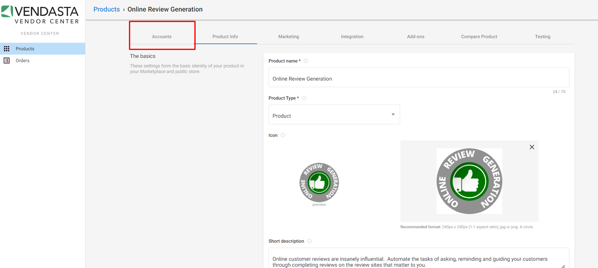
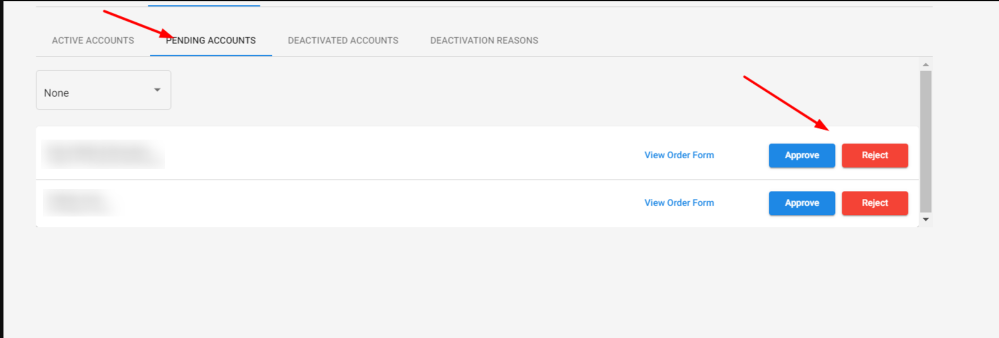
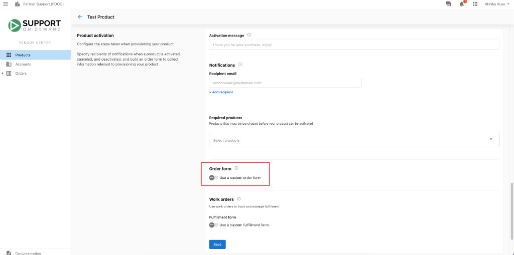

# Vendor Center overview

Vendor Center is where vendors create and manage custom products and services that resellers buy through the Vendasta Marketplace. You access it at vendors.vendasta.com or from the Partner Center navigation menu, and you need Partner Center Admin access.

## What is the Vendasta Marketplace? {#about-vendasta-marketplace}

The Vendasta Marketplace connects vendors to Resellers worldwide. Resellers purchase products at wholesale rates and resell them to their clients (SMBs). Your products will be purchased by Resellers through the Marketplace and then sold to their clients.

## Why use Vendor Center?

Create custom products for your market and control product creation, pricing, integration, and fulfillment. Vendor Center includes built-in integration capabilities and connects directly to the Vendasta Marketplace, so you don't need a separate product management system.

## What's included

**Product management** — Create products, set pricing, configure integrations, manage projects, and work with resellers:

- [Create a product](./vendor-center-general/what-are-custom-products) — Products, editions, add-ons, and the creation workflow
- [Set your product's price](./vendor-center-general/set-your-products-price) — Fixed, variable, and Contact Sales pricing models
- [Integrate your product](./vendor-center-general/integrate-your-product) — SSO and Business App integration
- [Create projects](./vendor-center-general/create-projects) — Track fulfillment across resellers
- [Task Manager/Fulfillment integration](./vendor-center-general/task-manager-integration) — Automate projects and event-generated tasks
- [Reseller information](./vendor-center-general/enriched-reseller-information) — Reseller tab, customizable table, Conversations
- [Reseller notifications](./vendor-center-general/reseller-notifications) — Start Selling alerts and notification settings

**Onboarding guides** — Requirements and guidelines for Marketplace vendors:

- [Operational requirements](./vendor-onboarding-guide/operational-requirements-for-marketplace-vendors) — Product structure, editions, multi-purchase, pricing
- [Technical requirements](./vendor-onboarding-guide/technical-requirements) — Integration requirements and developer resources
- [Service requirements](./vendor-onboarding-guide/service-vendor-requirements) — Reporting, file uploads, fulfillment forms, work orders
- [Marketing requirements](./vendor-onboarding-guide/marketing-requirements-guidelines-marketplace-vendors) — Product card, icon, gallery images, marketing materials
- [Order form guide](./vendor-onboarding-guide/order-form-guide) — Custom order forms and fulfillment forms

## Onboarding project

After signing your Vendor distribution agreement, you'll receive a welcome email with a link to your onboarding project. Access it anytime via [Partner Center → Tasks → Projects](https://partners.vendasta.com/task-manager/reporting). The project is a **shared checklist** with the Vendasta Vendor team that includes required tasks, integration points, and documentation links. This guide pairs with the [Vendor Operations Guide](./vendor-onboarding-guide/operational-requirements-for-marketplace-vendors).

## How do I get started with Vendor Center? {#get-started}

### 1. Access Vendor Center

Access Vendor Center at [vendors.vendasta.com](https://vendors.vendasta.com/) or through the Partner Center navigation menu. **You need Partner Center Admin access.** Contact your Vendor Account Manager if you need credentials.

### 2. Add your team members

Invite team members from [Partner Center → Administration → My Team](https://partners.vendasta.com/my-team). **Service vendors:** Provide team members with the Digital Agent Role for Task Manager/Fulfillment access. Consider adding a group email address for monitoring Reseller communications.

### 3. Browse the Marketplace

Browse the [Marketplace](https://partners.vendasta.com/marketplace/products) to see what other vendors have done and understand how your product fits.

### 4. Create your first product

- **Vendor Center:** Click **Add Product** in the top right. From Partner Center, go to `Marketplace` → `Open Vendor Center`, then **Products**.
- **Partner Center:** Go to `Marketplace` → `Products`, then click **Create product** in the top right. Click **Continue editing in Vendor Center** to publish later.

See [Create a product](./vendor-center-general/what-are-custom-products) for the full workflow.

### 5. Build your product

Review the [Operational requirements](./vendor-onboarding-guide/operational-requirements-for-marketplace-vendors) for product structure and pricing, then build your product in Vendor Center.

### 6. Set up integrations

Configure SSO, fulfillment settings, order forms, and reseller notifications. See [Integrate your product](./vendor-center-general/integrate-your-product), [Order form guide](./vendor-onboarding-guide/order-form-guide), and [Task Manager/Fulfillment integration](./vendor-center-general/task-manager-integration) if you provide services.

## Platform overview

### Partner Center

Vendors use Partner Center to:
- [Manage Admin platform access for your team](https://partners.vendasta.com/my-team)
- [Create test Accounts](https://partners.vendasta.com/manage-accounts)
- [Test activation of your SKUs](/commerce/orders/creating-and-managing-orders)
- [Access the Business App](/partner-center/overview)

### Business App

Business App is the SMB portal where clients access purchased products. Use it to test Single Sign On, trial activation, Executive Report, and Activity Stream.

### Task Manager/Fulfillment {#task-manager}

Task Manager/Fulfillment is Vendasta's project management tool. **Service vendors must use Task Manager/Fulfillment for fulfillment tracking.** Access via `Partner Center` → `Fulfillment` → `Open Task Manager`. Add team members as **Digital Agent** under `Administration` → `My team` for access.

## Important requirements

### Executive Report integration

**All product vendors must integrate into the Executive Report.** This proof of performance tool generates automatically (weekly or monthly) and shows clients their digital marketing activity. Learn more in the [Executive Report Overview](/business-app/executive-report).

### Task Manager/Fulfillment for service vendors {#task-manager-for-service-vendors}

**Service vendors must use Task Manager/Fulfillment for fulfillment tracking.** Essential features include adding your team, accessing Task Manager/Fulfillment, creating templates, and communicating with clients. See Fulfillment Project documentation for details.

## Product fulfillment

Vendasta's project management platform enables collaboration between Vendors, Resellers, and end clients. Receive interactive order forms, communicate via Conversations, and share Project Tasks. See [Create projects](./vendor-center-general/create-projects) and [Task Manager/Fulfillment integration](./vendor-center-general/task-manager-integration) for fulfillment workflows.

## What happens after my product is released? {#post-product-release}

Some features become available after your first product is released. Find your product at `Marketplace` → `Products` → `My Products` (not Discover Products). Your product shows as $0/Free in your Partner Center.

### Making changes to a released SKU

Changes to released products require Vendasta approval. Navigate to the "Compare Products" tab and click Request Approval. 

:::note
Webhooks are excluded from versioning and go live immediately — test on a sandbox product first.
:::

## Building your reseller network

Resellers appear in your Vendor Center Resellers tab after they find your product in Discover Products and click **Start Selling**. This makes the SKU available for their Store. **Monitor and respond to Reseller communications via Conversations** (click the speech icon in Vendor Center). See [Reseller information](./vendor-center-general/enriched-reseller-information) and [Reseller notifications](./vendor-center-general/reseller-notifications) for details on managing your reseller network.

## Common workflows

**Product creation** — Create a product with editions and add-ons, configure pricing and billing terms, add marketing materials, set up integrations, and publish to the Marketplace. See [Create a product](./vendor-center-general/what-are-custom-products) and [Set your product's price](./vendor-center-general/set-your-products-price).

**Product management** — Update product information, modify pricing and editions, manage order forms, track orders and projects, and communicate with resellers. See [Order form guide](./vendor-onboarding-guide/order-form-guide).

**Vendor operations** — Set up team members with appropriate roles, create projects for order fulfillment, integrate with Task Manager/Fulfillment, and manage reseller relationships. See [Create projects](./vendor-center-general/create-projects), [Task Manager/Fulfillment integration](./vendor-center-general/task-manager-integration), and [Reseller information](./vendor-center-general/enriched-reseller-information).

## Frequently asked questions

How do I approve a vendor product for activation?

To approve the Vendor product, follow these steps:

1. From Partner Center, navigate to Vendor Center using the 9-box navigation menu in the top left-hand of your dashboard.

2. Once Vendor Center is open, search for a vendor product and click on the product's name.

3. Click on "Accounts", then "Pending Accounts".

4. Approve/reject the order.

Why is "Automatic Activation" not available for my vendor/custom product?

If the order form in Vendor Center is toggled on, the toggle for automatic activation upon account creation will not be available in `Marketplace` → `Products` → `Product info`.

Where do I find Vendor Center?

Go to [vendors.vendasta.com](https://vendors.vendasta.com/) or open Vendor Center from the Partner Center navigation menu. You need Partner Center Admin access. Contact your Vendor Account Manager if you need credentials.

What is the Vendasta Marketplace?

The Vendasta Marketplace connects vendors to resellers worldwide. Resellers purchase products at wholesale rates through the Marketplace and resell them to their clients (SMBs).

How do I list a product on the Marketplace?

In Vendor Center, click **Add Product**, or in Partner Center go to `Marketplace` → `Products` and click **Create product**. Build the product following the [Operational requirements](./vendor-onboarding-guide/operational-requirements-for-marketplace-vendors), set up integrations, and publish it to the Marketplace. See [Create a product](./vendor-center-general/what-are-custom-products) for the full workflow.

What are the requirements for Marketplace vendors?

All product vendors must integrate into the Executive Report, and service vendors must use Task Manager/Fulfillment for fulfillment tracking. The onboarding guides list the operational, technical, service, and marketing requirements.

