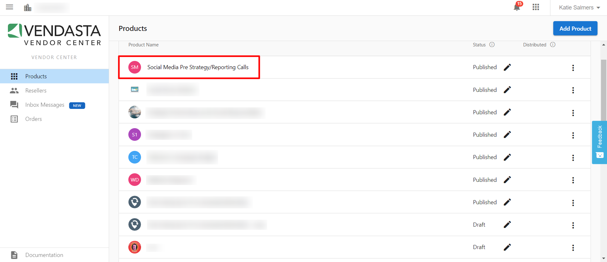
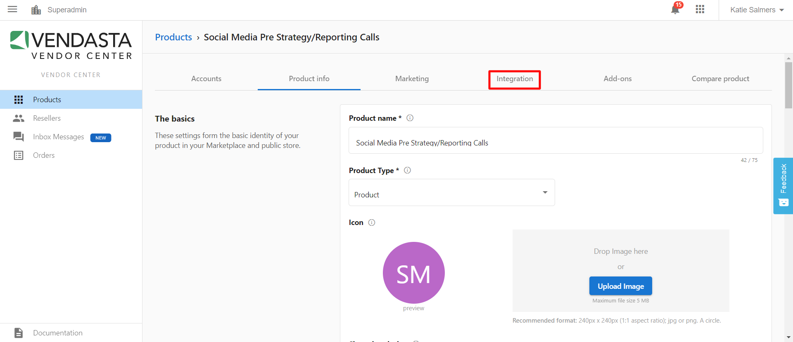
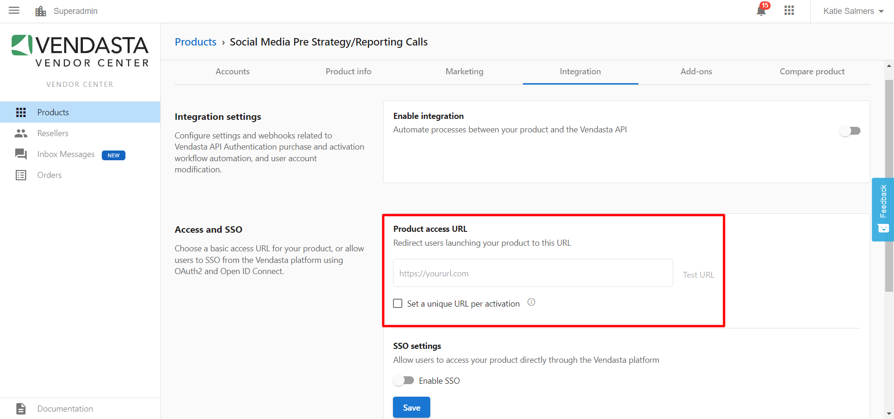

Yes, you are able to add a link to your custom product in Vendor Center under the "Integration" tab. When active on an account, your custom product will then show in the product menu in Business App and be clickable. You can link to external dashboards, websites, and even eBooks.

1) Navigate to Vendor Center from the 9-box menu in the top left-hand corner of your Partner Center dashboard.

2) Click on the custom product you would like to work on.

3) At the top of the screen, select the "Integration" tab.

4) Under "Access and SSO", add a link under "Product access URL".

5) Click "Save".

You can choose to have a custom URL per activation. If you check off this box, you will be able to add a specific URL to the order form for each individual activation.