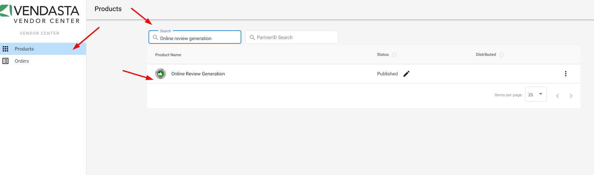
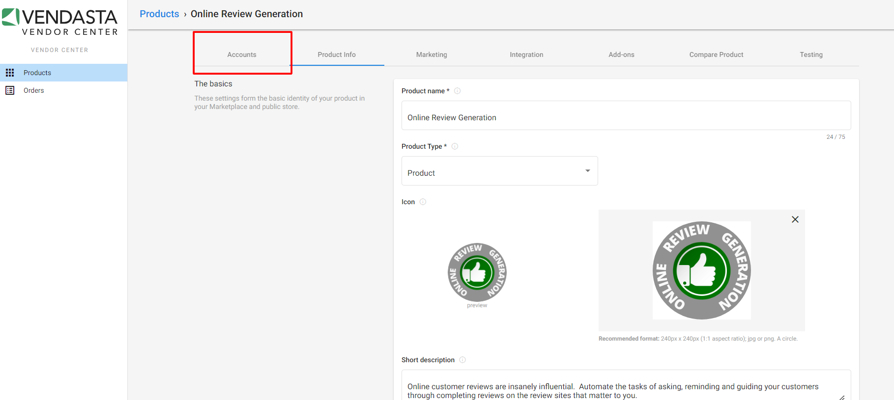
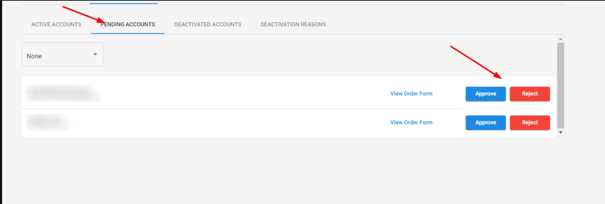

# How do I approve a vendor product for activation?

To approve the Vendor product, follow these steps:

1) From Partner Center, navigate to Vendor Center using the 9-box navigation menu in the top left-hand of your dashboard.

2) Once Vendor Center is open, search for a vendor product and click on the product's name.

3) Click on "Accounts", then "Pending Accounts".

4) Approve/reject the order.

