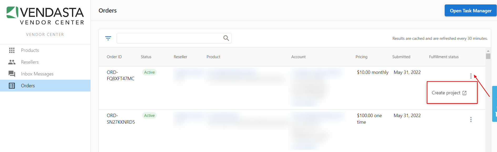

# Create projects in Vendor Center

Projects allow you to track the work you're doing across your resellers with Vendasta. Through them, you gain access to Task Manager, letting you add tasks, notes, and share activities with your clients directly.

### Create a project

1. Log in to [Vendor Center](https://vendors.vendasta.com/)
2. Go to **Orders**
3. Find the order you wish to create a project for
4. Click  **> Create Project **
5. Fill in the **Create project** form
6. Click **Create project**

:::note
Note that each product included in a Sales order is separated into its own row. You may see the same **Order ID** listed twice if two of your products were purchased in the same order.
:::

Once created, you'll see it linked in the **Orders** table.