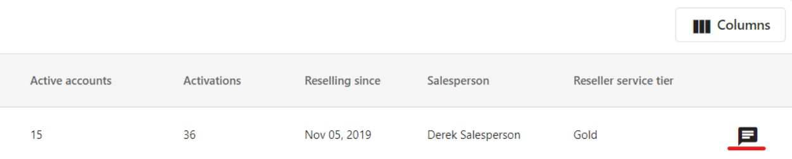

## Workflow

The **Reseller** tab in the Vendor Center navigation menu gives you a single view of all your resellers in one place. You can also still access product-specific reseller information by selecting a product first.

## Reseller Tab

The Reseller tab provides a customizable table with key details like name, email, and service tier to help you segment, qualify, and prioritize which resellers to reach out to.

**What are the features?**

- **Customizable Table:** Not all information may be relevant or helpful when searching for your ideal customer. By selecting the Columns button in the top right of the Reseller table, you can select what datasets are displayed and in what order they appear.
- **Products Selling:** You may have multiple products or services available through the Marketplace. By highlighting what the reseller is offering to their clients, you will have more insight on the needs of the reseller and their clients before a discovery call.
- **Active Accounts:** See how many accounts each reseller has with your products activated.
- **Activations:** Track the total number of product activations across a reseller's accounts.
- **Since:** View when the reseller started selling your products.
- **Vendasta Contact:** Identify who you can reach out to and work with at Vendasta when crafting a strategy with a reseller, or overcoming an obstacle in the communication or sales cycle.
- **Inbox Messaging:** Vendors can provide their resellers with the highest communication and customer service level through Inbox. It can also function as a single point of truth for communication since it removes the distractions from emails.

**Limitations**

- **Products sold displayed are Vendor specific:** While a reseller may be selling multiple products that cover different customer needs, the current release only surfaces what products of yours the reseller is offering to their clients.
- **Active Accounts displayed are Vendor specific:** Active Accounts only displays the accounts with your products being sold, not the total number of paying accounts that reseller may have across all products and services.
- **Columns are not filterable:** Currently the information provided in the columns can be sorted but not filtered. For example resellers can be sorted ascending, descending, or alphabetical based on the selected column.

## In-Platform Communication

Once you've identified a reseller to follow up with, you can message them directly through Inbox. Click the message icon on the right side of the Reseller table to open a conversation. Messages are tracked in Inbox so nothing gets lost.