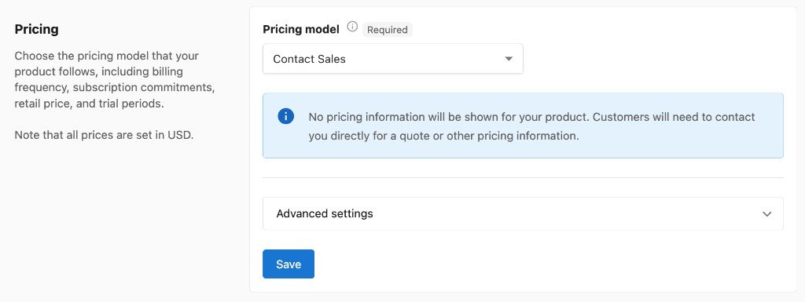

When you create a product, you'll have the option to set the pricing model that your product follows, including defining the billing period, subscription terms, retail price, and trial availability.

Note that the price fields in Vendor Center are currently always set in USD. For partners operating in currencies other than USD, your product's Retail Price can be set in the currency you select for your store in **Partner Center > Marketplace > Manage Store**.

## Pricing models

Different settings will be available depending on the pricing model you select. There are three pricing models: **Fixed price**, **Variable price**, and **Contact Sales**.

---

### Fixed price

Customers are billed a fixed price for your product, either one time or each billing period. This is the most common model and offers the most configuration options.

**Price fields:**

- **Wholesale Price** — The price charged to other resellers when they activate the product for their clients (if your product is sold in the Marketplace).
- **Retail Price** — The default price charged to customers. This can be overridden when adding a product to a package in your Store, but defaults to the value you set here.

**Setup fee:**

- **Wholesale setup fee** — The one-time setup fee charged to resellers for an activation of this product.
- **Suggested setup fee** — The default setup fee used by resellers of this product.

- **Billing period** — How often customers are billed for their subscription. Choose **One time**, **Monthly**, or **Yearly**.
- **Subscription term** — Set the number of billing periods customers are committed to. At the end of the subscription term, choose to **Renew with same term** or **Renew with a different subscription term**.
- **Trials** — Toggle on to allow customers to try your product before buying. Specify the number of free trial days.
- **Editions** — Toggle on to create multiple pricing plans, feature sets, or tiers of service for your product. Customers can upgrade or downgrade between editions. Editions share marketing material and add-ons but each has its own price settings. Click **Add edition** to configure. Leave toggled off if your product doesn't need multiple pricing options.

---

### Variable price

Customers choose how much they want to spend when ordering your product, above a minimum you set. This model is useful for tailoring ongoing services to suit a customer's changing needs, since Partner Center users can also request to change the subscription price for an account.

- **Minimum price** — The lowest amount a customer or Partner Center user can select when ordering or adjusting the subscription price.
- **Management fee** — Charge an additional fee each renewal on top of the variable price. Can be set as a flat dollar amount or a percentage.
- **Setup fee** — Adds a one-time charge when a customer purchases your product. Includes **Wholesale setup fee** (charged to resellers) and **Suggested setup fee** (default for resellers).
- **Billing period** — How often customers are billed for their subscription. Choose **One time**, **Monthly**, or **Yearly**.
- **Subscription term** — Set the number of billing periods customers are committed to. At the end of the subscription term, choose to **Renew with same term** or **Renew with a different subscription term**.

---

### Contact Sales

Hides the price from customers, requiring them to contact a salesperson for pricing information. Use this when your product requires detailed or case-based pricing.

:::info
Customers cannot purchase Contact Sales products through the Shopping Cart because no price is attached. Adding a Contact Sales product to the cart will submit a sales order for you to approve before the product can be activated.
:::

---

## Advanced settings

:::info
Advanced settings are available for all pricing models (Fixed price, Variable price, and Contact Sales).
:::

#### Allow multiple purchases per account (disables add-on support)

By default, only a single instance of a product can be active on an account at any time. 

**For base products (top-level products):** Even if this setting is enabled, the system will not allow quantity adjustments during order activation. The quantity field in the order cannot be modified due to custom integrations with certain products and their associated forms, such as GoDaddy. Note that add-ons cannot be used with products that have this setting enabled.

**For add-ons:** If this setting is enabled, the quantity can be adjusted in the order. However, this is not recommended for high-volume quantities (such as hundreds of units). Partner Center is designed primarily for SaaS products and is not optimized for high-volume physical item sales. Processing large quantities may result in slow load times or cause orders to crash.

**Best practice for high-volume orders:** If you need to fulfill orders with large quantities, use Order forms to specify the quantities needed for fulfillment. You will need to manually calculate the total cost and enter it into the order.

Once set, hit **Save** to save the pricing for your product.