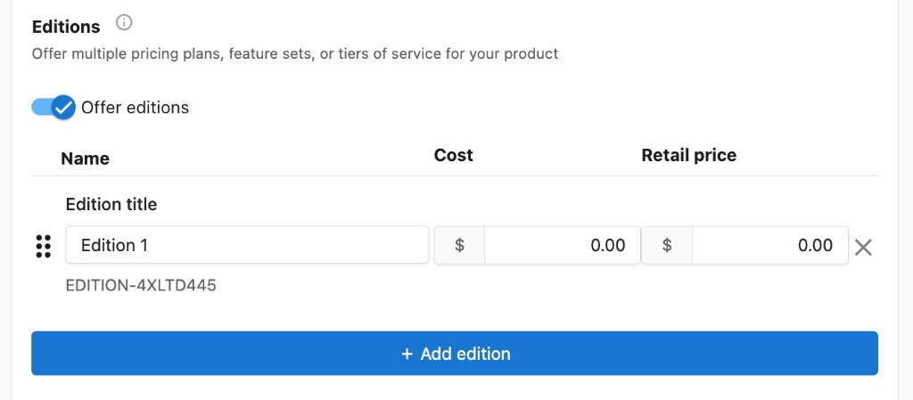
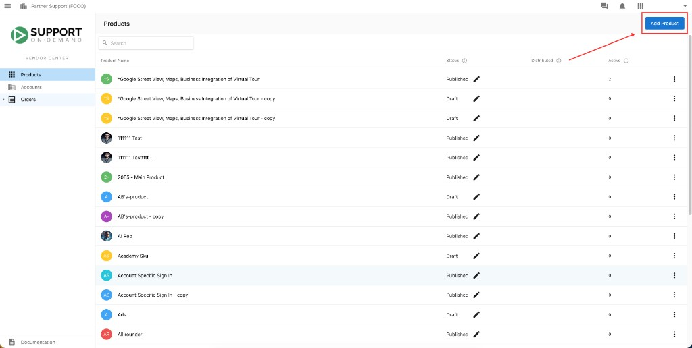
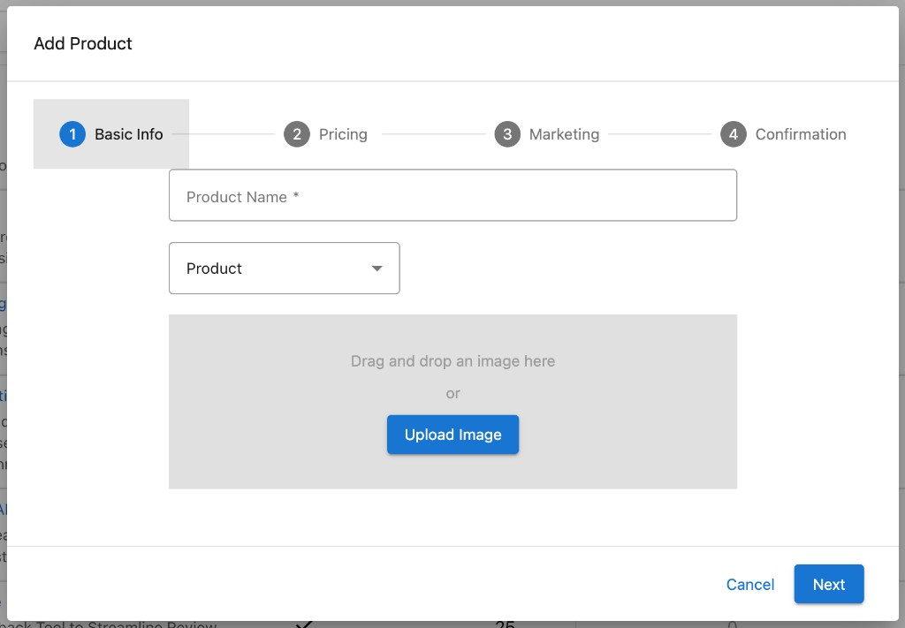
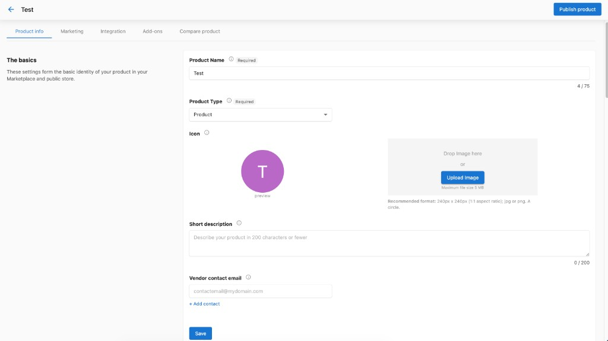
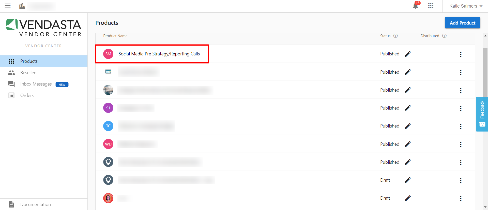
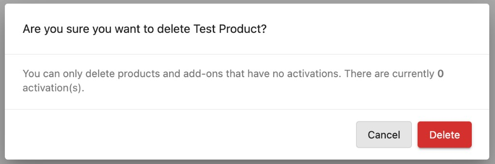

Just like the products you'll find in the Vendasta Marketplace, you can sell the products you create in your store on their own, package and sell them together with other products and services, activate them for your customers, and bill for them using Vendasta Payments.

## Products

A product is a representation of something you sell through the Vendasta platform. You can use products to represent a digital product, a service you provide, a physical product that you offer, or anything else you'd like to sell to your customers.

When you create a product, you have complete control over:

- Name
- Price
- Marketing material
- Order form
- And more

Naturally, some of the things you sell will be more complicated than others. That's why you can customize how you price, deliver, and fulfill what you sell using product editions and add-ons.

## Editions

Editions are versions of your product that represent different levels of service, functionality, or pricing options that you might offer. Customers can choose an edition of your product to buy and later upgrade or downgrade to a different edition when their needs change.

Editions of a product share marketing material and add-ons, but each edition can have its own price settings.

## Add-ons

When you create a product, you may want to create one or many add-ons to sell alongside it. Use add-ons to support purchasing optional features or services related to your product.

For example, imagine you offer a website-building service to your customers. Create an add-on to represent supplementary services you offer as part of building that website: adding an additional page on the website, adding e-commerce functionality to the website you build, 24-hour support for technical issues, and so on.

Use add-ons to add value and flexibility to the products that you offer your customers. Customers can't purchase an add-on until they've purchased the add-on's parent product, so ensure that the add-ons you create add value to the product they belong to.

## How to create a product

You can create a product from either Partner Center or Vendor Center:

### Partner Center

Go to **Marketplace** → **Products**, then click `Create product` in the top right corner.

### Vendor Center

1. From Partner Center, click **Open Vendor Center** — it appears in the left sidebar under **Marketplace** or in the top right corner beside `Create product`.
2. In Vendor Center, go to **Products**, then click `Add Product` in the top right corner.

Both paths open the same product creation flow. When you click the button, an **Add Product** dialog opens. Work through the four steps:

1. **Basic Info** — Enter the product name, select the product type, and upload an image.
2. **Pricing** — Set your price and billing options.
3. **Marketing** — Add marketing materials for your product listing.
4. **Confirmation** — Review your choices.

When you finish these steps, you can **Publish to store** to make the product available immediately, or **Continue editing in Vendor Center** for more options.

## Customize in Vendor Center

If you choose to continue editing, you'll land on your product page in Vendor Center. Here you have access to more options across several tabs:

- **Product info** — Refine the product name, type, icon, short description, and vendor contact email. This is also where you set the pricing model, prices, billing period, subscription terms, trials, and editions, plus product activation and order forms.
- **Marketing** — Add and manage marketing materials for your Marketplace listing.
- **Integration** — Configure SSO, fulfillment, and product access. See [Integrate your product](./integrate-your-product).
- **Add-ons** — Create add-ons to sell alongside your product.
- **Compare product** — Open your product in the Marketplace to preview how it will look when published, and suspend new activations.

### Related guides

- [Set your product's price](./set-your-products-price) — Adjust pricing and choose from Fixed, Variable, or Contact Sales models
- [Order form guide](../vendor-onboarding-guide/order-form-guide) — Order forms and fulfillment settings
- [Task Manager integration](./task-manager-integration) — For service vendors: fulfillment tracking
- [Create projects](./create-projects) — For service vendors: project creation and tracking

## Frequently asked questions

Can I add a link to my custom product?

You can add a link to your custom product in Vendor Center under the "Integration" tab. When active on an account, your custom product then appears in the product menu in Business App and is clickable. You can link to external dashboards, websites, and even eBooks.

1. Navigate to Vendor Center from the 9-box menu in the top right-hand corner of your Partner Center dashboard.

2. Click on the custom product you would like to work on.

3. At the top of the screen, select the "Integration" tab.

4. Under "Access and SSO", add a link under "Product access URL".

5. Click "Save".

You can choose to have a custom URL per activation. If you check off this box, you will be able to add a specific URL to the order form for each individual activation.

Can I add a new category in Vendor Center?

Partners cannot add a custom/new category in Vendor Center for their own custom product(s). Partners can only choose from the default LMI (Local Marketing Index) categories available in **Vendor Center** → **Marketing**. The selected category (primary and secondary) will determine where your custom product will appear in the Marketplace.

These categories work like product tags in Marketplace (beside product description).

Can I delete a custom product or add-on?

You can only delete products and add-ons when they have zero activations. If the product is currently active on any accounts, deactivate it from all accounts first.

