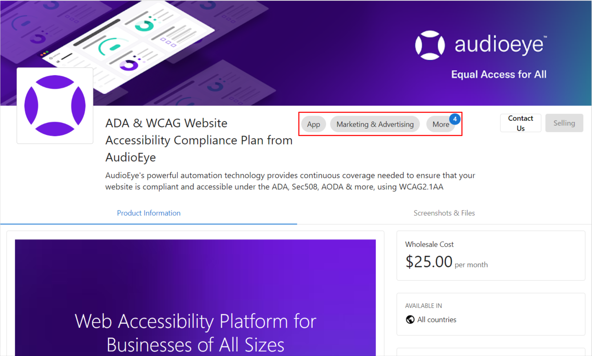
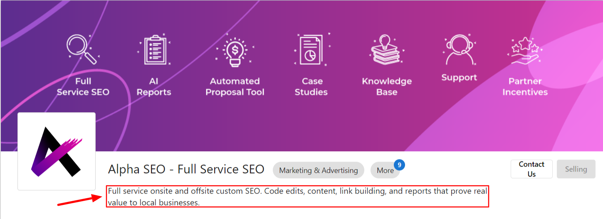
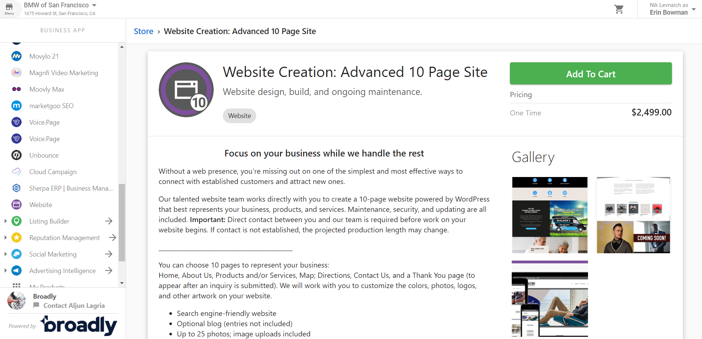
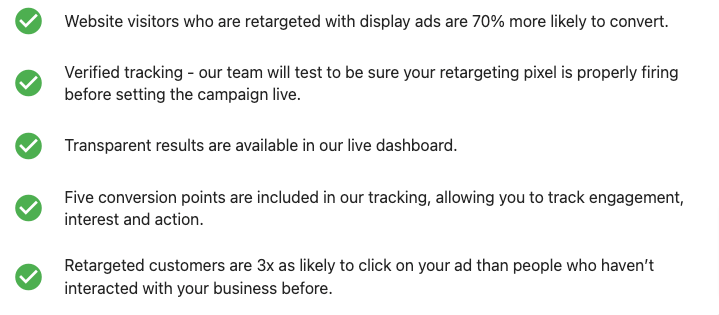
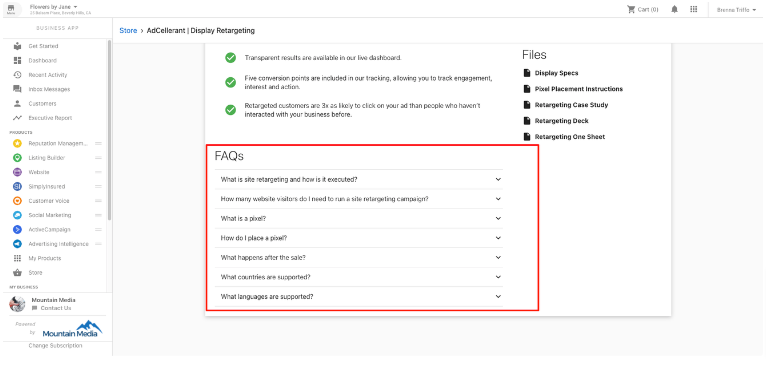
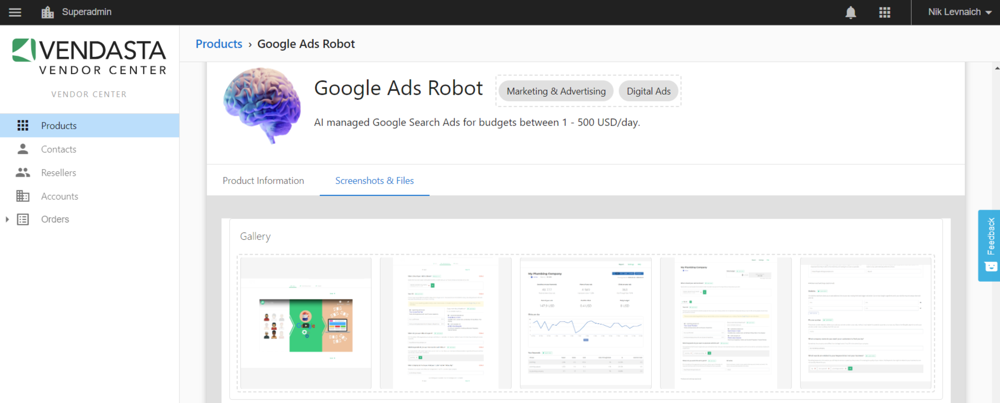

# Marketing Requirements and Guidelines for Marketplace Vendors

## Category Selection

Choose a category that best represents your product for the consumer. The category will help users find your product within our Marketplace. Think about which category a user would look in to find your specific product.

## Product Card

### Requirements for Product Card Images

Your product card image serves as a digital storefront within our Marketplace. It should be visually appealing and help users understand your product at a glance.

#### Card Image Guidelines:
- Dimensions: 370px x 200px
- Format: JPG/PNG
- File size: Maximum 5MB
- Text: Minimal or no text
- Branding: Include your logo or brand elements
- Quality: High resolution, not blurry or pixelated

### Requirements for Product Icon

Your product icon appears in multiple places throughout the platform, representing your brand and product.

#### Icon Image Guidelines:
- Dimensions: Square format (1:1 ratio), minimum 192px x 192px recommended
- Format: JPG/PNG (transparent PNG preferred)
- Quality: High resolution, clearly visible at small sizes
- Design: Simple, recognizable icon that represents your product

## Marketing Requirements

### End User Marketing Materials

Provide marketing materials that our partners can use to promote your product to their end-customers. These materials should explain the value of your product in simple terms that end-users will understand.

### User Benefits

Clearly articulate the benefits of your product for end-users. How does it solve their problems? What value does it provide?

### FAQs

Provide a list of frequently asked questions and their answers to help users understand your product better.

## Gallery Images

Include high-quality screenshots or images that showcase your product's interface and features. These images will help potential customers understand how your product works and what to expect.

### Gallery Image Guidelines:
- Dimensions: 800px x 600px (4:3 ratio) or 1920px x 1080px (16:9 ratio)
- Format: JPG/PNG
- Content: Screenshots of your product interface, features in action
- Quality: High resolution, clearly visible text and elements
- Number: 3-5 images recommended

## Best Practices for Marketing Success

1. **Focus on Benefits**: Clearly communicate how your product solves specific problems for end-users.

2. **Use Simple Language**: Avoid technical jargon. Write descriptions that are easy to understand for all users.

3. **Highlight Differentiators**: What makes your product unique compared to similar solutions?

4. **Update Regularly**: Keep your marketing materials and product information up-to-date as your product evolves.

5. **Quality Visuals**: Invest in high-quality images that showcase your product professionally.

6. **Consistent Branding**: Maintain consistent branding across all materials and touchpoints.

7. **Targeted Messaging**: Tailor your messaging to the specific audience of our Marketplace.

Following these guidelines will help ensure your product is presented effectively in the Marketplace, increasing visibility and adoption among our partner network.