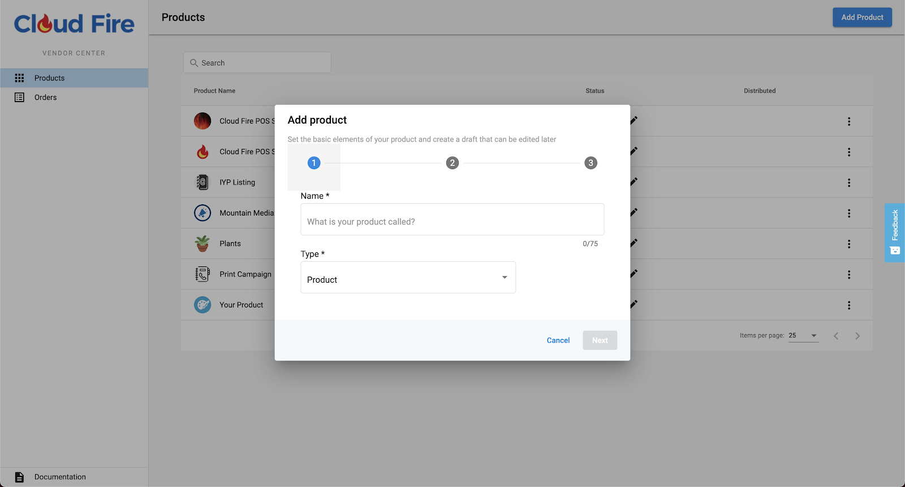
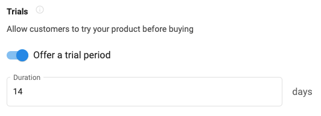
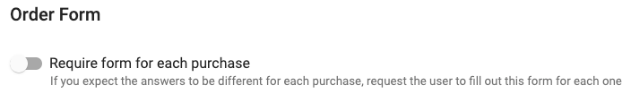
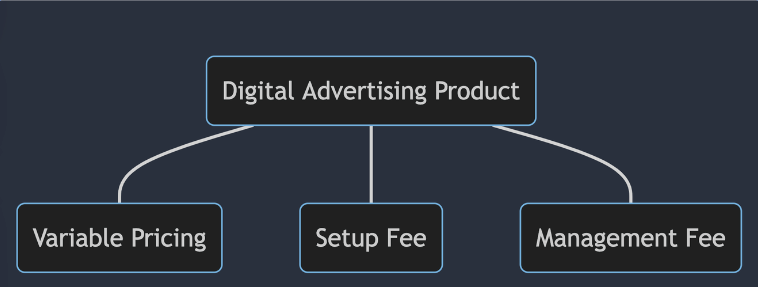

You must meet or exceed these operational requirements before your product or service reaches general availability.

## Product and service structure

Each product must have at least one paid tier. 

You can offer multiple paid tiers; each tier is an **Edition** in the Marketplace. 

- Vendors often use three **editions** (e.g., Bronze, Silver, Gold) with different price points and feature sets.
- Products can also include **free tiers** (trials, freemium, or premium) and **Add-ons** for upsells and optional features.

### Required information when creating a product

1. `Basic info`: name, category, vertical, description, etc.
2. `Integration settings`: SSO, Fulfillment, etc.

3. `Editions`: feature list, price, minimum, term, etc.
4. `Content`: logos, screenshots, documents, videos, etc.
5. `Visibility`: approval status

### Multi-purchase

You can turn multi-purchase on or off per edition. When enabled, customers can purchase your product multiple times for different locations they manage. For example, a reseller managing 10 locations for a client can purchase your product 10 times, once per location.

### Pricing and trials

You set your own pricing and trial periods. Vendasta supports various configurations, including wholesale and margin options. Your Vendor Success Manager can guide you on best practices for your category and product type.

### Product editions

You can configure editions (pricing tiers) to control how your product is presented to partners and sold to customers. The image above shows one example configuration.

### Add-on multi-purchase

Each add-on can use the same multi-purchase settings as your main product.

## Use case example

### Digital advertising

This example shows one way to structure a product: three editions (Bronze, Silver, Gold) with different price points and feature sets, plus optional add-ons for enhanced services.

## Help and support

Contact your Vendor Success Manager for guidance on product structure, pricing strategies, and Marketplace presentation.