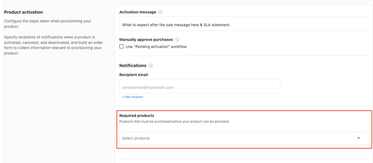

Service vendors in the Vendasta Marketplace set any required Marketplace products in Vendor Center, deliver client reporting through the Vendasta platform (SSO, Executive Report, or PDF file upload), and pass a final walkthrough by Vendasta Vendor Operations.

:::note
This article supports the integration phase for Marketplace Vendors. If you're ready to get started as a vendor, we'd love to hear from you. [Apply to join the Marketplace](https://www.vendasta.com/marketplace/vendors/).
:::

### Reliance on another Marketplace product

1. If your service leverages a Marketplace Product and requires that product to be active before you can start your work, ensure that the required product has been selected.

[Vendor Center](https://vendors.vendasta.com/) → `Select Product` → `Product Info` → `Product activation` → `Required products`:

2. If your service is reliant on a Vendasta product and involves responding to reviews, claiming and filing listings, or reviewing mentions, you can choose to have system-generated tasks created upon product activation. These are event-triggered tasks: Reviews, Mentions, and Listings.

:::note
If your service is not this type of service, ignore this checkbox.
:::

### Reporting

Provide any service completion report or ongoing reporting to your clients via the Vendasta Platform.

### Requirements

Refer to the reporting type that matches how you deliver reports to clients:

| Delivery method | Requirements |
| --- | --- |
| **Hosted dashboard** (users log in) | SSO into Dashboard, Executive Report Highlights |
| **Semi-interactive report** (shared as signed URL) | SSO into Dashboard, Executive Report Highlights or PDF File Upload |
| **Emailed PDF reports** | PDF File Upload, optionally Executive Report highlights |

### Reporting types

**Single Sign-On:**

If you have a hosted reporting dashboard that is accessed via a login, or shared via a signed URL, then that must be accessed via [SSO](https://developers.vendasta.com/vendor/d191b96068b71-sso-o-auth2-3-legged-flow).

**The Executive Report (API Integration):**

Pull highlights from, or recreate your reporting in Vendasta's dynamic report that lives within the Business App end-user dashboard. See supported card types [here](https://developers.vendasta.com/vendor/ZG9jOjE2NTY5Mzk0-executive-report).

:::info
Suggested maximum of 9 cards.
:::

### File uploads

File groups can be generated in two ways:

1. The `Account Details` page in Vendor Center. In this case, Vendasta hosts the file.

2. Automated upload via the Account [File Group API](https://developers.vendasta.com/vendor/e8e7370a6bbc0-create-a-file-group). In this case, the vendor hosts the file and provides a link.

For either method, file uploads will automatically send a message to the Activity Stream providing an alert that a new file is available.

### Final walkthrough (Vendasta testing your integration)

Once you have finished each task, submit it for review and approval in your project tracker by clicking `Approve`.

A Vendasta Vendor Operations team member will review your implementation and provide feedback before marking the task as complete.

### Fulfillment forms

Fulfillment forms collect information from customers after they purchase your product. Use them for details you need to fulfill the order, such as shipping addresses or service preferences. You can move questions from your purchase order form to the post-purchase fulfillment form so customers can complete orders with less friction.

Enable fulfillment forms on your product in Vendor Center. After you configure the form and publish your changes, you can track all orders and outstanding fulfillment in the work orders table.

**Work order statuses:**

- `Details needed`: Required information is missing. View these orders under the `In Review` tab and complete the fulfillment form to proceed.
- `Complete`: The fulfillment form is completed. You can view contact details, order forms, and fulfillment responses for each order.

<iframe 
  src="https://drive.google.com/file/d/1k8YNG1r2_ORiaxGf8LqKQMFh91RrJVD1/preview" 
  width="640" 
  height="480" 
  allow="autoplay">
</iframe>

## Frequently asked questions

How do I share files with clients as a service vendor?

Create a file group from the `Account Details` page in Vendor Center, where Vendasta hosts the file, or automatically through the [File Group API](https://developers.vendasta.com/vendor/e8e7370a6bbc0-create-a-file-group), where you host the file and provide a link. Either way, a message is sent to the Activity Stream to alert the client that a new file is available.

What reporting do I need to provide as a service vendor?

Provide service completion or ongoing reports to your clients through the Vendasta platform. Hosted dashboards need SSO into Dashboard and Executive Report highlights, semi-interactive reports need SSO plus Executive Report highlights or a PDF file upload, and emailed PDF reports need a PDF file upload.

How many cards should my Executive Report have?

The suggested maximum is 9 cards.

What does the Details needed work order status mean?

Required information is missing from the order. View these orders under the `In Review` tab and complete the fulfillment form to proceed.

How does Vendasta approve my integration?

After you finish each task, submit it for review by clicking `Approve` in your project tracker. A Vendasta Vendor Operations team member reviews your implementation and provides feedback before marking the task complete.

