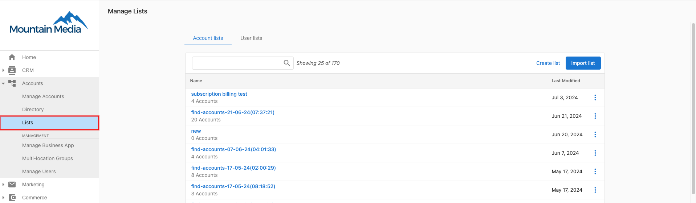

## Eine Liste erstellen

So erstellen Sie eine neue Kontoliste:

1. Gehen Sie zu `Partner Center` → `Accounts` → `Lists`.
2. Klicken Sie auf `Create List` in der oberen rechten Ecke des Bildschirms.

3. Geben Sie einen Namen für die Liste ein.
4. Klicken Sie auf `Create`.

:::tip Schnellzugriff
Sie können Ihre Listen direkt unter [partners.vendasta.com/action-lists/manage](https://partners.vendasta.com/action-lists/manage) verwalten
:::

Jetzt können Sie [Konten zur Liste hinzufügen](./add-accounts-to-lists).

:::note
Sie können auch bestehende Kontolisten in Partner Center importieren. Siehe den Abschnitt „Importieren" unten.
:::

## Eine Liste importieren (CSV)

1. Gehen Sie zu `Partner Center` → `Accounts` → `Lists`.
2. Klicken Sie auf `Import Lists`.
3. Laden Sie die CSV-Vorlage herunter oder wählen Sie eine Datei aus, und ordnen Sie dann die Felder zu.
4. Konfigurieren Sie die Benutzereinstellungen (Business App-Zugriff, Benachrichtigungen, Willkommens-E-Mail) für neue Benutzer, die durch den Import hinzugefügt werden.

:::info
Zu den erforderlichen CSV-Feldern gehören CompanyName und Zip. Lassen Sie unbekannte Felder leer; das System kann versuchen, fehlende Daten zu ergänzen, wenn Sie während des Imports die Option zum Ausfüllen leerer Zellen auswählen.
:::

Tags für Kontakte, Unternehmen und Konten haben eine maximale Länge von 50 Zeichen und dürfen nur aus alphanumerischen Standardzeichen (A-Z, 0-9), Bindestrichen (-), Leerzeichen ( ) oder Unterstrichen (_) bestehen.

Bitte vermeiden Sie Sonderzeichen wie @, #, $, %, & usw., da diese die Filter- und Suchfunktionen beeinträchtigen können.

### Die richtige Importvorlage auswählen

Je nachdem, was Sie importieren, stehen verschiedene CSV-Vorlagen zur Verfügung:

| Was Sie importieren | Zu verwendende Vorlage |
|-----------------------|-----------------|
| Geschäftskonten (erstellen oder aktualisieren) | `import_list_template.csv`, heruntergeladen aus dem Dialog „Import Lists" |
| Massen-Update bestehender Konten | Bulk Update-CSV-Vorlage, verfügbar unter `Partner Center` → `Accounts` → `Bulk Update` |
| Benutzer für Business App-Zugriff | `user-import-template.csv`, siehe [Benutzerlisten erstellen und Benutzer per Massenimport importieren](./create-user-lists-bulk-import-users) |
| CRM-Kontakte und -Unternehmen | `Contacts_Companies_Import_template`, heruntergeladen aus `CRM` → `Contacts` → `Import` |

Die Verwendung der falschen Vorlage ist eine häufige Ursache für fehlgeschlagene Importe. Beginnen Sie immer mit der Vorlage für Ihren spezifischen Importtyp.

### Wichtige Spaltennamen verstehen

**`UserGreetingName1`**: Diese Spalte wird dem Feld `Greeting name` im Benutzerdatensatz zugeordnet, nicht einem Jobtitel. Es handelt sich um den informellen Namen, den die Plattform bei der Ansprache des Benutzers verwendet (z. B. in E-Mails). Tragen Sie hier keinen Jobtitel ein; verwenden Sie dafür die Spalte `job_title`.

### Ländercodes: Großbritannien muss als `GB` eingegeben werden

Das Importsystem verwendet zweistellige **ISO-3166-1-Alpha-2**-Ländercodes. Der Code für das Vereinigte Königreich lautet **`GB`**, nicht `UK`. Die Eingabe von `UK` führt dazu, dass die Zeile fehlschlägt oder mit einem leeren Länderfeld importiert wird.

Häufige Codes zum Merken:

| Land | Korrekter Code |
|---------|-------------|
| Vereinigtes Königreich | `GB` |
| Vereinigte Staaten | `US` |
| Kanada | `CA` |
| Australien | `AU` |

### Größenbeschränkungen für Importe

Der Front-End-Import akzeptiert maximal **5.000 Datensätze pro Datei**. Wenn Ihre Liste 5.000 Zeilen überschreitet, teilen Sie sie in mehrere Dateien auf und importieren Sie diese nacheinander. Wenden Sie sich bei sehr großen einmaligen Importen an den Support, um einen Massenimport als betreute Aufgabe anzufordern.

### Häufige Importfehler

| Fehler | Ursache | Lösung |
|-------|-------|-----|
| Zeile schlägt mit Länderfehler fehl | `UK` wurde anstelle von `GB` verwendet (oder ein anderer ungültiger Code) | Durch den korrekten ISO-Alpha-2-Code ersetzen |
| Import der Telefonnummer schlägt fehl | Telefonnummern enthalten Formatierungszeichen wie `(`, `)` oder Leerzeichen | Nur Ziffern oder das E.164-Format verwenden: `+14165551234` |
| Import wird abgeschlossen, aber die Daten sind falsch | Für den Importtyp wurde die falsche Vorlage verwendet | Mit der korrekten Vorlage erneut exportieren und erneut importieren |
| Fehler „Fehlerhafte CSV" | Die CSV-Datei wurde in einer App bearbeitet, die die Codierung oder die Trennzeichen geändert hat | In einem reinen Texteditor öffnen, um Kommas und die UTF-8-Codierung zu überprüfen |
