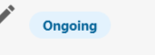

Die folgenden administrativen Aktionen sind über **Partner Center > Konten > Listen >  klicken Sie auf die drei Punkte neben der gewünschten Liste** verfügbar.

## Anpassen einer statischen Listenansicht

Sie können ändern, welche Spalten in Ihrer Listenansicht angezeigt werden, um die für Sie wichtigsten Informationen sichtbar zu machen (E-Mail, Telefon, Tags usw.):

1. Öffnen Sie Ihre Liste in **Partner Center > Accounts > Lists**
2. Klicken Sie auf das **Zahnradsymbol** in der oberen rechten Ecke der Listentabelle
3. Aktivieren oder deaktivieren Sie die Spalten, die Sie ein- oder ausblenden möchten (z. B. E-Mail, Telefon, Tags)
4. Schließen Sie das Panel – die Ansicht wird automatisch gespeichert

Angepasste Spaltenansichten gelten pro Benutzer und pro Liste, sodass jedes Teammitglied seine eigene bevorzugte Ansicht einrichten kann.

## Limits für Kontolisten

| Limit | Wert | Problemumgehung |
|-------|-------|------------|
| Maximale Anzahl an Konten pro Liste | 5.000 | Erstellen Sie mehrere Listen und weisen Sie allen Konten in den Listen ein gemeinsames Tag zu. Verwenden Sie das Tag, um zu filtern und mit der gesamten Gruppe zu arbeiten. |
| Obergrenze für die Massenaktivierung von Produkten | 500 Konten pro Aktion | Teilen Sie die Konten in mehrere Listen auf und aktivieren Sie sie in Stapeln. |

   [Kontodaten exportieren](#export-account-data)

   [Tags hinzufügen](#add-tags)

   [Zu einer Kampagne hinzufügen](#add-to-campaign)

   [Kampagnen pausieren](#pause-campaigns)

   [Multi-Standort-Gruppe erstellen](#create-multi-location-group)

   [Snapshot erstellen/aktualisieren](#createrefresh-snapshot)

   [Automatisierung auslösen](#trigger-automation)

   [Produkt aktivieren](#activate-product)

   [Add-on aktivieren](#activate-add-on)

   [Markt ändern](#change-market)

   [Löschen](#delete)

## Kontodaten exportieren

Erstellt eine herunterladbare CSV-Datei mit den aktuellen Daten aller Konten in der Liste. Dieser Export enthält die folgenden Informationen:

- Firmenname
- Adresse
- Stadt
- Bundesland
- Ländercode
- Postleitzahl
- Geschäftliche Telefonnummer(n)
- Website
- E-Mail-Adresse des Vertriebsmitarbeiters
- Kundenkennung
- Aktive Produkte (Listing Builder, Social AI, Reputation AI)
- Kontokennung
- Tags
- Gebührenfreie Nummer
- Beschreibung
- Kurzbeschreibung
- Wahrzeichen
- Zahlungsmethoden
- Dienstleistungen
- Marken
- Öffnungszeiten
- Felder für das Gesundheitswesen (falls zutreffend)

Nachdem Sie **Kontodaten exportieren** ausgewählt haben, gelangen Sie zur Seite **Verlauf** der Liste. Sobald der Export abgeschlossen ist, können Sie die CSV-Datei herunterladen, indem Sie auf das Symbol **Menü**  und anschließend auf **Konto-NAP/Produkt-CSV** klicken.

:::note Einschränkungen beim Export
Die exportierte CSV-Datei enthält nur informative Daten. Sie enthält **keine** anklickbaren Links zurück zu den Kontodatensätzen in Partner Center, sodass Sie nicht direkt aus der Tabelle heraus zu einem Konto klicken können.
:::

### Exportieren von Benutzerdetails (Namen und E-Mail-Adressen)

Der Standardexport für Kontodaten enthält Konto-/Unternehmensdaten (NAP + Produkte), jedoch keine einzelnen Benutzernamen und E-Mail-Adressen. Um eine Liste der mit Ihren Konten verknüpften Benutzer zu exportieren, wenden Sie sich an den Support und fordern Sie einen Export der Benutzerdetails an.

## Tags hinzufügen

Fügt jedem Konto in der Liste ein Tag hinzu. Dies ist nützlich, um Konten später zu filtern oder mehrere Listen zu einer logischen Gruppe zusammenzuführen.

**So fügen Sie ein Tag in großen Mengen hinzu, ohne vorhandene Tags zu überschreiben:**

1. Gehen Sie zu `Partner Center` → `Accounts` → `Lists`.
2. Klicken Sie auf die drei Punkte neben der Liste.
3. Wählen Sie **Tags hinzufügen** aus.
4. Wählen Sie ein vorhandenes Tag aus oder erstellen Sie ein neues.
5. Klicken Sie auf **Übernehmen**.

Tags werden hinzugefügt, vorhandene Tags auf den Konten werden nicht entfernt.

## Zu einer Kampagne hinzufügen

Ermöglicht es Ihnen, die Liste zu einer E-Mail-Marketingkampagne hinzuzufügen. Dadurch werden alle Benutzer und Kontakte, die den Konten in der Liste zugeordnet sind, zu dieser Kampagne hinzugefügt. [Weitere Informationen](../../marketing/campaigns)

## Kampagnen pausieren

Ermöglicht es Ihnen, eine derzeit aktive Kampagne für alle Benutzer und Kontakte zu pausieren, die den Konten in der Liste zugeordnet sind.  
Der Status ist beim Pausieren etwas verwirrend. „Pausiert" erscheint nicht als eigener Status. Wenn sich eine Kampagne jedoch im Status „Laufend" befindet, ändert sich ihr Status durch das Pausieren zu „Veröffentlicht".

## Multi-Standort-Gruppe erstellen

Ermöglicht es Ihnen, basierend auf der Liste eine Multi-Standort-Gruppe zu erstellen. Nach der Auswahl dieser Option können Sie festlegen, wie die Gruppe segmentiert werden soll. Dabei können Sie entweder **Geografische Region** oder **Konto-Tag(s)** wählen.

## Snapshot erstellen/aktualisieren

Je nach Status des Kontos geschieht eines von drei Dingen:

- Wenn für das Konto noch nie ein Snapshot-Bericht erstellt wurde, wird ein neuer Snapshot-Bericht erstellt.
- Wenn ein Konto zuvor einen Snapshot-Bericht hatte, der abgelaufen ist, wird dieser Snapshot-Bericht aktualisiert.
- Wenn ein Konto derzeit über einen aktiven Snapshot-Bericht verfügt (erstellt in den letzten 7 Tagen), wird dieses Konto übersprungen.

## Automatisierung auslösen

Ermöglicht es Ihnen, eine bestimmte Automatisierung für jedes Konto in der Liste auszulösen. Es gibt eine Reihe nützlicher Möglichkeiten, Automatisierungen innerhalb von Listen zu nutzen. Weitere Informationen finden Sie im Abschnitt [Manuelle Auslöser](../../automations/my-automations/automation-triggers-reference.mdx#manual) der Referenz zu Automatisierungsauslösern.

## Zwei Listen zusammenführen (mithilfe von Tags)

So führen Sie Listen zusammen:

1. Fügen Sie allen Konten in der ersten Liste ein gemeinsames Tag hinzu.
2. Fügen Sie dasselbe Tag allen Konten in der zweiten Liste hinzu.
3. Gehen Sie zu `Accounts > Manage Accounts`, filtern Sie nach dem Tag, wählen Sie die Konten aus und fügen Sie sie zu einer neuen Liste hinzu.

## FAQs

Kann ich den Namen einer Liste ändern?

Es gibt keine Option zum Bearbeiten des Namens. Löschen Sie die Liste und erstellen Sie sie neu. Beim Löschen einer Liste werden die zugehörigen Konten nicht entfernt.

## Produkt aktivieren

Ermöglicht es Ihnen, ein einzelnes Produkt für jedes Konto in der Liste zu aktivieren. Wenn ein Konto das ausgewählte Produkt bereits aktiviert hat, wird dieses Konto übersprungen. Mit dieser Funktion können Sie jedoch nur eine Neuaktivierung durchführen, keinen Edition-Wechsel.

:::note
Bitte beachten Sie, dass die Aktivierung eines Produkts zu einer Belastung auf Ihrer nächsten Rechnung führt. Stellen Sie daher sicher, dass sich nur die Konten in der Liste befinden, für die Sie das Produkt aktivieren möchten.
:::

## Add-on aktivieren

Ermöglicht es Ihnen, ein einzelnes Add-on für jedes Konto in der Liste zu aktivieren. Wenn ein Konto das ausgewählte Add-on bereits aktiviert hat, wird dieses Konto übersprungen.

:::note
Bitte beachten Sie, dass die Aktivierung eines Add-ons zu einer Belastung auf Ihrer nächsten Rechnung führt. Stellen Sie daher sicher, dass sich nur die Konten in der Liste befinden, für die Sie das Add-on aktivieren möchten.
:::

## Markt ändern

Ermöglicht es Ihnen, den Markt zu ändern, dem die Konten in der Liste zugeordnet sind. Dies ist nützlich, wenn Sie einen neuen Markt erstellt haben und Konten dorthin verschieben möchten.

## Löschen

Ermöglicht es Ihnen, die Liste zu löschen. Bitte beachten Sie, dass die Konten in der Liste selbst nicht entfernt werden; es wird nur die Liste gelöscht, der die Konten zugeordnet sind. Diese Aktion ist unumkehrbar. Stellen Sie daher sicher, dass Sie die Liste vollständig entfernen möchten, bevor Sie diese Option auswählen.