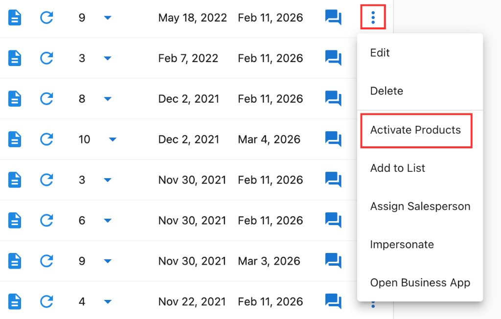
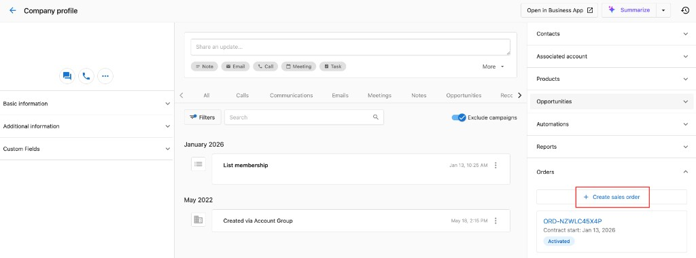

## Was ist Produktverwaltung für Konten?

Die Produktverwaltung umfasst das Aktivieren, Konfigurieren und Pflegen von Produkten und Dienstleistungen für Geschäftskonten. Dazu gehören die Auswahl geeigneter Produktausgaben, die Verwaltung von Add-ons, der Umgang mit Upgrades und Downgrades sowie die Deaktivierung von Produkten, wenn nötig.

## Warum ist Produktverwaltung wichtig?

Eine effektive Produktverwaltung sorgt für:

- **Angemessene Servicelevel**: Kunden erhalten Produkte, die zu ihren geschäftlichen Anforderungen und ihrem Budget passen
- **Umsatzoptimierung**: Die richtige Auswahl der Ausgabe und die Verwaltung von Add-ons maximieren den Nutzen für beide Seiten
- **Kundenzufriedenheit**: Passgenaue Produkte verbessern die Kundenerfahrung und reduzieren die Abwanderung
- **Betriebliche Effizienz**: Die richtige Produktkonfiguration reduziert Supportanfragen und verbessert die Servicebereitstellung
- **Wachstumschancen**: Strategische Produktverwaltung identifiziert Erweiterungs- und Upsell-Möglichkeiten

## Was gehört zur Produktverwaltung?

### Produktaktivierung
- Ersteinrichtung und Konfiguration des Produkts
- Auswahl und Anpassung der Ausgabe
- Einrichtung und Test von Integrationen
- Koordination des Starts und Zeitplanmanagement

### Ausgabenverwaltung
- Bearbeitung von Upgrades und Downgrades
- Funktionsvergleich und -auswahl
- Verwaltung der Preisstufen
- Planung und Durchführung von Übergängen

### Add-on-Services
- Aktivierung ergänzender Funktionen
- Konfiguration spezialisierter Dienstleistungen
- Premium-Supportoptionen
- Integrationserweiterungen

## So aktivieren Sie Produkte

### Produkte über das Konto aktivieren

Methode 1: So aktivieren Sie Produkte für ein Kundenkonto:

1. Navigieren Sie zu `Accounts` → `Manage Accounts`
2. Wählen Sie das Zielkonto aus Ihrer Kontoliste aus
3. Öffnen Sie die Kontodetailseite
4. Suchen Sie die Karte `Products` in der Konto-Übersicht
5. Klicken Sie auf `Create order`

Methode 2: So aktivieren Sie Produkte für ein Kundenkonto:

1. Navigieren Sie zu `Accounts` → `Manage Accounts`
2. Wählen Sie das Zielkonto aus der Kontoliste aus
3. Klicken Sie auf das Menüsymbol neben dem Konto
4. Wählen Sie `Activate Products`

### Produkte über CRM aktivieren
1. Navigieren Sie zu `CRM` → `Companies`
2. Wählen Sie das Zielunternehmen aus der Tabelle aus
3. Suchen Sie das Panel `Order` auf der rechten Seite 
4. Klicken Sie auf `Create Sales Order`
5. Folgen Sie dem Bestellvorgang, um die Order aufzugeben

### Ihren Produktkatalog aufbauen
1. Die Liste der über den Marketplace verfügbaren Produkte finden Sie dort
2. Klicken Sie auf die Produkte, die Sie Ihrem Angebot hinzufügen möchten
3. Klicken Sie oben rechts auf `Start selling`, um die Produkte Ihrem Angebot hinzuzufügen.

**Aktivierungsprozess:**

:::info Aktueller Aktivierungsablauf
Die Produktaktivierung erstellt als Teil des Aktivierungsprozesses immer eine Sales Order. Dies gewährleistet eine korrekte Abrechnung, Nachverfolgung und Integration in den Commerce-Workflow.
:::

1. **Aktivierung planen** zu geeigneten Geschäftszeiten
2. **Sales Order erstellen** – die Produktaktivierung generiert automatisch eine Sales Order zur Nachverfolgung und Abrechnung
3. **Produktaktivierung durchführen** gemäß dem Workflow zur Auftragsabwicklung
4. **Produktfunktionalität überprüfen** nach der Aktivierung
5. **Kundenzugang und Dashboard-Verfügbarkeit testen**
6. **Aktivierungsbestätigung bereitstellen** mit Bestelldetails und nächsten Schritten

## Produktausgaben ändern

So ändern Sie die Produktausgabe für ein Konto:

1. Gehen Sie zu `Accounts` → `Manage Accounts`.
2. Öffnen Sie das Konto und suchen Sie die Karte `Products` in der Übersicht.
3. Klicken Sie auf das Menüsymbol neben dem Produkt, das Sie ändern möchten, und wählen Sie `Change edition`.
4. Wählen Sie die gewünschte Ausgabe aus und bestätigen Sie.

:::warning
Ein Upgrade auf eine höhere Ausgabe kann zusätzliche Kosten verursachen. Einige Downgrades (zum Beispiel WordPress Premium) werden möglicherweise nicht unterstützt.
:::

## Produkte kündigen

So kündigen Sie ein Produkt für Ihren Kunden:

1. Gehen Sie zu `Accounts` → `Manage Accounts` und öffnen Sie das Konto.
2. Klicken Sie in der Karte `Products` in der Übersicht auf das Menüsymbol neben dem Produkt und wählen Sie `Cancel product`.
3. Bestätigen Sie die Kündigung oder wählen Sie `Schedule deactivation` und eine der folgenden Optionen:
   - Kündigung zum Ende der aktuellen Periode
   - Sofortige Kündigung
   - Kündigung nach einer festgelegten Anzahl von Verlängerungen

:::info
Das Produkt bleibt bis zu dem auf der Kündigungskarte angezeigten Datum aktiv. Sie können es in diesem Zeitraum wieder aktivieren.
:::

## Häufig gestellte Fragen zur Produktverwaltung

Kann ich die Option „E-Mail an alle Benutzer“ während der Aktivierung deaktivieren?

In einigen Aktivierungsabläufen können Sie die E-Mail-Benachrichtigungen für Benutzer steuern. Wenn Sie vermeiden möchten, E-Mails an alle Benutzer zu senden, überprüfen Sie die Aktivierungsoptionen und deaktivieren Sie die Massen-E-Mail-Benachrichtigungen, sofern verfügbar.

Kann ich mehr als eine Domain für dasselbe Konto erwerben?

Einige Produkte unterstützen mehrere Domains pro Konto. Überprüfen Sie die Konfigurationsoptionen des Produkts in der Karte `Products` in der Konto-Übersicht. Ist die Option nicht verfügbar, wird sie für dieses Produkt möglicherweise nicht unterstützt.

**Kundenkommunikation:**
- Erklären Sie Funktionsänderungen klar, bevor Sie sie durchführen
- Bieten Sie nach Upgrades Schulungen zu neuen Funktionen an
- Bestätigen Sie das Verständnis der Einschränkungen nach Downgrades
- Dokumentieren Sie die Gründe für Ausgabenänderungen zur späteren Referenz

## So gehen Sie mit Produktkündigungen um

### Kündigungsarten verstehen

**Vorübergehende Aussetzung:**
- Kunde bittet um Pausierung des Dienstes für einen bestimmten Zeitraum
- Abrechnung ausgesetzt, aber Konto und Daten bleiben erhalten
- Einfache Reaktivierung, wenn der Kunde bereit ist, den Dienst fortzusetzen

**Produktersatz:**
- Wechsel von einem Produkt zu einem anderen
- Datenmigration und Übergangsplanung erforderlich
- Minimierung der Serviceunterbrechung während des Übergangs

**Endgültige Kündigung:**
- Vollständige Einstellung des Produkts
- Überlegungen zur Datenaufbewahrung und zum Export
- Abschließende Abrechnung und Vertragsabschluss

### Kündigungsprozess

**Schritte vor der Kündigung:**
1. **Kündigungsgrund verstehen** und Alternativen prüfen
2. **Vertragsbedingungen prüfen** hinsichtlich Kündigungsverfahren und Zeitpunkt
3. **Alternative Lösungen besprechen** (Downgrades, Aussetzungen, andere Produkte)
4. **Schriftliche Kündigungsbestätigung einholen**, falls erforderlich
5. **Übergangszeitplan planen** und Kundenkommunikation vorbereiten

**Kündigungen durchführen:**
1. **Kündigung planen** für ein geeignetes Datum (häufig Ende der Abrechnungsperiode)
2. **Datenexport vorbereiten**, falls der Kunde seine Daten anfordert
3. **Produktzugang deaktivieren** gemäß den Kündigungsbedingungen
4. **Endabrechnung verarbeiten** und anteilige Gebühren berücksichtigen
5. **Abschluss der Kündigung mit dem Kunden bestätigen**
6. **Kündigungsgründe und -prozess dokumentieren** zur späteren Referenz

### Überlegungen nach der Kündigung

**Umgang mit Daten:**
- Kundendaten exportieren, falls vor der Kündigung angefordert
- Richtlinien zur Datenaufbewahrung für gekündigte Konten befolgen
- Kundendaten gemäß Datenschutzanforderungen sicher löschen
- Erforderliche Aufzeichnungen für geschäftliche und rechtliche Zwecke aufbewahren

**Beziehungsmanagement:**
- Trotz Kündigung eine professionelle Beziehung aufrechterhalten
- Tür für künftige Geschäftsmöglichkeiten offen halten
- Feedback zu Verbesserungsmöglichkeiten einholen
- Win-back-Kampagnen für geeignete Situationen in Betracht ziehen

## Häufig gestellte Fragen (FAQs)

Wie wähle ich die richtige Produktausgabe für einen neuen Kunden aus?

Berücksichtigen Sie die Unternehmensgröße, aktuelle Anforderungen, den technischen Kenntnisstand und das Budget des Kunden. Beginnen Sie mit einer Ausgabe, die den aktuellen Anforderungen entspricht, statt für mögliches künftiges Wachstum zu überdimensionieren.

Können Kunden ihre Produktausgabe jederzeit upgraden?

Die meisten Systeme erlauben sofortige Upgrades mit anteiligen Abrechnungsanpassungen. Prüfen Sie Ihre spezifischen Abrechnungsrichtlinien und kommunizieren Sie zeitliche Überlegungen an Ihre Kunden.

Was passiert mit Kundendaten, wenn ich die Produktausgabe herabstufe?

Die Daten bleiben in der Regel erhalten, der Zugriff auf erweiterte Funktionen kann jedoch eingeschränkt werden. Einige erweiterte Berichte oder Konfigurationen können nicht mehr verfügbar sein. Kommunizieren Sie diese Einschränkungen immer, bevor Sie ein Downgrade durchführen.

Wie gehe ich mit Kunden um, die Produkte vorübergehend kündigen möchten?

Erwägen Sie, statt einer Kündigung eine Produktaussetzung anzubieten. So bleiben Kontoeinrichtung und Daten erhalten, während die Abrechnung pausiert wird, was die Reaktivierung erheblich erleichtert, sobald der Kunde den Dienst fortsetzen möchte.

Kann ich mehrere Produkte gleichzeitig für dasselbe Konto aktivieren?

Ja, die meisten Konten können mehrere aktive Produkte haben. Berücksichtigen Sie Integrationsanforderungen und stellen Sie sicher, dass die Kombination Mehrwert bietet, ohne unnötige Überschneidungen oder Komplexität zu schaffen.

Was sollte ich tun, wenn eine Produktaktivierung fehlschlägt?

Prüfen Sie die Integrationsanforderungen, überprüfen Sie, ob die Kontoeinrichtung vollständig ist, sehen Sie sich alle Fehlermeldungen an und wenden Sie sich bei Bedarf an den technischen Support. Dokumentieren Sie das Problem zur späteren Referenz und Lösung.

Wie verfolge ich, welche Produkte bei verschiedenen Kundentypen gut abschneiden?

Nutzen Sie Reporting-Tools, um die Produktakzeptanz, Nutzungsmuster und Kundenzufriedenheit nach Geschäftskategorie, Größe oder anderen Merkmalen zu analysieren. Dies hilft bei künftigen Produktempfehlungen.

Können Kunden ihre eigenen Produkteinstellungen nach der Aktivierung ändern?

Dies hängt von Ihrer Systemkonfiguration und den Kundenberechtigungen ab. Viele Systeme erlauben es Kunden, einige Einstellungen zu ändern, während der Zugriff auf Abrechnungs- und zentrale Konfigurationsoptionen eingeschränkt bleibt.

Welche Zeitzone wird bei der Anzeige des Aktivierungsverlaufs für die Zeitstempel verwendet?

Die angezeigte Zeitzone entspricht der lokalen Zeit des aktuellen Benutzers.

