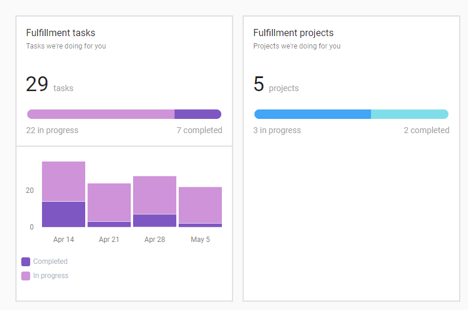

:::note Special Section Behavior
Anders als andere Abschnitte des Executive Reports ist Fulfillment ein **unsichtbarer Abschnitt**, der oben im Bericht erscheint (unterhalb des Marketing Funnel). Er **kann nicht neu angeordnet werden** und zeigt automatisch Project- und Task-Karten an, sofern Daten verfügbar sind.
:::

Ihr Fulfillment-Team arbeitet hart daran, Ihren Kunden möglichst viel Mehrwert zu bieten, doch häufig bleibt diese Arbeit verborgen. Sie müssen mühsam Berichte erstellen, um die im Auftrag Ihrer Kunden durchgeführten Maßnahmen hervorzuheben, was Sie von der Arbeit abhält, mit der Ihr Unternehmen eigentlich beauftragt wurde.

Fulfillment-Karten im Executive Report lösen dieses Problem.

## Welche Fulfillment-Daten werden angezeigt

Der Executive Report enthält Fulfillment-Karten, die die Arbeit Ihres Teams sichtbar machen:

Diese Karten zeigen Ihren Kunden genau, wie viele Aufgaben und Projekte Sie für sie bearbeiten, und schaffen so Transparenz sowie einen Nachweis des Mehrwerts, den Ihr Team liefert.

### Fulfillment-Karten umfassen

- `Fulfillment tasks`: Zeigt die Anzahl der für den Kunden abgeschlossenen Aufgaben
- `Fulfillment projects`: Zeigt die im Auftrag des Kunden geleistete Projektarbeit an
- `Project updates`: Kommuniziert sichtbare Projekt-Updates und Fortschritte

## Sichtbarkeitsregeln

### Karten für Fulfillment tasks und projects

**Frage: Werden hier nur Projekte und Aufgaben angezeigt, die auf sichtbar gesetzt sind?**

Nein. Bei den Karten `Fulfillment tasks` und `Fulfillment projects` zeigt Partner Center die Gesamtzahlen unabhängig von der Sichtbarkeit an. So wird sichergestellt, dass Ihr Team für die gesamte geleistete Arbeit Anerkennung erhält, unabhängig davon, ob sie als sichtbar markiert wurde oder nicht.

### Karte Project updates

Die Karte `Project updates` zeigt hingegen nur Informationen an, die als sichtbar markiert wurden. So behalten Sie die Kontrolle darüber, welche konkreten Projektkommunikationen und Updates Ihre Kunden sehen, während Ihr Team weiterhin für das Gesamtvolumen der geleisteten Arbeit gewürdigt wird.

## Unterstützung für mehrere Standorte

**Frage: Werden diese Karten auch im Multi-Location Executive Report angezeigt?**

Ja. Versionen dieser Karten sind auch im Multi-Location Executive Report verfügbar, sodass Sie den Fulfillment-Mehrwert über mehrere Unternehmensstandorte hinweg für Enterprise-Kunden nachweisen können.

## Vorteile des Fulfillment-Reportings

- **Transparenz**: Kunden können den Umfang der in ihrem Auftrag geleisteten Arbeit einsehen
- **Nachweis des Mehrwerts**: Präsentiert automatisch die Leistungen Ihres Teams, ohne manuelle Berichterstellung
- **Zeitersparnis**: Reduziert den Aufwand, separate Fulfillment-Berichte zu erstellen
- **Kundenbindung**: Hilft Kunden, den fortlaufenden Mehrwert, den sie erhalten, zu verstehen und zu schätzen
