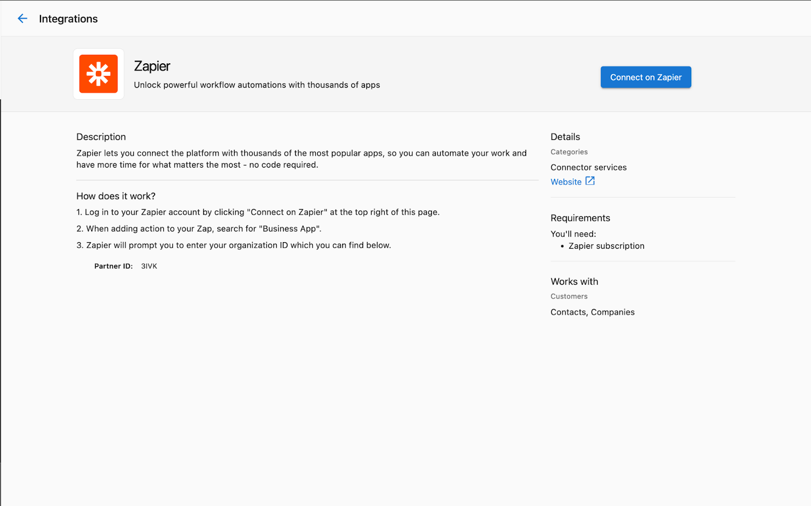
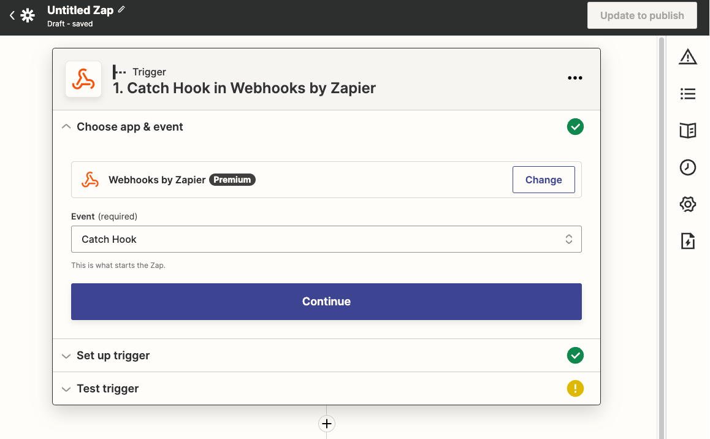
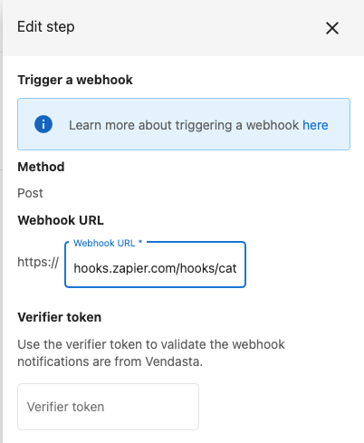
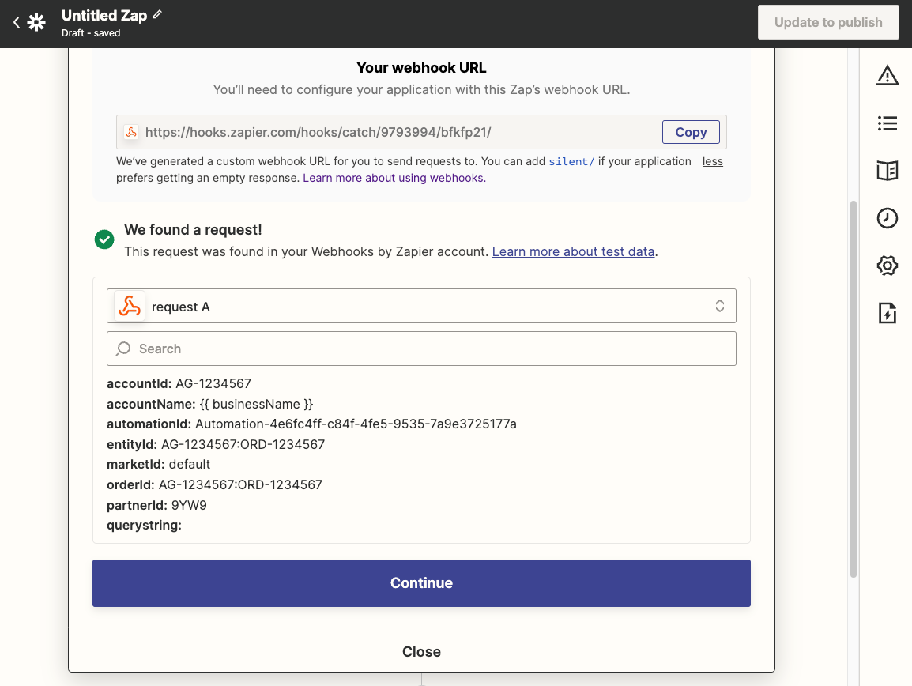
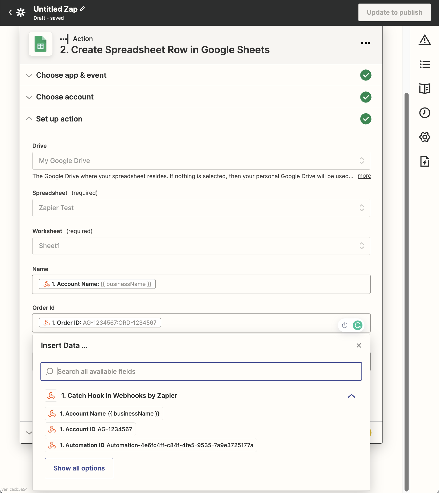

## Was ist die Zapier-Integration?

Vendastas Zapier-Integration ermöglicht es Ihnen, Ihr Vendasta-Konto über Zapiers Automatisierungsplattform mit Tausenden anderer Anwendungen zu verbinden. Diese Integration ermöglicht es Ihnen, Workflows zwischen Vendasta und anderen Anwendungen, die Sie täglich nutzen, zu automatisieren und so die Fähigkeiten Ihrer Plattform zu erweitern.

## Warum ist die Zapier-Integration wichtig?

Die Zapier-Integration hilft Ihnen:
- Wiederkehrende Aufgaben zwischen Anwendungen zu automatisieren
- Daten plattformübergreifend zu synchronisieren
- Workflows ohne individuelle Programmierung zu erstellen
- Vendasta mit über 6.000 unterstützten Anwendungen zu verbinden
- Manuelle Dateneingabe und menschliche Fehler zu reduzieren
- Ihre Abläufe mit automatisierten Prozessen zu skalieren

## Was Sie mit der Zapier-Integration tun können

| Funktion | Beschreibung |
|---------|-------------|
| **App-Konnektivität** | Verbindung von Vendasta mit Tausenden von Anwendungen |
| **CRM-Integration** | Synchronisierung von Kontakten und Unternehmen mit externen CRMs |
| **Automatisierungstrigger** | Nutzung von Vendasta-Automatisierungen zum Auslösen von Zapier-Workflows |
| **Aktivitätsprotokollierung** | Protokollierung von Aktivitäten wie Notizen, Anrufen und Meetings im Vendasta-CRM |
| **Workflow-Automatisierung** | Erstellung komplexer, mehrstufiger automatisierter Prozesse |

## So richten Sie die Zapier-Integration ein

### Zugriff auf die Integration

1. Melden Sie sich bei Ihrem Vendasta-Konto an
2. Navigieren Sie zu `Administration` → `Integrations`
3. Suchen Sie die Zapier-Integrationskachel

4. Klicken Sie auf `Connect`, um zu Zapier weitergeleitet zu werden

### Verbindung von Vendasta mit Zapier

Sobald Sie sich auf der Zapier-Website befinden, können Sie mit der Erstellung von Automatisierungen (Zaps) zwischen Vendasta und anderen Anwendungen beginnen.

### Ihren ersten Zap erstellen

#### Schritt 1: Trigger einrichten

Wählen Sie zunächst die App und das Ereignis aus, das Ihre Automatisierung auslösen soll.

Wenn Ihr Zap mit Vendasta-Daten starten soll, wählen Sie `Business App` als Trigger-App in Zapier, wählen Sie das verfügbare Trigger-Ereignis aus, verbinden Sie Ihr Konto und schließen Sie die in Zapier angezeigten `Setup instructions` ab, bevor Sie den Trigger testen.

#### Schritt 2: Mit Vendasta verbinden

1. Wählen Sie Vendasta als Ihre Aktions-App

2. Wählen Sie die Vendasta-Aktion aus, die Sie ausführen möchten

3. Verbinden Sie Ihr Vendasta-Konto, falls noch nicht geschehen

4. Schließen Sie die Einrichtung ab, indem Sie die Aktionsdetails konfigurieren

## Verfügbare Trigger und Aktionen

### Trigger (Ereignisse in Vendasta, die einen Zap auslösen können)

- **New Business Created** – Wenn ein neues Unternehmen zu Vendasta hinzugefügt wird
- **Business Updated** – Wenn Unternehmensinformationen geändert werden
- **New Order Placed** – Wenn eine neue Bestellung erstellt wird
- **Order Status Changed** – Wenn ein Bestellstatus aktualisiert wird

### Aktionen (Dinge, die Zapier in Vendasta tun kann)

- **Create a Business** – Neue Unternehmen zum Vendasta-CRM hinzufügen
- **Update a Business** – Bestehende Unternehmensinformationen ändern
- **Create a Task** – Aufgaben zur Vendasta-Aufgabenverwaltung hinzufügen
- **Add a Note to Business** – Notizen zu Unternehmensdatensätzen protokollieren
- **Create or Update CRM Contact** – Kontaktdatensätze im Vendasta-CRM verwalten
- **Create or Update CRM Companies** – Unternehmensdatensätze im Vendasta-CRM verwalten
- **Log CRM Activity** – Notizen, E-Mails, Anrufe, Meetings und Aufgaben erfassen

## So lösen Sie Zapier-Zaps mit Vendasta-Automatisierungen aus

### Voraussetzungen

- Ein Vendasta-Partnerkonto mit Zugriff auf Automatisierungen
- Ein Zapier-Konto
- Grundlegendes Verständnis von Webhooks

### Einrichten des Zaps für Automatisierungstrigger

1. Gehen Sie zu [Zapier](https://zapier.com/) und melden Sie sich bei Ihrem Konto an
2. Klicken Sie auf `Create Zap`

3. Suchen Sie nach `Webhooks by Zapier` und wählen Sie es als Trigger-App aus

4. Wählen Sie `Catch Hook` als Trigger-Ereignis aus und klicken Sie dann auf `Continue`

5. Kopieren Sie die Webhook-URL. Diese benötigen Sie für die Einrichtung der Automatisierung in Vendasta

6. Klicken Sie auf `Continue` und dann auf `Test trigger`. Machen Sie sich keine Sorgen, wenn der Test an diesem Punkt fehlschlägt

### Einrichten der Automatisierung in Vendasta

1. Melden Sie sich bei Ihrem Vendasta Partner Center an
2. Navigieren Sie zu `Administration` → `Automations`
3. Erstellen Sie eine neue Automatisierung oder bearbeiten Sie eine bestehende
4. Fügen Sie Ihrer Automatisierung eine `Webhook`-Aktion hinzu
5. Fügen Sie in der Webhook-Konfiguration die von Zapier kopierte URL ein

6. Konfigurieren Sie im Feld `Body` zusätzliche Daten, die Sie an Zapier senden möchten
7. Speichern Sie Ihre Automatisierung

### Testen der Integration

1. Lösen Sie Ihre Automatisierung in Vendasta aus
2. Gehen Sie zurück zu Zapier – der Test sollte erfolgreich gewesen sein

3. Richten Sie den Rest Ihres Zaps ein, indem Sie Aktionen hinzufügen, die ausgeführt werden sollen, wenn der Webhook ausgelöst wird

4. Benennen Sie Ihren Zap, testen Sie ihn und aktivieren Sie ihn

## Informationen zur Zapier-App und FAQ

### Was bedeutet der Beta-Modus?

Wir wissen, dass Sie es kaum erwarten können, dies zu nutzen! Während unser Entwicklungsteam noch einige spannende neue Funktionen für die Zapier-Integration entwickelt, wird dies durch das Beta-Tag kenntlich gemacht.

:::note Abonnementanforderung
Diese Funktion ist derzeit nur für Partner mit einer Abonnementstufe verfügbar, die Integrationen umfasst.
:::

### Wer kann die App nutzen?

Die App kann von Partnern, Vertriebsmitarbeitern und deren Kunden genutzt werden, da sie die Berechtigungen des Nutzers verwendet, der den Zap eingerichtet hat. Zu beachten ist, dass die App mit der Vendasta-Marke versehen ist. Wenn Sie die Plattform White-Label anbieten möchten, ist dies derzeit nicht möglich. Stattdessen können Sie die Zaps im Namen Ihrer Kunden erstellen.

### Wie Unternehmen mit Konten zusammenhängen

Ein Konto wird als Kopie der Unternehmensdaten erstellt, sobald erstmals ein Konto auf der Plattform benötigt wird. Nach der Erstellung aktualisiert eine Änderung des Unternehmensdatensatzes nur den zugewiesenen Vertriebsmitarbeiter und alle benutzerdefinierten Felder des Kontos. Wenn ein Kunde sein Konto aktualisiert, werden die meisten Felder im Unternehmensdatensatz aktualisiert.

## Best Practices

### Planung Ihrer Integrationen

- **Einfach beginnen** – Starten Sie mit einfachen Integrationen, bevor Sie komplexe Workflows aufbauen
- **Daten abbilden** – Verstehen Sie, wie Daten zwischen Anwendungen fließen
- **Gründlich testen** – Testen Sie Ihre Zaps gründlich, bevor Sie sich für kritische Geschäftsprozesse darauf verlassen
- **Regelmäßig überwachen** – Überwachen Sie Ihre Zaps regelmäßig, um sicherzustellen, dass sie weiterhin wie erwartet funktionieren

### Tipps zur Optimierung

- **Fehlerbenachrichtigungen nutzen** – Richten Sie in Zapier Fehlerbenachrichtigungen ein, um bei einem fehlgeschlagenen Zap benachrichtigt zu werden
- **Nutzungslimits prüfen** – Prüfen Sie Zapiers Nutzungslimits, um sicherzustellen, dass Ihr Automatisierungsbedarf innerhalb der Grenzen Ihres Plans liegt
- **Batch-Vorgänge** – Nutzen Sie nach Möglichkeit Batch-Vorgänge, um API-Aufrufe zu reduzieren
- **Datenvalidierung** – Implementieren Sie eine Datenvalidierung, um eine saubere Datenübertragung sicherzustellen

### Sicherheitsüberlegungen

- **Berechtigungen** – Stellen Sie sicher, dass Ihr Vendasta-Konto über die nötigen Berechtigungen verfügt
- **Kontosicherheit** – Halten Sie Ihre Zapier- und Vendasta-Konten sicher
- **Datenschutz** – Berücksichtigen Sie Datenschutzaspekte bei der Verbindung von Systemen
- **Zugriffskontrolle** – Beschränken Sie den Zap-Zugriff auf notwendige Teammitglieder

## Fehlerbehebung

### Häufige Probleme

**Zap wird nicht ausgelöst**
1. Überprüfen Sie, ob Ihr Vendasta-Konto über die nötigen Berechtigungen verfügt
2. Stellen Sie sicher, dass Ihr Zapier-Konto aktiv ist und über einen geeigneten Plan verfügt
3. Prüfen Sie, ob die Triggerbedingungen in Vendasta erfüllt werden

**Probleme bei der Datenübertragung**
1. Prüfen Sie, ob die zwischen den Apps übertragenen Daten korrekt formatiert sind
2. Überprüfen Sie die Feldzuordnungen in Ihrer Zap-Konfiguration
3. Sehen Sie sich den Zap-Verlauf in Zapier an, um herauszufinden, wo Fehler auftreten könnten

**App ist ausgegraut**
Verwenden Sie die richtige App für Ihren Workflow:

- `Vendasta`-App: als Aktions-App verwenden
- `Business App`-App: als Trigger-App verwenden und anschließend die in Zapier angezeigten `Setup instructions` abschließen
- `Webhooks by Zapier`: verwenden, wenn Sie über Webhook-Ereignisse von Vendasta-Automatisierungen auslösen möchten

### Support erhalten

Für zusätzliche Unterstützung bei der Zapier-Integration:
1. Prüfen Sie Zapiers Dokumentation für allgemeine Zapier-Probleme
2. Sehen Sie sich Vendastas API-Dokumentation für Anforderungen an das Datenformat an
3. Kontaktieren Sie den Vendasta-Kundensupport bei plattformspezifischen Problemen
4. Nutzen Sie Zapiers Support-Ressourcen für Zapier-spezifische Probleme

## Anwendungsfälle und Beispiele

### CRM-Synchronisierung

**Beispiel**: Automatisches Erstellen von Vendasta-CRM-Kontakten, wenn neue Leads zu Ihrem externen CRM hinzugefügt werden
- **Trigger**: Neuer Kontakt im externen CRM (z. B. HubSpot, Salesforce)
- **Aktion**: CRM-Kontakt in Vendasta erstellen oder aktualisieren

### Workflow für die Aufgabenverwaltung

**Beispiel**: Erstellen von Vendasta-Aufgaben, wenn bestimmte Ereignisse in anderen Systemen eintreten
- **Trigger**: Neues Support-Ticket im Helpdesk-System
- **Aktion**: Aufgabe in Vendasta zur Nachverfolgung erstellen

### Datensicherung und Berichterstattung

**Beispiel**: Automatischer Export von Vendasta-Daten in Tabellen für die Berichterstattung
- **Trigger**: Geplanter Trigger in Zapier
- **Aktion**: Daten aus Vendasta nach Google Sheets exportieren

## FAQs

Was macht die Zapier-App?

Mit der Zapier-App können Sie:
1. CRM-Kontakte in Vendasta erstellen oder aktualisieren
2. CRM-Unternehmen in Vendasta erstellen oder aktualisieren
3. CRM-Aktivitäten protokollieren (Notizen, E-Mails, Anrufe, Meetings, Aufgaben)
4. Vendasta-Automatisierungen mithilfe von API-Triggern ausführen
5. Vendasta mit über 6000 von Zapier unterstützten Apps verbinden

Wer kann die Zapier-App nutzen?

Die App kann von Partnern, Vertriebsmitarbeitern und deren Kunden genutzt werden. Sie verwendet die Berechtigungen des Nutzers, der den Zap eingerichtet hat. Beachten Sie, dass die App derzeit mit der Vendasta-Marke versehen ist, weshalb die White-Label-Optionen eingeschränkt sind.

Warum ist die App ausgegraut, wenn ich sie hinzufügen möchte?

Sie verwenden wahrscheinlich den falschen App-Typ für den Schritt:

- Verwenden Sie `Vendasta` bei der Konfiguration von Zap-Aktionen
- Verwenden Sie `Business App` bei der Konfiguration von Zap-Triggern und folgen Sie den `Setup instructions` in der App
- Verwenden Sie `Webhooks by Zapier`, wenn Sie über Vendasta-Automatisierungs-Webhooks auslösen

Welche Nutzungslimits gelten für die Zapier-Integration?

Sowohl Vendasta-Automatisierungen als auch Zapier haben eigene Nutzungslimits und Preise. Prüfen Sie die Dokumentation beider Plattformen für konkrete Details zu Limits und Kosten.

Kann ich Webhooks verwenden, um Zaps von Vendasta-Automatisierungen auszulösen?

Ja! Sie können Vendasta-Automatisierungen mit Webhook-Aktionen verwenden, um Zapier-Workflows auszulösen. Verwenden Sie „Webhooks by Zapier“ als Trigger-App und konfigurieren Sie die Webhook-URL in Ihrer Vendasta-Automatisierung.

Welche Abonnementstufe benötige ich für die Zapier-Integration?

Die Zapier-Integration ist nur für Partner mit einer Abonnementstufe verfügbar, die Integrationen umfasst. Prüfen Sie Ihre Abonnementdetails oder kontaktieren Sie den Support für weitere Informationen.

