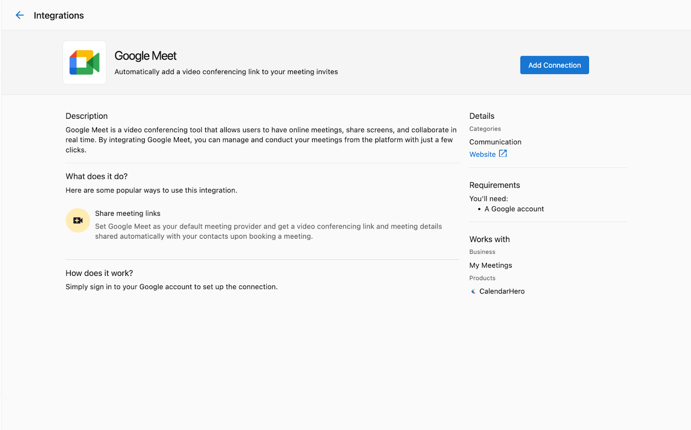
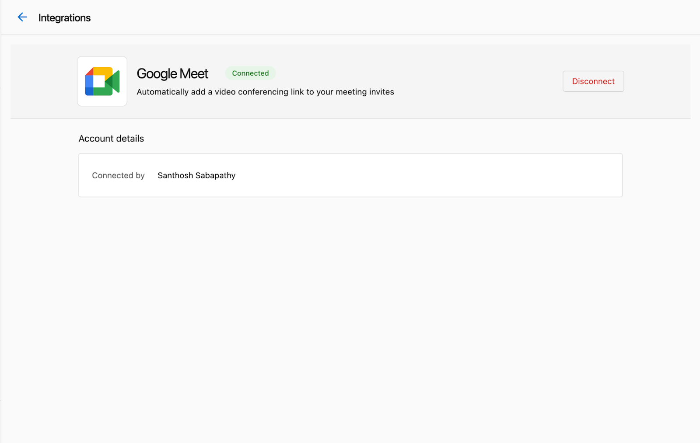

Mit den Google Meet- und Zoom-Integrationen von Vendasta können Sie Ihr Google Meet- oder Zoom-Konto mit Partner Center verbinden.

Sobald Sie die Google Meet- oder Zoom-Integration aktivieren, werden Sie einige Änderungen in Partner Center bemerken, wenn Sie mit einem Kunden kommunizieren:

- Beim Anzeigen eines Kontaktdatensatzes sehen Sie neben den Schaltflächen `Call` und `Email` eine neue Option, um ein Meeting zu starten oder zu planen.
- Beim Verfassen einer E-Mail an einen Kontakt sehen Sie neue Optionen, um einen Meeting-Link einzufügen und Meeting-Zeitfenster vorzuschlagen.

## Überlegungen zu Google Meet

- Um die Google Meet-Integration zu nutzen, benötigen Sie ein Google Workspace-Konto mit aktiviertem Google Meet.
- Alle Partner Center-Nutzer teilen sich dieselbe Google Meet-Verbindung. Wenn ein Nutzer die Google Meet-Integration einrichtet, steht sie allen Nutzern in diesem Partner-Konto zur Verfügung.
- Sie müssen sich für diese Integration nicht separat bei Ihrem Google-Konto anmelden.

## Überlegungen zu Zoom

- Anders als bei Google Meet muss jeder Partner Center-Nutzer sein eigenes Zoom-Konto verbinden.
- Sowohl kostenlose als auch kostenpflichtige Zoom-Konten werden unterstützt, kostenlose Konten haben jedoch einige Einschränkungen bei Meetings (z. B. eine Zeitbegrenzung von 40 Minuten für Gruppenmeetings).

## Die Google Meet-Integration einrichten

So aktivieren Sie die Google Meet-Integration für Ihr Partner Center-Konto:

1. Navigieren Sie über das linke Navigationsmenü in Partner Center zur Seite `Integrations`.
2. Suchen Sie die Kachel `Google Meet` und klicken Sie auf `Connect`.
3. Folgen Sie dem Google-Authentifizierungsablauf, um Partner Center Zugriff auf Ihr Google-Konto zu gewähren.

Nach Abschluss sollten Sie eine Meldung `Connection Completed` sehen:

## Die Zoom-Integration einrichten

Jeder Partner Center-Nutzer muss seine eigene Zoom-Integration einrichten:

1. Navigieren Sie zum Tab `Manage` in Ihrem Benutzerprofil (klicken Sie oben rechts auf Ihr Benutzersymbol).

2. Wählen Sie `Connected Apps` im linken Menü aus.
3. Suchen Sie die Zoom-Kachel und klicken Sie auf `Connect`.
4. Folgen Sie dem Zoom-Authentifizierungsablauf, um Partner Center Zugriff auf Ihr Zoom-Konto zu gewähren.

## Integrationseinstellungen verwalten

Administratoren können Integrationseinstellungen und Verbindungen über die Seite „Integrations“ verwalten:

1. Navigieren Sie über das linke Navigationsmenü zur Seite `Integrations`.
2. Suchen Sie die Integrationskachel (Google Meet oder Zoom).
3. Klicken Sie auf `Manage`, um die Verbindungseinstellungen anzuzeigen und anzupassen.

## Meetings planen

Sobald die Integration eingerichtet ist, ist die Planung von Meetings mit Kunden einfach:

1. Navigieren Sie zu einem Kundenkontaktdatensatz.
2. Klicken Sie auf die Meeting-Schaltfläche neben „Call“ und „Email“.
3. Wählen Sie, ob Sie ein sofortiges Meeting starten oder eines für später planen möchten.
4. Wählen Sie bei der Planung verfügbare Zeiten aus und fügen Sie Meeting-Details hinzu.
5. Senden Sie die Einladung an den Kontakt.

Alternativ können Sie beim Verfassen einer E-Mail wie folgt vorgehen:

1. Klicken Sie auf die Meeting-Schaltfläche im E-Mail-Editor.
2. Wählen Sie, ob Sie einen Meeting-Link hinzufügen oder Zeitfenster vorschlagen möchten.
3. Schließen Sie die Meeting-Einrichtung ab und senden Sie die E-Mail.

## Fehlerbehebung

Wenn bei den Google Meet- oder Zoom-Integrationen Probleme auftreten:

- Stellen Sie sicher, dass Ihr Google Workspace- oder Zoom-Konto aktiv und richtig konfiguriert ist.
- Überprüfen Sie, ob Sie während des Verbindungsvorgangs alle erforderlichen Berechtigungen erteilt haben.
- Bitten Sie bei Problemen mit Google Meet Ihren Administrator, die Verbindung auf der Seite „Integrations“ zu überprüfen.
- Versuchen Sie bei Problemen mit Zoom, Ihr Konto zu trennen und erneut zu verbinden.

Wenden Sie sich für weitere Unterstützung an den Vendasta Support.
