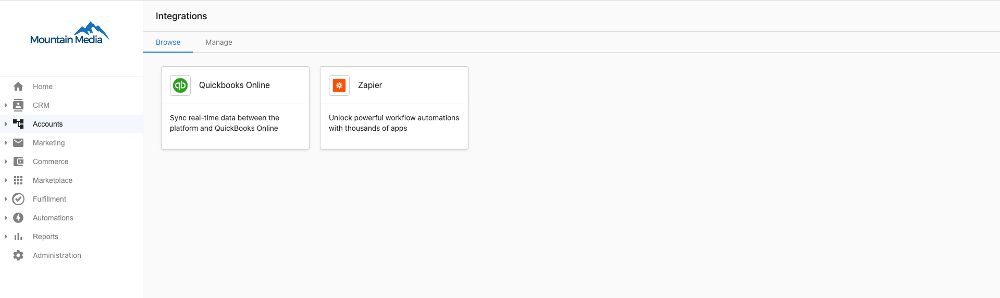
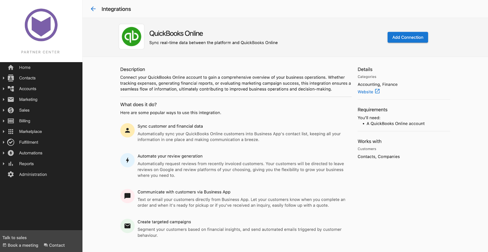
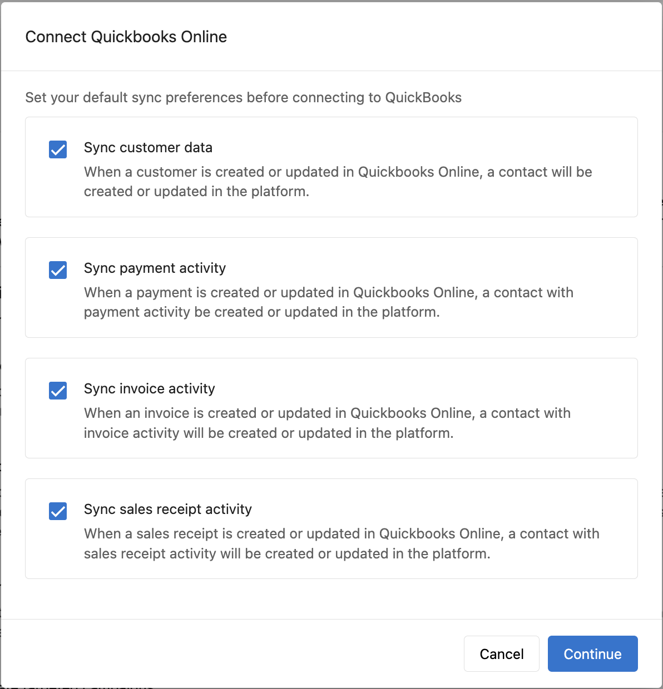
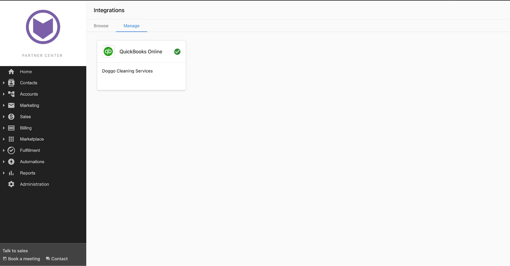
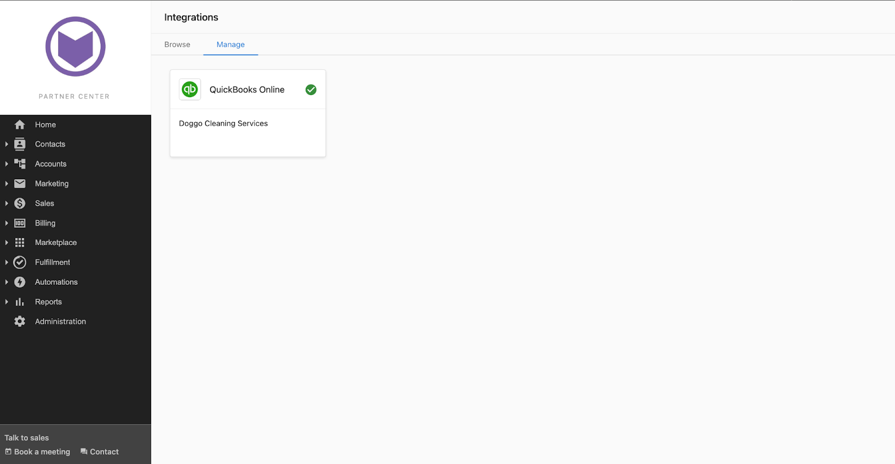
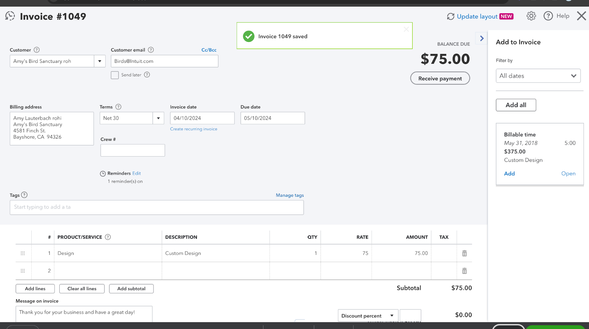
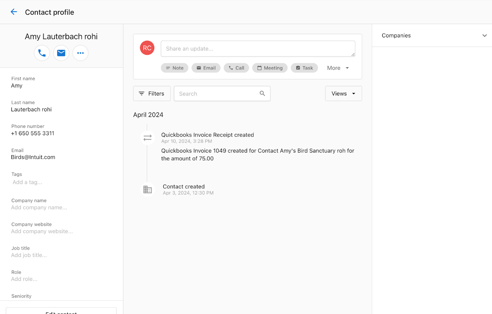

Die QuickBooks-Integration in Partner Center ermöglicht es Ihnen, Daten zwischen QuickBooks und Vendasta zu synchronisieren. Die Integration ist eine einseitige Synchronisierung von Kontakten von QuickBooks zu Vendastas CRM sowie 3 Automatisierungs-Trigger.

## Einrichten der QuickBooks-Integration

Sie können eine Verbindung mit QuickBooks einrichten, indem Sie zur Integrationsseite von Partner Center navigieren.

- Klicken Sie auf `Administration` → `Integrations`, um zur Integrationsseite zu navigieren.
- Klicken Sie auf die QuickBooks-Integrationskarte.

- Sie werden zur QuickBooks-Marketingseite weitergeleitet, die Informationen darüber bietet, was QuickBooks ist und welche Möglichkeiten eine Integration mit QuickBooks bietet. Klicken Sie auf `Add Connection`.

- Dies öffnet ein Pre-Connect-Formular, in dem Sie festlegen können, welche Daten zwischen QuickBooks und dem Partner Center CRM synchronisiert werden sollen. Die verfügbaren Synchronisierungsoptionen sind:
  - Kundendaten
  - Rechnungsdaten
  - Verkaufsbelegdaten
  - Zahlungsdaten

Klicken Sie auf `Continue`, nachdem Sie die zutreffenden Optionen ausgewählt haben.

- Dies führt zu einer Single-Sign-On-Seite, auf der Sie sich bei Ihrem QuickBooks-Konto anmelden und Berechtigungen erteilen können, um die Verbindung herzustellen.
- Nach erfolgreicher Verbindung werden Sie automatisch zur Registerkarte `Manage` auf der Integrationsseite weitergeleitet, wo Sie die Verbindung mit QuickBooks bestätigen können.
- Die hergestellte Verbindung wird auf der Registerkarte `Manage` und auf der Marketingseite angezeigt, wie unten dargestellt:

- Wenn Sie auf eine der beiden Karten klicken, gelangen Sie zur Seite `Connection Settings`, auf der Sie festlegen können, welche Daten synchronisiert werden sollen, oder die Integration trennen können.

:::info
Nach der ersten Verbindung mit QuickBooks werden alle Kontakte in QuickBooks mit dem Partner Center CRM synchronisiert. Sie können dies deaktivieren, indem Sie die Option „Sync Customer Data“ im Formular während der ersten Verbindung abwählen.
:::

## Synchronisierte Daten verwalten

Sie können auswählen, welche Daten zwischen QuickBooks und dem Partner Center CRM synchronisiert werden sollen:

1. Kontaktdaten
2. Rechnungsdaten
3. Verkaufsbelegdaten
4. Zahlungsdaten

Stellen Sie sicher, dass eine aktive Verbindung mit QuickBooks besteht, indem Sie auf die Registerkarte `Manage` auf der Integrationsseite klicken und nach der QuickBooks-Verbindungskarte suchen.

- Wenn Sie auf die Verbindungskarte klicken, gelangen Sie zur Seite „Connection Settings“. Hier können Sie festlegen, welche Daten synchronisiert werden sollen.

## Beispiel für die Integration

Betrachten Sie zum Beispiel einen Kontakt in Partner Center namens Amy. Amys Kontaktprofil in Partner Center zeigt keine kürzlich erfassten Aktivitäten.

Das Unternehmen erstellt für Amy eine Rechnung in QuickBooks.

Auf Amys Kontaktprofil in Partner Center wird eine Notiz mit Details aus QuickBooks erstellt, einschließlich Rechnungsnummer, Kontaktname und Rechnungsbetrag.

