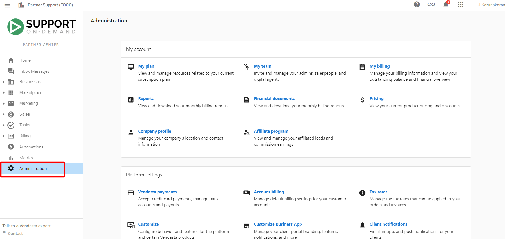
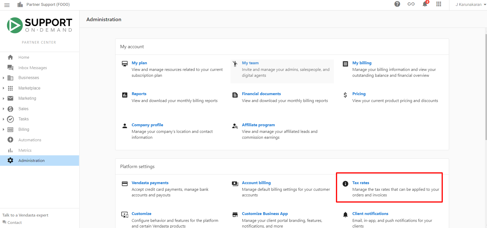
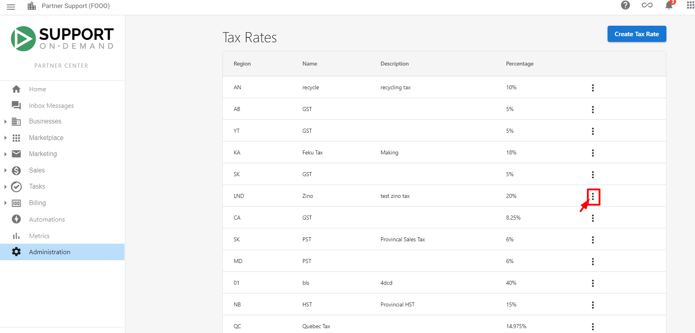
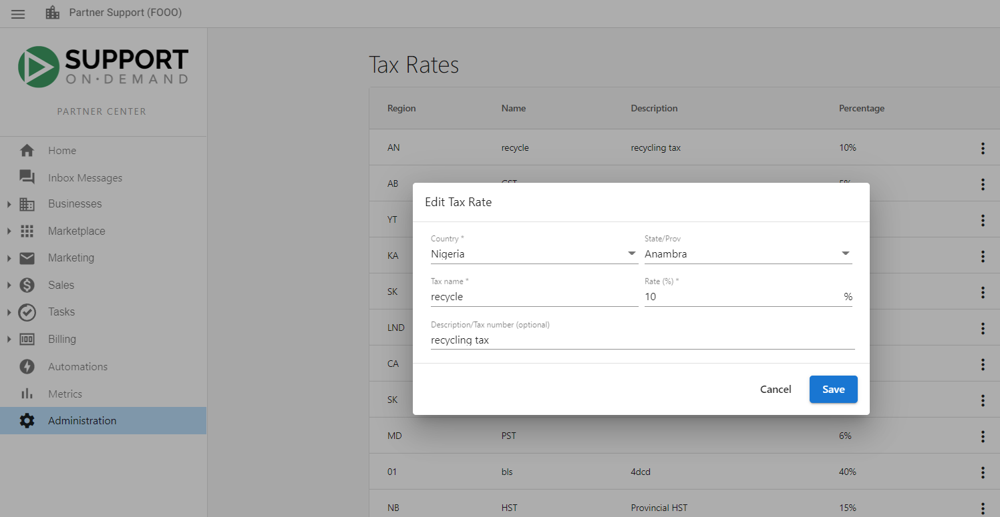
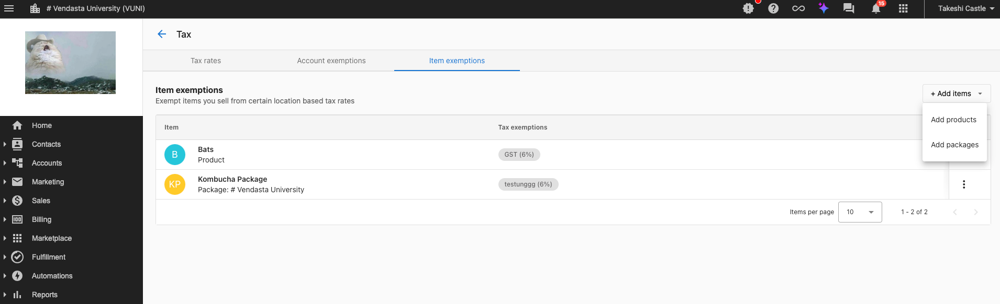
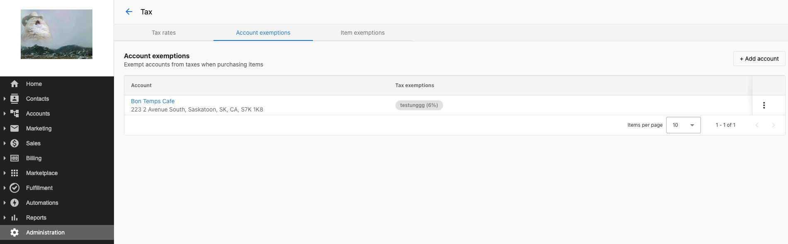

Konfigurieren Sie Steuersätze, wenden Sie Befreiungen an und sorgen Sie für korrekte Steuerberechnungen bei Rechnungen, Verkaufsaufträgen, Abonnementabrechnungen und Einkäufen im Warenkorb. Das System wendet Steuerregeln automatisch basierend auf Kundenadressen und Befreiungsstatus an.

## Was Sie konfigurieren können

- **Steuersätze** – Sätze nach Region festlegen und bearbeiten; das System wendet sie anhand der Kundenadressen an
- **Artikelbefreiungen** – Bestimmte Produkte oder Pakete von ausgewählten Steuersätzen ausschließen
- **Kontobefreiungen** – Ganze Konten befreien (z. B. Behörden, indigene Gemeinschaften, NGOs, Bildungseinrichtungen, religiöse Einrichtungen)
- **Adressbasierte Logik** – Die Steuer wird anhand der Postleitzahl bestimmt; ohne Adresse/Postleitzahl wird bei Opportunities keine Steuer angezeigt

## Einen Steuersatz erstellen

1. Gehen Sie zu `Partner Center` → `Administration` → `Tax Rates`
2. Klicken Sie auf `Create Tax Rate`
3. Geben Sie Land, Bundesland oder Provinz, Name und Satz sowie optional eine Beschreibung ein
4. Klicken Sie auf `Save`

## Steuersätze bearbeiten

1. Gehen Sie zu `Partner Center` → `Administration` → `Tax Rates`
2. Suchen Sie den zu ändernden Steuersatz und öffnen Sie das `kebab menu` (drei Punkte)
3. Wählen Sie `Edit`, aktualisieren Sie die Felder und klicken Sie dann auf `Save`

Änderungen gelten nur für neue Transaktionen; bestehende Rechnungen behalten ihre ursprüngliche Steuer.

## Adressanforderungen für Steuern

Steuerberechnungen erfordern eine vollständige Kundenadresse mit Postleitzahl. Wenn ein Konto keine Adresse mit Postleitzahl hat, zeigt das System bei Opportunities keinen Steuersatz an. Halten Sie Adressen vollständig und aktuell, damit die richtige Zuständigkeit und die richtigen Sätze angewendet werden.

## Artikelbefreiungen

Schließen Sie bestimmte Produkte oder Pakete von ausgewählten Steuersätzen aus:

1. Gehen Sie zu `Partner Center` → `Administration` → `Tax Rates`
2. Öffnen Sie `Item Exemptions` und klicken Sie auf `Add Items`
3. Wählen Sie die zu befreienden Produkte oder Pakete aus und legen Sie fest, von welchen Steuersätzen sie befreit sind
4. Klicken Sie auf `Save`

Befreite Artikel überspringen diese Steuern bei Verkaufsaufträgen und Abonnementabrechnungen automatisch.

## Kontobefreiungen

Für steuerbefreite Kunden (z. B. Behörden, Räte indigener Gemeinschaften, NGOs):

1. Gehen Sie zu `Partner Center` → `Administration` → `Tax Rates`
2. Öffnen Sie `Account Exemptions` und klicken Sie auf `Add Account`
3. Wählen Sie das Konto aus und legen Sie fest, welche Steuersätze befreit werden sollen (nur für den Standort des Kontos zutreffende Sätze werden angezeigt)
4. Klicken Sie auf `Save`

Das Konto ist dann von den ausgewählten Steuern auf alle Produkte und Dienstleistungen befreit.

## Komplexe Szenarien

- **Digitale Produkte** – Regeln können sich je nach Produkttyp, Liefermethode und Zuständigkeit unterscheiden; konfigurieren Sie Sätze und Befreiungen entsprechend Ihrer Regeln.
- **Mehrere Zuständigkeiten** – Verwenden Sie unterschiedliche Sätze und Befreiungsregeln pro Region; bewahren Sie Befreiungsbescheinigungen dort auf, wo sie erforderlich sind.
- **Steuerbefreite Organisationen** – Verwenden Sie Kontobefreiungen für Behörden, indigene Gemeinschaften, NGOs, Bildungs- und religiöse Einrichtungen, je nach Bedarf.

## Häufig gestellte Fragen

Was passiert, wenn ein Kundenkonto keine Adresse hat?

Ohne eine Adresse mit Postleitzahl zeigt das System bei Opportunities keine Steuersätze an, sodass keine Steuer angewendet wird, bis die Adresse vollständig ist.

Kann ich bestimmte Produkte von allen Steuern befreien?

Ja. Verwenden Sie **Item Exemptions**, um Produkte oder Pakete auszuwählen und festzulegen, von welchen Steuersätzen sie befreit sind.

Wie gehe ich mit steuerbefreiten Kunden wie Behörden um?

Verwenden Sie **Account Exemptions** unter **Tax Rates**. Fügen Sie das Konto hinzu und wählen Sie basierend auf Status und Standort aus, welche Steuersätze befreit werden sollen.

Gelten Befreiungen auch für wiederkehrende Abrechnungen?

Ja. Artikel- und Kontobefreiungen gelten nach der Konfiguration automatisch für Verkaufsaufträge und Abonnementabrechnungen.

Kann ich Steuersätze ändern, nachdem Rechnungen bereits existieren?

Ja. Änderungen gelten nur für neue Transaktionen; bestehende Rechnungen behalten ihre ursprünglichen Steuerberechnungen.

Was passiert, wenn sich die Steuersätze in meiner Zuständigkeit ändern?

Bearbeiten Sie den Satz unter `Administration` → `Tax Rates` (Kebab-Menü → `Edit`). Neue Sätze gelten nur für zukünftige Transaktionen.

## Video: Steuerbefreiungen anwenden

<iframe src="https://www.youtube-nocookie.com/embed/zEUKJFFfh1k" width="560" height="315" frameBorder="0" allow="accelerometer; autoplay; clipboard-write; encrypted-media; gyroscope; picture-in-picture" allowFullScreen></iframe>
