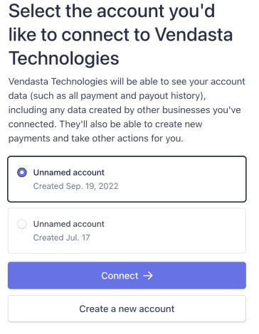
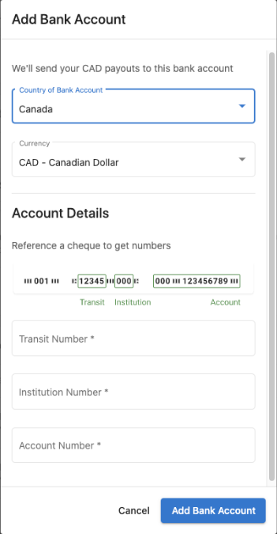

## Was ist Vendasta Payments?

Rechnen Sie alle Ihre Dienstleistungen über eine einzige, integrierte Plattform ab und ziehen Sie Zahlungen dafür ein. Bieten Sie Ihren lokalen Geschäftskunden ein nahtloses Kauferlebnis – alles an einem Ort und alles unter Ihrer Marke.

:::info Zahlungssicherheit
Vendasta führt einen aktuellen SOC 2® Type 2-Bericht zu seinen Sicherheitskontrollen, und Zahlungen werden über Stripe abgewickelt. Details dazu, wie Zahlungs- und Plattformdaten geschützt werden, finden Sie unter [Security and privacy](/getting-started/security-and-privacy) oder besuchen Sie das [Vendasta Trust Center](https://trust.vendasta.com/).
:::

  

    <iframe
      src="https://fast.wistia.net/embed/iframe/ayjibivt6o?web_component=true&seo=true"
      title="Vendasta Payments and Billing Setup Walkthrough"
      allow="autoplay; fullscreen"
      allowTransparency
      frameBorder="0"
      scrolling="no"
      className="wistia_embed"
      name="wistia_embed"
      width="100%"
      height="100%"
    ></iframe>
  

## Was ist bei der Einrichtung von Vendasta Payments enthalten?

### Optionen zur Kontokonfiguration
- **Neues Vendasta Payments-Konto**: Erstellen Sie ein neues Zahlungsabwicklungskonto für Vendasta Payments
- **Stripe-Kontoverbindung**: Verbinden Sie Ihr bestehendes Stripe Standard-Konto
- **Kontoverifizierung**: Erfüllen Sie die Anforderungen zur Identitätsverifizierung
- **Bankeinrichtung**: Konfigurieren Sie Auszahlungsziele und Finanzdaten

### Unterstützte Zahlungsmethoden
- Kredit- und Debitkarten (Visa, Mastercard, American Express, Discover)
- ACH-Überweisungen
- Vorab autorisierte Lastschriften (PADs)

### Regionale Verfügbarkeit
Vendasta Payments ist verfügbar in:
- USA, Kanada, Neuseeland, Australien, Vereinigtes Königreich, Tschechische Republik
- Weitere Länder mit Vertriebsunterstützung: Deutschland, Belgien, Niederlande, Polen, Schweiz

## So richten Sie Vendasta Payments ein

### Voraussetzungen: Meine Abrechnungseinrichtung

Bevor Sie Vendasta Payments einrichten, stellen Sie sicher, dass Ihre Abrechnungsinformationen unter `Partner Center` → `Administration` → `My billing` korrekt konfiguriert sind. Folgende Einstellungen müssen vollständig sein:

- **Billing Contact**: Ihre geschäftlichen Kontaktinformationen
- **Payment Method**: Hinterlegte Kreditkarte (nicht erforderlich, wenn Sie derzeit von Vendasta per Rechnung abgerechnet werden)

Diese Einstellungen sind erforderlich, damit Ihnen die Großhandelskosten für die Aktivierung von Produkten und Dienstleistungen in Rechnung gestellt werden können.

### Standardeinrichtung eines Vendasta Payments-Kontos

<iframe src="https://www.loom.com/embed/df6a770f5aef4db2935b81683559f7e9" frameborder="0" width="100%" height="400px" allowfullscreen></iframe>

Bevor Sie mit dem Einrichtungsprozess beginnen, müssen Partner die zusätzlichen [Terms of Service](https://www.vendasta.com/terms/terms-of-service/) für die Nutzung von Vendasta Payments überprüfen und ihnen zustimmen.

So erstellen Sie ein neues Vendasta Payments-Konto:

1. Navigieren Sie zu `Administration` → `Commerce Settings` → `Vendasta Payments`
2. Klicken Sie auf **Set up Vendasta Payments**, um Ihr Stripe-Konto zu erstellen
3. Geben Sie folgende erforderliche Informationen an:
   - **Legal business name** (muss genau dem Namen entsprechen, der mit Ihrer Steuernummer verknüpft ist)
   - **Business Number**
     - Für US-Unternehmen: Employer Identification Number (EIN)
     - Für kanadische Unternehmen: Canada Revenue Agency (CRA) Business Number
     - [Erfahren Sie mehr über die Identitätsverifizierung](https://stripe.com/docs/connect/identity-verification)
   - **Operating name** Ihres Unternehmens (Ihr Name „geschäftlich tätig als“, falls abweichend vom rechtlichen Namen)
   - **Registered business address** oder Privatadresse (falls Sie keine Geschäftsadresse haben)
   - **Informationen zum Kontovertreter**:
     - Rechtlicher Name
     - Privatadresse
     - ID-Verifizierung (vollständige Sozialversicherungsnummer für die USA sowie amtlicher Ausweis per Webcam, Telefon oder Datei-Upload)
4. Vervollständigen Sie den Kontoantrag mit allen erforderlichen Unterlagen
5. Konfigurieren Sie die Bankdaten für Auszahlungen
6. Warten Sie auf die Kontogenehmigung (in der Regel 1–2 Werktage)

:::warning
Vendasta Payments ist für Free- oder Trial-Abonnementstufen nicht verfügbar. Diese Einschränkung gilt für neue Benutzer sowie für aktuelle Nichtnutzer auf diesen Stufen aufgrund von Betrugspräventionsmaßnahmen.
:::

#### Online-Zahlungen akzeptieren

Standardmäßig ist die Währung, die Sie für Online-Zahlungen akzeptieren, dieselbe Währung, die Sie in Ihrer Abrechnungsbeziehung mit Vendasta verwenden (Ihre Vertragswährung).

Vendasta Payments kann derzeit Zahlungen von Visa-, Mastercard-, American Express- und Discover-Kreditkarten akzeptieren.

Erhaltene Zahlungen werden unter der Registerkarte `Partner Center` → `Commerce` → `Payments` angezeigt.

Nach Eingang Ihrer ersten Zahlung hält Stripe die erhaltenen Zahlungen bis zu eine Woche zurück. Am Ende dieses Zeitraums beginnt Stripe, einen Teil des angesammelten Guthabens auf einer rollierenden 7-Tage-Basis auf das Bankkonto auszuzahlen, das Sie in den Auszahlungseinstellungen hinzufügen.

Wenn eine Zahlung fehlgeschlagen ist, können Partner den Mauszeiger über das ⓘ **Information**-Symbol neben dem Status bewegen, um weitere Informationen zu erhalten.

#### Beschreibung des Kontoauszugs für Kunden

Die Beschreibung des Kontoauszugs, die Sie bei der Einrichtung von Vendasta Payments festlegen, wird auf den Kreditkartenabrechnungen Ihrer Kunden angezeigt und dient dazu, eine von ihnen getätigte Zahlung für Ihre Produkte oder Dienstleistungen zu erläutern.

Eine klare, präzise und wiedererkennbare Kontoauszugsbeschreibung verringert die Wahrscheinlichkeit von Rückbuchungen und Streitfällen, da sie Ihren Kunden hilft, sich zu erinnern, woher eine bestimmte Belastung oder Zahlung stammt.

Standardmäßig erscheint „Vendasta“ auf den Kreditkartenabrechnungen der Kunden, wenn diese eine Zahlung tätigen. Partner können diese Kontoauszugsbeschreibung durch ihren eigenen Firmennamen ersetzen, indem sie diese Informationen bei der Einrichtung von Vendasta Payments eingeben. Sie können bis zu 22 Zeichen für Ihre Kontoauszugsbeschreibung verwenden.

### Verbinden Sie Ihr bestehendes Stripe-Konto

Wenn Sie als Partner bereits ein bestehendes Stripe Standard-Konto haben, können Sie es mit Vendasta Payments verbinden, um von umfassenden Abrechnungsfunktionen wie Rechnungsstellung, Abonnements und Zahlungen zu profitieren.

#### Voraussetzungen für die Stripe-Verbindung
- Sie verwenden bereits Stripe, um Zahlungen von Kunden einzuziehen
- Sie rechnen in einer von Vendasta Payments unterstützten Währung ab
- Sie haben keine Transaktion über ein benutzerdefiniertes Connect-Konto von Vendasta abgeschlossen
- Ihr verbundenes Stripe-Konto ist in einem von Vendasta Payments unterstützten Land registriert

#### Unterstützte Zahlungsmethoden bei Stripe-Verbindung
- Kredit- und Debitkarten
- ACH-Überweisungen
- Vorab autorisierte Lastschriften (PADs)

#### Bearbeitungsgebühren bei verbundenem Stripe-Konto
- **Kreditkarte/Debitkarte/Bank-Lastschrift**: Ihre bestehenden Stripe-Gebühren bleiben unverändert
- **Plattformgebühr**: 0,75 % des Transaktionsbetrags

#### Verbindungsprozess
1. Navigieren Sie zu `Administration` → `Commerce Settings` → `Vendasta Payments`
2. Wählen Sie die Option `Connect Stripe Account`

3. Wählen Sie das Stripe-Konto aus, das Sie mit Vendasta Payments verbinden möchten. Wenn Sie mehrere Stripe-Konten haben, werden Sie aufgefordert, das gewünschte Konto auszuwählen.

4. Überprüfen und akzeptieren Sie die Verbindungsbedingungen
5. Schließen Sie den Integrationsprozess ab

:::info
Diese Funktion ist derzeit nur für neue Benutzer verfügbar, die noch keine Transaktionen mit plattformgenerierten Konten abgeschlossen haben.
:::

## So richten Sie Auszahlungen ein

Um auf Ihre Auszahlungseinstellungen zuzugreifen, navigieren Sie zu `Partner Center` → `Commerce` → `Payouts` oder `Administration` → `Commerce Settings` → `Vendasta Payments`.

### So richten Sie Bankkonten ein

Partner können Auszahlungen aus Online-Kreditkartenzahlungen auf ein oder mehrere Bankkonten erhalten, indem sie ihre Kontodaten in Stripe eingeben.

Wenn Sie in einem Land, in dem Sie tätig sind, keine Bankbeziehung haben, aber ein Bankkonto in einem anderen Land hinzufügen möchten, wenden Sie sich für weitere Informationen an [support@vendasta.com](mailto:support@vendasta.com).

Bei der Konfiguration Ihres ersten Bankkontos für Auszahlungen:

1. Gehen Sie zur Registerkarte `Administration`
2. Navigieren Sie zu `Commerce Settings` → `Vendasta Payments`
3. Klicken Sie unter „Receiving Payout“ auf `Add Bank Account`
4. Geben Sie Ihre Bankkontodaten ein:
   - Kontoinhabertyp (Einzelperson oder Unternehmen)
   - Name der Einzelperson (falls „Individual“ ausgewählt ist) oder Firmenname (falls „Company“ ausgewählt ist)
   - Bankkontonummer
   - Bankleitzahl
5. Legen Sie dieses Konto als Standard für Auszahlungen fest

:::tip
Wenn Sie bereits ein Bankkonto verbunden haben und es ersetzen möchten, müssen Sie zuerst ein neues Bankkonto hinzufügen. Sobald das neue Konto hinzugefügt wurde, können Sie es als Standard festlegen und dann das alte Bankkonto entfernen.
:::

### Ein Standardbankkonto festlegen

Wenn Sie mehr als ein Bankkonto zum Empfang von Auszahlungen hinzufügen, müssen Sie ein Standardkonto auswählen, um festzulegen, welches Konto Ihre Auszahlungen erhält. Sie können Ihr Standardbankkonto jederzeit im Stripe-Dashboard ändern.

### So richten Sie Bankkonten für mehrere Währungen ein

In unterstützten Ländern können Sie mehrere Bankkonten hinzufügen, um Auszahlungen in verschiedenen Währungen ohne Umrechnungsgebühren zu erhalten:

1. Fügen Sie ein Bankkonto pro unterstützter Abrechnungswährung hinzu
2. Wählen Sie eine Standardabrechnungswährung aus (die Sie jederzeit ändern können)
3. Zahlungen, die in konfigurierten Währungen eingehen, werden ohne Umrechnung abgewickelt
4. Zahlungen in nicht konfigurierten Währungen werden automatisch in Ihre Standardwährung umgerechnet

**Beispiel:** Ein Konto mit Sitz im Vereinigten Königreich mit sowohl GBP- als auch USD-Bankkonten (GBP als Standard):
- USD-Zahlungen gehen ohne Umrechnung an das USD-Konto
- GBP-Zahlungen gehen an das GBP-Konto
- Alle anderen Währungen werden in GBP umgerechnet und gehen an das GBP-Konto

### Ihre Auszahlungswährung ändern

Standardmäßig werden Auszahlungen in Ihrer Standardwährung auf Ihr Bankkonto vorgenommen. Sie können jedoch ein neues Auszahlungsziel hinzufügen und Ihre Gelder in eine andere Währung umrechnen lassen, bevor sie auf ein Bankkonto eingezahlt werden. Stripe kann für die Währungsumrechnung eine Gebühr erheben; weitere Informationen finden Sie in der [Stripe Docs](https://stripe.com/docs/payouts).

## Ihr Vendasta Payments Stripe-Konto verstehen

Wenn Sie Vendasta Payments einrichten, wird ein Stripe-Konto erstellt und mit Ihrem Vendasta-Konto verknüpft. Dies ist von einem eventuell bereits vorhandenen persönlichen Stripe-Konto getrennt.

### Vendasta Payments Stripe-Konto vs. persönliches Stripe-Konto

- Ihr **Vendasta Payments Stripe-Konto** kann nur innerhalb von Vendasta verwendet werden. Es kann nicht mit anderen Plattformen genutzt werden.
- Wenn Sie ein **persönliches Stripe-Konto** haben, kann dieses Konto sowohl innerhalb als auch außerhalb von Vendasta verwendet werden.

### Zugriff auf das Stripe-Dashboard

Partner haben keinen direkten Zugriff auf das Stripe-Dashboard. Berichte zu Zahlungen und Auszahlungen sind im Partner Center unter `Commerce` → `Payments` und `Commerce` → `Payouts` verfügbar.

### Ihre Unternehmensform ändern

Wenn Sie bei der Einrichtung von Vendasta Payments die falsche Unternehmensform ausgewählt haben (z. B. Unternehmen statt Einzelperson), wenden Sie sich an [billingsupport@vendasta.com](mailto:billingsupport@vendasta.com), um dies korrigieren zu lassen.

## Kontoinformationen verwalten

### Ihren Firmennamen aktualisieren

Es gibt zwei separate Firmennamen-Einstellungen für Vendasta Payments, die unterschiedliche Dinge steuern:

| Einstellung | Was sie steuert | Wo Sie sie ändern |
|---|---|---|
| **Rechtlicher Firmenname bei Stripe** | Ihr rechtlicher Name für Auszahlungen, Compliance und Steuerberichterstattung | Stripe Dashboard → `Settings` → `Account details` |
| **Anzeigename im Partner Center** | Der Name, der Kunden auf den Rechnungszahlungsbildschirmen und Kreditkartenabrechnungen angezeigt wird | `Partner Center` → `Administration` → `Business Profile` |

Wenn Sie diese beiden Einstellungen aufeinander abstimmen, vermeiden Sie Verwirrung, wenn Kunden beim Bezahlen einer Rechnung einen anderen Namen sehen als erwartet.

**So aktualisieren Sie Ihren rechtlichen Firmennamen in Stripe:**

1. Melden Sie sich über den Link unter `Administration` → `Commerce Settings` → `Vendasta Payments` → `Manage Account` bei Ihrem Stripe-Konto an
2. Gehen Sie zu `Settings` → `Account details`
3. Aktualisieren Sie das Feld **Legal business name**
4. Speichern Sie Ihre Änderungen

:::warning
Die Änderung Ihres rechtlichen Firmennamens bei Stripe kann eine erneute Identitätsverifizierung auslösen. Auszahlungen können kurzzeitig pausiert werden, während Stripe die Änderung überprüft.
:::

**So aktualisieren Sie den auf den Rechnungszahlungsbildschirmen der Kunden angezeigten Namen:**

1. Navigieren Sie zu `Partner Center` → `Administration` → `Business Profile`
2. Aktualisieren Sie das Feld **Business name**
3. Speichern Sie Ihre Änderungen

### Eigentümerinformationen aktualisieren
So ersetzen Sie Eigentümerdaten in Ihrem Zahlungskonto:

1. Navigieren Sie zu `Administration` → `Commerce Settings` → `Vendasta Payments`
2. Klicken Sie im Abschnitt `Accepting Payments` auf `Manage Account`
3. Klicken Sie auf der Seite „Identity Verification“ neben dem aktuellen Eigentümer auf `Update`
4. Füllen Sie das Formular mit den neuen Eigentümerinformationen aus
5. Entfernen Sie den vorherigen Eigentümer, indem Sie auf `Remove Person` → `Done` klicken

### Rechnungsadresse aktualisieren
So ändern Sie die auf Kundenrechnungen angezeigte Adresse:

1. Gehen Sie zu `Administration` → `My billing`
2. Klicken Sie auf `Billing Contact`
3. Aktualisieren Sie die Adressinformationen nach Bedarf
4. Speichern Sie die Änderungen

Aktualisierte Adressen erscheinen auf allen zukünftigen Kundenrechnungen.

## Kundenseitige Nutzungsbedingungen für die Zahlungsabwicklung

Ihre Kunden müssen den Nutzungsbedingungen zustimmen, die für die Zahlungsabwicklung gelten, wenn sie eine Service-Bestellung bezahlen. Diese Bedingungen erklären, dass Vendasta die Zahlungserfassung in Ihrem Namen abwickelt, und geben Auskunft darüber, wie Rückerstattungen, Streitfälle und andere zahlungsspezifische Details gehandhabt werden.

Dies trägt dazu bei, Ihre Haftung im Falle von Zahlungsstreitigkeiten mit Ihren Kunden zu begrenzen. In den meisten Rechtsordnungen sind Sie gesetzlich verpflichtet, spezielle Bedingungen für die Zahlungsabwicklung zu haben, wenn Sie Zahlungen entgegennehmen.

Die Bedingungen wurden mit Blick auf den Schutz der Partner und die Minimierung Ihrer Haftung erstellt. Alle Partner, die Vendasta Payments nutzen, sollten diese Einstellung aktiviert lassen, damit diese Bedingungen angezeigt werden, wenn der Kunde eine Zahlung vornimmt. Es wird nicht empfohlen, diese Bedingungen zu deaktivieren, da dies Ihre Haftung erhöhen kann.

## Fehlerbehebung bei Einrichtungsproblemen

### Fehler „Unsupported in Your Area“
Wenn diese Meldung angezeigt wird, obwohl Sie sich in einer unterstützten Region befinden:

1. Navigieren Sie zu `Administration` → `My billing`
2. Prüfen Sie, ob Ihre Rechnungskontaktinformationen vollständig sind
3. Stellen Sie sicher, dass Ihre Rechnungsadresse mit Postleitzahl vollständig ausgefüllt ist
4. Speichern Sie fehlende Informationen und versuchen Sie die Einrichtung erneut

Fehlende Angaben zur Rechnungsadresse verhindern die Aktivierung von Vendasta Payments, selbst in unterstützten Regionen.

### Keine Einrichtungsoption verfügbar
Wenn Sie keine Einrichtungsoptionen für Vendasta Payments sehen, deutet dies in der Regel auf Folgendes hin:
- Ihr Konto befindet sich auf einer Free- oder Trial-Stufe (Upgrade erforderlich)
- Sie befinden sich in einer nicht unterstützten geografischen Region
- Ihr Konto weist Einschränkungen auf, die Vendasta Payments verhindern

### Land des Stripe-Kontos nicht unterstützt
Wenn Ihre Stripe-Kontoverbindung nicht verfügbar ist oder während der Einrichtung fehlschlägt:

1. Bestätigen Sie, dass Ihr verbundenes Stripe-Konto in einem von Vendasta Payments unterstützten Land registriert ist
2. Verbinden Sie bei Bedarf ein Stripe-Konto, das in einem unterstützten Land registriert ist
3. Wenn Sie sich nicht sicher sind, welche Länder für Ihre Einrichtung unterstützt werden, wenden Sie sich an [support@vendasta.com](mailto:support@vendasta.com)

## Video-Anleitungen

Dieser Abschnitt enthält zwei Videoreihen, die Ihnen helfen, Vendasta Payments einzurichten und zu verstehen, wie die einzelnen Komponenten funktionieren.

### Einrichtungs-Videoanleitungen

Sehen Sie sich die folgenden Videos an, um eine Schritt-für-Schritt-Anleitung zur Einrichtung aller Komponenten von Vendasta Payments zu erhalten:

#### 1. Zahlungen einrichten

<iframe src="//fast.wistia.com/embed/iframe/6ar0gt02w5" width="560" height="315" frameBorder="0" allowFullScreen></iframe>

#### 2. Währung und Verkaufspreis festlegen

<iframe src="//fast.wistia.com/embed/iframe/1v9ge9w7cy" width="560" height="315" frameBorder="0" allowFullScreen></iframe>

#### 3. Bestehende Pakete aktualisieren

<iframe src="//fast.wistia.com/embed/iframe/sbzyunnepn" width="560" height="315" frameBorder="0" allowFullScreen></iframe>

#### 4. Pakete für Buy-It-Yourself konfigurieren

<iframe src="//fast.wistia.com/embed/iframe/zz1xdea7bj" width="560" height="315" frameBorder="0" allowFullScreen></iframe>

#### 5. Steuern anwenden

<iframe src="//fast.wistia.com/embed/iframe/57z3ynyeba" width="560" height="315" frameBOrder="0" allowFullScreen></iframe>

### Komponenten von Vendasta Payments verstehen

Diese Videos helfen zu erklären, wie die verschiedenen Elemente innerhalb von Vendasta Payments funktionieren:

#### Wie funktioniert BIY mit der Business App?

<iframe src="//fast.wistia.com/embed/iframe/7fh8sbaf2e" width="560" height="315" frameBorder="0" allowFullScreen></iframe>

#### Wie funktioniert BIY mit dem Store?

<iframe src="//fast.wistia.com/embed/iframe/7nyr2st4i0" width="560" height="315" frameBorder="0" allowFullScreen></iframe>

#### Wie funktioniert die Rechnungsstellung?

<iframe src="//fast.wistia.com/embed/iframe/dpkqrtbr41" width="560" height="315" frameBorder="0" allowFullScreen></iframe>

#### Wie funktionieren Zahlungen und Auszahlungen?

<iframe src="//fast.wistia.com/embed/iframe/23ixlvylkr" width="560" height="315" frameBorder="0" allowFullScreen></iframe>

## Häufige Fragen zur Einrichtung von Vendasta Payments

Welche Gebühren fallen bei der Verbindung meines eigenen Stripe-Kontos an?

Sie zahlen zusätzlich zu Ihren bestehenden ausgehandelten Stripe-Gebühren eine Plattformgebühr von 0,75 %. Ihre aktuellen Stripe-Sätze bleiben unverändert.

Kann ich Kundenzahlungsdaten von meinem bestehenden Stripe-Konto übertragen?

Derzeit ist eine automatische Übertragung von Kundenzahlungsinformationen nicht möglich. Sie müssen die Zahlungsdaten manuell in die Plattform eingeben.

Kann ich Zahlungen einsehen, nachdem ich mein Stripe-Konto verbunden habe?

Ja, Sie können Zahlungsdetails einsehen, die über die Plattform verarbeitet wurden. Auszahlungsinformationen müssen jedoch direkt in Ihrem Stripe-Konto abgerufen werden.

Kann ich mein eigenes Stripe-Konto hinzufügen, wenn ich bereits ein Plattformkonto verwende?

Diese Funktion ist derzeit nur für neue Benutzer verfügbar, die noch keine Transaktionen mit plattformgenerierten Konten abgeschlossen haben.

Berechnet Vendasta zusätzliche Stripe-Gebühren, wenn ich mein eigenes Stripe-Konto verbinde?

Nein, Sie behalten Ihre ausgehandelten Stripe-Gebühren. Vendasta berechnet nur eine Plattformgebühr von 0,75 % auf den Transaktionsbetrag.

Wenn ich Unterstützung für mein persönliches Stripe-Konto benötige, kann ich mich an Vendasta wenden?

Aufgrund des eingeschränkten Kontozugriffs muss jeglicher Support für persönliche Stripe-Konten direkt mit Stripe abgewickelt werden.

Warum ist Vendasta Payments auf Free- und Trial-Stufen nicht verfügbar?

Aufgrund zunehmender betrügerischer Transaktionen ist Vendasta Payments auf Free- und Trial-Stufen eingeschränkt. Bestehende Benutzer auf diesen Stufen, die den Dienst bereits nutzen, behalten den Zugriff.

Wenn ich über Vendasta Payments eine Stripe-Verbindung erstelle, kann ich auf mein Stripe-Konto zugreifen?

Nein, der Stripe-Zugriff ist auf Billing Support beschränkt. Wenn Sie Unterstützung mit Ihrem Vendasta Payments-Konto benötigen, senden Sie bitte ein Ticket an billingsupport@vendasta.com.

