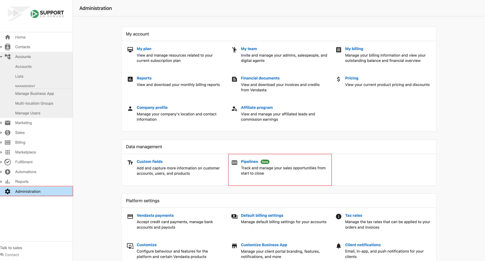

Mit Vertriebspipelines verfolgen Sie den Fortschritt von Opportunities und Umsatzprognosen. Verwenden Sie die standardmäßige vierstufige Pipeline oder erstellen Sie benutzerdefinierte Pipelines mit eigenen Phasen und Prognoseprozentsätzen.

## Standardpipeline

Die Standardpipeline hat vier Phasen: **Lead**, **Kontakt**, **Qualifiziert** und **Angebot**, mit Prognoseprozentsätzen von 0 %, 20 %, 40 % bzw. 60 %. Umsatzprognosen basieren auf der Wahrscheinlichkeit, die Sie für jede Phase festlegen. Wenn der Standard nicht zu Ihrem Unternehmen passt, können Sie benutzerdefinierte Pipelines erstellen und eigene Phasen und Prozentsätze definieren.

## Pipeline-Verwaltung

- **Pipelines erstellen** – Neue Vertriebs- und Workflow-Pipelines einrichten
- **Pipeline-Phasen** – Phasen und Fortschrittsregeln konfigurieren
- **Pipeline-Automatisierung** – Automatisierte Aktionen und Auslöser einrichten
- **Pipeline-Analysen** – Leistung und Konversionsraten über die Phasen hinweg verfolgen
- **Pipeline-Vorlagen** – Wiederverwendbare Vorlagen nutzen und erstellen

## So erstellen Sie eine Pipeline

1. Gehen Sie zu `Partner Center` → `Administration` und klicken Sie dann auf `Pipelines`.

   

2. Bearbeiten Sie die vorhandene Pipeline oder klicken Sie auf `Create pipeline`, um eine neue hinzuzufügen. Die Phasen erscheinen in Ihrer Pipeline in der Reihenfolge der Erfolgswahrscheinlichkeit, die Sie ihnen zuweisen.

   

## Häufig gestellte Fragen

Kann ich für mehrere Pipeline-Phasen denselben Wert eingeben?

Nein. Jede Pipeline-Phase muss einen eindeutigen numerischen Wert für die Abschlusswahrscheinlichkeit haben. Wenn Sie für mehrere Phasen denselben Wert eingeben, zeigt das System einen Fehler an.

