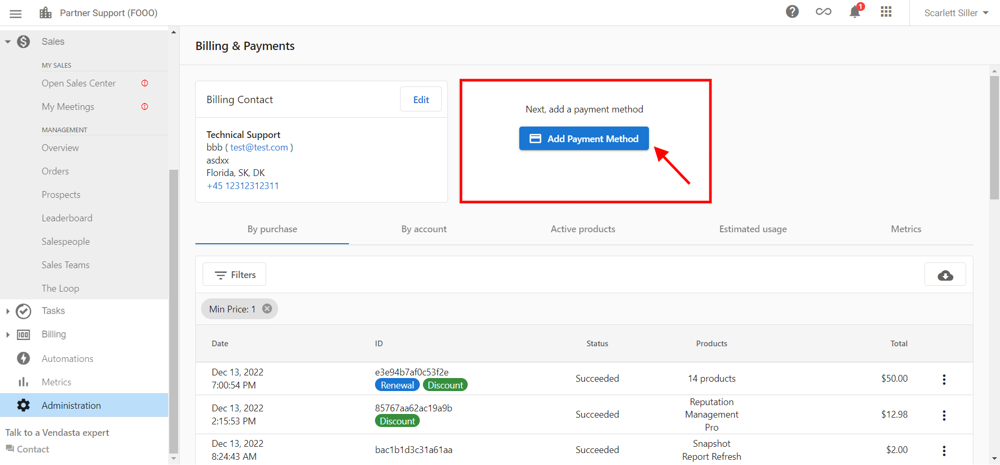
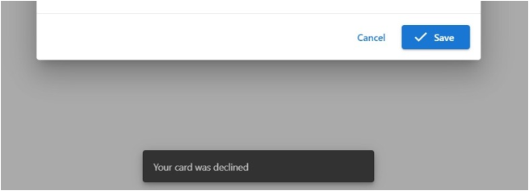

## Was sind Zahlungsmethoden und Abrechnungseinrichtung?

Mit Zahlungsmethoden und der Abrechnungseinrichtung in Partner Center können Sie alle Aspekte Ihrer Zahlungsinformationen und Rechnungskontakte verwalten. Dazu gehören das Hinzufügen von Kreditkarten, die Aktualisierung von Abrechnungsinformationen, das Ändern von Rechnungs-E-Mail-Adressen und das Wiederholen fehlgeschlagener Zahlungen.

## Warum ist die Verwaltung von Zahlungsmethoden wichtig?

Korrekt eingerichtete Zahlungsmethoden und Abrechnungsinformationen gewährleisten:
- Unterbrechungsfreien Service für Ihre Produkte und Abonnements
- Genaue Abrechnung und Rechnungsstellung
- Angemessene Kommunikation bei Abrechnungsfragen
- Schnelle Lösung von Zahlungsproblemen

## Was Sie mit Zahlungsmethoden tun können

| Aktion | Beschreibung |
|--------|-------------|
| **Zahlungsmethode hinzufügen** | Fügen Sie Ihre Kreditkarteninformationen für Käufe hinzu |
| **Abrechnungsinformationen aktualisieren** | Ändern Sie die Kontaktdaten Ihres Rechnungskontakts und die Unternehmensinformationen |
| **Rechnungs-E-Mail ändern** | Aktualisieren Sie, wohin Rechnungen gesendet werden |
| **Fehlgeschlagene Zahlungen wiederholen** | Wiederholen Sie manuell fehlgeschlagene Zahlungen |
| **Zahlungsprobleme verwalten** | Beheben Sie Probleme mit abgelehnten Karten und Zahlungen |

## So richten Sie Zahlungsmethoden ein

### Ihre erste Kreditkarte hinzufügen

Um Käufe auf der Vendasta-Plattform zu tätigen, müssen Sie Ihre Zahlungsinformationen zur Plattform hinzufügen.

So fügen Sie Ihre Kreditkarte zu Partner Center hinzu:

1. Navigieren Sie zu `Administration` → `My billing` → `Add Payment Method`

### Vollständige Abrechnungsinformationen hinzufügen

Wenn Sie Ihre Abrechnungsinformationen noch nicht hinzugefügt haben, können Sie dies unter `Partner Center` → `Administration` → `My billing` tun.

#### Schritt 1: Rechnungskontakt hinzufügen

1. Wählen Sie auf der Seite My billing `Add Billing Contact`

2. Füllen Sie das Formular aus und stellen Sie sicher, dass alle mit einem Sternchen (*) markierten Felder ausgefüllt sind
3. Klicken Sie danach auf `Save`

#### Schritt 2: Zahlungsmethode hinzufügen

1. Wählen Sie nach dem Hinzufügen der Rechnungskontaktinformationen `Add Payment Method`
2. Das Zahlungsmethodenformular wird angezeigt:

3. Füllen Sie das Formular aus und wählen Sie `Save`

:::note Probleme mit abgelehnten Karten
Wenn Sie eine Meldung erhalten, dass die Karte abgelehnt wurde, blockiert Ihr Kreditkartenunternehmen die Transaktion wahrscheinlich, weil es sich um eine internationale Zahlung handelt. Bitte kontaktieren Sie Ihr Kreditkartenunternehmen und bitten Sie es, alle Transaktionen von Vendasta Technologies Inc. zuzulassen.

:::

## So aktualisieren Sie vorhandene Informationen

### Abrechnungsinformationen aktualisieren

Wenn Sie Ihre Abrechnungsinformationen nach der Eingabe aktualisieren müssen:

1. Navigieren Sie zu `Partner Center` → `Administration` → `My billing`
2. Klicken Sie auf `Edit` im Abschnitt, den Sie aktualisieren möchten

:::tip
Wenn Sie Ihre Karte beim Bestätigen einer Bestellung in Partner Center aktualisieren, werden auch die Abrechnungsinformationen unter `My billing` aktualisiert.
:::

### Rechnungs-E-Mail-Adresse ändern

Die E-Mail-Adresse, an die wir Rechnungen senden, zu aktualisieren, ist genauso einfach wie die Aktualisierung der Rechnungskontaktinformationen:

1. Gehen Sie zu `Partner Center` → `Administration` → `My billing` → `Edit Billing contact`

:::tip Mehrere Rechnungskontakt-E-Mail-Adressen
Sie können mehr als eine E-Mail-Adresse hinzufügen, um Rechnungen und Abrechnungsbenachrichtigungen zu erhalten. Geben Sie im Rechnungskontaktformular mehrere Adressen ein, getrennt durch ein **Komma** oder **Semikolon** (z. B. `billing@yourcompany.com, finance@yourcompany.com`).
:::

## So verwalten Sie Zahlungsprobleme

### Mehrere Kreditkarten

**Können mehrere Kreditkarten zu Partner Center hinzugefügt werden?**

Nein, es kann nur **eine Kreditkarte** zu Partner Center hinzugefügt werden. Sie können Ihre Zahlungsmethode hinzufügen oder bearbeiten, indem Sie zu `Administration` → `My billing` → `Add Payment Method` gehen.

Jeder Versuch, eine zweite Karte hinzuzufügen, überschreibt die vorherige.

### Fehlgeschlagene Zahlungen wiederholen

**Kann ich eine Zahlung wiederholen?**

Ja, Sie können eine fehlgeschlagene Zahlung wiederholen:

1. Gehen Sie zu `Partner Center` → `Administration` → `My billing`
2. Klicken Sie auf die drei Punkte neben dem Kauf, den Sie bezahlen möchten
3. Wählen Sie `retry`

:::note
Es dauert einige Zeit, bis das System den Status bei erfolgreicher Zahlung auf `Succeeded` aktualisiert.
:::

## Was passiert, wenn eine Zahlung fehlschlägt

### Zeitplan für Wiederholungsversuche

Wenn eine Kreditkartenbelastung fehlschlägt, wiederholt die Plattform die Zahlung automatisch bis zu **5 Mal über etwa 14 Tage**. Sie erhalten für jeden fehlgeschlagenen Versuch eine E-Mail-Benachrichtigung.

### Kontosperrung

Wenn alle Wiederholungsversuche fehlschlagen:

- **Partner mit sofortiger Abrechnung**: Nach Tag 14 wird der Zugriff auf Partner Center und Business App für Vertragspartner gesperrt. Partner mit Starter-/Startup-Tarifen werden auf die kostenlose Stufe herabgestuft.
- **Partner mit Rechnungsstellung**: Ihr Konto wird 30 Tage nach Rechnungsstellung gesperrt, wenn keine Zahlung eingeht.

### Was mit aktiven Produkten passiert

Produkte bleiben bis zu 30 Tage nach einem Zahlungsfehler aktiv, verlängern sich jedoch **nicht automatisch**, wenn keine Zahlung erfolgt. Sie müssen Produkte nach Behebung der fehlgeschlagenen Zahlung manuell reaktivieren.

### So beheben Sie eine fehlgeschlagene Zahlung

1. Gehen Sie zu `Partner Center` → `Administration` → `My billing`
2. Klicken Sie auf `View Failed Payments`
3. Aktualisieren Sie bei Bedarf Ihre Kreditkarte (siehe [Abrechnungsinformationen aktualisieren](#abrechnungsinformationen-aktualisieren))
4. Wiederholen Sie den fehlgeschlagenen Kauf über die drei Punkte neben dem Kauf und die Auswahl von `Retry`

Eine erfolgreiche Zahlung stellt den Zugriff auf Ihr Konto automatisch wieder her.

## Anforderungen an Zahlungsmethoden

### Akzeptierte Zahlungsmethoden

- Für alle Partner ist eine hinterlegte Kreditkarte erforderlich
- Wir akzeptieren derzeit Visa, Mastercard und Amex
- Bei weiteren Fragen wenden Sie sich an billingsupport@vendasta.com

### Internationale Zahlungen

Wenn Ihr Kreditkartenunternehmen internationale Transaktionen blockiert:
- Kontaktieren Sie Ihr Kreditkartenunternehmen
- Bitten Sie es, alle Transaktionen von Vendasta Technologies Inc. zuzulassen
- Dies löst die meisten Probleme mit abgelehnten Karten

## Häufig gestellte Fragen

Kann ich mehrere Kreditkarten für verschiedene Käufe verwenden?

Nein, Partner Center unterstützt jeweils nur eine Kreditkarte. Jede neue Karte, die Sie hinzufügen, ersetzt die vorherige. Sie können Ihre Zahlungsmethode jedoch bei Bedarf vor bestimmten Käufen aktualisieren.

Was passiert, wenn meine Zahlung fehlschlägt?

Wenn eine Zahlung fehlschlägt, erhalten Sie eine Benachrichtigung. Sie können die Zahlung manuell wiederholen, indem Sie zu `Partner Center` → `Administration` → `My billing` gehen, auf die drei Punkte neben dem fehlgeschlagenen Kauf klicken und `retry` auswählen.

Woher weiß ich, ob meine Abrechnungsinformationen vollständig sind?

Vollständige Abrechnungsinformationen umfassen sowohl einen Rechnungskontakt (Unternehmensinformationen) als auch eine Zahlungsmethode (Kreditkarte). Beide Abschnitte müssen ausgefüllt sein, um Käufe zu tätigen und ordnungsgemäße Rechnungen zu erhalten.

Kann ich meine Abrechnungsinformationen nach der Einrichtung ändern?

Ja, Sie können Ihre Abrechnungsinformationen jederzeit aktualisieren, indem Sie zu `Partner Center` → `Administration` → `My billing` gehen und auf `Edit` im gewünschten Abschnitt klicken.

Warum wurde meine Karte abgelehnt?

Der häufigste Grund für abgelehnte Karten ist, dass Ihr Kreditkartenunternehmen internationale Transaktionen blockiert. Kontaktieren Sie Ihr Kreditkartenunternehmen und bitten Sie es, Transaktionen von Vendasta Technologies Inc. zuzulassen.

Wie ändere ich, wohin meine Rechnungen gesendet werden?

Um Ihre Rechnungs-E-Mail-Adresse zu ändern, aktualisieren Sie Ihre Rechnungskontaktinformationen unter `Partner Center` → `Administration` → `My billing` → `Edit Billing contact`.

Kann ich Rechnungen an mehrere E-Mail-Adressen senden?

Ja. In Ihren Rechnungskontaktinformationen können Sie mehrere E-Mail-Adressen eingeben, getrennt durch ein Komma oder Semikolon. Alle aufgeführten Adressen erhalten Rechnungen und Abrechnungsbenachrichtigungen.

Was passiert, wenn meine Zahlung fehlschlägt und ich sie nicht behebe?

Die Plattform wiederholt Ihre Zahlung bis zu 5 Mal über etwa 14 Tage. Wenn alle Versuche fehlschlagen, wird der Zugriff auf Ihr Konto gesperrt. Vertragspartner verlieren den Zugriff auf Partner Center und Business App, während Starter-/Startup-Partner auf die kostenlose Stufe herabgestuft werden. Partner mit Rechnungsstellung werden 30 Tage nach dem Rechnungsdatum gesperrt, wenn nicht bezahlt wird.

Aktive Produkte bleiben bis zu 30 Tage verfügbar, verlängern sich aber nicht. Um den Zugriff wiederherzustellen, aktualisieren Sie Ihre Zahlungsmethode und wiederholen Sie die fehlgeschlagenen Zahlungen unter `Partner Center` → `Administration` → `My billing` → `View Failed Payments`.

