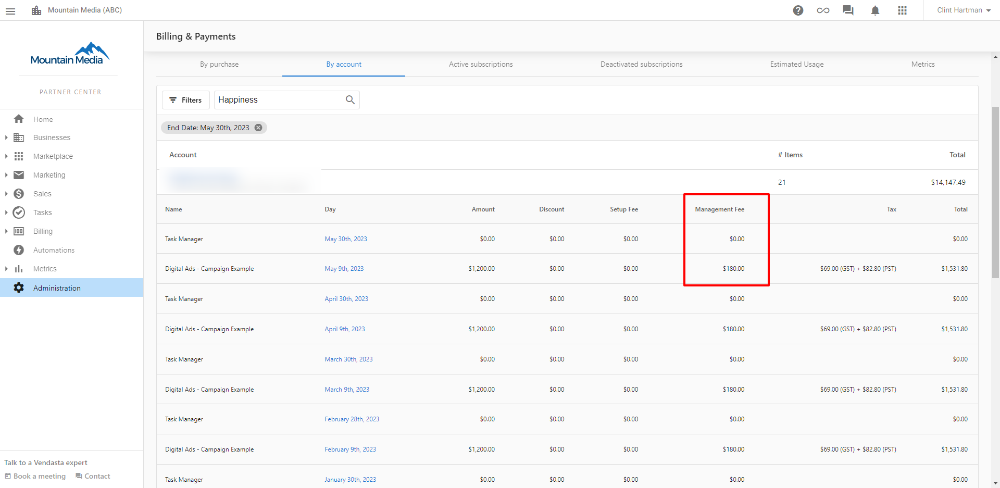
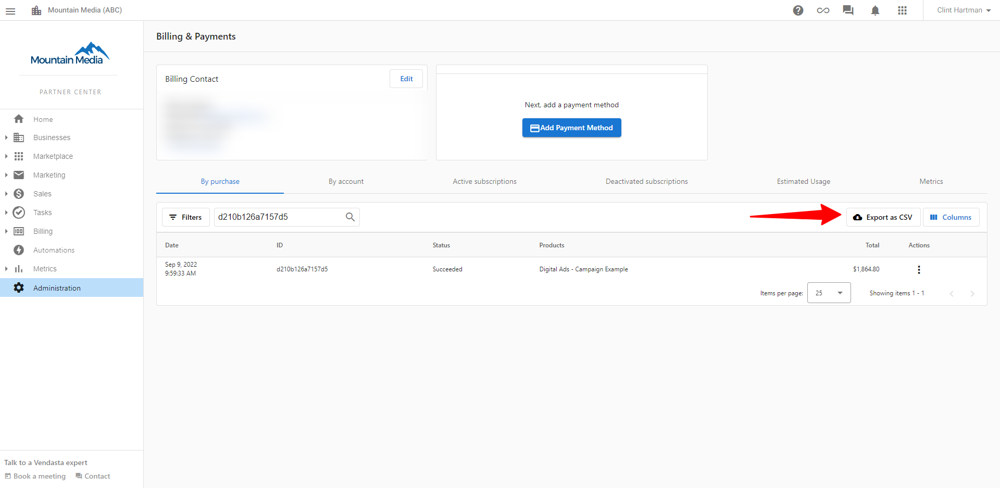
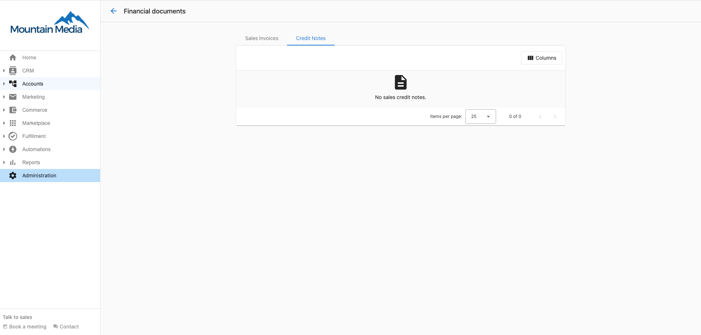
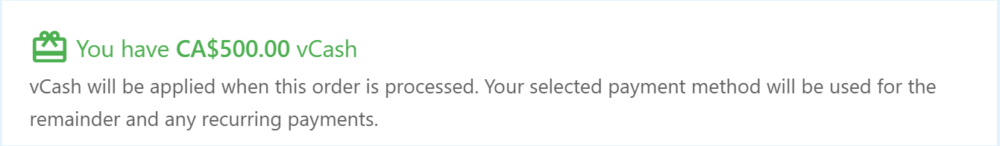

## Was sind Sonderfunktionen und Gutschriften?

Sonderfunktionen und Gutschriften in Partner Center umfassen die Sichtbarkeit von Verwaltungsgebühren, Gutschriften für gekündigte Dienste und virtuelles vCash-Guthaben, das auf jeden Vendasta-Kauf angewendet werden kann. Diese Funktionen sorgen für Transparenz bei der Abrechnung und flexible Zahlungsoptionen.

## Warum sind diese Funktionen wichtig?

Das Verständnis der speziellen Abrechnungsfunktionen hilft Ihnen dabei:
- Zusätzliche Gebühren im Zusammenhang mit Produkten nachzuverfolgen
- Guthaben aus gekündigten Diensten zu verwalten
- Virtuelles Guthaben zur Kostensenkung einzusetzen
- Genaue Finanzunterlagen zu führen
- Ihre Ausgaben mit verfügbarem Guthaben zu optimieren

## Was Sie mit Sonderfunktionen tun können

| Funktion | Beschreibung |
|---------|-------------|
| **Verwaltungsgebühren** | Zusätzliche Gebühren für bestimmte Produkte einsehen |
| **Gutschriften** | Guthaben aus gekündigten Produkten oder Diensten abrufen |
| **vCash-Guthaben** | Virtuelles Guthaben für jeden Vendasta-Kauf verwenden |
| **Guthabenverlauf** | Alle Guthaben und Gebühren im Zeitverlauf nachverfolgen |

## Verwaltungsgebühren

### Was sind Verwaltungsgebühren?

Verwaltungsgebühren sind Kosten, die für bestimmte Vendasta-Produkte anfallen. Diese Gebühren erscheinen als separate Positionen auf Ihrer Rechnung, wodurch die zusätzlichen Kosten für bestimmte Produkte leichter zu erkennen sind.

### So sehen Sie Verwaltungsgebühren ein

#### Auf Ihrer Quittung

Verwaltungsgebühren erscheinen als separate Positionen auf Ihrer Quittung:

#### Im Tab `By purchase`

Sie können Verwaltungsgebühren im Tab `By purchase` Ihres Abrechnungsbereichs einsehen:

#### Im Tab `By account`

Sie können Verwaltungsgebühren auch im Tab `By account` einsehen, der Gebühren nach Geschäftskonto ordnet:

### Verwaltungsgebühren-Berichte herunterladen

So laden Sie einen detaillierten CSV-Bericht mit Verwaltungsgebühren herunter:

1. Gehen Sie zum Tab `By purchase`
2. Klicken Sie auf die Option `CSV download`

#### Das CSV-Berichtsformat verstehen

Der CSV-Bericht zeigt Ihre Verwaltungsgebühren im folgenden Format:

### PDF-Rechnungen

Ihre monatliche PDF-Rechnung zeigt Verwaltungsgebühren ebenfalls als separate Positionen an:

## Partner-Gutschriften

### Was sind Gutschriften?

Eine Gutschrift ist ein von Vendasta ausgestellter Beleg für einen Partner, der ein Produkt oder eine bzw. mehrere Dienstleistungen gekündigt hat und dem „Guthaben" angeboten wird, das zur Verrechnung mit zukünftigen Käufen verwendet werden kann.

### So greifen Sie auf Gutschriften zu

Ihr Gutschriftenverlauf befindet sich unter `Partner Center` → `Administration` → `Financial Documents` → `Credit notes`.

### Gutschriften verwenden

Gutschriften stehen für:
- Rückerstattungen für gekündigte Produkte oder Dienste
- Guthaben, die auf zukünftige Käufe angewendet werden können
- Anpassungen an Ihrem Kontostand
- Dokumentation für die Finanzbuchhaltung

## vCash: virtuelles Guthaben

### Was ist vCash?

**vCash** ist virtuelles Guthaben, das Sie für Käufe im Vendasta-Ökosystem verwenden können. Sie können vCash für *jeden* Kauf einsetzen.

**Beispiele, wofür Sie vCash verwenden können:**
- Kauf von Reputation AI
- Ihre Abonnementgebühren
- Marketplace-Käufe
- Jeder Kauf innerhalb des Vendasta-Systems

[Klicken Sie hier, um die vollständigen Allgemeinen Geschäftsbedingungen einzusehen](http://vendasta.com/vcash-terms-and-conditions/).

### So prüfen Sie Ihr vCash-Guthaben

Wenn Sie vCash besitzen, finden Sie Ihr Guthaben unter [`Partner Center` → `Administration` → `My billing` → `Billing & Payments`](https://partners.vendasta.com/billing/by-purchase).

### So verwenden Sie vCash

Beim Abschluss eines Kaufs sehen Sie den folgenden Hinweis, wenn Sie über ein vCash-Guthaben verfügen:

Ihr vCash-Guthaben wird automatisch auf den Kauf angerechnet. Reicht das Guthaben nicht aus, um den gesamten Kauf zu decken, wird das verfügbare vCash-Guthaben angerechnet und Ihnen wird nur der Restbetrag berechnet.

### vCash-Anwendungsregeln

- vCash wird automatisch auf berechtigte Käufe angerechnet
- Ist Ihr vCash-Guthaben geringer als der Kaufbetrag, wird der Restbetrag Ihrer Zahlungsmethode belastet
- vCash kann für jedes Produkt oder jede Dienstleistung im Vendasta-Ökosystem verwendet werden
- Guthaben werden in der Reihenfolge ihrer Ausstellung angerechnet

## Rabatte und Volumenverpflichtungen

### Was ist eine Volumenverpflichtung?

Eine Volumenverpflichtung ist eine vertragliche Vereinbarung, eine Mindestanzahl an Produkten pro Monat zu aktivieren. Erreichen Sie dieses Minimum bis zum Monatsende nicht, wird Ihnen die Differenz in Rechnung gestellt, unabhängig davon, ob die Produkte aktiv genutzt wurden. Volumenverpflichtungen sind eine vertragliche Verpflichtung, keine nutzungsbasierte Abrechnung.

### Warum Ihnen möglicherweise eine Gebühr berechnet wird, obwohl Sie ein Produkt nicht genutzt haben

Wenn Sie eine Volumenverpflichtung für ein Produkt haben und Ihre Aktivierungen das Minimum unterschreiten, berechnet die Plattform die Differenz am Monatsende. Diese Gebühr ist kein Abrechnungsfehler. Sie spiegelt das von Ihnen vereinbarte Verpflichtungsvolumen wider.

### So funktionieren Rabatte (platzbasierte Logik)

Rabatte auf Vendasta-Produkte werden als feste Anzahl von Plätzen pro Abrechnungszeitraum vergeben. Diese Plätze werden nach dem Prinzip **Wer zuerst kommt, mahlt zuerst** an die Konten vergeben, die das rabattierte Produkt im Monat am frühesten aktivieren oder verlängern.

- Sind alle Rabattplätze früh im Monat belegt, werden spätere Aktivierungen zum Standardpreis berechnet.
- Rabatte sind standardmäßig nicht kontospezifisch. Sie gelten für das Konto, das das Produkt zuerst nutzt.

### Zeitregel für Rabatte

Die Vendasta-Plattform arbeitet in **UTC**. Der Rabatt läuft um **18:00 Uhr CST am letzten Tag des Abrechnungszeitraums** ab. Aktivierungen, die nach diesem Stichtag verarbeitet werden, qualifizieren sich nicht mehr für den auslaufenden Rabatt, selbst wenn sie in Ihrer lokalen Zeitzone innerhalb desselben Kalendertags zu liegen scheinen.

### So sehen Sie Ihre Rabatte ein

So sehen Sie die aktuell auf Ihr Konto angewendeten Rabatte:

1. Navigieren Sie zu `Partner Center` → `Administration` → `My billing`
2. Klicken Sie auf den Tab `Discounts`

Hier werden Ihre aktiven Rabattvereinbarungen angezeigt, einschließlich der Anzahl der verpflichteten Plätze und des Rabattsatzes.

## Guthaben und Gebühren verwalten

### Guthabenverfolgung

Alle Guthaben und Gebühren werden in Ihrem Partner Center erfasst:
- Verwaltungsgebühren erscheinen als separate Positionen
- Gutschriften sind über Financial Documents zugänglich
- vCash-Guthaben werden in Ihrem Abrechnungsbereich angezeigt
- Historische Daten werden zur Aufzeichnung aufbewahrt

### Finanzbuchhaltung

Nutzen Sie diese Funktionen, um:
- Alle zusätzlichen Kosten und Guthaben nachzuverfolgen
- Genaue Finanzunterlagen zu führen
- Verfügbares Guthaben zur Kostensenkung einzusetzen
- Gebührenstrukturen für verschiedene Produkte zu überwachen

## Häufig gestellte Fragen

Was sind Verwaltungsgebühren und warum sehe ich sie?

Verwaltungsgebühren sind zusätzliche Kosten, die für bestimmte Vendasta-Produkte anfallen. Sie erscheinen als separate Positionen auf Ihrer Rechnung, um Transparenz über die zusätzlichen Kosten bestimmter Produkte zu schaffen.

Wie greife ich auf meine Gutschriften zu?

Ihr Gutschriftenverlauf befindet sich unter `Partner Center` → `Administration` → `Financial Documents` → `Credit notes`. Gutschriften werden ausgestellt, wenn Sie Produkte oder Dienste kündigen und Guthaben für die zukünftige Nutzung erhalten.

Was ist vCash und wie verwende ich es?

vCash ist virtuelles Guthaben, das für jeden Kauf im Vendasta-Ökosystem verwendet werden kann. Es wird automatisch auf berechtigte Käufe angerechnet, und Sie können Ihr Guthaben unter `Partner Center` → `Administration` → `My billing` → `Billing & Payments` einsehen.

Kann ich steuern, wann vCash auf Käufe angerechnet wird?

vCash wird automatisch auf berechtigte Käufe angerechnet. Wenn Sie ein vCash-Guthaben haben, wird es zuerst verwendet, und ein etwaiger Restbetrag wird Ihrer Zahlungsmethode belastet.

Wie lade ich Berichte herunter, die Verwaltungsgebühren enthalten?

Gehen Sie zum Tab `By purchase` in Ihrem Abrechnungsbereich und klicken Sie auf die Option `CSV download`. Der resultierende Bericht enthält Verwaltungsgebühren als separate Positionen.

Kann ich vCash für Abonnementverlängerungen verwenden?

Ja, vCash kann für jeden Kauf im Vendasta-Ökosystem verwendet werden, einschließlich Abonnementverlängerungen, neuen Produktkäufen und Marketplace-Artikeln.

Laufen Gutschriften ab?

Die Bedingungen für Gutschriften können variieren. Prüfen Sie die spezifischen Details Ihrer Gutschrift oder wenden Sie sich an den Support, um Informationen zu Ablaufdaten und Nutzungsbedingungen zu erhalten.

Warum werde ich für eine Volumenverpflichtung berechnet, obwohl ich das Produkt nicht aktiviert habe?

Volumenverpflichtungen werden am Monatsende basierend auf der Anzahl der vertraglich vereinbarten Aktivierungen berechnet, nicht auf der Anzahl der tatsächlich genutzten. Liegen Ihre Aktivierungen unter dem vereinbarten Minimum, wird Ihnen die Differenz berechnet. Dies ist eine vertragliche Verpflichtung. Prüfen Sie die Details Ihrer Verpflichtung im Tab `Discounts` unter `Administration` → `My billing`.

Warum wurde mir der volle Preis für ein Produkt berechnet, das rabattiert sein sollte?

Rabatte basieren auf Plätzen und werden nach dem Prinzip „Wer zuerst kommt, mahlt zuerst" vergeben. Wenn alle verfügbaren Rabattplätze bereits früher im Abrechnungszeitraum durch andere Aktivierungen belegt waren, hat Ihre Aktivierung keinen Rabatt erhalten. Zudem qualifizieren sich Aktivierungen, die nach 18:00 Uhr CST am letzten Tag des Abrechnungszeitraums verarbeitet werden, nicht für einen in diesem Zeitraum auslaufenden Rabatt, selbst wenn sie in Ihrer lokalen Zeitzone auf denselben Kalendertag fallen.

