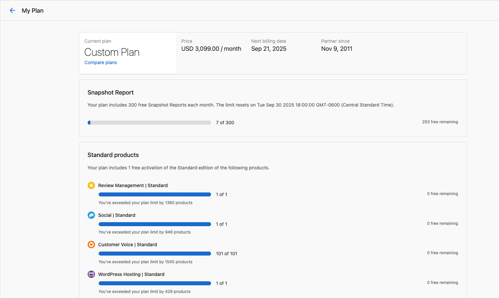

Zeigen Sie Ihren Vendasta-Abonnementplan in Partner Center an und verwalten Sie ihn, einschließlich Ihres aktuellen Plans, der Abrechnungshäufigkeit, der Nutzungslimits und der Kündigungsoptionen.

## Details Ihres Abonnementplans anzeigen

Sie können die Details Ihres Abonnementplans in Partner Center einsehen, einschließlich Ihres aktuellen Plans, der Abrechnungshäufigkeit und des nächsten Abrechnungsdatums. Sie können auch sehen, wie viel Ihrer Planlimits Sie bereits genutzt haben und wie viele kostenlose Elemente noch verbleiben, sowie Details zu Upgrades und anderen Plänen, indem Sie unter `Partner Center` → `Administration` → `My Plan` auf `Compare Plans` klicken.

**Wie funktioniert das?** Rufen Sie diese Seite über `Partner Center` → `Administration` → `My Plan` auf.

## Testabonnements

Partner können von einem Vendasta-Vertreter ein Testabonnement erhalten, das für einen begrenzten Zeitraum Zugriff auf Funktionen höherer Stufen bietet.

- Das Testabonnement kann **jederzeit vor dem von Ihrem Vendasta-Vertreter festgelegten Ablaufdatum gekündigt** werden. Zum Zeitpunkt der Kündigung bestätigt der Vertriebsmitarbeiter, welcher Admin auf dem Konto verbleiben soll, und entfernt alle anderen Admins.
- Wird während der Testphase des Partners ein **Vertrag unterzeichnet**, wird das Testabonnement zunächst gekündigt, bevor der Vertrag bearbeitet wird.
- Läuft das Testabonnement **ab** und der Partner unterzeichnet keinen Vertrag, wird der Zugriff auf die Standardstufe **Free** zurückgesetzt.

:::info
Bei Fragen zu Ihrem Testabonnement wenden Sie sich an Ihr zugewiesenes Client-Success-Team unten links in Partner Center.
:::

## Ihr Abonnement kündigen

### Starter-, Startup- oder Individual-Pläne

Partner mit einem Starter-, Startup- oder Individual-Plan können ihr Abonnement kündigen, indem sie [dieses Formular](https://docs.google.com/forms/d/e/1FAIpQLSdt1tIsvoyiETY0ZQLLe0vzn-xras9xJMGNgOs7eRv50Jb1pA/viewform) ausfüllen.

Kündigungen müssen **48 Stunden vor der Verlängerung** eingereicht werden, um zusätzliche Abonnementgebühren zu vermeiden, und werden innerhalb von **2 Werktagen** bearbeitet.

**Wichtige Hinweise nach der Kündigung:**

- Konten mit **kostenpflichtigen Apps und Diensten** werden weiterhin verlängert und können bis zur Kündigung genutzt werden.
- **Standardprodukte**, die die Anzahl von eins überschreiten, werden bei der Verlängerung kostenpflichtig.
- Konten mit **aktiven Abrechnungsautomatisierungen** werden weiterhin abgerechnet, sofern Sie diese nicht deaktivieren.
- **Zusätzliche Team-Mitglieder-Plätze** werden weiterhin berechnet, sofern Sie sie nicht aus Partner Center löschen.

### Vertraglich vereinbarte Pläne

Um ein vertraglich vereinbartes Abonnement zu kündigen oder herabzustufen, wenden Sie sich an Ihren Account Manager oder senden Sie eine E-Mail an **support@vendasta.com** für weitere Informationen.

Sie werden für aktive Produkte und Abonnements über die vereinbarte Laufzeit Ihrer Vertragsbedingungen weiterhin belastet. Beachten Sie die [Nutzungsbedingungen](https://www.vendasta.com/terms/) und deaktivieren Sie Produkte, um unnötige Gebühren zu vermeiden.

Wenn Sie Fragen zu Ihrem Plan haben oder Änderungen an Ihrem Abonnement vornehmen müssen, wenden Sie sich an unser Support-Team.
