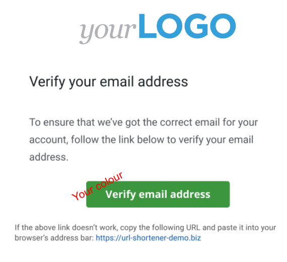
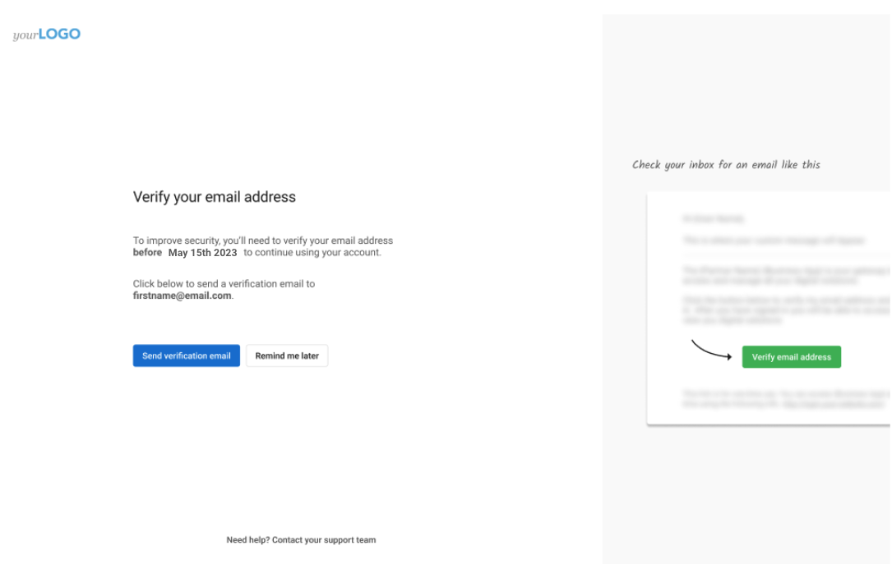
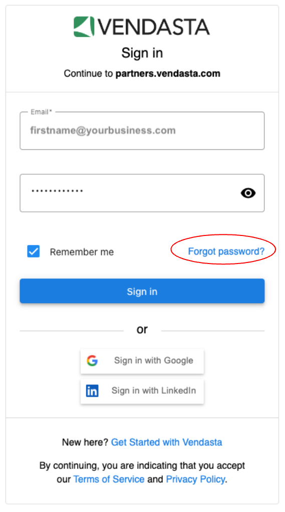

 ---
title: E-Mail-Verifizierung
sidebar_label: E-Mail-Verifizierung
description: Erfahren Sie mehr über die Anforderungen und Verfahren zur E-Mail-Verifizierung für Nutzer der Vendasta-Plattform.
sidebar_position: 10
---

Bei Vendasta legen wir großen Wert darauf, alle Geschäftsdaten unserer Partner und ihrer Kunden sicher zu speichern, das Risiko von Missbrauch zu verringern und die Sicherheit zu verbessern. Um dies zu unterstützen, müssen alle Nutzer, das heißt Partner-Center-Nutzer, Verkäufer, Digital Agents und Business-App-Nutzer, ihre E-Mail-Adressen verifizieren. So wird sichergestellt, dass alle Nutzer echt sind und Zugriff auf die von ihnen angegebene E-Mail-Adresse haben. Jeder hinzugefügte Nutzer wird automatisch verifiziert, sobald er sein eigenes Passwort über den Link in seiner Onboarding- oder Willkommens-E-Mail festlegt. **Wenn Sie oder Ihre Nutzer keine Seite sehen, die Sie zur Verifizierung Ihrer E-Mail-Adresse auffordert, ist keine Aktion erforderlich – Ihre E-Mail-Adresse ist bereits verifiziert.**

:::note
Seien Sie versichert, dass wir das gesamte White-Labeling beibehalten haben, sodass Business-App-Nutzer während des E-Mail-Verifizierungsprozesses nicht „Vendasta“ sehen. Sie werden aufgefordert, ihre E-Mail-Adresse unter Ihrer Marke zu verifizieren.
:::

Um das White-Labeling aufrechtzuerhalten, senden wir Ihren Kunden keine E-Mails zur E-Mail-Verifizierung, außer einer White-Label-Seite, die sie beim Anmelden in der Business App sehen, wenn ihre E-Mail-Adresse nicht verifiziert ist. Es liegt daher in Ihrer Verantwortung, Ihre Kunden dazu anzustoßen, ihre E-Mail-Adressen zu verifizieren.

**Es gibt mehrere Möglichkeiten, wie Nutzer ihre E-Mail-Adressen verifizieren können:**

- Eine Passwortänderung verifiziert die E-Mail-Adresse, da der Code zum Zurücksetzen des Passworts an die E-Mail-Adresse des Inhabers gesendet wird
- Das Festlegen eines Passworts über die Onboarding- oder Willkommens-E-Mail für neue Nutzer verifiziert die E-Mail-Adresse, da diese E-Mail an die Adresse des Inhabers gesendet wird
- Die Anmeldung über einen föderierten Identitätsanbieter (Google, LinkedIn, Facebook usw.) verifiziert die E-Mail-Adresse, da dies den Besitz der E-Mail-Adresse belegt
- Durch das Senden einer Verifizierungs-E-Mail über die Seite, die nach der Anmeldung angezeigt wird, und das Klicken auf den in der E-Mail gesendeten Verifizierungslink.

Wenn Sie ein bestehender Partner (oder Partner-Center-Nutzer, Verkäufer, Digital Agent oder Business-App-Nutzer) sind und Ihre E-Mail-Adresse noch nie verifiziert haben, können Sie den Vorgang mit ein paar einfachen Schritten abschließen:

1. Melden Sie sich bei der Vendasta-Plattform an
2. Sie sehen eine Seite, die Sie zur Verifizierung Ihrer E-Mail-Adresse auffordert.

3. Klicken Sie auf die Schaltfläche `Send verification email` und Sie erhalten eine E-Mail mit einem Verifizierungslink
4. Klicken Sie auf diesen Link, schließen Sie den Verifizierungsprozess ab und nutzen Sie die Plattform weiter
5. Herzlichen Glückwunsch! Ihre E-Mail-Adresse ist jetzt verifiziert

Falls Sie die Verifizierungs-E-Mail nicht erhalten haben, überprüfen Sie bitte, ob die korrekte/aktive E-Mail-Adresse hinterlegt ist. Falls nicht, aktualisieren Sie bitte Ihre E-Mail-Adresse, und Sie erhalten eine Verifizierungs-E-Mail.

Wenn Sie keinen Zugriff mehr auf die E-Mail-Adresse haben, mit der Sie sich anmelden, wenden Sie sich bitte an den Support, um Ihre E-Mail-Adresse aktualisieren zu lassen.

Sobald Sie diese Schritte abgeschlossen haben, ist nichts weiter erforderlich. Wir danken Ihnen für Ihre fortwährende Unterstützung!

**Wenn Sie von der Plattform ausgesperrt sind,** versuchen Sie bitte eines der folgenden:

- Überprüfen Sie Ihren Posteingang auf die Verifizierungs-E-Mail und klicken Sie auf den enthaltenen Link
- Setzen Sie Ihr Passwort über die Option „Passwort vergessen“ auf der Anmeldeseite zurück

- Wenden Sie sich an Ihren Admin, um Ihr Passwort zurücksetzen zu lassen

Sobald Sie auf den Verifizierungslink klicken oder Ihr Passwort zurücksetzen, können Sie sich wie gewohnt anmelden und Ihre E-Mail-Adresse wird verifiziert. Weitere Hilfe bei Anmeldeproblemen finden Sie unter [Was tun, wenn sich ein Teammitglied oder Kunden nicht anmelden können](/administration/my-account/my-team#what-to-do-when-your-team-member-or-clients-cannot-log-in).

:::note
Ihr Admin oder das Vendasta-Support-Team kann kein Passwort für Sie festlegen, aber sie können Ihnen eine E-Mail zum Zurücksetzen Ihres Passworts senden.
:::

**Wenn Sie über eine SSO-Integration mit Vendasta verfügen, finden Sie hier weitere Informationen:**

- Ihre Business-App-Nutzer, die sich mit ihrer E-Mail-Adresse und ihrem Passwort bei Ihrer Plattform anmelden und sich per SSO bei der Vendasta-Plattform anmelden, sehen nichts und müssen den E-Mail-Verifizierungsprozess nicht durchlaufen. Sie gelten als verifiziert.
- Ihre Teammitglieder, das heißt Partner-Center-Nutzer, Verkäufer und Digital Agents, die sich mit ihrer E-Mail-Adresse und ihrem Passwort bei der Vendasta-Plattform anmelden, müssen den Verifizierungsprozess abschließen, wenn sie nicht verifiziert sind und die entsprechende Aufforderung sehen.
