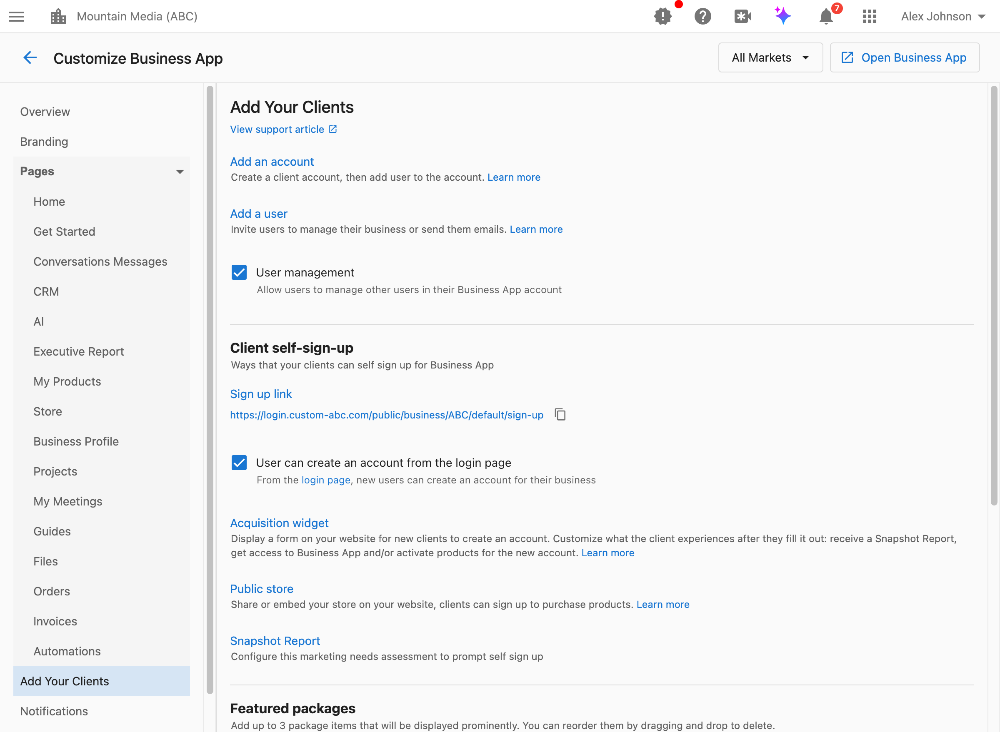

Der Bereich „Add Your Clients“ in Customize Business App steuert die verschiedenen Möglichkeiten, wie Kunden zu Ihrer Plattform hinzugefügt werden können. Konfigurieren Sie Self-Service-Optionen, Berechtigungen für die Benutzerverwaltung und Empfehlungsfunktionen.

## Wie greife ich auf diese Einstellungen zu?

Navigieren Sie zu `Partner Center` → `Accounts` → `Manage Business App` → `Customize Business App` → `Add Your Clients`.

## Wie kann ich Kunden erlauben, ihre eigenen Teammitglieder einzuladen?

Die Einstellung „User Management“ steuert, ob Ihre Kunden weitere Benutzer innerhalb ihres Business-App-Kontos einladen oder verwalten können.

**Was das bewirkt:**
- Wenn aktiviert: Kunden können zusätzliche Teammitglieder zu ihrem Konto einladen oder bestehende Benutzer verwalten
- Wenn deaktiviert: Nur Sie (der Partner) können Benutzer zu Kundenkonten hinzufügen

**Wann Sie dies aktivieren sollten:**
- Ihre Kunden haben mehrere Mitarbeiter, die Zugriff benötigen
- Sie möchten Supportanfragen zum Hinzufügen von Benutzern reduzieren
- Ihre Kunden verwalten ihre eigenen Teams

**Wann Sie dies deaktivieren sollten:**
- Sie möchten die volle Kontrolle darüber behalten, wer auf welches Konto zugreift
- Ihr Preismodell ist nutzerbasiert und Sie müssen dies steuern
- Sie sind in einer regulierten Branche tätig, die eine strikte Zugriffskontrolle erfordert

**So konfigurieren Sie es:**

1. Navigieren Sie zu `Partner Center` → `Accounts` → `Manage Business App` → `Customize Business App` → `Add Your Clients`.
2. Suchen Sie das Kontrollkästchen `User management` oder `Users can invite users`.
3. Aktivieren oder deaktivieren Sie es.
4. Klicken Sie auf `Save`.

**Was Kunden tun können, wenn diese Funktion aktiviert ist:**
- Neue Benutzer per E-Mail einladen
- Berechtigungen bestehender Benutzer verwalten
- Benutzer aus ihrem Konto entfernen

:::info
Diese Einstellung unterstützt eine marktspezifische Konfiguration. Sie können die Benutzerverwaltung für einige Märkte aktivieren und für andere deaktiviert lassen.
:::

## Wie aktiviere ich Self-Signup für neue Kunden?

Mit Self-Signup können potenzielle Kunden ihr eigenes Business-App-Konto erstellen, ohne dass Sie sie manuell hinzufügen müssen.

Umfassende Informationen zur Self-Signup-Konfiguration, einschließlich:
- Abrufen Ihres Signup-Links
- Aktivieren von „Create Account“ auf der Anmeldeseite
- Automatisieren des Onboardings für Self-Signup-Kunden
- Best Practices und Tipps

finden Sie in der dedizierten [Self-Signup-Dokumentation](/accounts/manage-business-app/self-signup).

## Wie zeige ich neuen Signups eine Vorschau ihres AI Receptionist?

Die AI Employee Preview zeigt neuen Signups direkt nach der E-Mail-Verifizierung eine Live-Chat-Vorschau ihres AI Receptionist – bereits trainiert anhand des Unternehmensprofils und der während des Signups erfassten Website-Daten. Sie können mit ihm als ihrem eigenen KI-Mitarbeiter chatten, noch bevor sie die Business-App-Startseite erreichen.

**So schalten Sie es ein oder aus:**

1. Navigieren Sie zu `Partner Center` → `Administration` → `Customize Business App` → `Add Your Clients`.
2. Suchen Sie das Kontrollkästchen **Add an AI Employee Preview to self signup**.
3. Aktivieren Sie es, um die Vorschau einzuschalten, oder deaktivieren Sie es, um sie auszuschalten.

:::info
Wenn Conversations AI in Ihrem Konto aktiviert ist, ist die AI Employee Preview standardmäßig eingeschaltet.
:::

Weitere Informationen dazu, was Kunden während des Onboardings sehen, finden Sie in der [Self-Signup-Dokumentation](/accounts/manage-business-app/self-signup#immediate-ai-onboarding).

## Was ist das Acquisition Widget?

Das Acquisition Widget ist ein Formular, das Sie auf Ihrer Website einbetten können und mit dem neue Kunden ein Konto erstellen können.

**Was es tut:**
- Zeigt ein Anmeldeformular auf Ihrer Website an
- Erfasst Informationen zu neuen Kunden
- Kann Snapshot Reports, Business-App-Zugriff oder Produktaktivierung auslösen

**Wann Sie es verwenden sollten:**
- Sie möchten Leads direkt über Ihre Marketing-Website erfassen
- Sie möchten Testversionen oder Demos über Ihre Website anbieten
- Sie möchten den Onboarding-Prozess für neue Kunden automatisieren

**So konfigurieren Sie es:**
Navigieren Sie zu `Partner Center` → `Marketing` → `Acquisition Widget`, um Ihr Widget einzurichten und anzupassen.

## Was ist der Public Store?

Mit dem Public Store können Sie Ihren Produktstore auf Ihrer Website teilen oder einbetten, sodass Kunden sich direkt anmelden und Produkte kaufen können.

**Was er tut:**
- Stellt einen teilbaren Link zu Ihrem Produktstore bereit
- Ermöglicht das Einbetten der Store-Funktionalität auf Ihrer Website
- Ermöglicht Self-Service-Käufe für neue Kunden

**Wann Sie ihn verwenden sollten:**
- Sie möchten, dass Kunden Produkte durchsuchen und kaufen können, ohne den Vertrieb zu kontaktieren
- Sie führen Marketingkampagnen durch, die auf eine Produktseite verweisen
- Sie möchten ein Self-Service-Kauferlebnis anbieten

**So konfigurieren Sie es:**
Navigieren Sie zu `Partner Center` → `Marketplace` → `Manage Public Store`, um die Einstellungen und das Erscheinungsbild Ihres Public Store zu konfigurieren.

## Wie richte ich Featured Packages für neue Signups ein?

Featured Packages werden Kunden, die sich anmelden, aber keine aktiven Produkte haben, prominent angezeigt, um sie zu einem Upgrade zu animieren.

Detaillierte Informationen zur Konfiguration von Featured Packages, einschließlich:
- Einrichtung von Paketen pro Markt
- Best Practices für die Paketauswahl
- Wie Featured Packages Kunden angezeigt werden

finden Sie in der dedizierten [Featured-Packages-Dokumentation](/accounts/manage-business-app/featured-packages).

:::warning
Featured Packages müssen pro Markt konfiguriert werden. Wählen Sie im Dropdown-Menü einen bestimmten Markt aus, bevor Sie Featured Packages konfigurieren. Die Ansicht „All Markets“ unterstützt keine Featured-Package-Konfiguration.
:::

## Wie kann ich Kunden erlauben, andere Unternehmen zu empfehlen?

Mit der Funktion „Client Referral“ können Ihre bestehenden Kunden andere Unternehmen einladen, sich für Ihre Dienstleistungen anzumelden.

**Was das bewirkt:**
- Fügt den Kundenprofilen in Business App eine Schaltfläche „Invite a business“ hinzu
- Kunden können den Link zu Ihrer Landingpage mit anderen Unternehmen teilen
- Hilft, Ihren Kundenstamm durch Mundpropaganda zu erweitern

**So richten Sie es ein:**

1. Erstellen Sie eine Landingpage auf Ihrer Website mit einem Acquisition Widget für Anmeldungen oder Testversionen (konfiguriert unter `Partner Center` → `Marketing` → `Acquisition Widget`).
2. Navigieren Sie zu `Partner Center` → `Accounts` → `Manage Business App` → `Customize Business App` → `Add Your Clients`.
3. Scrollen Sie zum Abschnitt `Client referral`.
4. Geben Sie die URL Ihrer Landingpage in das Feld `Invitation landing page URL` ein.
5. Klicken Sie auf `Save`.

**Was Kunden sehen:**
Nach dem Speichern erscheint im Profilbereich des Kunden eine Schaltfläche `Invite a business`. Kunden können den Link zu Ihrer Landingpage kopieren und teilen.

:::tip Best Practice
Stellen Sie sicher, dass Ihre Landingpage ein Acquisition Widget enthält, damit empfohlene Unternehmen problemlos ein Konto erstellen können. Erwägen Sie Anreize für erfolgreiche Empfehlungen, um die Teilnahme zu fördern.
:::

## FAQs

Was ist der Unterschied zwischen Benutzereinladung und Benutzerverwaltung?

Die Bezeichnung der Einstellung hängt von Ihrer Kontokonfiguration ab:
- `Users can invite users`: Kunden können per E-Mail Einladungen zum Hinzufügen neuer Benutzer versenden
- `User management`: Kunden können sowohl neue Benutzer einladen als auch bestehende Benutzer verwalten (bearbeiten/entfernen)

Beide Einstellungen verwenden denselben Umschalter; die Bezeichnung spiegelt Ihre aktivierten Funktionen wider.

Können Kunden eine unbegrenzte Anzahl von Teammitgliedern einladen?

Standardmäßig ja. Falls Sie die Anzahl der Benutzer pro Konto begrenzen müssen, würde dies eher über Ihr Preismodell und kontobezogene Einstellungen gesteuert als über diesen Umschalter.

Wie verfolge ich Empfehlungen von Kunden nach?

Empfehlungen, die über Ihre Landingpage (mit Acquisition Widget) eingehen, werden wie jeder andere Lead nachverfolgt. Sie können sie anhand der Quell-URL identifizieren oder UTM-Parameter für Ihre Empfehlungs-Landingpage einrichten.

Kann ich alle Self-Service-Kundenanmeldungen deaktivieren?

Ja. Um Self-Service-Anmeldungen jeglicher Art zu verhindern:
1. Deaktivieren Sie die Option „User can create an account from the login page“
2. Teilen Sie den direkten Signup-Link nicht
3. Entfernen Sie das Acquisition Widget oder implementieren Sie es nicht
4. Leeren Sie die URL der Empfehlungs-Landingpage

Kunden können dann nur auf Konten zugreifen, die Sie manuell für sie erstellen.

Gelten diese Einstellungen für alle Märkte?

Die meisten Einstellungen in diesem Bereich unterstützen eine marktspezifische Konfiguration. Wählen Sie im Dropdown-Menü einen Markt aus, um Einstellungen für diesen bestimmten Markt zu konfigurieren, oder verwenden Sie „All Markets“, um Standardwerte festzulegen.

Ausnahme: Featured Packages müssen pro Markt konfiguriert werden und können nicht auf der Ebene „All Markets“ festgelegt werden.

Wo finde ich weitere Informationen zu Snapshot Reports?

Snapshot Reports sind Marketing-Bedarfsanalysen, die Self-Signup anstoßen können. Weitere Informationen finden Sie in der [Snapshot-Report-Dokumentation](/snapshot-report/#why-is-snapshot-report-important).

