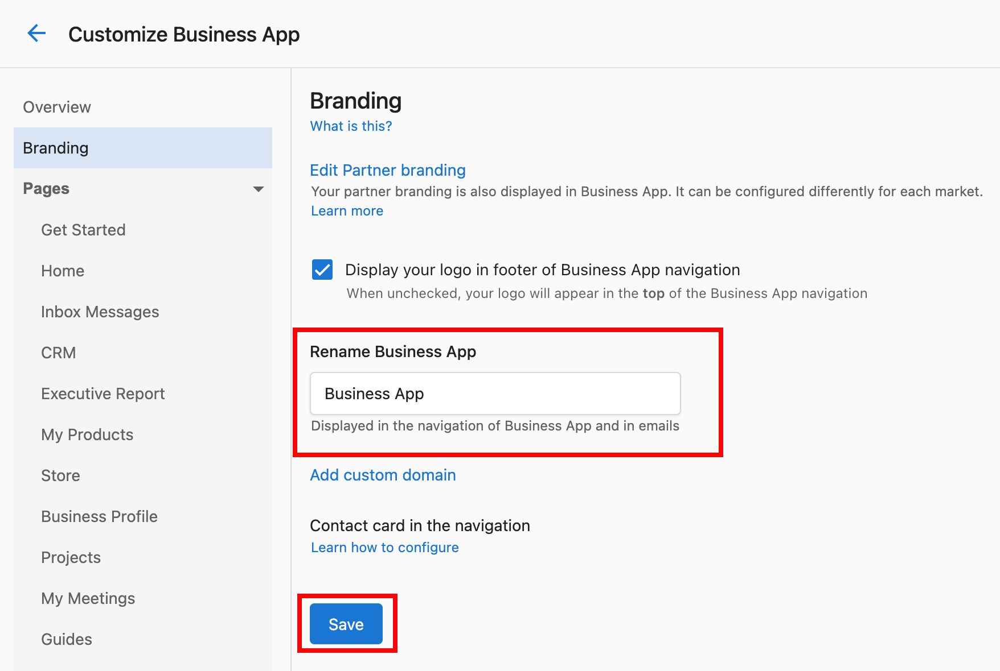

# Business App anpassen

Steuern Sie Layout, Navigation und visuelle Elemente der Business-App-Erfahrung Ihrer Kunden. Blenden Sie Seiten ein oder aus, passen Sie das Branding an und erstellen Sie eine maßgeschneiderte Oberfläche, die zu Ihrem Unternehmen und den Bedürfnissen Ihrer Kunden passt.

## Zugriff

Gehen Sie zu `Partner Center` → `Administration` → `Customize Business App`.

## Was Sie tun können

- **Seitensichtbarkeit und Navigation** – Dashboard-Bereiche (Grow, Listings, Protect, Connect, Reputation), die Seite „Automations“ und den Tab „Guides“ ein- oder ausblenden; die Oberfläche an Ihren Workflow anpassen
- **Branding und visuelle Identität** – Business App umbenennen, Logo-Platzierung festlegen, visuelle Konsistenz in der gesamten Oberfläche wahren
- **Benutzererfahrung** – Benachrichtigungsbanner, benutzerdefinierte Inhalte (Videos, Nachrichten) hinzufügen und steuern, wie Kunden mit Funktionen interagieren

## Seitensichtbarkeit und Navigation

### Dashboard-Seiten ein- oder ausblenden

1. Gehen Sie zu `Partner Center` → `Administration` → `Customize Business App` → `Pages`
2. Wählen Sie die zu ändernde Seite aus: `Grow`, `Listings`, `Protect`, `Connect`, `Reputation` und andere
3. Aktivieren oder deaktivieren Sie das Kontrollkästchen `Show this page` der Seite und speichern Sie

### Seite „Automations“

1. Öffnen Sie in `Customize Business App` `Pages` → `Automations`
2. Aktivieren oder deaktivieren Sie das Kontrollkästchen `Show this page` und speichern Sie (aktiviert = Kunden sehen Automations; deaktiviert = Seite ausgeblendet)
3. Änderungen wirken sich sofort aus; Automations werden weiterhin ausgeführt, wenn Trigger erfüllt sind, auch wenn die Seite ausgeblendet ist

### Bereich „Guides“

1. Gehen Sie zu `Customize Business App` → `Pages` → `Guides`
2. Schalten Sie die Sichtbarkeit des Tabs **Guides** um und speichern Sie (Show = Kunden sehen Guides; Hide = Tab entfernt)
3. Bei mehreren Märkten pro Markt konfigurieren

:::info
Das Ausblenden des Bereichs „Guides“ kann die Oberfläche vereinfachen, wenn Ihre Kunden keine In-App-Guides benötigen oder Sie über andere Kanäle schulen.
:::

## Branding und visuelle Identität

### Business App umbenennen

1. Gehen Sie zu `Customize Business App` → `Branding`
2. Wählen Sie **Rename Business App**, geben Sie Ihren bevorzugten Namen ein und speichern Sie

Der Name wird in der gesamten Kundenoberfläche und in E-Mails aktualisiert.

### Logo-Platzierung

1. Laden Sie unter `Customize Business App` → `Branding` bei Bedarf Ihr Logo hoch
2. Nutzen Sie die Platzierungsoptionen: Deaktivieren Sie **Display your logo in footer of Business App navigation**, um das Logo von unten links nach oben links zu verschieben
3. Vorschau ansehen und speichern

## Benutzererfahrung

### Benachrichtigungsbanner

1. Öffnen Sie in **Customize Business App** den Tab **Notifications** → **Global notification banner**
2. Legen Sie Nachrichtentext, Anzeigedauer, Styling und Zielgruppe fest
3. Fügen Sie bei Bedarf ein Ablaufdatum hinzu und aktivieren Sie den Banner

Verwenden Sie Banner für Ankündigungen, Updates oder Aktionen.

### Einstellungen für Kundeneinladungen

1. Erstellen Sie eine Landingpage (z. B. mit einem Acquisition Widget für Anmeldungen oder Testversionen)
2. Gehen Sie zu `Customize Business App` → `Add Your Clients`
3. Fügen Sie die URL der Landingpage in **Invitation Landing Page URL** ein und speichern Sie

Im Kundenprofil erscheint dann eine Schaltfläche **Invite a business**; Kunden können Ihre Landingpage teilen, um andere Unternehmen einzuladen.

## Häufig gestellte Fragen

Wie schnell werden Oberflächenänderungen wirksam?

Die meisten Änderungen (Seitensichtbarkeit, Branding) werden sofort wirksam. Kunden sehen sie beim nächsten Aktualisieren oder Anmelden.

Kann ich die Oberfläche für verschiedene Kunden unterschiedlich anpassen?

Ja. Viele Einstellungen können pro Kunde oder Gruppe festgelegt werden. Sie können auch auf Benutzerebene steuern: `Partner Center` → `Accounts` → `Manage Users` → drei Punkte neben dem Benutzer → **Edit Permissions**.

Was passiert, wenn ich eine Seite ausblende, die Kunden gerade nutzen?

Der Zugriff auf diesen Bereich wird sofort entfernt. Kommunizieren Sie dies im Voraus und bieten Sie bei Bedarf Alternativen an.

Kann ich Oberflächenänderungen vor der Anwendung in der Vorschau ansehen?

Einige Einstellungen verfügen über Vorschauen. Bewährte Praxis ist es, mit einer Staging- oder eingeschränkten Gruppe zu testen, bevor Sie für alle ausrollen.

Wie erfahre ich, welche Seiten meine Kunden nutzen?

Nutzen Sie Analyse- und Engagement-Berichte, um zu entscheiden, was ein- oder ausgeblendet werden soll.

Kann ich den Standardnamen von Business App nach dem Umbenennen wiederherstellen?

Ja. Sie können den Namen jederzeit in den Branding-Einstellungen wieder auf „Business App“ oder einen anderen Namen ändern.

Was ist der Unterschied zwischen dem Ausblenden einer Seite und dem Deaktivieren einer Funktion?

Das Ausblenden einer Seite entfernt sie aus der Navigation; die Funktion kann unter Umständen weiterhin erreichbar sein. Das Deaktivieren einer Funktion entfernt sowohl den Zugriff als auch die Funktionalität.

Wie wirkt sich die Logo-Platzierung auf mobile Nutzer aus?

Testen Sie Sichtbarkeit und Größe des Logos auf Desktop und Mobilgeräten, damit das Branding konsistent bleibt.

Kann ich Benachrichtigungsbanner für bestimmte Zeiten planen?

Prüfen Sie die Banner-Einstellungen auf Optionen für Timing und Planung.

Was sollte ich bei der Anpassung für Kunden beachten?

Konzentrieren Sie sich auf Kundenbedürfnisse, Einfachheit und Funktionalität: Entfernen Sie ungenutzte Funktionen, halten Sie die Navigation übersichtlich, wahren Sie die Markenkonsistenz und nutzen Sie Kundenfeedback.

## Artikel in diesem Bereich

- **[Branding-Einstellungen](./branding-settings.mdx)** – App-Name, benutzerdefinierte Domain, Branding der Web-Chat-Fußzeile
- **[Add Your Clients](./add-your-customers-settings.mdx)** – Self-Signup, Benutzerverwaltung, Empfehlungen, Akquisitionsoptionen
- **[Benachrichtigungen & Kampagnen](./notifications-and-campaigns.mdx)** – Ankündigungsbanner und Onboarding-Kampagnen
- **[Einstellungen für mehrere Standorte](./multi-location-settings.mdx)** – Standardberichtszeiträume für Kunden mit mehreren Standorten
- **[Einstellungen zur Seitensichtbarkeit](./page-visibility-settings.mdx)** – Steuern Sie, welche Seiten und Funktionen Kunden sehen
- **[Einrichtungsanleitung](./setup-guide.mdx)** – Vollständige Einrichtung, mobile Konfiguration, Checkliste für den Launch und Fehlerbehebung
