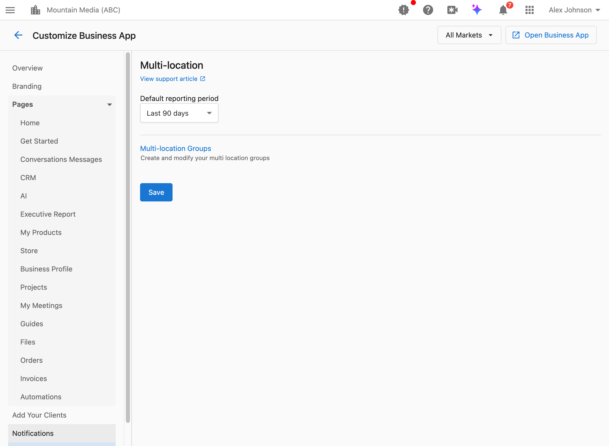

Der Bereich „Mehrere Standorte“ in „Business App anpassen“ steuert Einstellungen für Kunden, die mehrere Unternehmensstandorte verwalten. Konfigurieren Sie Standard-Berichtszeiträume und greifen Sie auf die Gruppenverwaltung zu.

## Wie greife ich auf diese Einstellungen zu?

Navigieren Sie zu `Partner Center` → `Accounts` → `Manage Business App` → `Customize Business App` → `Multi-location`.

## Wie lege ich den Standard-Berichtszeitraum fest?

Der Standard-Berichtszeitraum legt fest, welcher Zeitraum vorausgewählt ist, wenn Kunden mit mehreren Standorten ihre Berichte ansehen.

**Was das steuert:**
- Den Standardzeitraum, der in den Dashboards der Business App für mehrere Standorte angezeigt wird
- Den Standardzeitraum für die Führungsberichte für mehrere Standorte
- Die erste Ansicht, die Kunden sehen, bevor sie einen anderen Zeitraum auswählen

**Verfügbare Optionen:**
- Letzte 7 Tage
- Letzte 30 Tage
- Letzte 90 Tage
- Letzte 6 Monate
- Letzte 12 Monate

**Wann Sie den Standard ändern sollten:**
- `Last 7 days`: Am besten für Kunden geeignet, die die Leistung häufig überwachen und aktuelle Daten wünschen
- `Last 30 days`: Eine gute Standardeinstellung für die meisten Unternehmen; sie balanciert Aktualität mit aussagekräftigen Trends
- `Last 90 days`: Besser für saisonale Unternehmen oder solche, die die vierteljährliche Leistung verfolgen
- `Last 6/12 months`: Nützlich für Kunden, die sich auf langfristige Trends und Vorjahresvergleiche konzentrieren

**So konfigurieren Sie es:**

1. Navigieren Sie zu `Partner Center` → `Accounts` → `Manage Business App` → `Customize Business App` → `Multi-location`.
2. Verwenden Sie das Markt-Dropdown-Menü oben rechts, um **All Markets** oder einen bestimmten Markt auszuwählen. Um für einen Markt einen abweichenden Standard festzulegen, wählen Sie diesen Markt aus und deaktivieren Sie den Schalter `Apply to all markets`, damit sich Ihre Änderungen nur auf diesen Markt auswirken.
3. Suchen Sie das Dropdown-Menü `Default reporting period`.
4. Wählen Sie Ihren bevorzugten Zeitraum aus.
5. Klicken Sie auf `Save`.

:::info
Kunden können den Zeitraum beim Anzeigen ihrer Berichte jederzeit ändern. Diese Einstellung steuert nur die anfängliche Standardauswahl.
:::

## Wie verwalte ich Standortgruppen?

Mit Standortgruppen können Sie die Unternehmen von Kunden mit mehreren Standorten in logische Gruppen einteilen (z. B. nach Region, Franchise-Inhaber oder Marke).

**Was Gruppen bewirken:**
- Sie organisieren mehrere Standorte in überschaubare Segmente
- Sie ermöglichen Kunden, aggregierte Daten für bestimmte Gruppen anzuzeigen
- Sie unterstützen die Berichterstattung und den Leistungsvergleich über Standortgruppen hinweg

**So konfigurieren Sie es:**
Navigieren Sie zu `Partner Center` → `Accounts` → `Brands` → `Manage`, um Gruppen für mehrere Standorte zu erstellen und zu ändern.

## Häufig gestellte Fragen

Können Kunden den Zeitraum selbst ändern?

Ja. Der Standard-Berichtszeitraum legt nur die anfängliche Ansicht fest. Kunden können beim Anzeigen ihrer Berichte jederzeit einen anderen Zeitraum auswählen.

Betrifft die Zeitraum-Einstellung alle Berichte?

Diese Einstellung betrifft speziell die Ansichten der Business App für mehrere Standorte und der Führungsberichte für mehrere Standorte. Für einzelne Standortberichte können in den Home-Seiteneinstellungen eigene Zeitraum-Einstellungen konfiguriert sein.

Was ist der beste Standard für die meisten Unternehmen?

`Last 30 days` ist in der Regel eine gute Standardeinstellung für die meisten Unternehmen. Sie liefert genügend Daten, um Trends zu erkennen, und bleibt gleichzeitig aktuell genug, um handlungsrelevant zu sein. Berücksichtigen Sie bei der Auswahl die Branchen Ihrer Kunden und wie häufig sie ihre Daten überprüfen.

Kann ich für verschiedene Märkte unterschiedliche Standards festlegen?

Ja. Diese Einstellung unterstützt eine marktspezifische Konfiguration. Wählen Sie im Dropdown-Menü einen Markt aus, um für die Kunden mit mehreren Standorten in diesem Markt einen anderen Standardzeitraum festzulegen.

Was passiert, wenn ich keinen Standard festlege?

Wenn kein Standard konfiguriert ist, verwendet das System einen Standardwert (in der Regel die letzten 30 Tage). Das Festlegen eines expliziten Standards sorgt für ein einheitliches Erlebnis für Ihre Kunden.

Wer sieht Einstellungen für mehrere Standorte in der Business App?

Ansichten für mehrere Standorte stehen nur Kunden zur Verfügung, die Zugriff auf mehrere Unternehmensstandorte haben. Kunden mit nur einem Standort sehen keine Dashboards oder Berichte für mehrere Standorte.

