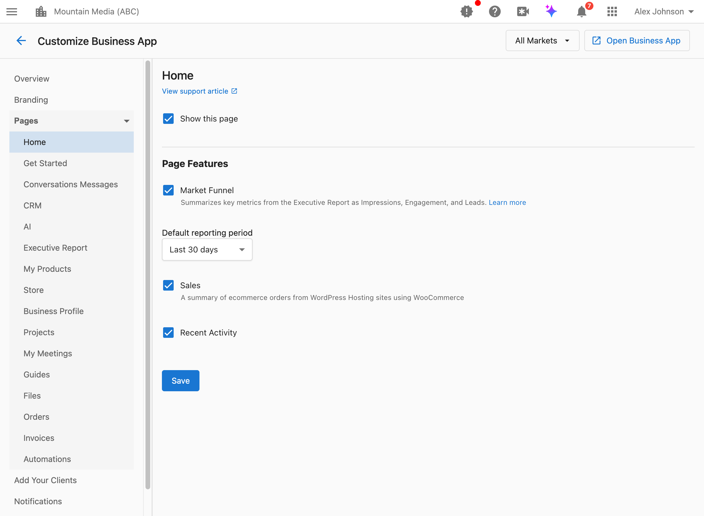

Der Bereich „Pages“ in „Business App anpassen“ steuert, welche Seiten Kunden in der Navigation ihrer Business App sehen, und konfiguriert seitenspezifische Funktionen. Sie können ganze Seiten ein- oder ausblenden und einzelne Seiteneinstellungen feinabstimmen.

## Wie greife ich auf die Seiteneinstellungen zu?

Navigieren Sie zu `Partner Center` → `Administration` → `Customize Business App` → `Pages`, und wählen Sie dann die Seite aus, die Sie konfigurieren möchten.

## `Show this page` verstehen

Die meisten Seiten verfügen über ein Kontrollkästchen `Show this page`, das steuert, ob die Seite in der Business-App-Navigation der Kunden erscheint. Aktivieren Sie es, um die Seite anzuzeigen, und deaktivieren Sie es, um die Seite auszublenden.

**Was passiert, wenn Sie eine Seite ausblenden:**
- Die Seite wird aus dem Navigationsmenü des Kunden entfernt
- Kunden können nicht direkt auf die Seite zugreifen
- Zugrunde liegende Funktionen können weiterhin funktionieren (z. B. laufen Automatisierungen auch, wenn die Automations-Seite ausgeblendet ist)

**Partner-Standardwerte vs. Markteinstellungen:**
- Konfigurieren Sie Standardwerte auf Partnerebene mit „All Markets“
- Überschreiben Sie diese für bestimmte Märkte, indem Sie diesen Markt aus dem Dropdown-Menü auswählen
- Marktspezifische Einstellungen haben Vorrang vor den Partner-Standardwerten

**Wann Sie Seiten ausblenden sollten:**
- Die Funktion ist nicht Teil Ihres Leistungsangebots
- Sie möchten die Oberfläche für bestimmte Kundensegmente vereinfachen
- Die Seite zeigt Funktionen, die Kunden nicht erworben haben

---

## Einstellungen der Home-Seite

Die Home-Seite ist das Haupt-Dashboard, das Kunden sehen, wenn sie sich in der Business App anmelden.

`Show this page` (`showDashboard`)
Steuert, ob Kunden das Home-Dashboard sehen.

### Was ist der Marketing-Funnel und sollte ich ihn anzeigen?

Der Marketing-Funnel fasst wichtige Kennzahlen aus dem Executive Report als Impressionen, Engagement und Leads in einer visuellen Trichterdarstellung zusammen.

**Wann anzeigen:** Kunden möchten einen schnellen visuellen Überblick über ihre Marketingleistung
**Wann ausblenden:** Sie verwenden keine Executive-Report-Kennzahlen oder möchten ein einfacheres Dashboard

### Wie ändere ich den Standardzeitraum für Berichte auf der Home-Seite?

Das Dropdown-Menü `Default reporting period` legt fest, welcher Zeitraum für die Daten der Home-Seite anfänglich ausgewählt ist.

**Optionen:** Letzte 7 Tage, 30 Tage, 90 Tage, 6 Monate oder 12 Monate

### Sollte ich WordPress-Verkäufe/-Bestellungen anzeigen?

Die Einstellung `Sales` zeigt eine Zusammenfassung der E-Commerce-Bestellungen von WordPress-Hosting-Websites mit WooCommerce an.

**Wann anzeigen:** Kunden nutzen WordPress Hosting mit WooCommerce
**Wann ausblenden:** Kunden nutzen keinen WordPress-E-Commerce

### Sollte ich „Recent Activity“ anzeigen?

Der Abschnitt `Recent Activity` zeigt einen Feed der letzten Aktionen und Ereignisse im Konto des Kunden.

**Wann anzeigen:** Kunden möchten sehen, was in ihrem Unternehmen passiert
**Wann ausblenden:** Sie möchten ein übersichtlicheres, fokussierteres Dashboard

---

## Einstellungen der Get-Started-Seite

Die Get-Started-Seite führt neue Kunden durch die ersten Einrichtungsschritte.

`Show this page` (`showGetStarted`)
Steuert, ob Kunden die Get-Started-Onboarding-Seite sehen.

### Wann sollte ich die Get-Started-Seite anzeigen?

Zeigen Sie diese Seite an, wenn:
- Sie Kunden durch die Ersteinrichtung führen möchten
- Kunden Hilfe beim Verbinden von Konten und Konfigurieren von Funktionen benötigen
- Sie neue Kunden onboarden, die eine Orientierung benötigen

Blenden Sie diese Seite aus, wenn:
- Kunden bereits eingerichtet sind und keine Onboarding-Anleitung benötigen
- Sie das Onboarding über andere Kanäle anbieten (Anrufe, individuelle Schulungen)

### Wie füge ich ein individuelles Onboarding-Video hinzu?

1. Aktivieren Sie das Kontrollkästchen `Onboarding video`.
2. Geben Sie eine YouTube-Video-URL in das Feld `Custom onboarding video` ein.
3. Klicken Sie auf `Save`.

Das individuelle Video ersetzt das Standard-Onboarding-Video, das Kunden angezeigt wird.

:::tip
Erstellen Sie ein Video, das Ihre Marke vorstellt und erklärt, wie Kunden das für sie angepasste Business-App-Erlebnis nutzen sollen.
:::

### Was ist der Abschnitt „Customer Journey“?

Der Abschnitt `Customer Journey` zeigt ein interaktives Diagramm der wichtigsten Phasen, die Personen durchlaufen, um zum Kunden Ihres Kunden zu werden. Kunden können Phasen auswählen, um auf passgenaue Wachstumsstrategien zuzugreifen.

**Wann anzeigen:** Kunden profitieren davon, ihren Kundengewinnungs-Funnel zu verstehen und zu optimieren
**Wann ausblenden:** Das Customer-Journey-Konzept passt nicht zu Ihrem Leistungsangebot

---

## Einstellungen der Inbox/Messages-Seite

Die Inbox-Seite (auch „Conversations Messages“ genannt) zeigt die Kommunikation mit Kunden.

`Show this page` (`showInboxMessage`)
Steuert, ob Kunden die Inbox/Messages-Seite sehen.

### Sollte ich Kunden erlauben, mit meinem Team zu chatten?

Die Einstellung `Customers can start conversations with you` steuert, ob Kunden Nachrichten an Sie (den Partner) über den Link „Contact Us“ in der Business-App-Navigation initiieren können.

**Wenn aktiviert:** Kunden können Ihnen Nachrichten senden; Unterhaltungen erscheinen in ihrer Inbox
**Wenn deaktiviert:** Kunden können erst antworten, nachdem Sie eine Unterhaltung mit ihnen begonnen haben

:::info
Auch wenn diese Option deaktiviert ist, können Kunden Ihnen weiterhin Nachrichten senden, nachdem Sie eine Unterhaltung mit ihnen begonnen haben. Die Einstellung steuert nur, ob sie neue Unterhaltungen beginnen können.
:::

### Was kann ich im Contact-Us-Modal steuern?

Die Gruppe **Contact Us Modal** auf dieser Seite steuert, was Kunden sehen, wenn sie auf die Karte **Contact Us** in der Business-App-Navigation klicken. Jede der folgenden Optionen ist unabhängig — Sie können jede Kombination ein- oder ausschalten.

| Einstellung | Was sie bewirkt |
|---------|---------------|
| **Modal description** | Eine von Ihnen verfasste Nachricht (bis zu 250 Zeichen), die oben im Modal über allen unten genannten Optionen erscheint. Sie ist an keinen Schalter gebunden — sie ist immer bearbeitbar. |
| **Show assigned salesperson name & email** | Zeigt oder verbirgt die Kontaktkarte des zugewiesenen Teammitglieds im Modal. |
| **Customers can start a conversation** | Zeigt die oben beschriebene Chat-Schaltfläche an. |
| **Show a support center link** | Fügt eine Schaltfläche hinzu, die eine von Ihnen angegebene URL in einem neuen Tab öffnet. Zeigt zwei Felder an: **Support center URL** (muss mit `https://` beginnen) und **Button text** (Standardwert „Visit support center“). |

**So konfigurieren Sie den Support-Center-Link:**

1. Gehen Sie zu `Partner Center` → `Administration` → `Customize Business App` → `Pages` → `Inbox/Messages`
2. Aktivieren Sie unter `Contact Us Modal` das Kontrollkästchen `Show a support center link`
3. Geben Sie das Ziel in `Support center URL` ein (muss mit `https://` beginnen)
4. Passen Sie optional den `Button text` an (Standardwert „Visit support center“)
5. Klicken Sie auf `Save`

:::info
Wenn alle Optionen des Contact-Us-Modals deaktiviert sind und die Modalbeschreibung leer ist, erscheint die Contact-Us-Karte überhaupt nicht in der Navigation des Kunden.
:::

---

## CRM-Seiteneinstellungen

Die CRM-Seite bietet Funktionen für das Kundenbeziehungsmanagement. Mehrere Unterfunktionen können unabhängig voneinander ein- oder ausgeblendet werden.

### Welche CRM-Funktionen sollte ich Kunden anzeigen?

Konfigurieren Sie die Sichtbarkeit für jede CRM-Funktion:

| Einstellung | Was sie anzeigt |
|---------|---------------|
| `Show CRM contacts page` | Kontaktdatensätze und -verwaltung |
| `Show CRM companies page` | Unternehmens-/Organisationsdatensätze |
| `Show CRM tasks page` | Aufgabenverwaltung und To-dos |
| `Show CRM forms page` | Individuelle Formulare zur Datenerfassung |
| `Show CRM opportunities page` | Vertriebspipeline und Deals |

### Erweiterte CRM-Funktionen

Diese Funktionen können erfordern, dass bestimmte Feature-Flags für Ihr Konto aktiviert sind:

| Einstellung | Was sie anzeigt |
|---------|---------------|
| `Show CRM custom objects pages` | Von Ihnen erstellte individuelle Datenobjekte |
| `Show CRM lists page` | Dynamische Listen und Segmentierung |
| `Show CRM activity leaderboard page` | Rangliste der Teamaktivitäten |
| `Show CRM lead scoring settings` | Konfiguration der Lead-Bewertung |

### Wann Sie bestimmte CRM-Funktionen ausblenden sollten

- **Kontakte/Unternehmen ausblenden**: Der Kunde benötigt keine CRM-Funktionalität
- **Aufgaben ausblenden**: Der Kunde verwaltet Aufgaben anderswo
- **Formulare ausblenden**: Es sind keine individuellen Formulare konfiguriert
- **Opportunities ausblenden**: Der Kunde verfolgt keine Vertriebspipeline
- **Erweiterte Funktionen ausblenden**: Die Funktionen sind nicht Teil Ihres Angebots oder nicht eingerichtet

---

## Einstellungen der AI-Assistant-Seite

`Show this page` (`showAiAssistant`)
Steuert, ob Kunden die AI-Assistant-Seite sehen.

Zeigen Sie diese Seite an, wenn Kunden über aktivierte KI-Funktionen verfügen und von KI-gestützten Tools profitieren würden.

---

## Einstellungen der Executive-Report-Seite

Der Executive Report bietet umfassende Analysen zur Marketingleistung.

Eine detaillierte Konfiguration der Abschnitte, Bewertungen und Reihenfolge des Executive Reports finden Sie in der dedizierten Dokumentation zum [Anpassen des Executive Reports](/accounts/reports/customize-executive-report).

---

## Einstellungen der My-Products-Seite

`Show this page` (`showMyProducts`)
Steuert, ob Kunden die My-Products-Seite mit ihren aktiven Produkten sehen.

**Wann anzeigen:** Kunden verwalten ihre eigenen Produkte oder müssen sehen, was sie haben
**Wann ausblenden:** Sie verwalten die Produkte für Kunden und möchten nicht, dass diese Änderungen vornehmen

### Häufig gestellte Fragen zu My Products

Wie nutzen meine Kunden die My-Products-Seite?

Kunden melden sich in der Business App an und klicken auf `My Products`, um alle für ihr Konto aktiven Produkte und Dienstleistungen zu sehen. Die Seite listet alles auf, worauf sie Zugriff haben, sodass sie Produkte öffnen oder die am häufigsten genutzten für einen schnellen Zugriff an das Seitenpanel anheften können.

Wie können Kunden Produkte im Seitenpanel der Business App organisieren?

Auf der My-Products-Seite klicken Kunden auf das **Pin-Symbol** oben rechts auf einer Produktkarte, um auszuwählen, welche Produkte im Seitenpanel der Business App erscheinen. Jeder Nutzer kann seine eigenen Pins festlegen, sodass unterschiedliche Teammitglieder unterschiedliche Produkte angeheftet haben können.

Warum kann ein Kunde ein Produkt nicht an das Navigationspanel anheften?

Nur Produkte mit einem Dashboard oder einem Ziellink können angeheftet werden. Wenn ein Produkt keinen zugehörigen Link hat (z. B. bei manchen individuellen Produkten), wird die Karte zur Information angezeigt, aber die Pin-Option ist nicht verfügbar. Produktlinks werden bei der Einrichtung des Produkts konfiguriert (z. B. im Marketplace oder bei der individuellen Produktkonfiguration).

---

## Store-Seiteneinstellungen

`Show this page` (`showStore`)
Steuert, ob Kunden die Store-Seite zum Kauf zusätzlicher Produkte sehen.

**Wann anzeigen:** Sie möchten, dass Kunden Produkte selbst erwerben können
**Wann ausblenden:** Alle Käufe laufen über Ihr Vertriebsteam

Für die Store-Konfiguration navigieren Sie zu `Partner Center` → `Marketplace` → `Manage Store`.

---

## Einstellungen der Business-Profile-Seite

Die Business-Profile-Seite zeigt die Unternehmensinformationen des Kunden an und ermöglicht optional deren Bearbeitung.

### Sollte ich Kunden erlauben, ihr eigenes Profil zu bearbeiten?

Die Einstellung `Customers can edit` steuert, ob Kunden ihre Unternehmensprofilinformationen ändern können.

**Wenn aktiviert:** Alle Felder im Business Profile sind für Kunden bearbeitbar
**Wenn deaktiviert:** Alle Felder sind schreibgeschützt; Kunden müssen sich für Änderungen an Sie wenden

**Was Kunden bearbeiten können, wenn aktiviert:**
- Firmenname und Kontaktinformationen
- Adress- und Standortdetails
- Öffnungszeiten
- Buchungslink-URL
- Kategorien und Beschreibungen

---

## Projects-Seiteneinstellungen

`Show this page` (`showFulfillment`)
Steuert, ob Kunden die Projects-Seite zur Nachverfolgung von Auftragsabwicklung und Projektarbeit sehen.

**Wann anzeigen:** Sie erbringen Dienstleistungen, die eine Projektverfolgung oder Auftragsabwicklungsprozesse beinhalten
**Wann ausblenden:** Ihre Dienstleistungen beinhalten keine projektbasierten Leistungen

---

## Einstellungen der My-Meetings-Seite

`Show this page` (`meetingSchedulerBusinessApp`)
Steuert, ob Kunden die My-Meetings-Seite mit Funktionen zur Terminplanung sehen.

**Wann anzeigen:** Sie nutzen den Terminplaner und möchten, dass Kunden Termine buchen oder einsehen können
**Wann ausblenden:** Sie nutzen die Terminplaner-Funktion nicht

---

## Guides-Seiteneinstellungen

`Show this page` (`showContentLibrary`)
Steuert, ob Kunden die Guides-Seite mit Lerninhalten sehen.

Eine Konfiguration individueller Guides einschließlich der WordPress-Blog-Integration finden Sie in der Dokumentation zu [individuellen Inhalten](/business-app/administration/custom-content-advanced-configuration).

---

## Files-Seiteneinstellungen

`Show this page` (`showFiles`)
Steuert, ob Kunden die Files-Seite zur Dokumentenspeicherung und -freigabe sehen.

**Wann anzeigen:** Sie teilen Dateien mit Kunden oder möchten, dass diese Dokumente hochladen
**Wann ausblenden:** Sie nutzen keine Dateifreigabe mit Kunden

---

## Orders-Seiteneinstellungen

`Show this page` (`showOrderPage`)
Steuert, ob Kunden die Orders-Seite mit ihrem Bestellverlauf sehen.

**Wann anzeigen:** Kunden kaufen Produkte und müssen den Bestellverlauf einsehen können
**Wann ausblenden:** Sie verwalten den gesamten Einkauf, und Kunden benötigen keine Bestellübersicht

---

## Invoices-Seiteneinstellungen

`Show this page` (`showInvoices`)
Steuert, ob Kunden die Invoices-Seite mit Abrechnungsinformationen sehen.

**Wann anzeigen:** Kunden verwalten ihre eigene Abrechnung und benötigen Zugriff auf Rechnungen
**Wann ausblenden:** Sie erledigen die gesamte Abrechnung extern oder möchten nicht, dass Kunden Rechnungen einsehen

Für die Abrechnungskonfiguration navigieren Sie zu `Partner Center` → `Billing`.

---

## Automations-Seiteneinstellungen

`Show this page` (`showAutomations`)
Steuert, ob Kunden die Automations-Seite sehen.

**Wann anzeigen:** Kunden erstellen und verwalten ihre eigenen Automatisierungen
**Wann ausblenden:** Sie verwalten Automatisierungen für Kunden oder bieten diese Funktion nicht an

:::info
Automatisierungen laufen weiter, auch wenn die Automations-Seite ausgeblendet ist. Das Ausblenden der Seite entzieht Kunden nur den Zugriff zum Anzeigen und Verwalten von Automatisierungen.
:::

Für Automatisierungsvorlagen navigieren Sie zu `Partner Center` → `Automations` → `Templates`.

---

## Häufig gestellte Fragen

Wenn ich eine Seite ausblende, funktioniert die Funktion dann noch?

In den meisten Fällen ja. Das Ausblenden einer Seite entfernt sie aus der Navigation, deaktiviert aber nicht die zugrunde liegende Funktion. Zum Beispiel:
- Ausgeblendete Automatisierungen laufen weiterhin, wenn sie ausgelöst werden
- Ausgeblendete CRM-Funktionen speichern weiterhin Daten
- Eine ausgeblendete Inbox empfängt weiterhin Nachrichten

Die Einstellung zur Seitensichtbarkeit steuert den Kundenzugriff, nicht die Funktionalität.

Kann ich verschiedenen Kunden unterschiedliche Seiten anzeigen?

Die Seitensichtbarkeit wird auf Partner- oder Marktebene konfiguriert, nicht pro Kunde. Um verschiedenen Kundensegmenten unterschiedliche Seiten anzuzeigen:
1. Erstellen Sie separate Märkte für jedes Segment
2. Konfigurieren Sie die Seitensichtbarkeit pro Markt
3. Weisen Sie Kunden dem entsprechenden Markt zu

Wie kann ich in der Vorschau sehen, was Kunden sehen?

Nutzen Sie die Funktion `View as Customer`:
1. Navigieren Sie zum Konto eines Kunden
2. Klicken Sie auf das Drei-Punkte-Menü
3. Wählen Sie `View as Customer`

So sehen Sie die Business App genau so, wie dieser Kunde sie sieht.

Was ist die Mindestanzahl an Seiten, die ich anzeigen sollte?

Es gibt kein erforderliches Minimum. Die meisten Implementierungen enthalten jedoch mindestens:
- **Home**: Haupt-Dashboard und Einstiegspunkt
- **Inbox/Messages**: Kommunikationsmöglichkeit
- Eine oder mehrere Funktionsseiten, die für Ihr Angebot relevant sind

Welche Seiten die richtigen sind, hängt von Ihren Dienstleistungen und den Bedürfnissen der Kunden ab.

Können Kunden Zugriff auf ausgeblendete Seiten beantragen?

Ausgeblendete Seiten sind für Kunden nicht sichtbar, sodass sie nicht wissen, dass sie diese beantragen könnten. Wenn ein Kunde Zugriff auf eine ausgeblendete Funktion benötigt, müssten Sie entweder:
- Die Seite für seinen Markt aktivieren
- Ihn in einen anderen Markt verschieben, in dem diese Seite aktiviert ist
- Die Seite auf Partnerebene für alle Kunden aktivieren

Wirken sich ausgeblendete Seiten auf Abrechnung oder Produktzugriff aus?

Nein. Die Seitensichtbarkeit steuert nur die Navigationsoberfläche. Produktzugriff, Abrechnung und Funktionalität werden separat über Produktzuweisungen und Kontoeinstellungen verwaltet.

