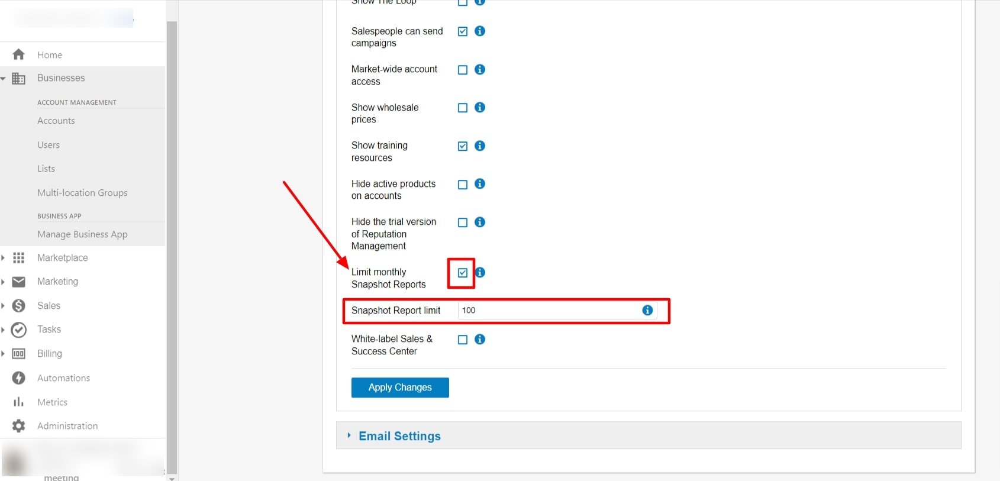

Dieser umfassende Leitfaden behandelt die Marktkonfiguration, erweiterte Plattformeinstellungen und spezialisierte Funktionen, einschließlich der Anmeldung zum Early Access Program, der Anpassung von Geschäftsprioritäten und der Steuerung von Marketplace-Anbietern.

## Was sind Markets und erweiterte Konfigurationseinstellungen?

Markets und erweiterte Konfigurationseinstellungen helfen Ihnen, Ihre Geschäftsstruktur zu organisieren, marktspezifisches Branding und Einstellungen anzupassen, frühzeitig auf neue Funktionen zuzugreifen und spezialisierte Geschäftsabläufe zu konfigurieren. Diese Einstellungen umfassen Marktsegmentierung, Branding-Anpassung, Programme zur Funktionsvorschau und die Verwaltung von Geschäftsprioritäten.

## Warum sind Markets und erweiterte Konfiguration wichtig?

- **Geschäftsorganisation**: Segmentieren Sie Ihr Geschäft nach Region, Marke, Branche oder eigenen Kriterien
- **Marktspezifisches Branding**: Passen Sie Logos, Farben und Erlebnisse für verschiedene Märkte an
- **Funktionsverwaltung**: Steuern Sie den Zugriff auf neue Funktionen und Fähigkeiten über Early-Access-Programme
- **Geschäftsausrichtung**: Konfigurieren Sie Einstellungen passend zu Ihren Geschäftsprioritäten und Abläufen
- **Skalierbarkeit**: Richten Sie Systeme ein, die mit Ihrem Geschäft wachsen und eine zentrale Aufsicht ermöglichen

## Was ist bei Markets und erweiterter Konfiguration enthalten?

### Marktorganisation und -struktur
- **Kontozuweisung**: Alle neuen Konten müssen einem bestimmten Markt zugewiesen werden
- **Marktsegmentierung**: Organisieren Sie nach Marke, Region, Branche oder eigenen Kriterien
- **Zentrale Verwaltung**: Behalten Sie den Überblick über alle Märkte von einer Plattform aus
- **Skalierbare Struktur**: Fügen Sie neue Märkte hinzu, wenn Ihr Geschäft wächst

### Marktspezifisches Branding
- **Individuelle Logos**: Laden Sie unterschiedliche Logos für jeden Markt hoch
- **Farbschemata**: Legen Sie eindeutige Farbpaletten pro Markt fest
- **Produktbenennung**: Passen Sie Produktnamen für verschiedene Märkte an
- **Login-Portale**: Gebrandete Erlebnisse für marktspezifische Nutzer

### Konfiguration auf Marktebene
- **Individuelle Einstellungen**: Konfigurieren Sie Funktionen und Einschränkungen pro Markt
- **Vererbung von Berechtigungen**: Märkte übernehmen Standardeinstellungen, können aber angepasst werden
- **Einstellungen für Verkaufsaufträge**: Marktspezifische Vertriebsprozesse und Konfigurationen
- **Berichtslimits**: Legen Sie unterschiedliche Limits und Einschränkungen pro Markt fest

:::warning
Markets sind nur bei bestimmten Abonnementstufen verfügbar. Wenden Sie sich an Ihren Kundenbetreuer oder den Support, um Markets für Ihre Plattform zu aktivieren oder zusätzliche Märkte hinzuzufügen.
:::

## So verstehen Sie die Marktstruktur

### Prinzipien der Marktorganisation

#### Prozess der Kontozuweisung
Wenn Markets auf Ihrer Plattform aktiviert sind:
- **Erforderliche Zuweisung**: Jedes neue Konto muss bei der Erstellung einem Markt zugewiesen werden
- **Dropdown-Auswahl**: Im Formular zur Kontoerstellung erscheint ein Markt-Dropdown
- **Standardmarkt**: Ein Markt repräsentiert Ihr Unternehmen als Ganzes
- **Zusätzliche Märkte**: Werden zur Segmentierung nach Region, Marke oder anderen Kriterien verwendet

#### Nutzerzugriff und Berechtigungen
Verschiedene Nutzertypen interagieren unterschiedlich mit Märkten:

**Business-App-Nutzer**:
- Erhalten Berechtigungen für bestimmte Konten statt für ganze Märkte
- Sehen beim Login das Branding des ersten Kontos in ihrer Liste
- Das Branding aktualisiert sich, wenn sie Konten aus anderen Märkten auswählen
- Sehen marktspezifisches Branding beim Zugriff auf Produkte in zugewiesenen Konten

**Vertriebsmitarbeiter**:
- Sehen nach dem Login in ihr Konto marktspezifisches Branding
- Snapshot-Berichte zeigen das Branding ihres zugewiesenen Markts
- Neue Konten werden automatisch in ihrem zugewiesenen Markt erstellt
- Müssen einem Markt zugewiesen werden (erforderlich für Vertriebsmitarbeiter, die vor der Aktivierung von Markets erstellt wurden)

### Verwaltung von URLs und Portalen
- **Konsistente URLs**: Portal-URLs bleiben mit Ihrer ursprünglichen Einrichtung konsistent
- **Eigene Domains**: Individuelle Domains pro Markt sind derzeit nicht verfügbar
- **Login-Branding**: Portale vor dem Login zeigen Ihr White-Label-Branding
- **Marktwechsel**: Das Branding aktualisiert sich dynamisch basierend auf den ausgewählten Konten

## So konfigurieren Sie marktspezifisches Branding

### Zugriff auf Markt-Branding-Einstellungen

So passen Sie das Branding für einzelne Märkte an:

1. Navigieren Sie zu `Administration` → `Partner branding`
2. Verwenden Sie das Dropdown oben rechts, um auszuwählen:
   - `All Markets`: Branding auf alle Märkte anwenden
   - `Individual Market`: Branding für einen bestimmten Markt anpassen
3. Konfigurieren Sie Logos, Farben und visuelle Elemente
4. Speichern Sie die Änderungen für den ausgewählten Marktbereich

### Vererbung und Anpassung von Branding
- **Standard-Branding**: Vor der Aktivierung von Markets erstelltes Branding wird zum Standard für neue Märkte
- **Individuelle Anpassung**: Jeder Markt kann eine eigene visuelle Identität haben
- **Vererbungsmodell**: Neue Märkte übernehmen Standardeinstellungen, können aber geändert werden
- **Einheitliche Elemente**: Wahren Sie die Markenkonsistenz über Märkte hinweg und ermöglichen Sie gleichzeitig Differenzierung

## So verwalten Sie Markteinstellungen und -konfiguration

### Marktspezifische Funktionen konfigurieren

Jeder Markt kann eine eigene Konfiguration für verschiedene Funktionen haben:

#### Konfiguration der Einstellungen für Verkaufsaufträge
Märkte können angepasste Vertriebsprozesse haben:
- **Individuelle Vertriebsprozesse**: Konfigurieren Sie einzigartige Workflows pro Markt
- **Bestelleinschränkungen**: Legen Sie marktspezifische Produkt- und Verkaufsbeschränkungen fest
- **Prozessanpassung**: Passen Sie Vertriebsworkflows an die Marktanforderungen an
- **Berechtigungsvarianten**: Unterschiedliche Zugriffsebenen und Fähigkeiten pro Markt

#### Beta-Programm und Funktionsverwaltung
- **Beta-Zugriff auf Marktebene**: Aktivieren oder deaktivieren Sie Beta-Funktionen pro Markt
- **Unabhängige Einstellungen**: Teilnahme am Beta-Programm getrennt von Einstellungen auf Partnerebene
- **Funktions-Rollouts**: Testen Sie neue Funktionen in bestimmten Märkten vor der breiteren Einführung
- **Kontrollierter Zugriff**: Verwalten Sie die Funktionsverfügbarkeit basierend auf der Marktreife

### Markteinstellungen auf Standardwerte zurücksetzen

Wenn Sie marktspezifische Konfigurationen zurücksetzen müssen:

1. Gehen Sie zu `Administration` → `Customize`
2. Klicken Sie auf `Markets`
3. Klicken Sie auf das Bearbeitungssymbol neben dem Markt, den Sie zurücksetzen möchten
4. Navigieren Sie zu `Sales` → `Configure Orders and Sales Processes`
5. Scrollen Sie nach unten und klicken Sie auf `Restore Back to Partner Defaults`

:::info
Die Option `Restore Back to Partner Defaults` erscheint nur, wenn Sie zuvor marktspezifische Einstellungen für Verkaufsaufträge konfiguriert haben. So wird verhindert, dass Sie versehentlich Märkte zurücksetzen, die Standardkonfigurationen verwenden.
:::

## So konfigurieren Sie marktbasierte Berichtslimits

### Marktspezifische Limits für Snapshot-Berichte festlegen

Es gibt zwar kein direktes marktweites Snapshot-Limit, aber Sie können die Berichterstellung pro Markt steuern, indem Sie Limits für Vertriebsmitarbeiter innerhalb jedes Markts konfigurieren:

1. Navigieren Sie zu `Administration` → `Customize` → `Sales`
2. Wechseln Sie zu dem bestimmten Markt, den Sie konfigurieren möchten
3. Aktivieren Sie das Kontrollkästchen `Limit monthly Snapshot Reports`
4. Legen Sie das `Snapshot creation limit` für Vertriebsmitarbeiter in diesem Markt fest
5. Speichern Sie die Konfiguration

### Marktberichtslimits verstehen
- **Kombinierte Limits**: Arbeiten mehrere Vertriebsmitarbeiter in einem Markt, ist das Limit das gemeinsame Maximum, das alle Vertriebsmitarbeiter zusammen erstellen können
- **Marktspezifisch**: Jeder Markt kann unterschiedliche Berichtslimits haben
- **Individuelle Nachverfolgung**: Die Nutzung jedes Vertriebsmitarbeiters wird innerhalb des Marktgesamtwerts separat erfasst
- **Monatlicher Reset**: Alle Limits werden unabhängig von der Marktkonfiguration monatlich zurückgesetzt

## So fügen Sie Markets hinzu und verwalten sie

### Neue Markets hinzufügen
So erweitern Sie Ihre Marktstruktur:
- **Support kontaktieren**: Wenden Sie sich an Ihren Kundenbetreuer oder Support On Demand
- **Zweck definieren**: Legen Sie klar fest, wofür der neue Markt verwendet wird
- **Organisation planen**: Überlegen Sie, wie Konten zugewiesen und verwaltet werden
- **Branding vorbereiten**: Bereiten Sie bei Bedarf marktspezifische Branding-Elemente vor

### Einen Markt deaktivieren

Das Deaktivieren eines Markts entfernt ihn aus der aktiven Nutzung, löscht ihn aber nicht. Konten und Daten, die mit dem Markt verknüpft sind, bleiben erhalten. Um die Deaktivierung eines Markts zu beantragen, wenden Sie sich mit dem Marktnamen und Ihren Kontodetails an den [Vendasta-Support](https://support.vendasta.com).

### Einen Markt reaktivieren

Ein zuvor deaktivierter oder gekündigter Markt kann reaktiviert werden. Bevor Sie die Reaktivierung beantragen, sprechen Sie mit Ihrem Vendasta-Kundenbetreuer, da die Reaktivierung eines gekündigten Markts je nach Vertrag zusätzliche Kosten verursachen kann. Um einen Markt zu reaktivieren, wenden Sie sich mit dem Marktnamen und Ihren Kontodetails an den [Vendasta-Support](https://support.vendasta.com).

### Einen Markt umbenennen

Marktnamen können jederzeit geändert werden. Wenden Sie sich mit dem aktuellen Namen, dem neuen Namen und Ihren Kontodetails an den [Vendasta-Support](https://support.vendasta.com).

### Best Practices für die Marktverwaltung
- **Klare Benennung**: Verwenden Sie aussagekräftige Marktnamen, die ihren Zweck widerspiegeln
- **Konsistente Organisation**: Legen Sie klare Kriterien für die Kontozuweisung fest
- **Regelmäßige Überprüfung**: Bewerten Sie die Effektivität der Marktstruktur regelmäßig
- **Nutzerschulung**: Stellen Sie sicher, dass Teammitglieder Marktzuweisungen und deren Auswirkungen verstehen

## So treten Sie dem Early Access Program bei

### Was ist das Early Access Program?

Das Early Access Program bietet Zugriff auf Funktionen, bevor sie für alle Nutzer veröffentlicht werden. So können Sie neue Fähigkeiten testen und Feedback geben, um die zukünftige Entwicklung mitzugestalten.

**Vorteile:**
- Sofortiger Zugriff auf die neuesten Funktionen
- Einfluss auf die zukünftige Entwicklung durch Feedback
- Wettbewerbsvorteil durch die neuesten Fähigkeiten

**Zu beachten:**
- Funktionen können sich ohne Vorankündigung ändern
- Begrenzte Dokumentation im Voraus
- Möglichkeit unerwarteten Verhaltens

### Early Access beitreten

**Für Ihre gesamte Plattform:**
1. Gehen Sie zu `Partner Center` → `Administration` → `Customize`
2. Navigieren Sie zu `General Product Settings` → `Others`
3. Wählen Sie `Join Early Access Program`

**Für einzelne Markets:**
1. Gehen Sie zu `Partner Center` → `Administration` → `Customize`
2. Navigieren Sie zu `Markets` und wählen Sie Ihren Zielmarkt aus
3. Gehen Sie zum Abschnitt `General Product Settings`
4. Suchen Sie `Early Access Program`
5. Ändern Sie die Auswahl auf `Enable`

:::info
Marktspezifische Einstellungen überschreiben Partner-Standardeinstellungen, sofern nicht ausdrücklich anders festgelegt.
:::

### Early Access verlassen

Wenn Sie das Programm verlassen, haben Sie keinen Zugriff mehr auf Early-Access-Funktionen. Bedenken Sie dies sorgfältig, da einige Funktionen möglicherweise von Ihrer Plattform entfernt werden.

## So verwalten Sie Business Priorities

### Anpassen der Optionen für Geschäftsprioritäten

Sie können die Optionen für Geschäftsprioritäten anpassen, die Ihren Kunden zur Verfügung stehen, damit sie sich auf die für ihre Branche oder ihr Geschäftsmodell relevantesten Ziele konzentrieren können.

### Konfigurationsschritte

1. Navigieren Sie zu `Partner Center` → `Administration` → `Customize`
2. Gehen Sie zu `Product Settings` → `Business Priorities`
3. Überprüfen Sie die verfügbaren Prioritätskategorien
4. Aktivieren/deaktivieren Sie Prioritäten je nach Ihrem Kundenstamm
5. Passen Sie bei Bedarf die Prioritätsbeschreibungen an
6. Speichern Sie Ihre Konfiguration

### Best Practices für Business Priorities

- **Branchenrelevanz**: Aktivieren Sie Prioritäten, die zu den Branchen Ihrer Kunden passen
- **Einfachheit**: Überfordern Sie Kunden nicht mit zu vielen Optionen
- **Regelmäßige Überprüfung**: Aktualisieren Sie Prioritäten, wenn sich Ihr Kundenstamm weiterentwickelt
- **Klare Beschreibungen**: Stellen Sie sicher, dass Prioritätsbeschreibungen leicht verständlich sind

## So steuern Sie den Kontakt von Marketplace-Anbietern

### Direkten Anbieterkontakt verhindern

Sie können verhindern, dass Marketplace-Anbieter Ihre Partner direkt kontaktieren, und so die Kontrolle über Anbieterbeziehungen und Kommunikation behalten.

### Kontaktschutz aktivieren

So verhindern Sie direkten Kontakt von Marketplace-Anbietern:

1. Navigieren Sie zu `Partner Center` → `Administration` → `Customize`
2. Gehen Sie zu `General Product Settings`
3. Suchen Sie die Einstellungen für `Marketplace Vendor Contact`
4. Wählen Sie `Prevent Direct Contact`
5. Speichern Sie Ihre Änderungen

### Vorteile der Kontaktsteuerung

- **Beziehungsmanagement**: Behalten Sie die Kontrolle über Anbieterpartnerschaften
- **Qualitätssicherung**: Filtern Sie Anbieterkommunikation nach Relevanz
- **Markenschutz**: Sorgen Sie für eine einheitliche Botschaft Ihrer Organisation
- **Kundenschutz**: Schützen Sie Kunden vor unerwünschter Anbieterkontaktaufnahme

## So stellen Sie Einstellungen für Verkaufsaufträge im Markt wieder her

### Standard- vs. individuelle Einstellungen verstehen

Einstellungen für Verkaufsaufträge im Markt können pro Markt angepasst werden oder von Standardeinstellungen auf Partnerebene übernommen werden. Manchmal müssen Sie diese Einstellungen auf ihre ursprüngliche Konfiguration zurücksetzen.

### Wiederherstellungsprozess

1. Navigieren Sie zu `Partner Center` → `Administration` → `Customize`
2. Gehen Sie zu `Markets` und wählen Sie Ihren Zielmarkt aus
3. Suchen Sie den Abschnitt `Sales Order Settings`
4. Klicken Sie auf `Restore to Partner Defaults`
5. Bestätigen Sie die Wiederherstellung, wenn Sie dazu aufgefordert werden

:::warning
Das Wiederherstellen von Markteinstellungen überschreibt alle individuellen Konfigurationen, die Sie für diesen bestimmten Markt vorgenommen haben.
:::

## Häufig gestellte Fragen (FAQs)

Wie aktiviere ich Markets für meine Plattform?

Markets sind nur bei bestimmten Abonnementstufen verfügbar. Wenden Sie sich an Ihren Kundenbetreuer oder Support On Demand, um Markets zu aktivieren oder zusätzliche Märkte zu Ihrer Plattform hinzuzufügen.

Kann ich die Erstellung von Snapshot-Berichten pro Markt begrenzen?

Es gibt kein direktes marktweites Limit, aber Sie können die Snapshot-Erstellung pro Vertriebsmitarbeiter innerhalb jedes Markts begrenzen. Das Marktlimit wird zum gemeinsamen Maximum, das alle Vertriebsmitarbeiter in diesem Markt zusammen erstellen können.

Wie stelle ich Markteinstellungen auf die Standardwerte zurück?

Gehen Sie zu `Administration` → `Customize` → `Markets`, bearbeiten Sie den Markt, navigieren Sie zu `Sales` → `Configure Orders and Sales Processes`, und klicken Sie dann unten auf der Seite auf „Restore Back to Partner Defaults".

Was passiert mit Vertriebsmitarbeitern, die vor der Aktivierung von Markets erstellt wurden?

Vertriebsmitarbeiter, die vor der Aktivierung von Markets erstellt wurden, müssen bei der nächsten Bearbeitung ihrer Daten einem Markt zugewiesen werden. So wird die korrekte Marktzuordnung und das Branding sichergestellt.

Kann jeder Markt unterschiedliches Branding haben?

Ja, jeder Markt kann eigene Logos, Farben, Produktnamen und andere Branding-Elemente haben. Verwenden Sie das Markt-Dropdown in Partner branding, um das Branding einzelner Märkte zu konfigurieren.

Wie sehen Business-App-Nutzer unterschiedliches Markt-Branding?

Business-App-Nutzer werden Konten zugewiesen, nicht Märkten. Sie sehen beim Login das Branding ihres ersten Kontos, und das Branding aktualisiert sich, wenn sie Konten aus anderen Märkten auswählen.

Kann ich eigene Domains für verschiedene Markets verwenden?

Eigene Domains pro Markt sind derzeit nicht verfügbar. Alle Märkte verwenden URLs, die mit Ihrer ursprünglichen Plattformeinrichtung konsistent sind, jedoch mit marktspezifischem Branding.

Welche Einstellungen können pro Markt unterschiedlich konfiguriert werden?

Märkte können unterschiedliche Einstellungen für Verkaufsaufträge, Beta-Programm-Teilnahme, Berichtslimits, Branding-Elemente und verschiedene Funktionskonfigurationen unabhängig von Einstellungen auf Partnerebene haben.

Wie werden neue Konten Märkten zugewiesen?

Beim Erstellen neuer Konten müssen Sie im Formular zur Kontoerstellung einen Markt aus einem Dropdown-Menü auswählen. Alle Konten benötigen eine Marktzuweisung für die korrekte Organisation und das Branding.

Was passiert, wenn mehrere Vertriebsmitarbeiter im selben Markt arbeiten?

Wenn mehrere Vertriebsmitarbeiter in einem Markt mit Snapshot-Berichtslimits arbeiten, stellt das Limit das gemeinsame Maximum dar, das alle Vertriebsmitarbeiter in diesem Markt zusammen erstellen können, nicht pro Einzelperson.

Benötige ich Markets, wenn ich nur ein geografisches Gebiet bediene?

Markets sind für Unternehmen mit einer einzigen Region nicht erforderlich, können aber dennoch nützlich sein, um nach Branche, Servicestufe oder Geschäftstyp zu segmentieren. Bewerten Sie, ob die organisatorischen Vorteile den zusätzlichen Aufwand rechtfertigen.

Kann ich Early-Access-Funktionen testen, bevor ich mich vollständig festlege?

Early-Access-Funktionen werden direkt in die Produktion veröffentlicht. Es gibt keine separate Testumgebung. Erwägen Sie, mit einem einzelnen Markt in Early Access zu beginnen, wenn Sie die Exposition beim Testen begrenzen möchten.

Was passiert mit Konten, wenn ich einen Markt entferne?

Konten, die entfernten Märkten zugewiesen sind, müssen neu zugewiesen werden, bevor der Markt gelöscht werden kann. Wenden Sie sich an den Support, um Unterstützung bei der Konsolidierung oder Entfernung von Märkten zu erhalten.

Kann ich Geschäftsprioritäten für verschiedene Markets anpassen?

Ja, Geschäftsprioritäten können für jeden Markt unterschiedlich konfiguriert werden, sodass Sie Optionen basierend auf den spezifischen Branchen oder Schwerpunkten jedes Marktsegments anpassen können.

Woher weiß ich, welche Early-Access-Funktionen derzeit aktiv sind?

Early-Access-Funktionen werden in der Regel in Partnerkommunikationen und Release Notes angekündigt. Überprüfen Sie Ihr Partner-Dashboard und Ihre Kommunikationseinstellungen, um über neue Veröffentlichungen informiert zu bleiben.

Kann ich Anbieterkontakt für einige Märkte verhindern, aber nicht für andere?

Einstellungen zum Marketplace-Anbieterkontakt gelten in der Regel plattformweit. Wenn Sie marktspezifische Kontrollen für Anbieterkontakt benötigen, wenden Sie sich an den Support, um verfügbare Optionen zu besprechen.

Wirkt sich die Wiederherstellung von Markteinstellungen auf bestehende Bestellungen aus?

Das Wiederherstellen von Einstellungen wirkt sich auf die zukünftige Bestellabwicklung aus, ändert aber keine bestehenden Bestellungen. Alle individuellen Felder oder Prozesse, die für diesen Markt spezifisch sind, werden jedoch auf die Standardwerte zurückgesetzt.

Wie oft werden neue Funktionen zu Early Access hinzugefügt?

Die Häufigkeit von Funktionsveröffentlichungen variiert je nach Entwicklungszyklen. Early-Access-Teilnehmer sehen in der Regel monatlich neue Funktionen, wobei das Timing je nach Funktionskomplexität und Testanforderungen variieren kann.

