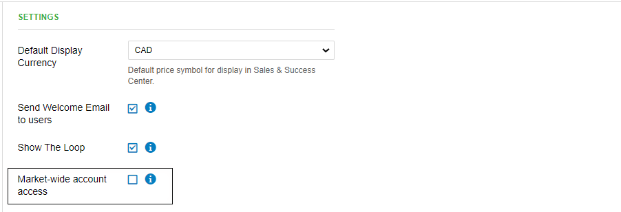

## Was ist Sales Team Management?

Sales Team Management bietet umfassende Kontrolle darüber, worauf Ihr Vertriebsteam zugreifen, was es sehen und was es innerhalb der Plattform tun kann. Sie können unterschiedliche Berechtigungsstufen konfigurieren, die Preistransparenz steuern, Berichtsfunktionen verwalten und spezifische Einschränkungen festlegen, damit Ihr Team innerhalb definierter Geschäftsparameter arbeitet.

## Warum ist Sales Team Management wichtig?

Eine ordnungsgemäße Konfiguration des Vertriebsteams schützt sensible Geschäftsinformationen und stellt gleichzeitig sicher, dass Teammitglieder über die Werkzeuge verfügen, die sie für ihren Erfolg benötigen. Sie können die Vertraulichkeit von Preisen wahren, unbefugte Aktionen verhindern und Teamabläufe effizient skalieren, indem Sie geeignete Zugriffsebenen und Einschränkungen festlegen.

## Was ist bei Sales Team Management enthalten?

### Rollenbasierte Zugriffskontrolle
- **Berechtigungen für Sales Manager**: Vollständiger Marktzugriff und administrative Fähigkeiten
- **Berechtigungen für Vertriebsmitarbeiter**: Eingeschränkter Zugriff basierend auf Zuweisungen und Marktes­einstellungen
- **Marktweite Zugriffseinstellungen**: Steuern Sie die Kontosichtbarkeit über Gebiete hinweg
- **Zuweisungsbasierte Einschränkungen**: Beschränken Sie den Zugriff auf speziell zugewiesene Konten

### Preis- und Produktsteuerung
- **Sichtbarkeit der Großhandelspreise**: Kosteninformationen für Vertriebsmitarbeiter anzeigen oder ausblenden
- **Einschränkungen für Einzelprodukte**: Steuern Sie die Verkaufsfähigkeiten für einzelne Produkte
- **Kontrolle der Produktauswahl**: Verwalten Sie, welche Produkte Teammitglieder verkaufen können
- **Preisschutz**: Wahren Sie vertrauliche Kostenstrukturen

### Kommunikations- und Marketingberechtigungen
- **Zugriff auf E-Mail-Kampagnen**: Aktivieren oder deaktivieren Sie Funktionen für Marketingkampagnen
- **Kundenkommunikationstools**: Steuern Sie Funktionen für die direkte Kundeninteraktion
- **Kampagnenerstellung**: Verwalten Sie, wer Marketingmaterialien erstellen und versenden darf
- **Zugriff auf Marketingtools**: Konfigurieren Sie die Verfügbarkeit von Werbefunktionen

### Einschränkungen bei Berichten und Analysen
- **Snapshot-Berichtslimits**: Legen Sie monatliche Erstellungsobergrenzen pro Vertriebsmitarbeiter fest
- **Berichtszugriffskontrollen**: Definieren Sie, welche Analysen Teammitglieder einsehen können
- **Nutzungsüberwachung**: Verfolgen Sie die Berichtserstellung und Teamaktivität
- **Administrative Überschreibungen**: Behalten Sie unabhängig von Einschränkungen den Admin-Zugriff bei

## So konfigurieren Sie Rollen des Vertriebsteams

### Rollenunterschiede verstehen

#### Fähigkeiten von Sales Managern
Sales Manager verfügen über erweiterten Zugriff und administrative Funktionen:
- **Marktweiter Kontozugriff**: Können alle Konten innerhalb ihres Markts unabhängig von der Zuweisung sehen
- **Überschreibung von Einschränkungen**: Zugriff auf Konten, auch wenn der marktweite Zugriff deaktiviert ist
- **Administrative Funktionen**: Konfigurieren Sie Teameinstellungen und verwalten Sie Berechtigungen
- **Vollständiger Berichtszugriff**: Erstellen Sie unbegrenzt Berichte und sehen Sie umfassende Analysen ein

#### Fähigkeiten von Vertriebsmitarbeitern  
Vertriebsmitarbeiter haben einen fokussierten Zugriff, der für die täglichen Vertriebsaktivitäten konzipiert ist:
- **Zuweisungsbasierter Zugriff**: Können nur Konten sehen, die ihnen speziell zugewiesen sind (wenn der marktweite Zugriff deaktiviert ist)
- **Eingeschränkter administrativer Zugriff**: Können Teameinstellungen oder Berechtigungen nicht ändern
- **Eingeschränkte Berichterstellung**: Unterliegen monatlichen Snapshot-Berichtslimits
- **Kontrollierter Funktionszugriff**: Manche Funktionen können je nach Konfiguration deaktiviert sein

### Marktweite Zugriffseinstellungen konfigurieren

Der marktweite Zugriff bestimmt, ob Vertriebsmitarbeiter alle Konten in ihrem Gebiet sehen können:

1. Navigieren Sie zu `Administration` → `Customize` → `Sales` → `Settings`
2. Suchen Sie die Konfiguration `Market-wide access`
3. Aktivieren Sie sie, damit Vertriebsmitarbeiter alle Marktkonten sehen können
4. Deaktivieren Sie sie, um Vertriebsmitarbeiter auf zugewiesene Konten zu beschränken
5. Speichern Sie die Konfiguration

:::info
Sales Manager haben unabhängig von der marktweiten Zugriffseinstellung immer Zugriff auf alle Konten in ihrem Markt. So wird eine ordnungsgemäße Managementaufsicht und administrative Fähigkeiten sichergestellt.
:::

## So steuern Sie die Preistransparenz

### Großhandelspreise vor Vertriebsmitarbeitern verbergen

So schützen Sie sensible Kosteninformationen und erhalten gleichzeitig die Vertriebsfunktionalität:

1. Gehen Sie zu `Administration` → `Customize` 
2. Erweitern Sie den Abschnitt `Sales`
3. Scrollen Sie nach unten zu den Preissteuerungen
4. Deaktivieren Sie `Show wholesale prices`
5. Speichern Sie die Änderungen

Diese Einstellung verhindert, dass Vertriebsmitarbeiter Produktkosten sehen, während sie weiterhin Angebote erstellen und Bestellungen zu Standardpreisen bearbeiten können.

### Best Practices für Preistransparenz
- **Margen schützen**: Verbergen Sie Großhandelspreise, um Gewinnmargen zu wahren
- **Transparenz ermöglichen**: Zeigen Sie Preise für Sales Manager zur Aufsicht an
- **Änderungen überwachen**: Verfolgen Sie, wann Einstellungen zur Preistransparenz geändert werden
- **Teammitglieder schulen**: Stellen Sie sicher, dass Vertriebsmitarbeiter Preisrichtlinien verstehen

## So konfigurieren Sie Produkt- und Kampagnenberechtigungen

### Zugriff auf E-Mail-Kampagnen aktivieren

So ermöglichen Sie Vertriebsmitarbeitern das Versenden von Marketingkampagnen:

1. Navigieren Sie zu `Partner Center` → `Administration` → `Customize` → `Sales`
2. Aktivieren Sie `Salespeople can send campaigns`
3. Konfigurieren Sie kampagnenspezifische Einschränkungen
4. Speichern Sie die Einstellungen

Dies ermöglicht Vertriebsmitarbeitern, E-Mail-Marketingkampagnen direkt an ihre zugewiesenen Konten zu erstellen und zu versenden.

:::info
Suchen Sie den Schalter `Salespeople can send campaigns` im Abschnitt Sales der Anpassungseinstellungen. Diese Steuerung bestimmt, ob Ihr Vertriebsteam auf Kampagnenfunktionen im Partner Center zugreifen kann.
:::

## So verwalten Sie Snapshot-Berichtslimits

### Monatliche Berichtslimits festlegen

So steuern Sie, wie viele Snapshot-Berichte jeder Vertriebsmitarbeiter monatlich erstellen kann:

1. Navigieren Sie zu `Administration` → `Customize` → `Sales`
2. Aktivieren Sie `Limit monthly Snapshot Reports` unter Settings
3. Geben Sie das gewünschte `Snapshot Report limit` ein
4. Konfigurieren Sie bei Bedarf Limits für bestimmte Märkte
5. Speichern Sie die Konfiguration

### Marktspezifische Snapshot-Limits

Es gibt zwar keine direkte Möglichkeit, Snapshots pro Markt zu begrenzen, aber Sie können Snapshots pro Vertriebsmitarbeiter innerhalb bestimmter Märkte begrenzen:

**Für einzelne Markets:**
1. Navigieren Sie zum Abschnitt `Markets` in den Anpassungseinstellungen
2. Wählen Sie Ihren Zielmarkt aus
3. Gehen Sie zur `Sales`-Konfiguration für diesen Markt
4. Aktivieren Sie das Kontrollkästchen `limit monthly snapshot report`
5. Legen Sie das `snapshot creation limit` für Vertriebsmitarbeiter in diesem Markt fest

:::info
Arbeiten mehrere Vertriebsmitarbeiter in einem Markt, stellt das Marktlimit das gemeinsame zulässige Maximum dar, das alle Vertriebsmitarbeiter in diesem Markt zusammen erstellen können.
:::

:::warning
Wenn Sie Märkte individuell angepasst haben, müssen Sie diese Einstellung für jeden Markt einzeln anpassen. Prüfen Sie den Abschnitt Markets, um zu sehen, welche Märkte bereits über eine eigene Einstellung verfügen, da die Standardänderung diese nicht überschreibt.
:::

### Verwaltung von Berichtslimits
- **Vollständige Einschränkung**: Setzen Sie das Limit auf 0, um die Berichtserstellung vollständig zu deaktivieren
- **Monatlicher Reset**: Alle Limits werden am ersten Tag jedes Monats um 00:00 UTC zurückgesetzt
- **Administrativer Zugriff**: Von Admins erstellte Berichte zählen nicht zu den Limits der Vertriebsmitarbeiter
- **Kampagnenintegration**: Berichtslimits wirken sich auf E-Mail-Kampagnen aus, die Schritte zur Berichtserstellung enthalten

### Wenn Limits überschritten werden

Wenn ein Vertriebsmitarbeiter sein monatliches Limit erreicht, sieht er eine Benachrichtigung, die die weitere Berichtserstellung verhindert:

## Häufig gestellte Fragen (FAQs)

Was ist der Unterschied zwischen einem Sales Manager und einem Vertriebsmitarbeiter?

**Wichtige Zugriffsunterschiede:**

**Sales Manager:**
- Können **alle** Konten innerhalb ihres Markts unabhängig vom Zuständigen sehen und darauf zugreifen
- Behalten vollen Zugriff, auch wenn die Konfiguration `Market-wide access` **deaktiviert** ist
- Können marktweite Zugriffseinschränkungen überschreiben

**Vertriebsmitarbeiter:**
- Können nur Konten sehen, die ihnen speziell zugewiesen sind, wenn `Market-wide access` **deaktiviert** ist
- Sind auf ihre zugewiesenen Konten beschränkt, sofern der marktweite Zugriff nicht aktiviert ist
- Unterliegen den Konfigurationseinstellungen für marktweiten Zugriff

**Ort der Konfiguration:**
Die Einstellungen für marktweiten Zugriff finden Sie unter `Partner Center` → `Administration` → `Customize` → `Sales` → `Settings`.

Diese Unterscheidung sorgt für eine ordnungsgemäße Kontotrennung und gibt Sales Managern gleichzeitig die Aufsicht, die sie benötigen, um ihre Teams effektiv zu führen.

Wie verberge ich Großhandelspreise vor meinen Vertriebsmitarbeitern?

Sie können verhindern, dass Ihre Vertriebsmitarbeiter die Großhandelspreise von Marketplace-Produkten sehen:

1. Gehen Sie zu `Partner Center` → `Administration` → `Customize`
2. Erweitern Sie den Abschnitt `Sales`
3. Scrollen Sie nach unten und deaktivieren Sie `Show wholesale prices`

Diese Einstellung verbirgt Preise vor Vertriebsmitarbeitern, während sie weiterhin Angebote erstellen und Bestellungen zu Standardpreisen bearbeiten können. Dies hilft, Ihre Gewinnmargen zu schützen und gleichzeitig die operative Funktionalität zu erhalten.

Kann ich die Erstellung von Snapshot-Berichten für Vertriebsmitarbeiter vollständig deaktivieren?

Ja, Sie können die Erstellung von Snapshot-Berichten vollständig deaktivieren, indem Sie das monatliche Limit auf 0 setzen. Dies verhindert, dass Vertriebsmitarbeiter Berichte erstellen, während der Admin-Zugriff erhalten bleibt.

Zählen von Admins erstellte Berichte zu den Limits der Vertriebsmitarbeiter?

Berichte, die direkt von Admin-Konten aus erstellt werden, zählen nicht zu den Limits der Vertriebsmitarbeiter. Wenn Sie jedoch einen Vertriebsmitarbeiter imitieren (impersonate), zählen diese Berichte zu dessen Gesamtwert.

Wie wirken sich Snapshot-Berichtslimits auf E-Mail-Kampagnen aus?

Vertriebsmitarbeiter können keine Konten zu Kampagnen hinzufügen, die Schritte zur Snapshot-Berichtserstellung enthalten, wenn sie ihr monatliches Limit überschritten haben. Von Admin-Konten aus gestartete Kampagnen sind davon nicht betroffen.

Wann werden monatliche Berichtslimits zurückgesetzt?

Alle monatlichen Limits werden am ersten Tag jedes Monats um 00:00 UTC zurückgesetzt. Sie können die aktuelle UTC-Zeit prüfen, um genau zu wissen, wann die Limits zurückgesetzt werden.

Können Vertriebsmitarbeiter Großhandelspreise sehen, wenn ich sie verberge?

Nein, wenn Großhandelspreise verborgen sind, können Vertriebsmitarbeiter keine Produktkosten sehen. Sie können weiterhin Angebote erstellen und Bestellungen mit Standard-Kundenpreisstrukturen bearbeiten.

Was passiert, wenn ich E-Mail-Kampagnen für Vertriebsmitarbeiter aktiviere?

Vertriebsmitarbeiter können dann E-Mail-Marketingkampagnen an ihre zugewiesenen Konten erstellen und versenden. Sie haben Zugriff auf Kampagnenerstellungstools und Vorlagen innerhalb ihrer Berechtigungsstufe.

Kann ich unterschiedliche Snapshot-Berichtslimits für verschiedene Markets festlegen?

Ja, Sie können unterschiedliche monatliche Limits für jeden Markt konfigurieren. Es gibt zwar kein direktes marktweites Limit, aber Sie können Limits pro Vertriebsmitarbeiter innerhalb bestimmter Märkte festlegen:

1. Navigieren Sie zum Abschnitt `Markets` in den Anpassungseinstellungen
2. Wählen Sie Ihren Zielmarkt aus  
3. Konfigurieren Sie `limit monthly snapshot report` für diesen Markt
4. Legen Sie das `snapshot creation limit` für Vertriebsmitarbeiter in diesem Markt fest

Denken Sie daran: Arbeiten mehrere Vertriebsmitarbeiter in einem Markt, gilt das Limit für jeden einzelnen Vertriebsmitarbeiter, nicht als gemeinsames Marktgesamtlimit.

Woher weiß ich, welche Vertriebsmitarbeiter ihre Berichtslimits erreicht haben?

Sie können die Berichtserstellung über Admin-Analysen und Berichtsfunktionen überwachen. Vertriebsmitarbeiter, die ihre Limits erreichen, erhalten Benachrichtigungen, wenn sie versuchen, weitere Berichte zu erstellen.

## Screenshots or videos

<iframe 
  src="https://drive.google.com/file/d/11_cFgRQLN_Ez6UMK45Tn2O0_yp96AaZI/preview" 
  width="640" 
  height="480" 
  allowFullScreen
></iframe>
