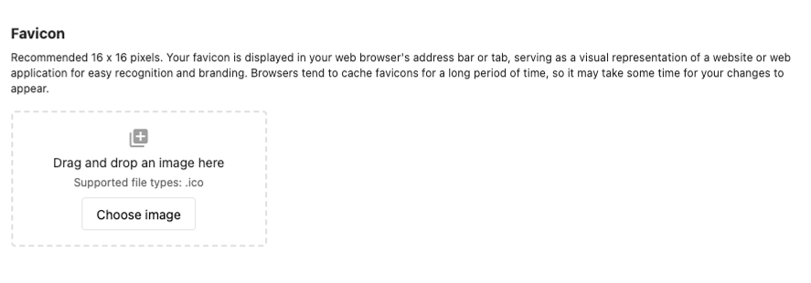

Passen Sie das Erscheinungsbild Ihrer Plattform mit eigenen Logos, Farben, Firmennamen und visuellen Elementen an. White-Label-Branding sorgt für ein konsistentes Erscheinungsbild überall dort, wo Kunden die Plattform sehen: Business App, E-Mail-Kampagnen und Kundenkommunikation.

## Warum das wichtig ist

Starkes Branding bietet ein einheitliches, professionelles Erlebnis und stärkt Ihr Unternehmen. White-Labeling entfernt andere Marken, sodass Kunden nur Ihre Marke sehen, was Vertrauen aufbaut und dazu passt, wie Sie Ihr Unternehmen anderswo präsentieren.

## Was enthalten ist

- **Markenidentität** – Firmenname, Logos, Farbdesigns, Favicon
- **White-Label** – Ersetzt externe Markenverweise auf der gesamten Plattform
- **Multi-Market** – Unterschiedliches Branding pro Markt; generische oder marktspezifische Logos für die Anmeldung
- **Technisches** – Hinweise zu Dateiformat und Größe; Änderungen wirken sich schnell aus

## Firmennamen und primäres Branding einrichten

1. Gehen Sie zu `Partner Center` → `Administration` → `Partner branding`
2. Legen Sie `Company Name` fest – geben Sie den Namen ein, der in der Kundenkommunikation und auf der gesamten Plattform erscheinen soll
3. Speichern

## Farbdesign konfigurieren

1. Öffnen Sie in `Partner branding` den Abschnitt `Theme`
2. Legen Sie `Primary` (und ggf. Sekundär-/Hintergrundfarben) fest
3. Vorschau ansehen, dann speichern

Das Design gilt für alle kundenseitig sichtbaren Bereiche.

## Logos verwalten

### Primäres Logo hochladen

1. Gehen Sie zu `Partner Center` → `Administration` → `Partner branding` → `Logo`
2. Laden Sie Ihr Logo hoch (PNG oder JPG; transparentes PNG empfohlen)
3. Verwenden Sie eine hochauflösende Datei für eine klare Darstellung auf verschiedenen Geräten
4. Positionieren und speichern

### Marktspezifisches Branding

1. Verwenden Sie in `Partner branding` das Dropdown-Menü `All Markets` (oben rechts), um einen Markt auszuwählen
2. Legen Sie Logos, Farben und Firmennamen für diesen Markt fest
3. Speichern; für weitere Märkte wiederholen

### Branding der Anmeldeseite

1. Laden Sie unter `Partner branding` → `Logo` das Logo hoch, das auf der Anmeldeseite erscheinen soll
2. **Hinweis:** Die Anmeldeseite kann nicht vollständig als White Label gestaltet werden. Bei mehreren Märkten können Sie für den Standardmarkt ein generisches Logo verwenden, sodass marktspezifisches Branding erst nach der Anmeldung erscheint.

:::info
Sie können die Anmeldeseite nicht vollständig als White Label gestalten. Wenn Sie für den Standardmarkt ein generisches Logo verwenden, kann marktspezifisches Branding angezeigt werden, sobald Nutzer sich in der Business App befinden.
:::

## Favicon und Browser-Symbole

### Favicon hochladen

1. Gehen Sie zu `Partner Center` → `Administration` → `Partner branding` → `Favicon`
2. Verwenden Sie eine `ICO`-Datei (z. B. favicon.ico). PNG/JPG werden nicht akzeptiert.
3. Empfohlene Größe: 16×16 oder 32×32 px
4. Hochladen und prüfen, ob es in den Browser-Tabs erscheint

### Fehlerbehebung beim Favicon

- **Falsches Format** – Verwenden Sie nur .ico. Konvertieren Sie PNG/JPG bei Bedarf in ICO.
- **Unscharf oder verzerrt** – Verwenden Sie 16×16 oder 32×32 px; halten Sie das Design einfach.
- **Aktualisiert sich nicht** – Leeren Sie den Browser-Cache oder versuchen Sie es in einem privaten Fenster; Favicons werden zwischengespeichert.

### Firmen-Avatar / Shortcut-Symbol

1. Legen Sie in `Partner branding` den `Company Avatar` fest (quadratisches Bild für Profile, kleine Kontexte)
2. Legen Sie das `Shortcut Icon` für den mobilen Startbildschirm und Lesezeichen fest (512×512 px; GIF, JPG oder PNG)
3. Speichern und auf verschiedenen Geräten testen

## Wo Branding erscheint

- **Business App** – Logos in Navigation und Kopfzeilen, Markenfarben, Firmenname, Favicon in Tabs
- **E-Mails** – Logo, Markenfarben, Firmenname in Kopf- und Fußzeilen sowie Absenderinformationen
- **Anmeldung und Kundenbereiche** – Gebrandete Anmeldung (mit den oben genannten Einschränkungen); marktspezifisches Branding nach der Anmeldung

## Häufig gestellte Fragen

Kann ich die Plattform vollständig als White Label gestalten?

Ja, für die meisten Bereiche. Sie können Logos, Farben, Firmennamen und die meisten visuellen Elemente ersetzen. Einige Optionen können von Ihrem Abonnement abhängen.

Warum lässt sich mein Favicon nicht hochladen?

Favicons müssen ICO-Dateien sein (z. B. image.ico, nicht image.png oder image.jpg). Gehen Sie zu `Partner Center` → `Administration` → `Partner branding` → `Favicon`.

Falls es weiterhin fehlschlägt: Prüfen Sie, ob die Datei .ico ist, halten Sie die Größe klein (16×16 oder 32×32) oder versuchen Sie, die ICO-Datei neu zu erstellen. Wenn das Problem weiterhin besteht, wenden Sie sich an den Support.

Kann ich die Anmeldeseite der Business App anpassen?

Sie können die Anmeldeseite nicht vollständig als White Label gestalten. Verwenden Sie bei mehreren Märkten ein generisches Logo für den Standardmarkt; dieses Logo erscheint bei der Anmeldung, und marktspezifisches Branding erscheint nach der Anmeldung innerhalb der Business App.

So ändern Sie das Branding: `Partner Center` → `Administration` → `Partner branding` → `Logo`. Verwenden Sie bei mehreren Märkten den Tab `All Markets` (oben rechts) und passen Sie pro Markt an.

Wie schnell wirken sich Branding-Änderungen aus?

Die meisten Änderungen wirken sich sofort aus. Bei Favicons kann es aufgrund des Browser-Cachings zu Verzögerungen kommen.

Welche Dateiformate eignen sich am besten für Logos?

PNG mit transparentem Hintergrund ist am besten geeignet. Verwenden Sie eine hohe Auflösung für Klarheit auf verschiedenen Geräten.

Kann ich für verschiedene Märkte unterschiedliches Branding festlegen?

Ja. Verwenden Sie die Marktauswahl in Partner branding, um Logos, Farben und Firmennamen pro Markt festzulegen.

Was passiert, wenn ich kein individuelles Branding einrichte?

Die Plattform verwendet Standardvisuals. Individuelles Branding sorgt für ein professionelleres, konsistenteres Erlebnis.

Gibt es Abonnement-Beschränkungen beim Branding?

Einige White-Label-Optionen können je nach Plan variieren. Prüfen Sie Ihr Abonnement oder wenden Sie sich für Details an den Support.

Wie kann ich Branding testen, bevor ich es einführe?

Nutzen Sie alle verfügbaren Vorschauoptionen in den Einstellungen und testen Sie mit einer kleinen Gruppe, bevor Sie es überall anwenden.

Was tun, wenn mein Branding nicht korrekt angezeigt wird?

Prüfen Sie Dateiformate, Bildgrößen und leeren Sie den Browser-Cache. Wenn es weiterhin fehlschlägt, wenden Sie sich mit den Details an den Support.

## Vorschau und Tests

Die Branding-Oberfläche zeigt eine Live-Vorschau. Testen Sie Logos, Farben und Favicon auf verschiedenen Geräten und Browsern.

Für Hilfe bei visuellem Branding wenden Sie sich an den Support unter support@vendasta.com.
