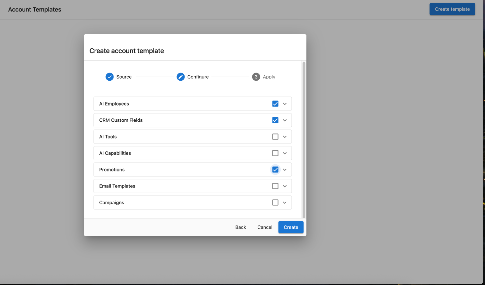

# Plantillas de cuenta

Las plantillas de cuenta te permiten configurar una cuenta una sola vez y reutilizar esa configuración en todas partes. Cuando se aplica una plantilla, esta implementa AI employees, la configuración de web chat, campos de CRM, campañas, automatizaciones, formularios y más en la cuenta de destino en cuestión de segundos, sin ningún paso manual.

Las plantillas son especialmente útiles para incorporar clientes a gran escala, estandarizar la configuración en un sector vertical o para ofrecer el autorregistro de SMB.

## Qué incluyen las plantillas de cuenta

Una plantilla captura la configuración completa de una cuenta de origen, incluyendo:

- AI employees
- Widgets de web chat y su configuración
- Formularios
- Campos de CRM
- Diseños de campos de CRM
- Campañas
- Automatizaciones

## Cómo acceder

Para ver, crear, actualizar o aplicar plantillas manualmente, ve a Partner Center → `Accounts` → `Account Templates`.

## Aplicar una plantilla manualmente

Para aplicar una plantilla directamente a una cuenta, abre la plantilla desde Partner Center → `Accounts` → `Account Templates`, selecciona una cuenta de destino, elige qué funciones aplicar y haz clic en **Apply**.

## Aplicar plantillas automáticamente

### Vincular una plantilla a una categoría de negocio

Vincula una plantilla de cuenta a una categoría de negocio y toda nueva cuenta creada en esa categoría, ya sea mediante API, manualmente o a través del autorregistro de SMB, obtiene automáticamente la plantilla correspondiente aplicada. No se requiere configuración manual.

### Usar la acción de automatización "Apply an account template"

Las plantillas también pueden aplicarse desde dentro de una automatización, lo que te da control total sobre cuándo y cómo se activan.

Para configurarlo:

1. Ve a Partner Center → **Automations**.
2. Selecciona o crea una automatización.
3. Agrega la acción **Apply account template**.
4. Selecciona la plantilla que quieres aplicar.

Esto te permite aplicar o volver a aplicar una plantilla según cualquier condición que una automatización pueda evaluar.

## Incluir diseños de campos de CRM

Un [diseño de campos](/administration/data-management/crm-objects/field-layouts) (la agrupación y el orden de los campos en los registros de contactos, empresas, oportunidades y objetos personalizados) puede implementarse con una plantilla para que todas las cuentas presenten sus registros de la misma manera.

- Solo se capturan los diseños personalizados. Los tipos de objeto que aún usan el diseño estándar se omiten.
- Si un diseño hace referencia a campos personalizados o a un tipo de objeto personalizado que la cuenta de destino no tiene, estos se crean primero ahí y el diseño se redirige hacia ellos.
- Aplicar una plantilla reemplaza el diseño de la cuenta de destino para ese tipo de objeto. Cualquier personalización de diseño ya realizada en la cuenta de destino se sobrescribe.

## Incluir formularios y widgets de web chat

Los formularios y los widgets de web chat configurados en la cuenta de origen pueden incluirse en la plantilla e implementarse en todas las cuentas a las que se aplique la plantilla. Esto es particularmente útil cuando:

- Un mensaje inicial de web chat necesita estar en otro idioma.
- Las declaraciones de privacidad difieren según la región.

## Actualizar cuentas de forma masiva

Después de mejorar la cuenta de origen a partir de la cual se creó una plantilla, haz clic en **Update template** para actualizar la plantilla con los últimos cambios. No se requiere reconstruirla. Las actualizaciones se aplican la próxima vez que se use la plantilla.

## Usar la aplicación de plantillas como disparador de automatización

Cuando termina de aplicarse una plantilla, la cuenta de destino recibe una entrada en el registro de actividad. Las automatizaciones pueden escuchar esa entrada y encadenar trabajo posterior a partir de una aplicación de plantilla completada, como la asignación de representantes o la configuración de formularios de cupones.

## Límites de objetos personalizados

Cada cuenta puede tener hasta 3 [objetos personalizados de CRM](/crm/custom-objects). Si aplicar una plantilla llevara a una cuenta de destino a superar este límite, la aplicación falla para esa cuenta y Partner Center muestra un error que identifica la causa, en lugar de fallar silenciosamente.

## Para quién es esto

- Partners que incorporan cuentas a gran escala (implementaciones empresariales, canales de reventa, migraciones)
- Partners que estandarizan la configuración en varias cuentas dentro del mismo sector vertical
- Partners que ofrecen autorregistro de SMB
