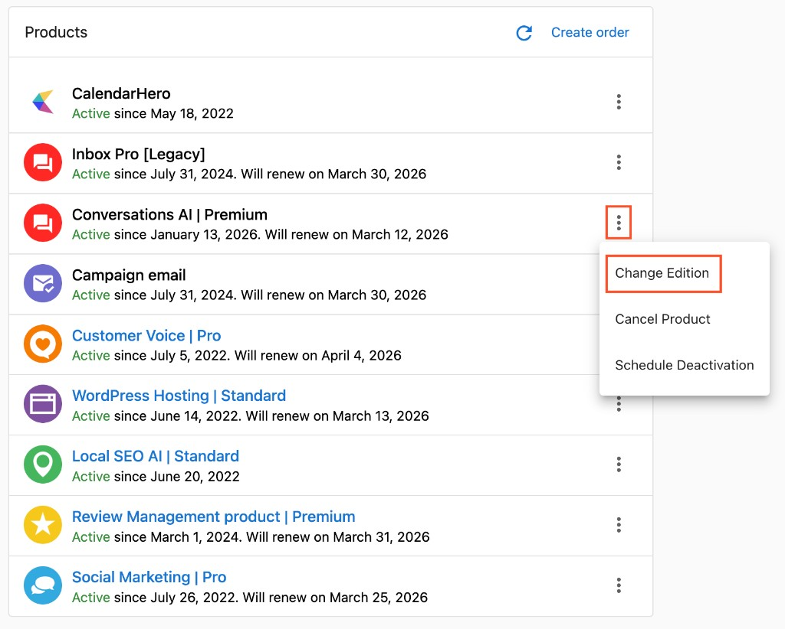

## ¿Qué es la administración de productos para cuentas?

La administración de productos implica activar, configurar y mantener productos y servicios para cuentas de negocio. Esto incluye seleccionar las ediciones de producto adecuadas, administrar complementos, gestionar mejoras y reducciones de nivel, y desactivar productos cuando sea necesario.

## ¿Por qué es importante la administración de productos?

Una administración de productos eficaz garantiza:

- **Niveles de servicio adecuados**: los clientes reciben productos que coinciden con sus necesidades de negocio y presupuesto
- **Optimización de ingresos**: una selección de edición y una administración de complementos adecuadas maximizan el valor para ambas partes
- **Satisfacción del cliente**: los productos con el tamaño correcto mejoran la experiencia del cliente y reducen la cancelación
- **Eficiencia operativa**: una configuración de producto adecuada reduce los problemas de soporte y mejora la entrega del servicio
- **Oportunidades de crecimiento**: una administración de productos estratégica identifica oportunidades de expansión y venta adicional

## ¿Qué incluye la administración de productos?

### Activación de productos
- Configuración inicial y ajuste del producto
- Selección y personalización de la edición
- Configuración e integración y pruebas
- Coordinación del lanzamiento y gestión del cronograma

### Administración de ediciones
- Procesamiento de mejoras y reducciones de nivel
- Comparación y selección de funciones
- Administración de niveles de precio
- Planificación y ejecución de la transición

### Servicios complementarios
- Activación de funciones complementarias
- Configuración de servicios especializados
- Opciones de soporte premium
- Ampliaciones de integración

## Cómo activar productos

### Activar productos desde la cuenta

Método 1: para habilitar productos para una cuenta de cliente:

1. Ve a `Accounts` → `Manage Accounts`
2. Selecciona la cuenta objetivo de tu lista de cuentas
3. Abre la página de detalles de la cuenta
4. Busca la tarjeta `Products` en la Descripción general (Overview) de la cuenta
5. Haz clic en `Create order`

Método 2: para habilitar productos para una cuenta de cliente:

1. Ve a `Accounts` → `Manage Accounts`
2. Selecciona la cuenta objetivo de la lista de cuentas
3. Haz clic en el ícono de menú junto a la cuenta
4. Selecciona `Activate Products`

### Activar productos desde el CRM
1. Ve a `CRM` → `Companies`
2. Selecciona la empresa objetivo en la tabla
3. Busca el panel `Order` a la derecha 
4. Haz clic en `Create Sales Order`
5. Sigue el proceso de pedido para completar el Pedido

### Cómo armar tu catálogo de productos
1. Puedes encontrar la lista de productos disponibles a través del mercado (marketplace)
2. Haz clic en los productos que deseas agregar a tu oferta de productos
3. Haz clic en `Start selling` en la parte superior derecha para agregar los productos a tu oferta.

**Proceso de activación:**

:::info Flujo de activación actual
La activación del producto siempre crea un pedido de venta como parte del proceso de activación. Esto garantiza una facturación, un seguimiento y una integración del flujo de comercio adecuados.
:::

1. **Programa la activación** durante el horario laboral adecuado
2. **Crea el pedido de venta**: la activación del producto genera automáticamente un pedido de venta para el seguimiento y la facturación
3. **Ejecuta la activación del producto** siguiendo el flujo de cumplimiento del pedido
4. **Verifica la funcionalidad del producto** después de la activación
5. **Prueba el acceso del cliente** y la disponibilidad del panel
6. **Proporciona confirmación de la activación** con los detalles del pedido y los próximos pasos

## Cambiar ediciones de producto

Para cambiar la edición de un producto para una cuenta:

1. Ve a `Accounts` → `Manage Accounts`.
2. Abre la cuenta y busca la tarjeta `Products` en la Descripción general (Overview).
3. Haz clic en el ícono de menú junto al producto que deseas cambiar y selecciona `Change edition`.
4. Selecciona la edición deseada y confirma.

:::warning
Mejorar a una edición superior puede generar cargos adicionales. Es posible que algunas reducciones de nivel (por ejemplo, WordPress Premium) no sean compatibles.
:::

## Cancelar productos

Para cancelar un producto de tu cliente:

1. Ve a `Accounts` → `Manage Accounts` y abre la cuenta.
2. En la tarjeta `Products` de la Descripción general (Overview), haz clic en el ícono de menú junto al producto y selecciona `Cancel product`.
3. Confirma la cancelación, o elige `Schedule deactivation` y selecciona una de las siguientes opciones:
   - Cancelar al final del período actual
   - Cancelar de inmediato
   - Cancelar después de un número específico de renovaciones

:::info
El producto permanece activo hasta la fecha que se muestra en la tarjeta de cancelación. Puedes reactivarlo durante este período.
:::

## Preguntas frecuentes sobre la administración de productos

¿Puedo desactivar la opción "enviar correo electrónico a todos los usuarios" durante la activación?

En algunos flujos de activación puedes controlar las notificaciones por correo electrónico a los usuarios. Si necesitas evitar enviar correos electrónicos a todos los usuarios, revisa las opciones de activación y anula la selección de las notificaciones masivas por correo electrónico donde estén disponibles.

¿Puedo comprar más de un dominio en la misma cuenta?

Algunos productos admiten múltiples dominios por cuenta. Revisa las opciones de configuración del producto en la tarjeta `Products` de la Descripción general (Overview) de la cuenta. Si la opción no está disponible, es posible que no sea compatible con ese producto.

**Comunicación con el cliente:**
- Explica claramente los cambios de función antes de procesarlos
- Ofrece capacitación sobre las nuevas capacidades después de las mejoras
- Confirma la comprensión de las limitaciones después de las reducciones de nivel
- Documenta los motivos de los cambios de edición para futuras referencias

## Cómo gestionar las cancelaciones de productos

### Comprender los tipos de cancelación

**Suspensión temporal:**
- El cliente solicita pausar el servicio durante un período específico
- La facturación se suspende, pero la cuenta y los datos se conservan
- Reactivación sencilla cuando el cliente esté listo para reanudar

**Reemplazo de producto:**
- Cambio de un producto a otro
- Se requiere migración de datos y planificación de la transición
- Minimizar la interrupción del servicio durante la transición

**Cancelación permanente:**
- Interrupción completa del producto
- Consideraciones sobre la retención y exportación de datos
- Facturación final y cierre del contrato

### Proceso de cancelación

**Pasos previos a la cancelación:**
1. **Comprende el motivo de la cancelación** y explora alternativas
2. **Revisa los términos del contrato** para conocer los procedimientos y los plazos de cancelación
3. **Analiza soluciones alternativas** (reducciones de nivel, suspensiones, otros productos)
4. **Obtén confirmación de cancelación por escrito** si es necesario
5. **Planifica el cronograma de transición** y la comunicación con el cliente

**Ejecutar cancelaciones:**
1. **Programa la cancelación** para la fecha adecuada (a menudo el final del período de facturación)
2. **Prepara la exportación de datos** si el cliente solicita su información
3. **Desactiva el acceso al producto** según los términos de cancelación
4. **Procesa la facturación final** y gestiona cualquier cargo prorrateado
5. **Confirma la finalización de la cancelación** con el cliente
6. **Documenta la cancelación**: motivos y proceso para futuras referencias

### Consideraciones posteriores a la cancelación

**Manejo de datos:**
- Exporta los datos del cliente si se solicitan antes de la cancelación
- Sigue las políticas de retención de datos para cuentas canceladas
- Elimina de forma segura los datos del cliente según los requisitos de privacidad
- Mantén los registros necesarios para fines comerciales y legales

**Gestión de la relación:**
- Mantén una relación profesional a pesar de la cancelación
- Deja la puerta abierta para futuras oportunidades de negocio
- Solicita comentarios sobre oportunidades de mejora
- Considera campañas de recuperación para situaciones adecuadas

## Preguntas frecuentes (FAQ)

¿Cómo elijo la edición de producto adecuada para un cliente nuevo?

Considera el tamaño del negocio del cliente, sus necesidades actuales, su nivel de sofisticación técnica y su presupuesto. Comienza con una edición que satisfaga los requisitos actuales en lugar de sobredimensionar pensando en un crecimiento futuro potencial.

¿Los clientes pueden mejorar su edición de producto en cualquier momento?

La mayoría de los sistemas permiten mejoras inmediatas con ajustes de facturación prorrateados. Revisa tus políticas de facturación específicas y comunica cualquier consideración de tiempo a los clientes.

¿Qué sucede con los datos del cliente cuando reduzco el nivel de su edición de producto?

Por lo general, los datos se conservan, pero el acceso a las funciones avanzadas puede quedar restringido. Es posible que algunos informes o configuraciones avanzadas dejen de estar disponibles. Comunica siempre estas limitaciones antes de procesar las reducciones de nivel.

¿Cómo manejo a los clientes que quieren cancelar productos temporalmente?

Considera ofrecer la suspensión del producto en lugar de la cancelación. Esto conserva la configuración de su cuenta y sus datos mientras se pausa la facturación, lo que facilita mucho la reactivación cuando estén listos para reanudar el servicio.

¿Puedo activar varios productos para la misma cuenta simultáneamente?

Sí, la mayoría de las cuentas pueden tener varios productos activos. Considera los requisitos de integración y asegúrate de que la combinación aporte valor sin una superposición o complejidad innecesarias.

¿Qué debo hacer si falla la activación de un producto?

Revisa los requisitos de integración, verifica que la configuración de la cuenta esté completa, revisa cualquier mensaje de error y comunícate con el soporte técnico si es necesario. Documenta el problema para futuras referencias y su resolución.

¿Cómo hago seguimiento de qué productos tienen mejor rendimiento para los diferentes tipos de cliente?

Usa herramientas de informes para analizar la adopción de productos, los patrones de uso y la satisfacción del cliente según la categoría del negocio, el tamaño u otros atributos. Esto ayuda a orientar futuras recomendaciones de productos.

¿Los clientes pueden cambiar la configuración de su propio producto después de la activación?

Esto depende de la configuración de tu sistema y de los permisos del cliente. Muchos sistemas permiten a los clientes modificar algunas configuraciones mientras restringen el acceso a la facturación y a las opciones de configuración principales.

Al ver el historial de activación, ¿qué zona horaria se usa en las marcas de tiempo?

La zona horaria que se muestra refleja la hora local del usuario actual.

