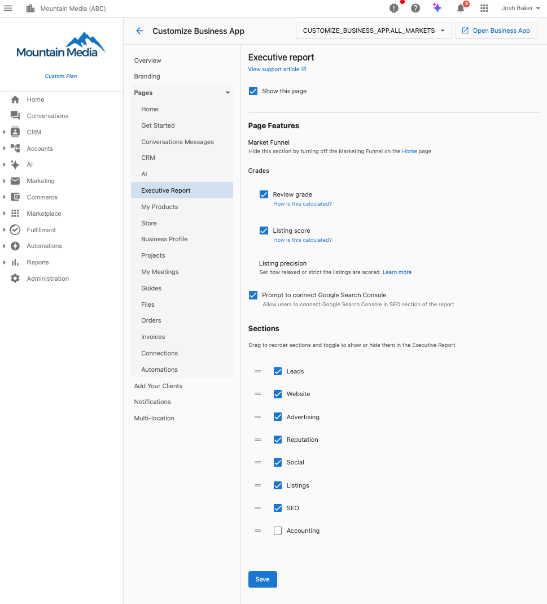

Puedes configurar el orden de las secciones del Executive Report y ocultar o mostrar secciones por mercado. Esto permite que la generación de reportes de cara a tus clientes se enfoque en las áreas donde aportas valor y evite llamar la atención sobre métricas que no forman parte de tu conjunto de soluciones.

## ¿Por qué personalizar las secciones del Executive Report?

El Executive Report muestra solo las secciones en las que quieres enfocar la generación de reportes. Si no quieres que una sección se muestre nunca a un mercado específico, puedes deshabilitarla por completo, asegurando que tus reportes se alineen con tu oferta de servicios.

## Cómo personalizar las secciones del Executive Report

### Instrucciones paso a paso

1. **Ve a la configuración de personalización**
   - Ve a `Partner Center` → `Accounts` → `Manage Business App` → `Customize Business App` → `Executive Report` → `Sections`

2. **Selecciona tu mercado**
   - Elige el mercado en el que deseas hacer cambios usando el menú desplegable en la esquina superior derecha
   - Cada mercado puede tener su propia configuración personalizada

3. **Configura las funciones de la página** (opcional)
   - **Show this page**: activa o desactiva si el Executive Report aparece en Business App
   - **Market Funnel**: ocúltalo desactivando Marketing Funnel en la página de inicio
   - **Review Grade**: configura los ajustes de cálculo y visualización
   - **Listing Score**: establece las preferencias de cálculo y visualización
   - **Listing Precision**: ajusta la exigencia de la puntuación (de relajada a estricta)
   - **Google Search Console Prompt**: habilita o deshabilita los avisos de conexión

4. **Configura las secciones del reporte**
   - **Alternar visibilidad**: usa los interruptores para mostrar u ocultar secciones específicas
   - **Reordenar secciones**: arrastra las secciones hacia arriba o hacia abajo para priorizar las métricas importantes
   - Secciones disponibles: Leads, Website, Reputation, Social, Listings, SEO, Advertising, Accounting

5. **Guarda los cambios**
   - Haz clic en **Save** para aplicar tu personalización
   - Los cambios se reflejarán en todos los Executive Reports de ubicación única de ese mercado

## Opciones de configuración disponibles

La interfaz de personalización del Executive Report ofrece varias áreas de configuración:

### Funciones de la página
- **Show this page**: controla si la página del Executive Report aparece en Business App
- **Market Funnel**: oculta esta sección desactivando Marketing Funnel en la página de inicio
- **Review Grade**: configura cómo se calculan y muestran las calificaciones de reseñas
- **Listing Score**: establece cómo se calculan y muestran las puntuaciones de los listados
- **Listing Precision**: ajusta qué tan estricta o relajada es la puntuación de los listados
- **Google Search Console Prompt**: permite que tus clientes conecten Google Search Console en la sección de SEO

### Secciones del reporte (arrastra para reordenar y alternar la visibilidad)
Las siguientes secciones se pueden reordenar y ocultar/mostrar en tu Executive Report:

- **Leads**: métricas de captación de leads, llamadas telefónicas, recepcionista con IA, chat web y envíos de formularios
- **Website**: datos de rendimiento y analítica del sitio web
- **Reputation**: datos de gestión de reseñas y reputación en línea
- **Social**: métricas de marketing y participación en redes sociales
- **Listings**: datos de precisión y visibilidad de los listados del negocio
- **SEO**: datos de optimización para motores de búsqueda y tráfico orgánico
- **Advertising**: rendimiento de publicidad paga en distintas plataformas
- **Accounting**: integración de datos financieros (QuickBooks, etc.)

## Configuración por mercado

### ¿Por qué usar configuraciones basadas en el mercado?

Distintos mercados pueden enfocarse en diferentes áreas de servicio. Por ejemplo:
- El **Mercado A** podría especializarse en servicios de SEO y Website
- El **Mercado B** podría enfocarse en Reputation AI y redes sociales
- El **Mercado C** podría ofrecer un paquete de servicio completo

### Configurar varios mercados

1. Selecciona el primer mercado en el menú desplegable
2. Configura las secciones según las áreas de enfoque de ese mercado
3. Guarda los cambios
4. Cambia al siguiente mercado y repite el proceso
5. Cada mercado mantiene su propia configuración independiente

## Reportes de ubicación única frente a multiubicación

### Executive Reports de ubicación única
La personalización de secciones funciona para todos los Executive Reports de ubicación única
- Usa la configuración descrita anteriormente
- Los cambios se aplican de inmediato a todos los reportes de ese mercado

### Executive Reports multiubicación
Los Executive Reports multiubicación se gestionan de forma diferente
- La generación de reportes multiubicación se controla en `Partner Center` → `Accounts` → `Multi-Location Groups` → [Selecciona el grupo] → `Features`
- Habilitar o deshabilitar funciones mostrará u ocultará las funciones relacionadas en el reporte multiubicación.

## Prácticas recomendadas

### Enfócate en las secciones que aportan valor
- Habilita las secciones donde brindas servicios activamente
- Deshabilita las secciones donde no tienes productos o datos activos
- Coloca tus áreas de mejor desempeño en la parte superior

### Ten en cuenta las expectativas de tus clientes
- Alinea la visibilidad de las secciones con tus propuestas de venta
- Asegúrate de que las secciones habilitadas tengan datos suficientes para mostrar métricas significativas
- Usa el orden de las secciones para contar una historia de rendimiento convincente

### Dependencias de las fuentes de datos
- **Las integraciones conectadas generan valor**: secciones como Leads muestran múltiples fuentes (Google Business Profile, AI Voice Receptionist, Web Chat, Forms); cuantas más estén conectadas, más ricos son los datos
- **El estado de la integración afecta la credibilidad**: los listados con estado "Synced" ofrecen datos más confiables que "Manual update only" o "Syncing is disabled"
- **Oculta las secciones con datos deficientes**: si integraciones clave están desconectadas o muestran errores, considera ocultar esas secciones hasta resolverlo

### Estrategia de orden de secciones
- **Empieza con las métricas de mayor impacto**: coloca en la parte superior las secciones con buen desempeño (tráfico del sitio web, leads generados)
- **Sigue el recorrido del cliente**: organiza las secciones para contar una historia; el flujo Leads → CRM → Website → SEO → Reputation resulta natural
- **Termina con oportunidades de crecimiento**: coloca hacia el final las secciones que fomentan la acción (como "Unlock Bing Places Insights")

### Valor de la comparación con la industria
- **El contexto de la industria impulsa la participación**: las secciones que muestran comparaciones como "86th Percentile" o "Industry Average" generan conversaciones más convincentes con los clientes
- **Posicionamiento competitivo**: habilita las secciones donde puedas demostrar un desempeño superior al promedio en comparación con los estándares de la industria
- **Usa las clasificaciones por percentil**: las secciones que incluyen datos de percentil (como Review Grade o Listing Score) ayudan a los clientes a entender su posición en el mercado

### Revisión y ajuste periódicos
- Revisa el desempeño de las secciones trimestralmente
- Ajusta el orden según los patrones estacionales del negocio
- Habilita nuevas secciones a medida que amplías tu oferta de servicios

## Solución de problemas

### Problemas comunes y soluciones

**P: No veo las opciones de personalización**
- Asegúrate de tener permisos de administrador en Partner Center
- Verifica que estés en el mercado correcto si usas configuración multimercado
- Contacta a soporte si las opciones siguen sin aparecer

**P: Los cambios no aparecen en los reportes**
- Las personalizaciones solo se aplican a los Executive Reports de ubicación única
- Los reportes multiubicación requieren una configuración independiente
- Espera hasta 24 horas para que los cambios se reflejen en los reportes programados

**P: Algunas secciones se muestran aunque estén deshabilitadas**
- Verifica si la sección contiene datos de negocio críticos que anulan la personalización
- Confirma que guardaste los cambios después de hacer modificaciones
- Asegúrate de estar viendo los reportes del mercado correcto

## Preguntas frecuentes (FAQ)

¿Puedo personalizar los Executive Reports multiubicación de la misma manera?

Los Executive Reports multiubicación se gestionan por separado en `Partner Center` → `Accounts` → `Multi-Location Groups` → [Nombre del grupo] → `Features`. Activa o desactiva ahí `CRM & Conversations` para controlar si esa sección aparece en los reportes multiubicación.

¿Los cambios de personalización afectan los reportes históricos?

Sí, los cambios de personalización se aplican a todos los reportes, pasados y presentes. Los reportes históricos se ven afectados por los cambios realizados en la visibilidad y el orden.

¿Puedo tener distintos órdenes de secciones para los reportes semanales y mensuales?

No, la personalización de secciones se aplica tanto a los Executive Reports semanales como a los mensuales del mercado seleccionado. Se usa la misma configuración para ambas frecuencias.

¿Puedo previsualizar los cambios antes de guardarlos?

Actualmente no existe una función de vista previa. Los cambios surten efecto una vez guardados. Te recomendamos hacer los ajustes y revisar un reporte de inmediato.

¿Cuál es la diferencia entre Page Features y Report Sections?

**Page Features** controla la funcionalidad general del Executive Report (mostrar la página, cálculos de calificación, avisos), mientras que **Report Sections** controla qué áreas de métricas específicas aparecen en el reporte y en qué orden (Website, SEO, Advertising, etc.).

¿Cómo afecta Listing Precision a mis reportes?

Listing Precision controla qué tan estricta o relajada es la puntuación para la precisión de los listados de negocio. Una configuración más estricta implica estándares más altos para lo que se considera un "buen" listado, mientras que una configuración más relajada es más tolerante con discrepancias menores.

¿Qué sucede si desactivo "Show this page"?

Si deshabilitas "Show this page", la pestaña del Executive Report no aparecerá en Business App para ese mercado. Los clientes no podrán acceder al reporte, aunque los envíos por correo electrónico podrían seguir activos según la configuración de notificaciones.

## Recursos relacionados
- [Gestión de grupos multiubicación](/accounts/multilocation-groups/)
