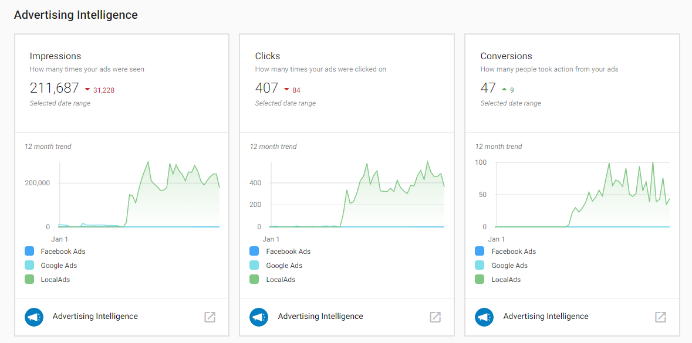

## ¿Qué es el resumen de rendimiento publicitario?

Puedes ver los resúmenes de rendimiento tanto de tus cuentas de Facebook Ads como de Google Ads dentro del Executive Report en Business App. Esta vista consolidada te da a ti y a tus clientes una imagen completa del rendimiento publicitario en varias plataformas.

## ¿Por qué es importante el resumen de rendimiento publicitario?

Tú y tus clientes pueden ver qué está sucediendo en todos sus canales de marketing digital en un solo lugar. Esto te permite obtener información rápida y sencilla sobre qué anuncios están teniendo buen desempeño y reducir la carga de trabajo con reportes automatizados. Al combinar la generación de reportes de rendimiento en tiempo real entre canales publicitarios con datos de ventas únicos, puedes mantener a tus clientes informados sobre su verdadero ROI.

### Métricas que puedes ver

- **ROI**: retorno de la inversión en los canales publicitarios
- **Client spend**: gasto publicitario total
- **Impressions**: cuántas veces se mostraron los anuncios
- **Clicks**: número de clics en los anuncios
- **Conversions**: acciones realizadas por los usuarios (compras, registros, etc.)
- **Comparisons to previous time period**: rendimiento semana a semana o mes a mes

## Cómo configurar la generación de reportes de rendimiento publicitario

### Requisitos previos
- Advertising Intelligence debe estar activado para la cuenta
- Las cuentas publicitarias deben estar conectadas a Advertising Intelligence

### Conectar cuentas publicitarias
1. Con Advertising Intelligence activado, conecta tus cuentas de Facebook Ads y/o Google Ads al producto
2. Ve al Executive Report en Business App y selecciona un período de tiempo
3. En la sección `Advertising`, verás subsecciones para `Facebook Ads` y `Google Ads` (según qué cuentas estén conectadas)

### Ver los datos de rendimiento
En el Executive Report, puedes ver el resumen de tus campañas de Facebook Ads y Google Ads en una sección de publicidad unificada. Esto ofrece una vista integral del rendimiento de tu publicidad en las distintas plataformas.

## Actualizaciones de datos

Los datos publicitarios actualizados en el Executive Report se completan cada domingo, comenzando la semana en que conectas una cuenta. Esto garantiza que tengas actualizaciones regulares y coherentes sobre el rendimiento de tu publicidad para compartir con los clientes.

## Plataformas publicitarias compatibles

El Executive Report admite datos publicitarios de:
- **Google Ads** (a través de Advertising Intelligence)
- **Facebook Ads** (a través de Advertising Intelligence)

Ambas plataformas ofrecen las mismas métricas principales (ROI, gasto, impresiones, clics, conversiones) y datos comparativos para ayudarte a demostrar el valor de la publicidad a tus clientes.

:::note
Advertising Intelligence también puede conectar cuentas de Microsoft Ads, pero los datos de Microsoft Ads no aparecen en esta sección del Executive Report. Consulta el rendimiento de Microsoft Ads directamente en Advertising Intelligence.
:::
