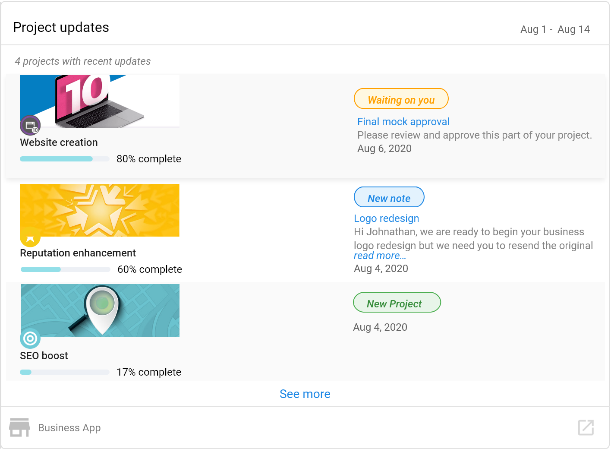

:::note Comportamiento especial de la sección
A diferencia de otras secciones del Executive Report, Fulfillment es una **sección invisible** que aparece en la parte superior de los reportes (debajo de Marketing Funnel). **No se puede reordenar** y muestra automáticamente tarjetas de Project y Task cuando hay datos disponibles.
:::

Tu equipo de fulfillment se esfuerza por aportar el mayor valor posible a tus clientes; sin embargo, a menudo este trabajo permanece oculto. Tienes que crear reportes con esmero para destacar las acciones realizadas en nombre de tus clientes, lo que te distrae del trabajo que tu empresa se comprometió a realizar en primer lugar.

Las tarjetas de fulfillment en el Executive Report resuelven este problema.

## Qué datos de fulfillment se muestran

El Executive Report incluye tarjetas de fulfillment que destacan el trabajo de tu equipo:

Estas tarjetas les mostrarán a tus clientes exactamente cuántas tareas y proyectos estás realizando para ellos, brindando transparencia y demostrando el valor que aporta tu equipo.

### Las tarjetas de fulfillment incluyen

- `Fulfillment tasks`: muestra el número de tareas completadas para el cliente
- `Fulfillment projects`: muestra el trabajo de proyectos realizado en nombre del cliente
- `Project updates`: comunica las actualizaciones y el progreso visibles de los proyectos

## Reglas de visibilidad

### Tarjetas de tareas y proyectos de fulfillment

**Pregunta: ¿Esto solo muestra proyectos y tareas configurados como visibles?**

No. Para las tarjetas `Fulfillment tasks` y `Fulfillment projects`, Partner Center muestra los números totales sin importar la visibilidad. Esto garantiza que tu equipo reciba crédito por todo el trabajo realizado, esté marcado como visible o no.

### Tarjeta de actualizaciones de proyecto

Sin embargo, la tarjeta `Project updates` solo muestra la información que se ha hecho visible. Esto te da control sobre qué comunicaciones y actualizaciones de proyectos específicas ven tus clientes, a la vez que se sigue reconociendo a tu equipo por el volumen total de trabajo.

## Compatibilidad con multiubicación

**Pregunta: ¿Estas tarjetas aparecerán en el Executive Report multiubicación?**

Sí. Existen versiones de estas tarjetas disponibles en el Executive Report multiubicación, lo que te permite demostrar el valor de fulfillment en varias ubicaciones de negocio para clientes empresariales.

## Beneficios de la generación de reportes de fulfillment

- **Transparencia**: los clientes pueden ver el volumen de trabajo que se realiza en su nombre
- **Demostración de valor**: destaca automáticamente los esfuerzos de tu equipo sin necesidad de generar reportes manuales
- **Ahorro de tiempo**: reduce la necesidad de crear reportes de fulfillment por separado
- **Retención de clientes**: ayuda a los clientes a comprender y valorar el beneficio continuo que reciben
