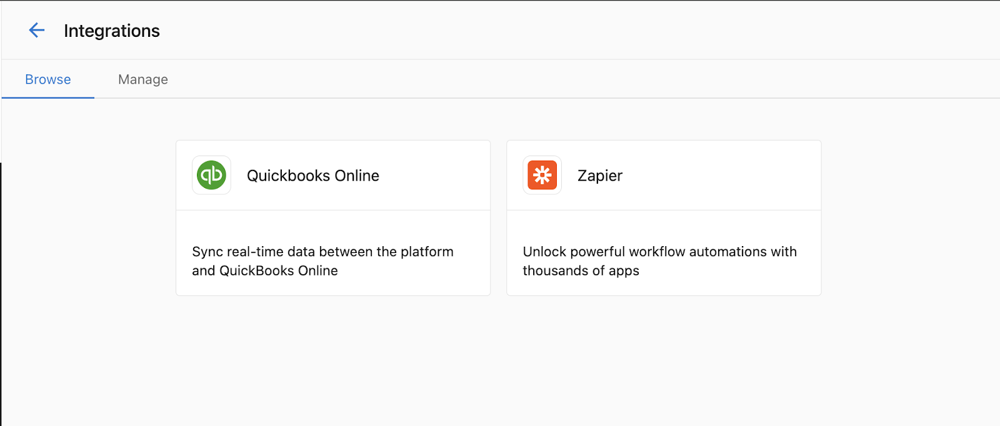
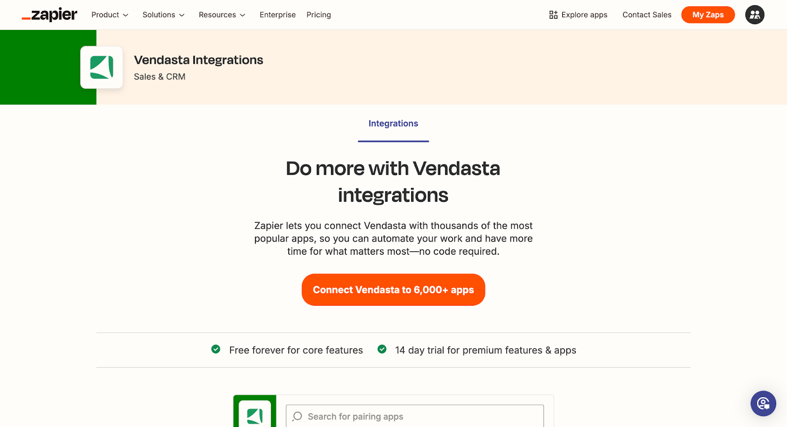
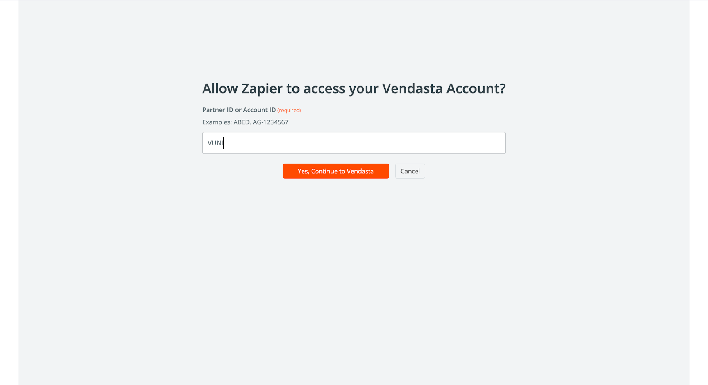
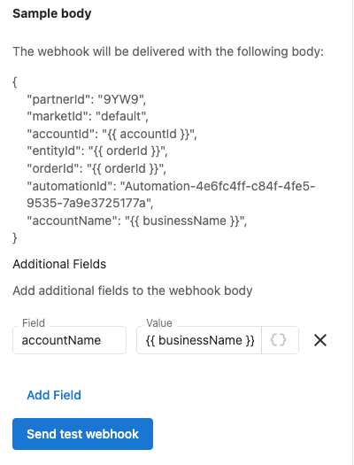
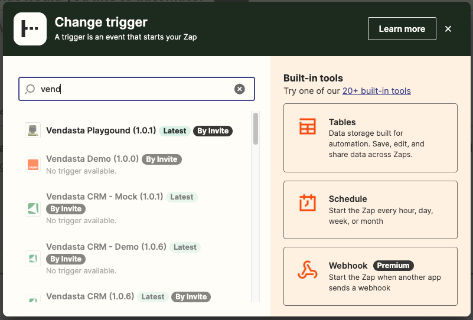

## ¿Qué es la integración con Zapier?

La integración de Vendasta con Zapier te permite conectar tu cuenta de Vendasta con miles de otras aplicaciones a través de la plataforma de automatización de Zapier. Esta integración te permite automatizar flujos de trabajo entre Vendasta y otras aplicaciones que usas a diario, ampliando las capacidades de tu plataforma.

## ¿Por qué es importante la integración con Zapier?

La integración con Zapier te ayuda a:
- Automatizar tareas repetitivas entre aplicaciones
- Sincronizar datos entre múltiples plataformas
- Crear flujos de trabajo sin necesidad de programar
- Conectar Vendasta con más de 6000 aplicaciones compatibles
- Reducir la entrada manual de datos y el error humano
- Escalar tus operaciones con procesos automatizados

## Qué puedes hacer con la integración con Zapier

| Función | Descripción |
|---------|-------------|
| **Conectividad de aplicaciones** | Conecta Vendasta con miles de aplicaciones |
| **Integración de CRM** | Sincroniza contactos y empresas con CRMs externos |
| **Activadores de automatización** | Usa las automatizaciones de Vendasta para activar flujos de trabajo de Zapier |
| **Registro de actividad** | Registra actividades como notas, llamadas y reuniones en el CRM de Vendasta |
| **Automatización de flujos de trabajo** | Crea procesos automatizados complejos de varios pasos |

## Cómo configurar la integración con Zapier

### Acceso a la integración

1. Inicia sesión en tu cuenta de Vendasta
2. Ve a `Administration` → `Integrations`
3. Ubica el mosaico de la integración de Zapier

4. Haz clic en `Connect` para que se te dirija a Zapier

### Conectar Vendasta con Zapier

Una vez que estés en el sitio web de Zapier, puedes comenzar a crear automatizaciones (Zaps) entre Vendasta y otras aplicaciones.

### Crear tu primer Zap

#### Paso 1: configura tu activador

Primero, selecciona la aplicación y el evento que activará tu automatización.

Si quieres que tu Zap comience a partir de datos de Vendasta, selecciona `Business App` como la aplicación activadora en Zapier, elige el evento activador disponible, conecta tu cuenta y completa las `Setup instructions` que se muestran en Zapier antes de probar el activador.

#### Paso 2: conecta con Vendasta

1. Selecciona Vendasta como tu aplicación de acción

2. Elige la acción de Vendasta que quieres realizar

3. Conecta tu cuenta de Vendasta si aún no lo has hecho

4. Completa la configuración definiendo los detalles de la acción

## Activadores y acciones disponibles

### Activadores (eventos en Vendasta que pueden iniciar un Zap)

- **New Business Created**: cuando se agrega un nuevo negocio a Vendasta
- **Business Updated**: cuando se modifica la información de un negocio
- **New Order Placed**: cuando se crea un nuevo pedido
- **Order Status Changed**: cuando se actualiza el estado de un pedido

### Acciones (cosas que Zapier puede hacer en Vendasta)

- **Create a Business**: agrega nuevos negocios al CRM de Vendasta
- **Update a Business**: modifica la información de un negocio existente
- **Create a Task**: agrega tareas a la gestión de tareas de Vendasta
- **Add a Note to Business**: registra notas en los registros de negocios
- **Create or Update CRM Contact**: administra registros de contactos en el CRM de Vendasta
- **Create or Update CRM Companies**: administra registros de empresas en el CRM de Vendasta
- **Log CRM Activity**: registra notas, correos electrónicos, llamadas, reuniones y tareas

## Cómo activar Zaps de Zapier usando automatizaciones de Vendasta

### Requisitos previos

- Una cuenta de partner de Vendasta con acceso a Automations
- Una cuenta de Zapier
- Comprensión básica de los webhooks

### Configurar el Zap para activadores de automatización

1. Ve a [Zapier](https://zapier.com/) e inicia sesión en tu cuenta
2. Haz clic en `Create Zap`

3. Busca y selecciona `Webhooks by Zapier` como la aplicación activadora

4. Selecciona `Catch Hook` como el evento activador y luego haz clic en `Continue`

5. Copia la URL del webhook. La necesitarás para configurar la automatización en Vendasta

6. Haz clic en `Continue` y luego en `Test trigger`. No te preocupes si la prueba falla en este punto

### Configurar la automatización en Vendasta

1. Inicia sesión en tu Partner Center de Vendasta
2. Ve a `Administration` → `Automations`
3. Crea una nueva automatización o edita una existente
4. Agrega una acción `Webhook` a tu automatización
5. En la configuración del webhook, pega la URL que copiaste de Zapier

6. Configura cualquier dato adicional que quieras enviar a Zapier en el campo `Body`
7. Guarda tu automatización

### Probar la integración

1. Activa tu automatización en Vendasta
2. Regresa a Zapier y deberías ver que la prueba fue exitosa

3. Continúa configurando el resto de tu Zap, agregando las acciones que deberían ocurrir cuando se active el webhook

4. Ponle un nombre a tu Zap, pruébalo y actívalo

## Información y preguntas frecuentes sobre la aplicación de Zapier

### ¿Qué es el modo beta?

¡Sabemos que estás ansioso por empezar a usar esto! Mientras nuestro equipo de desarrollo sigue incorporando funciones nuevas y emocionantes a la integración con Zapier, se usará la etiqueta beta para indicarlo.

:::note Requisito de suscripción
Esta función solo está disponible actualmente para partners con un nivel de suscripción que incluya integraciones.
:::

### ¿Quién puede usar la aplicación?

La aplicación puede ser utilizada por partners, vendedores y sus clientes, ya que usa los permisos del usuario que configuró el Zap. Cabe destacar que la aplicación tiene la marca de Vendasta, así que si deseas aplicar tu marca blanca a la plataforma, no podrás ofrecer esto actualmente. En su lugar, puedes optar por crear los zaps en nombre de tus clientes.

### Cómo se relacionan las empresas con las cuentas

Se creará una cuenta como una copia de los datos de la empresa la primera vez que se necesite una cuenta en la plataforma. Una vez creada, actualizar el registro de la empresa solo actualizará el vendedor asignado y todos los campos personalizados de la cuenta. Cuando un cliente actualiza su cuenta, la mayoría de los campos actualizarán el registro de la empresa.

## Mejores prácticas

### Planificación de tus integraciones

- **Empieza de forma simple**: comienza con integraciones básicas antes de crear flujos de trabajo complejos
- **Mapea tus datos**: comprende cómo fluyen los datos entre las aplicaciones
- **Prueba a fondo**: prueba tus Zaps a fondo antes de depender de ellos para procesos de negocio críticos
- **Supervisa con regularidad**: supervisa tus Zaps con regularidad para asegurarte de que sigan funcionando como se espera

### Consejos de optimización

- **Usa notificaciones de error**: configura notificaciones de error en Zapier para que se te avise si un Zap falla
- **Revisa los límites de uso**: revisa los límites de uso de Zapier para asegurarte de que tus necesidades de automatización estén dentro de las restricciones de tu plan
- **Operaciones por lotes**: cuando sea posible, usa operaciones por lotes para reducir las llamadas a la API
- **Validación de datos**: implementa la validación de datos para garantizar una transferencia de datos limpia

### Consideraciones de seguridad

- **Permisos**: asegúrate de que tu cuenta de Vendasta tenga los permisos necesarios
- **Seguridad de la cuenta**: mantén seguras tus cuentas de Zapier y Vendasta
- **Privacidad de los datos**: considera las implicaciones de privacidad de los datos al conectar sistemas
- **Control de acceso**: limita el acceso a los Zaps solo a los miembros del equipo necesarios

## Solución de problemas

### Problemas comunes

**El Zap no se activa**
1. Verifica que tu cuenta de Vendasta tenga los permisos necesarios
2. Asegúrate de que tu cuenta de Zapier esté activa y tenga un plan adecuado
3. Comprueba que las condiciones del activador se estén cumpliendo en Vendasta

**Problemas de transferencia de datos**
1. Comprueba que los datos que se transfieren entre las aplicaciones tengan el formato correcto
2. Verifica los mapeos de campos en la configuración de tu Zap
3. Revisa el historial de Zaps en Zapier para identificar dónde podrían estar ocurriendo los fallos

**La aplicación aparece atenuada**
Usa la aplicación correcta para tu flujo de trabajo:

- Aplicación `Vendasta`: úsala como aplicación de acción
- Aplicación `Business App`: úsala como aplicación activadora y luego completa las `Setup instructions` que se muestran en Zapier
- `Webhooks by Zapier`: úsala cuando quieras activarla desde eventos de webhook de las automatizaciones de Vendasta

### Obtener soporte

Para obtener soporte adicional con la integración con Zapier:
1. Consulta la documentación de Zapier para problemas generales de Zapier
2. Revisa la documentación de la API de Vendasta para conocer los requisitos de formato de datos
3. Contacta a atención al cliente de Vendasta para problemas específicos de la plataforma
4. Usa los recursos de soporte de Zapier para problemas específicos de Zapier

## Casos de uso y ejemplos

### Sincronización de CRM

**Ejemplo**: crea automáticamente contactos de CRM de Vendasta cuando se agreguen nuevos leads a tu CRM externo
- **Activador**: nuevo contacto en un CRM externo (por ejemplo, HubSpot, Salesforce)
- **Acción**: crea o actualiza un contacto de CRM en Vendasta

### Flujo de trabajo de gestión de tareas

**Ejemplo**: crea tareas de Vendasta cuando ocurran eventos específicos en otros sistemas
- **Activador**: nuevo ticket de soporte en el sistema de mesa de ayuda
- **Acción**: crea una tarea en Vendasta para el seguimiento

### Respaldo de datos e informes

**Ejemplo**: exporta automáticamente datos de Vendasta a hojas de cálculo para generar informes
- **Activador**: activador programado en Zapier
- **Acción**: exporta datos de Vendasta a Google Sheets

## Preguntas frecuentes

¿Qué hace la aplicación de Zapier?

La aplicación de Zapier te permite:
1. Crear o actualizar contactos de CRM en Vendasta
2. Crear o actualizar empresas de CRM en Vendasta
3. Registrar actividades de CRM (notas, correos electrónicos, llamadas, reuniones, tareas)
4. Ejecutar automatizaciones de Vendasta usando activadores de API
5. Conectar Vendasta con más de 6000 aplicaciones compatibles con Zapier

¿Quién puede usar la aplicación de Zapier?

La aplicación puede ser utilizada por partners, vendedores y sus clientes. Usa los permisos del usuario que configuró el Zap. Ten en cuenta que la aplicación actualmente tiene la marca de Vendasta, por lo que las opciones de marca blanca son limitadas.

¿Por qué la aplicación aparece atenuada cuando intento agregarla?

Es probable que estés usando el tipo de aplicación incorrecto para el paso:

- Usa `Vendasta` al configurar acciones de Zap
- Usa `Business App` al configurar activadores de Zap y sigue las `Setup instructions` dentro de la aplicación
- Usa `Webhooks by Zapier` al activar desde webhooks de automatizaciones de Vendasta

¿Cuáles son los límites de uso de la integración con Zapier?

Tanto las automatizaciones de Vendasta como Zapier tienen sus propios límites de uso y precios. Consulta la documentación de ambas plataformas para conocer los detalles específicos sobre los límites y los costos.

¿Puedo usar webhooks para activar Zaps desde las automatizaciones de Vendasta?

¡Sí! Puedes usar las automatizaciones de Vendasta con acciones de webhook para activar flujos de trabajo de Zapier. Usa "Webhooks by Zapier" como tu aplicación activadora y configura la URL del webhook en tu automatización de Vendasta.

¿Qué nivel de suscripción necesito para la integración con Zapier?

La integración con Zapier solo está disponible para partners con un nivel de suscripción que incluya integraciones. Consulta los detalles de tu suscripción o contacta a soporte para obtener más información.

