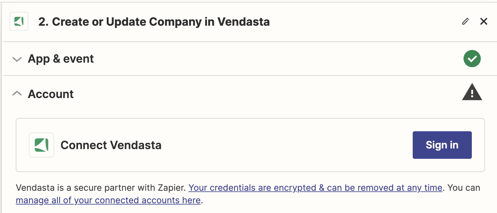
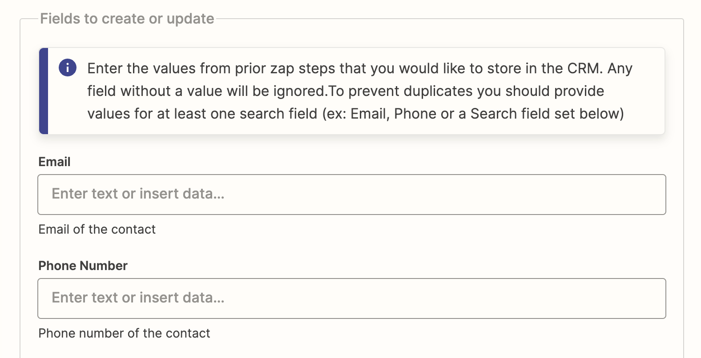
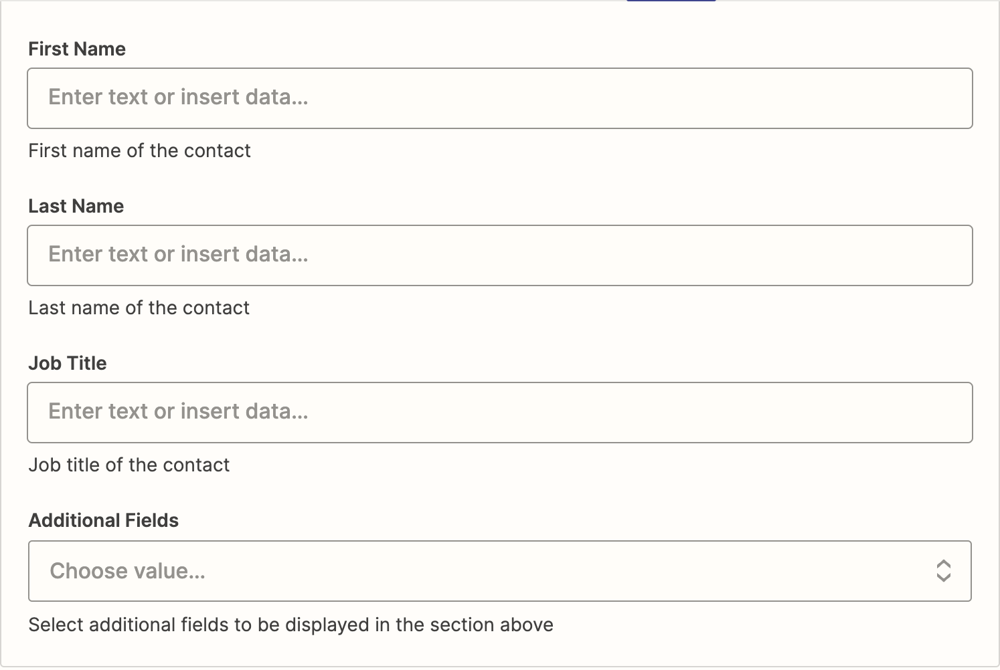
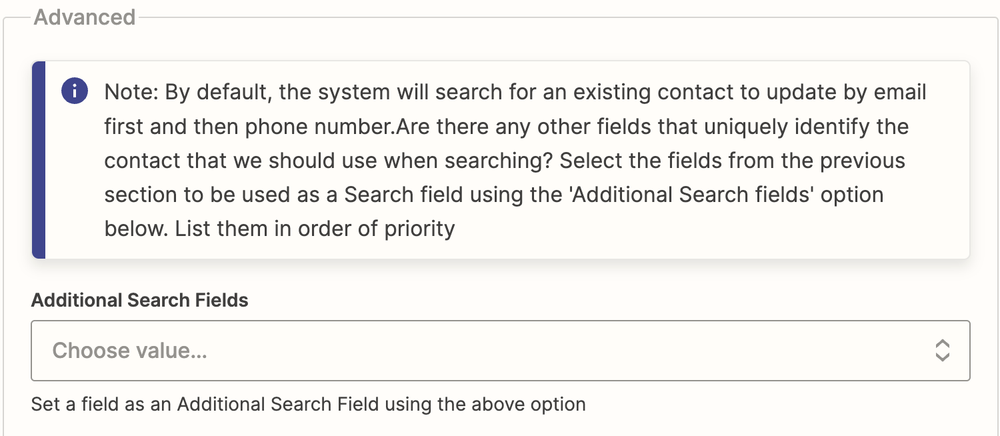
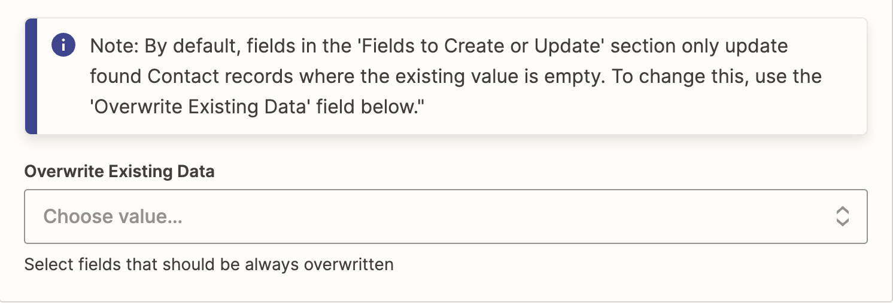
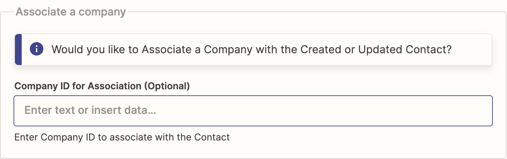
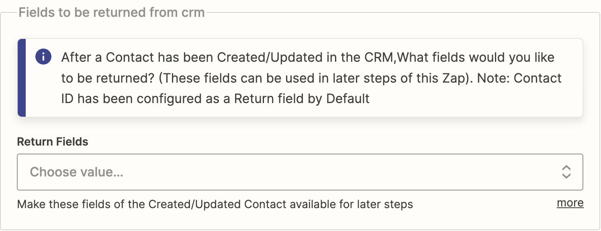

<iframe 
  src="//www.youtube-nocookie.com/embed/cnIpC7vSHFE" 
  width="560" 
  height="315" 
  frameBorder="0" 
  allowFullScreen=""
></iframe>

La aplicación de Vendasta en Zapier te permite conectar tu CRM de Vendasta a varios sistemas de terceros mediante Zapier. Puedes seleccionar cualquier sistema de terceros disponible en Zapier como disparador, el cual inicia una acción en el CRM de Vendasta.

## Paso 1: Seleccionar el disparador

En este paso, puedes seleccionar el disparador que inicia una acción en tu flujo de trabajo. Por ejemplo, un nuevo cliente en Quickbooks Online puede usarse como disparador; sin embargo, puedes elegir entre varios otros disparadores disponibles en Zapier.

## Paso 2: Elegir la acción

Después de seleccionar el disparador, deberás elegir la aplicación que realizará la acción deseada. En este escenario, esa aplicación sería la aplicación de Vendasta. Esto significa que cada vez que se agregue un nuevo cliente en Quickbooks Online, se ejecutará una acción en el CRM de Vendasta. Como parte de la aplicación de Vendasta en Zapier, son posibles varias acciones.

## Paso 3: Seleccionar la acción de crear o actualizar

En este paso, establecerás la acción que se realizará cuando ocurra el evento disparador. Para este escenario, la acción es crear o actualizar un contacto en el CRM de Vendasta.

Recuerda que puedes cambiar la acción en cualquier momento haciendo clic en el menú desplegable y eligiendo una opción diferente. Después de seleccionar la acción, haz clic en `Continue` para avanzar al siguiente paso.

## Paso 4: Iniciar sesión

En este paso, conectarás tu cuenta de Vendasta. Haz clic en `Sign in` para ser redirigido a la página de inicio de sesión. Ahí, ingresarás tu ID de partner o el ID de cuenta de la pyme para la que estás configurando Zapier y otorgarás los permisos necesarios. Después de esto, serás redirigido automáticamente de vuelta a Zapier.

:::note
Solo necesitas completar este proceso una vez. En el futuro, iniciarás sesión automáticamente en tu cuenta al usar la aplicación de Vendasta.
:::

## Paso 5: Ingresar el ID de la organización

En este paso, deberás ingresar el ID de la organización, que es un campo obligatorio. Este ID se completa automáticamente según el ID de cuenta que usaste al iniciar sesión.

## Paso 6: Campos a crear o actualizar: campos de búsqueda

En la sección `Fields to Create or Update`, puedes ingresar valores para los campos que deseas crear o actualizar. Estos valores pueden tomarse de pasos anteriores en Zapier.

Para evitar crear entradas duplicadas, asegúrate de proporcionar valores para al menos un campo de búsqueda. Esto podría ser el campo de correo electrónico o número de teléfono, que se proporcionan de forma predeterminada, o cualquier otro campo de búsqueda que puedas configurar en la sección Advanced.

## Paso 7: Campos a crear o actualizar: campos estándar

Esta sección incluye un conjunto de campos estándar que puedes usar al crear o actualizar un contacto. Puedes completar estos campos con valores de pasos anteriores en Zapier.

También encontrarás un menú desplegable `Additional Fields`. Úsalo para agregar más campos a la sección `Fields to Create or Update`. Una vez agregados, puedes proporcionar valores para estos campos.

## Paso 8: Sección avanzada: campos de búsqueda adicionales

En la sección `Advanced`, tienes la opción de refinar tu búsqueda de contactos. De forma predeterminada, el sistema busca contactos primero por correo electrónico y luego por número de teléfono. Sin embargo, puedes especificar campos únicos adicionales para identificar contactos durante la búsqueda.

Para hacerlo, usa el menú desplegable `Additional Search Fields`. Esto te permite seleccionar campos adicionales para realizar la operación de búsqueda. Puedes ordenar estos campos por prioridad para lograr una búsqueda más personalizada.

:::note
Solo puedes seleccionar campos de búsqueda adicionales entre los presentes en la sección `Fields to Create or Update`. Si deseas usar un campo nuevo, primero agrégalo mediante la opción `Additional Fields` en la sección `Fields to Create or Update`. Después de eso, podrás seleccionarlo desde el menú desplegable `Additional Search Fields`.
:::

## Paso 9: Sección avanzada: sobrescribir datos existentes

De forma predeterminada, solo se actualizan los campos sin ningún valor actual en la sección `Fields to Create or Update`. Si deseas cambiar esto y sobrescribir datos existentes, usa la opción `Overwrite Existing Data`.

Haz clic en el menú desplegable `Overwrite Existing Data` para seleccionar campos específicos que siempre deseas que se sobrescriban, sin importar si están vacíos o ya contienen datos.

:::note
Sobrescribir datos existentes puede ser útil en ciertos escenarios, pero debe usarse con precaución para evitar la pérdida involuntaria de datos.
:::

## Paso 10: Asociar una empresa

En este paso, tienes la opción de asociar una empresa con el contacto que estás creando o actualizando. Si deseas hacerlo, ingresa el ID de la empresa en el cuadro de texto proporcionado, etiquetado `Company ID for Association (Optional)`.

:::note
Este es un paso opcional. Si no tienes el ID de la empresa a la mano, puedes dejarlo en blanco y continuar con el siguiente paso.
:::

## Paso 11: Seleccionar los campos de retorno del CRM

Después de que se haya creado o actualizado un contacto en el CRM, puedes elegir qué campos deseas que se devuelvan. Estos campos se pueden usar en pasos posteriores de este Zap.

Para seleccionar los campos de retorno, haz clic en el menú desplegable en `Return Fields` y selecciona los campos específicos que deseas que se devuelvan desde el CRM.

:::note
El ID del contacto siempre se incluye como campo de retorno de forma predeterminada.
:::

