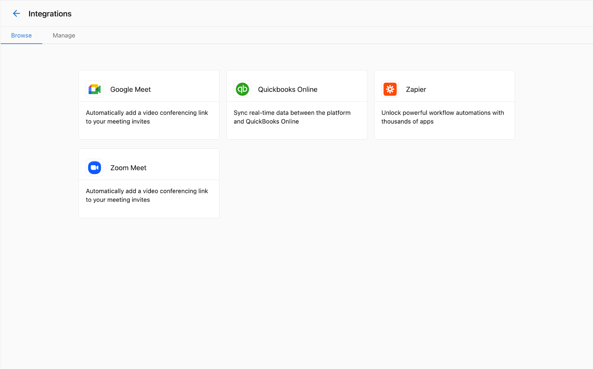

Las integraciones de Google Meet y Zoom de Vendasta permiten a los partners integrar sus cuentas de Google Meet o Zoom con Partner Center.

Una vez que habilitas la integración de Google Meet o de Zoom, notarás algunos cambios en Partner Center al comunicarte con un cliente:

- Al ver el registro de un contacto, verás una nueva opción junto a los botones `Call` y `Email` para iniciar o programar una reunión.
- Al redactar un correo electrónico a un contacto, verás nuevas opciones para incluir un enlace de reunión y sugerir horarios de reunión.

## Consideraciones para Google Meet

- Para usar la integración de Google Meet, debes tener una cuenta de Google Workspace con Google Meet habilitado.
- Todos los usuarios de Partner Center comparten la misma conexión de Google Meet. Cuando un usuario configura la integración de Google Meet, queda disponible para todos los usuarios de esa cuenta de partner.
- No necesitarás iniciar sesión por separado en tu cuenta de Google para usar esta integración.

## Consideraciones para Zoom

- A diferencia de Google Meet, cada usuario de Partner Center necesita conectar su propia cuenta de Zoom.
- Se admiten tanto las cuentas de Zoom gratuitas como las de pago, pero las cuentas gratuitas tienen algunas limitaciones de reunión (por ejemplo, un límite de 40 minutos para reuniones grupales).

## Configuración de la integración de Google Meet

Para habilitar la integración de Google Meet en tu cuenta de Partner Center:

1. Ve a la página `Integrations` desde el menú de navegación izquierdo en Partner Center.
2. Busca el bloque `Google Meet` y haz clic en `Connect`.
3. Sigue el flujo de autenticación de Google para otorgar a Partner Center acceso a tu cuenta de Google.

Una vez completado, deberías ver un mensaje `Connection Completed`:

## Configuración de la integración de Zoom

Cada usuario de Partner Center necesita configurar su propia integración de Zoom:

1. Ve a la pestaña `Manage` en tu perfil de usuario (haz clic en tu ícono de usuario en la esquina superior derecha).

2. Selecciona `Connected Apps` en el menú izquierdo.
3. Busca el bloque de Zoom y haz clic en `Connect`.
4. Sigue el flujo de autenticación de Zoom para otorgar a Partner Center acceso a tu cuenta de Zoom.

## Gestión de la configuración de integraciones

Los administradores pueden gestionar la configuración de integraciones y conexiones a través de la página Integrations:

1. Ve a la página `Integrations` desde el menú de navegación izquierdo.
2. Busca el bloque de la integración (Google Meet o Zoom).
3. Haz clic en `Manage` para ver y ajustar la configuración de la conexión.

## Programación de reuniones

Una vez integrado, programar reuniones con clientes es sencillo:

1. Ve al registro de contacto de un cliente.
2. Haz clic en el botón de reunión junto a 'Call' y 'Email'.
3. Elige iniciar una reunión inmediata o programar una para más tarde.
4. Al programar, selecciona los horarios disponibles y agrega los detalles de la reunión.
5. Envía la invitación al contacto.

Alternativamente, al redactar un correo electrónico:

1. Haz clic en el botón de reunión en el redactor de correo electrónico.
2. Elige agregar un enlace de reunión o sugerir horarios.
3. Completa la configuración de la reunión y envía el correo electrónico.

## Solución de problemas

Si tienes problemas con las integraciones de Google Meet o Zoom:

- Asegúrate de que tu cuenta de Google Workspace o Zoom esté activa y correctamente configurada.
- Verifica que hayas otorgado todos los permisos necesarios durante el proceso de conexión.
- Para problemas con Google Meet, pide a tu administrador que verifique la conexión en la página Integrations.
- Para problemas con Zoom, intenta desconectar y volver a conectar tu cuenta.

Para obtener asistencia adicional, comunícate con el soporte de Vendasta.
