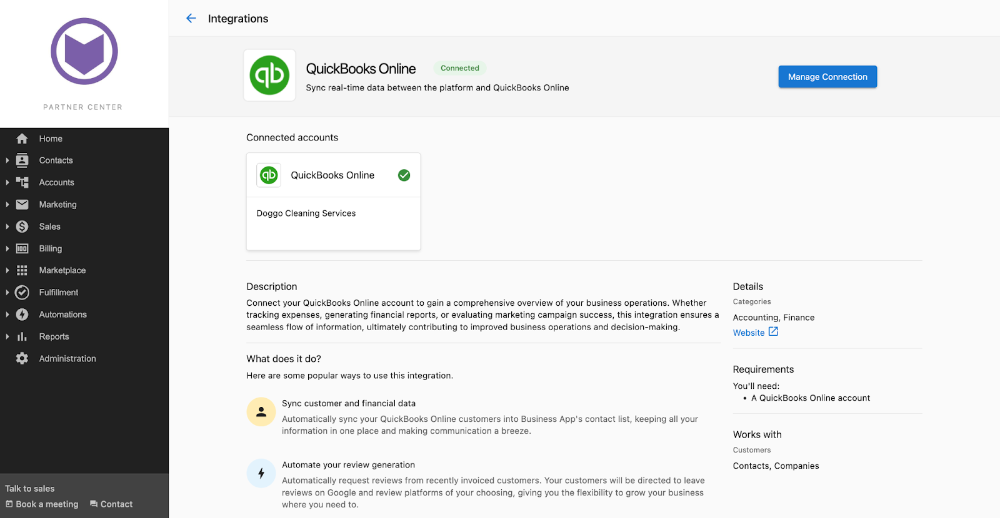
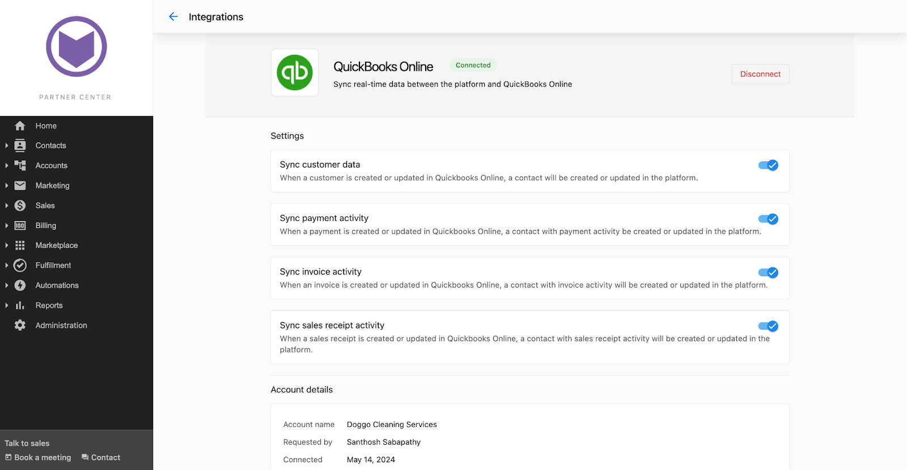

La integración de QuickBooks en Partner Center te permite sincronizar datos entre QuickBooks y Vendasta. La integración es una sincronización unidireccional de contactos de QuickBooks al CRM de Vendasta y 3 disparadores de automatización.

## Configuración de la integración de QuickBooks

Puedes configurar una conexión con QuickBooks navegando a la página de Integrations de Partner Center.

- Haz clic en `Administration` → `Integrations` para ir a la página de Integrations.
- Haz clic en la tarjeta de integración de QuickBooks.

- Serás llevado a la página de marketing de QuickBooks, que ofrece información sobre qué es QuickBooks y las posibilidades que brinda una integración con QuickBooks. Haz clic en `Add Connection`.

- Esto te muestra una ventana emergente de formulario previo a la conexión donde puedes definir los datos que deseas sincronizar entre QuickBooks y el CRM de Partner Center. Las opciones de sincronización disponibles son:
  - Datos de clientes
  - Datos de facturas
  - Datos de recibos de venta
  - Datos de pagos

Haz clic en `Continue` después de elegir las opciones que correspondan.

- Esto te lleva a una página de inicio de sesión único donde puedes iniciar sesión en tu cuenta de QuickBooks y otorgar los permisos necesarios para establecer la conexión.
- Una vez que la conexión se realiza con éxito, serás redirigido automáticamente a la pestaña `Manage` de la página de Integrations, donde puedes confirmar la conexión con QuickBooks.
- La conexión establecida se muestra en la pestaña `Manage` y en la página de marketing, como se ve a continuación:

- Al hacer clic en cualquiera de las dos tarjetas, llegarás a la página `Connection Settings`, donde puedes especificar qué datos sincronizar o elegir desconectar la integración.

:::info
Después de la conexión inicial con QuickBooks, todos los contactos en QuickBooks se sincronizan con el CRM de Partner Center. Puedes optar por no hacerlo desmarcando la opción Sync Customer Data en el formulario durante la conexión inicial.
:::

## Administra los datos sincronizados

Puedes elegir los datos que deseas sincronizar entre QuickBooks y el CRM de Partner Center:

1. Datos de contactos
2. Datos de facturas
3. Datos de recibos de venta
4. Datos de pagos

Asegúrate de que exista una conexión activa con QuickBooks haciendo clic en la pestaña `Manage` de la página de Integrations y verificando la tarjeta de conexión de QuickBooks.

- Al hacer clic en la tarjeta de conexión, llegarás a la página Connection Settings. Aquí puedes especificar qué datos se van a sincronizar.

## Ejemplo de la integración

Considera, por ejemplo, un contacto en Partner Center llamado Amy. El perfil de contacto de Amy en Partner Center no muestra actividades recientes registradas.

La empresa crea una factura para Amy en QuickBooks.

Se crea una nota en el perfil de contacto de Amy en Partner Center con los detalles de QuickBooks, incluyendo el número de factura, el nombre del contacto y el monto de la factura.

