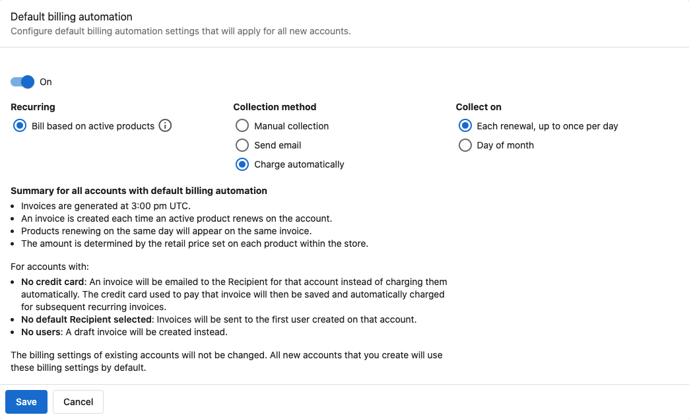

La configuración de facturación predeterminada aplica la configuración de facturación de suscripción que elijas a cada cuenta nueva que crees. La configuras una vez; las cuentas nuevas obtienen esa configuración automáticamente. Las cuentas existentes no se modifican.

## Qué es

La facturación de suscripción crea y envía facturas o cobra los métodos de pago guardados para las suscripciones recurrentes. La configuración predeterminada en `Administration` → `Default billing settings` se aplica a todas las cuentas nuevas para que no tengas que configurar la facturación de cada cuenta manualmente.

## Por qué importa

- **Menos trabajo manual** – Las cuentas nuevas obtienen tu configuración de facturación preferida automáticamente
- **Coherencia** – Las mismas prácticas de facturación en los clientes nuevos
- **Flexibilidad** – Cambia cualquier cuenta individual desde su propia configuración de facturación en `Accounts` → `Manage Accounts`

## Qué puedes configurar

- **`Subscriptions`** – Un interruptor que activa la facturación de suscripción para las cuentas nuevas. Está `Off` de manera predeterminada
- **`Payment collection`** – Cómo cobras el dinero de una suscripción
- **`Subscription renewal`** – Qué ocurre cuando se renueva una suscripción. Las opciones incluyen `Do nothing` y `Create a draft invoice`
- **`Subscription scheduling`** – Si cada suscripción se renueva en su propia fecha de inicio, o si todas las suscripciones se alinean a una fecha común
- **`Memo`** – Texto libre que se imprime al pie de cada factura que crea la facturación de suscripción

La página muestra un aviso que indica que esta configuración solo se aplica a las cuentas creadas **después** de que guardes. Las cuentas existentes mantienen su configuración actual.

## Cómo configurar la facturación predeterminada

1. Ve a `Partner Center` → `Administration` → `Default billing settings`
2. Activa el interruptor `Subscriptions`. Está `Off` de manera predeterminada
3. Establece `Payment collection` con el método que quieras usar para cobrar el pago
4. Establece `Subscription renewal`. Elige `Do nothing` si no quieres que se genere nada al renovarse, o `Create a draft invoice` si quieres una factura que revises antes de enviarla
5. Establece `Subscription scheduling`. Renueva cada suscripción en su propia fecha de inicio, o alinea las suscripciones a una fecha común
6. Agrega un `Memo` si quieres un texto fijo al pie de cada factura que crea la facturación de suscripción
7. Revisa la configuración y selecciona `Save`

Las cuentas nuevas obtendrán esta configuración en su facturación automáticamente.

:::warning
La configuración de facturación predeterminada no cambia las cuentas existentes. Solo las cuentas creadas después de que guardes usarán estos valores predeterminados.
:::

## Cambiar la facturación de una cuenta individual

Puedes cambiar la facturación de cualquier cuenta en cualquier momento:

1. Ve a `Partner Center` → `Accounts` → `Manage Accounts`
2. Abre la cuenta
3. Cambia la configuración de facturación propia de esa cuenta

Para obtener más información sobre la facturación por cuenta, consulta [Gestión de suscripciones](/commerce/subscriptions/subscription-management).

## Valores predeterminados específicos por mercado

Con varios mercados, puedes establecer distintas configuraciones de facturación predeterminada por mercado. Usa el selector de mercado en la página `Default billing settings`.

## Requisito de precios de productos

Para que la automatización facture correctamente:

- Se deben establecer **precios de venta al público** para cada producto
- La **configuración de suscripción** debe ser correcta para los productos recurrentes

:::info
Para facturar automáticamente en función de los productos activos, debes establecer precios de venta al público para cada producto. Sin precios, la automatización no puede calcular los importes.
:::

## Preguntas frecuentes

¿La configuración de facturación predeterminada afecta a las cuentas existentes?

No. Solo se aplica a las cuentas creadas después de que guardes. Las cuentas existentes mantienen su configuración de facturación actual.

¿Puedo cambiar la facturación de una cuenta después de aplicar los valores predeterminados?

Sí. Ve a `Accounts` → `Manage Accounts`, abre la cuenta y cambia la configuración de facturación propia de esa cuenta.

¿Necesito establecer precios de producto para que funcione la automatización?

Sí. Establece precios de venta al público para cada producto para que la facturación automática pueda calcular los importes.

¿Puedo tener distintos valores predeterminados por mercado?

Sí. Selecciona cada mercado en la página `Default billing settings` y guarda distintas configuraciones por mercado.

¿Qué hace la configuración de `Payment collection`?

`Payment collection` establece cómo cobras el dinero de una suscripción en una cuenta nueva. Abre el campo en la página `Default billing settings` para ver los métodos disponibles para tu cuenta y elige el que coincida con la forma en que quieres que te paguen.

¿Para qué sirve el campo `Memo`?

Todo lo que escribas en `Memo` se imprime al pie de cada factura que crea la facturación de suscripción. Úsalo para texto fijo como condiciones de pago o una nota de remesa.

¿Puedo desactivar la facturación de suscripción predeterminada más adelante?

Sí. Ve a `Default billing settings`, establece el interruptor `Subscriptions` en `Off` y guarda. Las cuentas nuevas ya no obtendrán los valores predeterminados; las cuentas existentes no se modifican.

Mis clientes están recibiendo correos de facturas inesperados: ¿cómo detengo esto?

Esto ocurre cuando la facturación de suscripción está activada y configurada para generar facturas al renovarse. Para detener el envío de correos de facturas:

1. Ve a `Partner Center` → `Administration` → `Default billing settings` y comprueba si el interruptor `Subscriptions` está activado
2. Establece `Subscription renewal` en `Do nothing` para que las renovaciones ya no generen una factura y, luego, selecciona `Save`
3. Esto cambia el valor predeterminado solo para las cuentas nuevas. Para una cuenta que ya está enviando facturas, cambia la configuración de facturación propia de esa cuenta

La configuración de la cuenta se encuentra en `Partner Center` → `Accounts` → `Manage Accounts`; luego abre la cuenta afectada.

