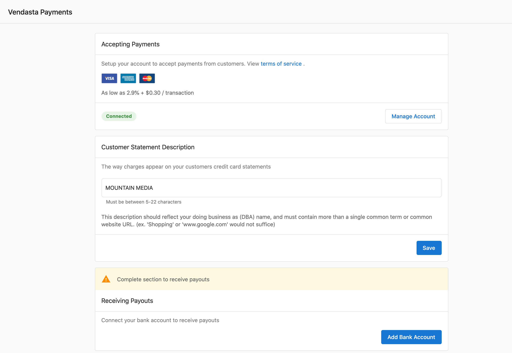
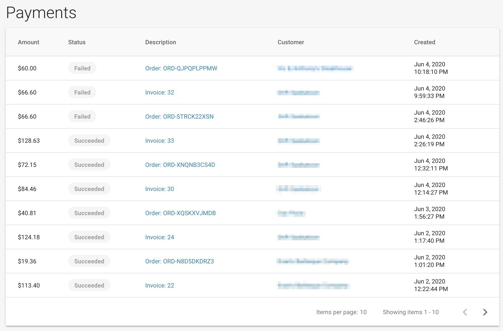
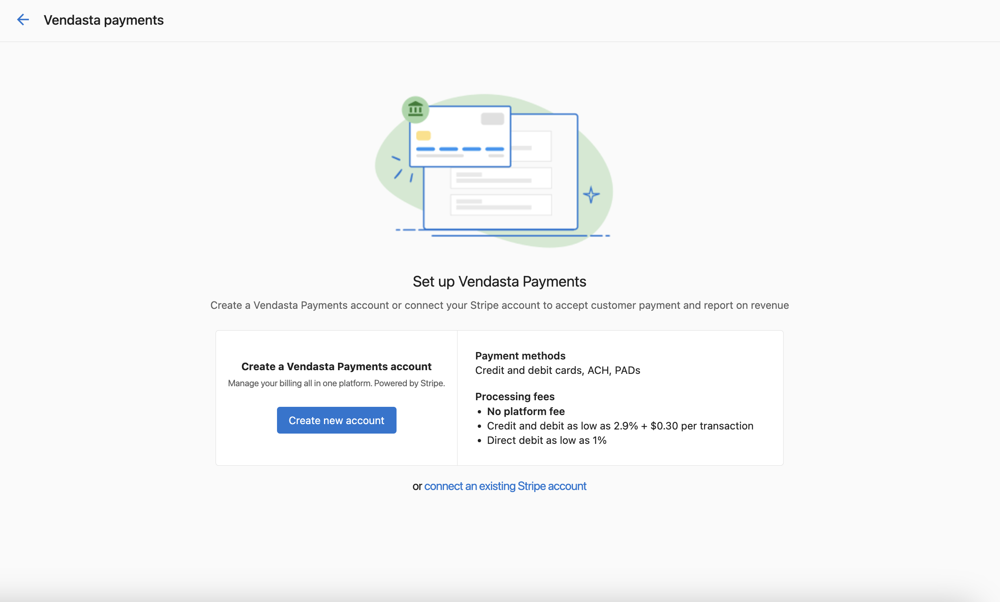
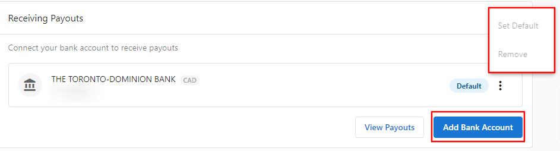
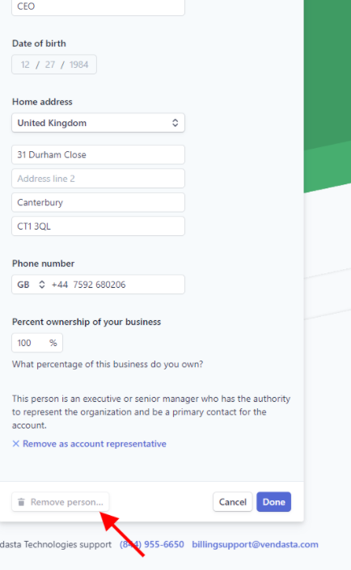

## ¿Qué es Vendasta Payments?

Factura, cobra y recibe pagos por todos tus servicios a través de una única plataforma integrada. Ofrece a tus clientes de negocios locales una experiencia de compra fluida, todo en un solo lugar y bajo tu marca.

:::info Seguridad de pagos
Vendasta mantiene un informe SOC 2® Tipo 2 vigente que cubre sus controles de seguridad, y los pagos se procesan a través de Stripe. Para obtener detalles sobre cómo se protegen los datos de pago y de la plataforma, consulta [Seguridad y privacidad](/getting-started/security-and-privacy) o visita el [Centro de confianza de Vendasta](https://trust.vendasta.com/).
:::

  

    <iframe
      src="https://fast.wistia.net/embed/iframe/ayjibivt6o?web_component=true&seo=true"
      title="Vendasta Payments and Billing Setup Walkthrough"
      allow="autoplay; fullscreen"
      allowTransparency
      frameBorder="0"
      scrolling="no"
      className="wistia_embed"
      name="wistia_embed"
      width="100%"
      height="100%"
    ></iframe>
  

## ¿Qué incluye la configuración de Vendasta Payments?

### Opciones de configuración de la cuenta
- **Nueva cuenta de Vendasta Payments**: crea una nueva cuenta de procesamiento de Vendasta Payments
- **Conexión de cuenta de Stripe**: conecta tu cuenta existente de Stripe Standard
- **Verificación de cuenta**: completa los requisitos de verificación de identidad
- **Configuración bancaria**: configura los destinos de pago y los datos financieros

### Métodos de pago admitidos
- Tarjetas de crédito y débito (Visa, Mastercard, American Express, Discover)
- Transferencias ACH
- Débitos preautorizados (PAD)

### Disponibilidad regional
Vendasta Payments está disponible en:
- EE. UU., Canadá, Nueva Zelanda, Australia, Reino Unido, República Checa
- Países adicionales con asistencia de ventas: Alemania, Bélgica, Países Bajos, Polonia, Suiza

## Cómo configurar Vendasta Payments

### Requisitos previos: mi configuración de facturación

Antes de configurar Vendasta Payments, asegúrate de que tu información de facturación esté correctamente configurada en `Partner Center` → `Administration` → `My billing`. Deben completarse los siguientes ajustes:

- **Contacto de facturación**: la información de contacto de tu negocio
- **Método de pago**: tarjeta de crédito registrada (no es necesario si actualmente Vendasta te factura mediante factura)

Estos ajustes son necesarios para que se te facturen los costos mayoristas asociados con la activación de productos y servicios.

### Configuración estándar de la cuenta de Vendasta Payments

<iframe src="https://www.loom.com/embed/df6a770f5aef4db2935b81683559f7e9" frameborder="0" width="100%" height="400px" allowfullscreen></iframe>

Antes de comenzar el proceso de configuración, debes revisar y aceptar los [Términos de servicio](https://www.vendasta.com/terms/terms-of-service/) adicionales asociados con el uso de Vendasta Payments.

Para crear una nueva cuenta de Vendasta Payments:

1. Ve a `Administration` → `Commerce Settings` → `Vendasta Payments`
2. Haz clic en **Set up Vendasta Payments** para crear tu cuenta de Stripe
3. Proporciona la siguiente información obligatoria:
   - **Nombre legal del negocio** (debe coincidir exactamente con el nombre asociado a tu identificación fiscal)
   - **Número de negocio**
     - Para empresas de EE. UU.: número de identificación de empleador (EIN)
     - Para empresas canadienses: número de negocio de la Agencia de Ingresos de Canadá (CRA)
     - [Más información sobre la verificación de identidad](https://stripe.com/docs/connect/identity-verification)
   - **Nombre operativo** de tu empresa (tu nombre comercial, si es diferente del nombre legal)
   - **Dirección comercial registrada** o dirección particular (si no tienes una dirección comercial)
   - **Información del representante de la cuenta**:
     - Nombre legal
     - Dirección particular
     - Verificación de identidad (número completo de seguro social para EE. UU., e identificación emitida por el gobierno mediante cámara web, teléfono o carga de archivo)
4. Completa la solicitud de cuenta con toda la documentación requerida
5. Configura los datos bancarios para los pagos
6. Espera la aprobación de la cuenta (normalmente de 1 a 2 días hábiles)

:::warning
Vendasta Payments no está disponible para los niveles de suscripción Free o Trial. Esta restricción se aplica a los usuarios nuevos y a los usuarios actuales que no lo usan en estos niveles, debido a medidas de prevención de fraude.
:::

#### Aceptar pagos en línea

De forma predeterminada, la moneda que aceptas para los pagos en línea es la moneda que utilizas en tu relación de facturación con Vendasta (tu moneda contractual).

Vendasta Payments actualmente puede aceptar pagos con tarjetas de crédito Visa, Mastercard, American Express y Discover.

Los pagos que hayas recibido se mostrarán en la pestaña `Partner Center` → `Commerce` → `Payments`.

Después de recibir tu primer pago, Stripe retendrá los pagos que recibas durante un período de hasta una semana. Al finalizar este período, Stripe comenzará a pagar una parte del saldo acumulado, de forma continua cada 7 días, a la cuenta bancaria que agregues en la configuración de pagos.

Si un pago ha fallado, puedes pasar el cursor sobre el ícono ⓘ **Información** junto al estado para obtener más información.

#### Descripción del estado de cuenta del cliente

La descripción del estado de cuenta del cliente que estableces al configurar Vendasta Payments se muestra en los estados de cuenta de tarjeta de crédito de tus clientes y se usa para aclarar un pago que hicieron por tus productos o servicios.

Usar un descriptor de estado de cuenta claro, preciso y reconocible reduce la probabilidad de contracargos y disputas, ya que ayuda a tus clientes a recordar el origen de un cargo o pago en particular.

De forma predeterminada, "Vendasta" aparece en los estados de cuenta de tarjeta de crédito de los clientes cuando realizan un pago. Puedes reemplazar este descriptor de estado de cuenta con el nombre de tu propio negocio ingresando esta información al configurar Vendasta Payments. Puedes usar hasta 22 caracteres para tu descripción del estado de cuenta.

### Conecta tu cuenta existente de Stripe

Si ya tienes una cuenta existente de Stripe Standard, puedes conectarla a Vendasta Payments para aprovechar funciones de facturación integrales, como facturación, suscripciones y pagos.

#### Requisitos para la conexión con Stripe
- Ya usas Stripe para cobrar pagos de clientes
- Facturas en una moneda admitida por Vendasta Payments
- No has completado una transacción usando una cuenta connect personalizada de Vendasta
- Tu cuenta de Stripe conectada está registrada en un país admitido por Vendasta Payments

#### Métodos de pago admitidos con la conexión de Stripe
- Tarjetas de crédito y débito
- Transferencias ACH
- Débitos preautorizados (PAD)

#### Tarifas de procesamiento con una cuenta de Stripe conectada
- **Crédito/Débito/Débito bancario**: tus tarifas existentes de Stripe no cambian
- **Tarifa de plataforma**: 0.75 % del monto de la transacción

#### Proceso de conexión
1. Ve a `Administration` → `Commerce Settings` → `Vendasta Payments`
2. Selecciona la opción `Connect Stripe Account`

3. Elige la cuenta de Stripe que deseas conectar a Vendasta Payments. Si tienes varias cuentas de Stripe, se te pedirá que selecciones la que quieres conectar.

4. Revisa y acepta los términos de conexión
5. Completa el proceso de integración

:::info
Esta función actualmente solo está disponible para usuarios nuevos que no hayan completado transacciones con cuentas generadas por la plataforma.
:::

## Cómo configurar los pagos a proveedores

Para acceder a la configuración de tus pagos a proveedores, ve a `Partner Center` → `Commerce` → `Payouts` o `Administration` → `Commerce Settings` → `Vendasta Payments`.

### Cómo configurar cuentas bancarias

Puedes recibir pagos a proveedores de pagos en línea con tarjeta de crédito en una o más cuentas bancarias ingresando los datos de tu cuenta en Stripe.

Si no tienes una relación bancaria en todos los países donde operas, pero deseas agregar una cuenta bancaria en un país diferente, comunícate con [support@vendasta.com](mailto:support@vendasta.com) para obtener más información.

Al configurar tu primera cuenta bancaria para pagos a proveedores:

1. Ve a la pestaña `Administration`
2. Ve a `Commerce Settings` → `Vendasta Payments`
3. Haz clic en `Add Bank Account` en Receiving Payout
4. Ingresa los datos de tu cuenta bancaria:
   - Tipo de titular de la cuenta (individual o empresa)
   - Nombre del individuo (si se selecciona Individual) o nombre de la empresa (si se selecciona Company)
   - Número de cuenta bancaria
   - Número de ruta bancaria
5. Establece esta cuenta como predeterminada para los pagos a proveedores

:::tip
Si ya tienes una cuenta bancaria conectada y deseas reemplazarla, primero debes agregar una nueva cuenta bancaria. Una vez agregada la nueva cuenta, puedes establecerla como predeterminada y luego eliminar la cuenta bancaria anterior.
:::

### Establecer una cuenta bancaria predeterminada

Si agregas más de una cuenta bancaria para recibir pagos a proveedores, debes seleccionar una cuenta predeterminada para especificar cuál recibe tus pagos. Puedes cambiar tu cuenta bancaria predeterminada en cualquier momento desde el panel de Stripe.

### Cómo configurar cuentas bancarias en varias monedas

En los países admitidos, puedes agregar varias cuentas bancarias para recibir pagos a proveedores en diferentes monedas sin tarifas de conversión:

1. Agrega una cuenta bancaria por cada moneda de liquidación admitida
2. Selecciona una moneda de liquidación predeterminada (que puedes cambiar en cualquier momento)
3. Los pagos recibidos en las monedas configuradas se liquidan sin conversión
4. Los pagos en monedas no configuradas se convierten automáticamente a tu moneda predeterminada

**Ejemplo:** una cuenta con sede en el Reino Unido con cuentas bancarias tanto en GBP como en USD (GBP como predeterminada):
- Los pagos en USD van a la cuenta en USD sin conversión
- Los pagos en GBP van a la cuenta en GBP
- Todas las demás monedas se convierten a GBP y van a la cuenta en GBP

### Cambiar tu moneda de pago a proveedores

De forma predeterminada, los pagos a proveedores se realizan a tu cuenta bancaria en tu moneda predeterminada. Sin embargo, puedes agregar un nuevo destino de pago y elegir convertir tus fondos a una moneda diferente antes de que se depositen en una cuenta bancaria. Stripe puede cobrar una tarifa por la conversión de moneda; visita la [documentación de Stripe](https://stripe.com/docs/payouts) para obtener más información.

## Cómo entender tu cuenta de Stripe de Vendasta Payments

Cuando configuras Vendasta Payments, se crea una cuenta de Stripe vinculada a tu cuenta de Vendasta. Esta es independiente de cualquier cuenta personal de Stripe que ya puedas tener.

### Cuenta de Stripe de Vendasta Payments frente a cuenta personal de Stripe

- Tu **cuenta de Stripe de Vendasta Payments** solo puede usarse dentro de Vendasta. No se puede usar con otras plataformas.
- Si tienes una **cuenta personal de Stripe**, esa cuenta puede usarse tanto dentro como fuera de Vendasta.

### Acceso al panel de Stripe

No tienes acceso directo al panel de Stripe. Los informes de pagos y pagos a proveedores están disponibles en Partner Center en `Commerce` → `Payments` y `Commerce` → `Payouts`.

### Cambiar tu tipo de negocio

Si seleccionaste el tipo de negocio incorrecto al configurar Vendasta Payments (por ejemplo, Company en lugar de Individual), comunícate con [billingsupport@vendasta.com](mailto:billingsupport@vendasta.com) para corregirlo.

## Gestión de la información de la cuenta

### Actualizar el nombre de tu negocio

Hay dos configuraciones de nombre de negocio independientes para Vendasta Payments, y cada una controla algo diferente:

| Configuración | Qué controla | Dónde cambiarla |
|---|---|---|
| **Nombre legal del negocio en Stripe** | Tu nombre legal para pagos a proveedores, cumplimiento e informes fiscales | Panel de Stripe → `Settings` → `Account details` |
| **Nombre visible en Partner Center** | El nombre que ven los clientes en las pantallas de pago de facturas y en los estados de cuenta de tarjeta de crédito | `Partner Center` → `Administration` → `Business Profile` |

Mantener estas dos configuraciones alineadas evita confusiones cuando los clientes ven un nombre diferente al esperado al pagar una factura.

**Para actualizar el nombre legal de tu negocio en Stripe:**

1. Inicia sesión en tu cuenta de Stripe mediante el enlace en `Administration` → `Commerce Settings` → `Vendasta Payments` → `Manage Account`
2. Ve a `Settings` → `Account details`
3. Actualiza el campo **Legal business name**
4. Guarda los cambios

:::warning
Cambiar el nombre legal de tu negocio en Stripe puede activar una revisión de reverificación de identidad. Los pagos a proveedores pueden pausarse brevemente mientras Stripe revisa el cambio.
:::

**Para actualizar el nombre que se muestra en las pantallas de pago de facturas de los clientes:**

1. Ve a `Partner Center` → `Administration` → `Business Profile`
2. Actualiza el campo **Business name**
3. Guarda los cambios

### Actualizar la información de propiedad
Para reemplazar los datos de propiedad en tu cuenta de pagos:

1. Ve a `Administration` → `Commerce Settings` → `Vendasta Payments`
2. En la sección `Accepting Payments`, haz clic en `Manage Account`
3. En la página de verificación de identidad, haz clic en `Update` junto al propietario actual
4. Completa el formulario con la información del nuevo propietario
5. Elimina al propietario anterior haciendo clic en `Remove Person` → `Done`

### Actualizar la dirección de facturación
Para cambiar la dirección que aparece en las facturas de los clientes:

1. Ve a `Administration` → `My billing`
2. Haz clic en `Billing Contact`
3. Actualiza la información de dirección según sea necesario
4. Guarda los cambios

Las direcciones actualizadas aparecerán en todas las facturas de clientes futuras.

## Términos de servicio para procesamiento de pagos dirigidos al cliente

Tus clientes deben aceptar los Términos de servicio que se aplican al procesamiento de pagos cuando pagan una orden de servicio. Estos términos explican que Vendasta está facilitando el cobro de pagos en tu nombre y brindan información sobre cómo se gestionan los reembolsos, las disputas y otros detalles específicos de pagos.

Esto ayuda a limitar tu responsabilidad en caso de disputas de pago con tus clientes. En la mayoría de las jurisdicciones, se te exige legalmente contar con términos que se apliquen específicamente al procesamiento de pagos al aceptar pagos.

Estos términos se han creado pensando en la protección del partner y en minimizar tu responsabilidad. Todos los partners que usan Vendasta Payments deben dejar esta opción activada para que estos términos se muestren cuando el cliente realice un pago. No se recomienda desactivar estos términos, ya que puede aumentar tu responsabilidad.

## Solución de problemas de configuración

### Error de "No disponible en tu área"
Si ves este mensaje a pesar de estar en una región admitida:

1. Ve a `Administration` → `My billing`
2. Verifica que la información de tu contacto de facturación esté completa
3. Asegúrate de que tu dirección de facturación esté completamente rellenada con código postal
4. Guarda cualquier información faltante y vuelve a intentar la configuración

La falta de información de dirección de facturación impide la activación de Vendasta Payments incluso en regiones admitidas.

### No hay opción de configuración disponible
Si no ves las opciones de configuración de Vendasta Payments, esto normalmente indica que:
- Tu cuenta está en un nivel Free o Trial (se requiere actualizar)
- Estás en una región geográfica no admitida
- Tu cuenta tiene restricciones que impiden usar Vendasta Payments

### El país de la cuenta de Stripe no es compatible
Si la conexión de tu cuenta de Stripe no está disponible o falla durante la configuración:

1. Confirma que tu cuenta de Stripe conectada esté registrada en un país compatible con Vendasta Payments
2. Si es necesario, conecta una cuenta de Stripe registrada en un país compatible
3. Si no estás seguro de qué países son compatibles con tu configuración, comunícate con [support@vendasta.com](mailto:support@vendasta.com)

## Guías en video

Esta sección contiene dos conjuntos de videos para ayudarte a configurar Vendasta Payments y entender cómo funcionan los diferentes componentes.

### Videos de configuración paso a paso

Mira los siguientes videos para obtener una guía paso a paso sobre cómo configurar todos los componentes de Vendasta Payments:

#### 1. Configurar pagos

<iframe src="//fast.wistia.com/embed/iframe/6ar0gt02w5" width="560" height="315" frameBorder="0" allowFullScreen></iframe>

#### 2. Establecer moneda y precio minorista

<iframe src="//fast.wistia.com/embed/iframe/1v9ge9w7cy" width="560" height="315" frameBorder="0" allowFullScreen></iframe>

#### 3. Actualizar paquetes existentes

<iframe src="//fast.wistia.com/embed/iframe/sbzyunnepn" width="560" height="315" frameBorder="0" allowFullScreen></iframe>

#### 4. Configurar paquetes para Buy-It-Yourself

<iframe src="//fast.wistia.com/embed/iframe/zz1xdea7bj" width="560" height="315" frameBorder="0" allowFullScreen></iframe>

#### 5. Aplicar impuestos

<iframe src="//fast.wistia.com/embed/iframe/57z3ynyeba" width="560" height="315" frameBOrder="0" allowFullScreen></iframe>

### Cómo entender los componentes de Vendasta Payments

Estos videos ayudan a explicar cómo funcionan los diferentes elementos dentro de Vendasta Payments:

#### ¿Cómo funciona BIY con Business App?

<iframe src="//fast.wistia.com/embed/iframe/7fh8sbaf2e" width="560" height="315" frameBorder="0" allowFullScreen></iframe>

#### ¿Cómo funciona BIY con la Store?

<iframe src="//fast.wistia.com/embed/iframe/7nyr2st4i0" width="560" height="315" frameBorder="0" allowFullScreen></iframe>

#### ¿Cómo funciona la facturación?

<iframe src="//fast.wistia.com/embed/iframe/dpkqrtbr41" width="560" height="315" frameBorder="0" allowFullScreen></iframe>

#### ¿Cómo funcionan los pagos y los pagos a proveedores?

<iframe src="//fast.wistia.com/embed/iframe/23ixlvylkr" width="560" height="315" frameBorder="0" allowFullScreen></iframe>

## Preguntas frecuentes sobre la configuración de Vendasta Payments

¿Cuáles son las tarifas por conectar mi propia cuenta de Stripe?

Pagarás una tarifa de plataforma del 0.75 % además de tus tarifas de Stripe negociadas existentes. Tus tarifas actuales de Stripe no cambian.

¿Puedo transferir los datos de pago de mis clientes desde mi cuenta existente de Stripe?

Actualmente, la transferencia automática de la información de pago de los clientes no está disponible. Deberás ingresar manualmente los datos de pago en la plataforma.

¿Podré ver los pagos después de conectar mi cuenta de Stripe?

Sí, puedes ver los detalles de los pagos procesados a través de la plataforma. Sin embargo, la información de pagos a proveedores debe consultarse directamente en tu cuenta de Stripe.

¿Puedo agregar mi propia cuenta de Stripe si ya estoy usando una cuenta de la plataforma?

Esta función actualmente solo está disponible para usuarios nuevos que no hayan completado transacciones con cuentas generadas por la plataforma.

¿Vendasta cobra tarifas adicionales de Stripe cuando conecto mi propia cuenta de Stripe?

No, conservarás tus tarifas de Stripe negociadas. Vendasta solo cobra una tarifa de plataforma del 0.75 % sobre el monto de la transacción.

Si necesito ayuda con mi cuenta personal de Stripe, ¿puedo contactar a Vendasta?

Debido al acceso limitado a la cuenta, todo el soporte para cuentas personales de Stripe debe gestionarse directamente con Stripe.

¿Por qué Vendasta Payments no está disponible en los niveles Free y Trial?

Debido al aumento de transacciones fraudulentas, Vendasta Payments está restringido en los niveles Free y Trial. Los usuarios existentes en estos niveles que ya usan el servicio conservan el acceso.

Si creo una conexión de Stripe a través de Vendasta Payments, ¿puedo acceder a mi cuenta de Stripe?

No, el acceso a Stripe está restringido a Billing Support. Si necesitas ayuda con tu cuenta de Vendasta Payments, envía un ticket a billingsupport@vendasta.com.

