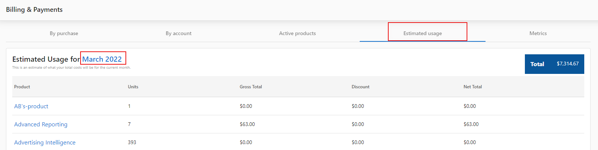

# Mi facturación

Administra tu información de facturación, métodos de pago y facturas desde `Partner Center` → `Administration` → `My billing`. Esta página cubre el modelo de facturación y las funciones clave; usa los enlaces a continuación para ver métodos de pago, informes y créditos.

## Qué es el modelo de facturación de Vendasta

El modelo de facturación de Vendasta te da la libertad de activar y cancelar productos en cualquier momento del mes y, aun así, aprovechar al máximo tu dinero. Cuando activas un producto para una cuenta (excepto los productos de "pago único"), ese producto se programará para renovarse automáticamente según su frecuencia de facturación (es decir, mensual o anual).

Si cancelas un producto antes de su fecha de renovación, ese producto seguirá activo hasta la siguiente fecha de renovación, momento en el cual se desactivará automáticamente.

## Por qué es importante entender el modelo de facturación

Comprender cómo funciona la facturación de Vendasta te ayuda a:
- Administrar las suscripciones de tus clientes de manera efectiva
- Predecir y controlar tus costos mensuales
- Tomar decisiones informadas sobre las activaciones y cancelaciones de productos
- Optimizar tu estrategia de facturación según las necesidades de tu negocio

## Qué puedes hacer con la facturación en Partner Center

Cada una de las siguientes opciones se puede acceder desde `Partner Center` → `Administration` → `My billing`:

| Función | Descripción |
|---------|-------------|
| **Billing Contact** | Establece la información de tu empresa tal como aparece en las facturas, incluido el nombre de la empresa, la dirección comercial y el contacto |
| **Payment Method** | Cambia tu método de pago, agrega métodos de pago adicionales o elimina los guardados. Aceptamos Visa, Mastercard y Amex |
| **Billing Metrics** | Consulta el desglose del rendimiento de los mercados y productos durante el mes |
| **Estimated Usage** | Consulta cuánto pagarás al final del mes según los productos actualmente activos |
| **Active Subscriptions** | Consulta qué productos forman parte del ciclo de facturación actual |

## Cómo configurar tu facturación

### Cómo entender los tipos de facturación

Existen dos estrategias de facturación disponibles para los partners de Vendasta:

#### Partners con facturación instantánea (predeterminado)

- Todos los nuevos partners siguen esta estrategia de forma predeterminada
- Todas las nuevas activaciones y renovaciones son "prepagadas" mediante el método de pago que ingresaste
- Un pago exitoso en el momento de la activación (o renovación) cubre el período del producto o servicio hasta la próxima fecha de renovación (mensual o anual)

#### Partners facturados

- Disponible para partners heredados y grandes empresas que cumplen requisitos específicos
- Todas las activaciones y renovaciones se concilian en una factura mensual
- Las facturas generalmente se envían en los primeros días posteriores al cierre del mes
- La mayoría de los partners de pago posterior tienen condiciones de pago NET10 (10 días desde la fecha de la factura para realizar el pago)
- Las opciones de pago incluyen tarjeta de crédito, transferencia ACH o cheque enviado por correo

### Cómo funciona el modelo de facturación

**Ejemplo:**
Si activas Reputation AI para una cuenta el 24 de junio, se te cobra al instante y se programará para renovarse el 24 de julio.

Si cancelas Reputation AI antes de su fecha de renovación del 24 de julio, permanecerá activo hasta el 24 de julio y se desactivará automáticamente.

Si no cancelas Reputation AI antes de su fecha de renovación del 24 de julio, se renovará automáticamente, se programará para renovarse nuevamente de forma automática el 24 de agosto, y se te cobrará por ese mes de acceso al momento de la renovación.

### Cómo encontrar las fechas de renovación

Cuando activas un producto, verás la fecha de renovación en ese momento. También puedes encontrar la fecha de renovación de un producto en la página **Account Details** dentro de Partner Center.

### Cómo cancelar un producto

Para cancelar un producto de una cuenta:

1. Ve a `Partner Center` → `Accounts` → `Manage Accounts`
2. Selecciona una cuenta
3. Haz clic en los tres puntos junto a un producto y selecciona **Cancel Product**

### Cómo encontrar las fechas de desactivación

Cuando cancelas un producto, verás la fecha de desactivación en ese momento. También puedes encontrar la fecha de desactivación en la página **Activation History** dentro de la página de la cuenta:

### Cómo deshacer una cancelación

Para deshacer la cancelación de un producto antes de la fecha de desactivación:

1. Ve a `Partner Center` → `Accounts` → `Manage Accounts`
2. Selecciona una cuenta
3. Haz clic en los tres puntos junto al producto y selecciona **Undo Cancellation**

## Billing Metrics

En la pestaña **Metrics**, puedes ver un desglose del rendimiento de los mercados y productos que estás vendiendo durante el mes. Esto es útil para analizar qué productos son tus mejores resultados.

Esta pantalla se desglosa de la siguiente manera:

- **Market**: el mercado al que está asignado el producto (solo disponible cuando se selecciona la opción **Group by market**)
- **Product**: el producto al que corresponde la fila
- **Churn**: el porcentaje de cuentas que han tenido el producto desactivado ese mes
- **Retention**: el porcentaje de cuentas que han mantenido su suscripción a ese producto desde el mes anterior
- **Starting Balance**: la cantidad de cuentas que tenían el producto activo al comienzo del mes
- **Activations**: la cantidad de nuevas activaciones del producto desde el comienzo del mes
- **Total Billable**: la suma del saldo inicial y las activaciones de ese mes
- **Deactivations**: la cantidad de suscripciones del producto que han vencido o han sido canceladas

## Estimated Usage

La pestaña **Estimated Usage** desglosa cuánto pagarás al final del mes según los productos actualmente activos. Ten en cuenta que esta estimación no incluye ningún cargo relacionado con los servicios administrados.

### Cómo exportar el uso estimado

Sí, ¡puedes exportar los datos de uso estimado!

En Partner Center, navega a `Administration` → `My billing`, haz clic en la pestaña **Estimated Usage** y luego haz clic en el mes actual resaltado en azul para descargar un CSV del uso de productos del mes actual.

:::tip Notas importantes
- Esto solo muestra los productos y costos activos, no el uso estimado dentro de los productos
- La vista de uso estimado y las descargas de CSV de uso estimado tienen valores diferentes
- La vista de uso estimado en Partner Center muestra el costo mensual estimado para el partner, mientras que la descarga de CSV solo cuenta el consumo hasta la fecha actual (fecha de descarga)
:::

## Active Subscriptions

La pestaña **Active Subscriptions** te muestra qué productos forman parte del ciclo de facturación actual. Te permite ver fácilmente qué productos estuvieron activos en una cuenta durante el mes, así como cuándo vencerán esos productos (si están configurados para hacerlo).

### By Account

En el encabezado 'By Account' puedes ver la cantidad de productos pagados o gratuitos actualmente activados en cada cuenta, así como el total de renovación mensual de esa cuenta. Al hacer clic en una cuenta, podrás ver el desglose por producto y en qué día del mes está programado renovarse cada producto.

### By Purchase

Cuando activas un producto para una cuenta (excepto los productos de "pago único"), ese producto se programará para renovarse automáticamente según su frecuencia de facturación (es decir, mensual o anual).

Si cancelas un producto antes de su fecha de renovación, ese producto seguirá activo hasta esa fecha, momento en el cual se desactivará automáticamente.

Al comienzo de cada mes calendario, te facturaremos todos los productos que se activaron o se renovaron automáticamente en el mes calendario anterior.

## Preguntas frecuentes

¿Qué métodos de pago se aceptan?

Se requiere una tarjeta de crédito registrada para todos los partners. Actualmente aceptamos Visa, Mastercard y Amex. Para más inquietudes, no dudes en escribir a billingsupport@vendasta.com.

¿Cómo se me facturará?

Los informes de facturación del mes anterior se generan el día 1 del mes. Las facturas se envían luego antes del día 10 del mes.

La factura mensual contiene lo siguiente:
- Informes Snapshot de pago único a $2 cada uno
- Tarifas de software y servicio para los productos activados (mensuales, anuales y de pago único)
- Tarifas de campañas de anuncios digitales mensuales y de pago único, si corresponde
- Las tarifas de Digital Advertising se cobran por adelantado antes de que comience cualquier trabajo

Para obtener una estimación a mitad de mes de tu próxima factura, consulta `Partner Center` → `Administration` → `Billing` → `Estimated Usage`. ¿Necesitas verificar el costo de tus bienes y servicios? Dirígete a **Pricing** en la página de Administration.

:::tip Consejo profesional
Digital Agency se factura en una sola línea y, de forma predeterminada, todos los mercados se facturan juntos. Si necesitas un desglose contable más detallado, comunícate con tu representante de cuenta para conocer más opciones.
:::

Ten en cuenta que, al activar productos facturados mensualmente, recibirás un mes completo de servicio incluso si cancelas. Por este motivo, no prorrateamos los precios.

¿Se me cobrará automáticamente?

Sí. Cada mes, te enviaremos la(s) factura(s) de tu agencia que incluyen tu suscripción y cualquier producto y servicio activo. Luego, cobraremos a la tarjeta de crédito registrada.

Si tienes una disputa con tu factura actual, comunícate con billingsupport@vendasta.com antes de la fecha de vencimiento que aparece en la esquina superior derecha.

¿En qué moneda facturan?

Nuestros precios reflejan USD. Si eres una agencia fuera de EE. UU. y tienes preguntas sobre nuestros precios, contáctanos.

¿Hay tarifas separadas por el envío de correos electrónicos?

¡Para nada! Con Vendasta, puedes enviar una cantidad ilimitada de correos electrónicos en campañas sin costo alguno. Sin embargo, puedes potenciar tus esfuerzos de prospección con Snapshot Report, que cuesta $2 por cuenta.

¿Cómo se procesará mi primera factura?

Tu tarifa de incorporación, si corresponde, se cobrará de inmediato.

Las facturas mensuales se enviarán por correo electrónico alrededor del día **1** del mes:
- La suscripción se factura para el mes **actual**
- (Para los partners facturados, las tarifas de software se cobran por el mes **anterior**)

**Importante:** Tu primera factura también tendrá una tarifa de suscripción prorrateada por tu mes de registro más una suscripción completa para el mes siguiente.

¿El costo mayorista de los productos se cobra por cliente?

Nuestros productos se cobran por cuenta, no por usuario. Por ejemplo, puedes activar Reputation AI una sola vez para la empresa *Joe's Flowers*, pero otorgar acceso ilimitado a todos los que trabajan para Joe.

Si falla la activación de mi producto, ¿se me cobrará de todos modos?

La facturación mayorista para los partners con facturación instantánea ocurre cuando se inicia la activación del producto. En caso de que la activación de tu producto falle, ya sea por un error de activación o un error de facturación, el sistema activará automáticamente un reembolso por la activación del producto en cuestión.

Para los partners con facturación mensual o facturados, la activación fallida del producto no se calculará en tu factura mensual.

## Solución de problemas

### Faltan las tarjetas de facturación y financieras

Si las tarjetas **My Plan**, **My billing**, **Reports**, **Financial Documents** o **Pricing** no son visibles en **Administration**, se trata de un problema de configuración de permisos, no de un error.

Cada administrador de Partner Center tiene un permiso de **Access scope to reports**. Cuando este se establece en un nivel restringido, lo cual puede ocurrir al actualizar los permisos de administrador, estas tarjetas quedan ocultas para ese administrador.

Los administradores no pueden cambiar esta configuración por sí mismos. Comunícate con [Soporte de Vendasta](https://support.vendasta.com) y solicita que el acceso a informes del administrador afectado se configure en **Can view and edit reports**. Incluye la dirección de correo electrónico del administrador en tu solicitud.

## Artículos de esta sección

- **[Métodos de pago y configuración](./payment-methods-and-setup.mdx)** – Administra los métodos de pago, la información de facturación y resuelve problemas de pago
- **[Informes y datos de facturación](./billing-reports-and-data.mdx)** – Accede a informes de facturación, consulta los próximos cargos y exporta datos de facturación
- **[Funciones especiales y créditos](./special-features-and-credits.mdx)** – Tarifas de administración, notas de crédito y créditos virtuales vCash
- **[Enviar una solicitud de facturación](./submit-a-billing-request.mdx)** – Disputa un cargo o solicita un reembolso al equipo de finanzas de Vendasta
