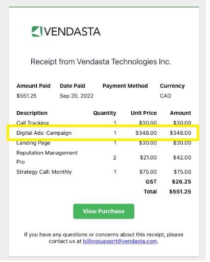
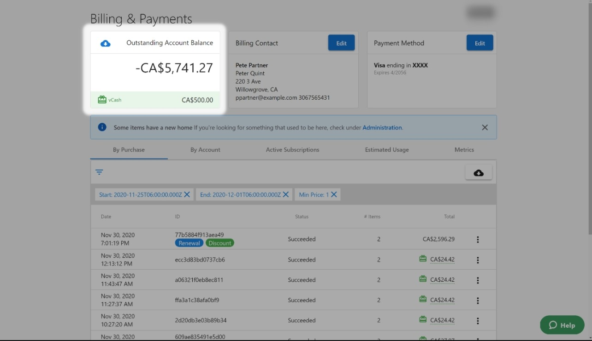

## ¿Qué son las funciones especiales y los créditos?

Las funciones especiales y los créditos en Partner Center incluyen la visibilidad de las comisiones de gestión, las notas de crédito por servicios cancelados y los créditos virtuales vCash que se pueden aplicar a cualquier compra de Vendasta. Estas funciones ofrecen transparencia en la facturación y opciones de pago flexibles.

## ¿Por qué son importantes estas funciones?

Comprender las funciones especiales de facturación te ayuda a:
- Hacer seguimiento de las comisiones adicionales asociadas a los productos
- Gestionar los créditos de servicios cancelados
- Aplicar créditos virtuales para reducir costos
- Mantener registros financieros precisos
- Optimizar tu gasto con los créditos disponibles

## Qué puedes hacer con las funciones especiales

| Función | Descripción |
|---------|-------------|
| **Comisiones de gestión** | Consulta las comisiones adicionales asociadas a ciertos productos |
| **Notas de crédito** | Accede a los créditos de productos o servicios cancelados |
| **Créditos vCash** | Usa créditos virtuales para cualquier compra de Vendasta |
| **Historial de créditos** | Haz seguimiento de todos los créditos y comisiones a lo largo del tiempo |

## Comisiones de gestión

### ¿Qué son las comisiones de gestión?

Las comisiones de gestión son cargos que se aplican a ciertos productos de Vendasta. Estas comisiones aparecen como líneas independientes en tu factura, lo que facilita identificar los costos adicionales asociados a productos específicos.

### Cómo ver las comisiones de gestión

#### En tu recibo

Las comisiones de gestión aparecerán como líneas independientes en tu recibo:

#### En la pestaña `By purchase`

Puedes ver las comisiones de gestión en la pestaña `By purchase` de tu sección de facturación:

#### En la pestaña `By account`

También puedes ver las comisiones de gestión en la pestaña `By account`, que organiza los cargos por cuenta de negocio:

### Descargar informes de comisiones de gestión

Para descargar un informe CSV detallado que incluya las comisiones de gestión:

1. Ve a la pestaña `By purchase`
2. Haz clic en la opción `CSV download`

#### Cómo entender el formato del informe CSV

El informe CSV mostrará tus comisiones de gestión en el siguiente formato:

### Facturas en PDF

Tu factura mensual en PDF también mostrará las comisiones de gestión como líneas independientes:

## Notas de crédito de partner

### ¿Qué son las notas de crédito?

Una nota de crédito es un recibo emitido por Vendasta a un partner que ha cancelado un producto o servicio(s) y al que se le ofrecen "créditos" que puede usar para compensar futuras compras.

### Cómo acceder a las notas de crédito

El historial de tus notas de crédito se encuentra en `Partner Center` → `Administration` → `Financial Documents` → `Credit notes`.

### Uso de las notas de crédito

Las notas de crédito representan:
- Reembolsos por productos o servicios cancelados
- Créditos que se pueden aplicar a futuras compras
- Ajustes al saldo de tu cuenta
- Documentación para el registro financiero

## vCash: créditos virtuales

### ¿Qué es vCash?

**vCash** es un crédito virtual que puedes usar para compras dentro del ecosistema Vendasta. Puedes usar vCash en *cualquier* compra.

**Ejemplos de para qué puedes usar vCash:**
- Compra de Reputation AI
- Tus tarifas de suscripción
- Compras en el Marketplace
- Cualquier compra dentro del sistema Vendasta

[Haz clic aquí para ver los términos y condiciones completos](http://vendasta.com/vcash-terms-and-conditions/).

### Cómo consultar tu saldo de vCash

Si tienes vCash, puedes encontrar tu saldo navegando a [`Partner Center` → `Administration` → `My billing` → `Billing & Payments`](https://partners.vendasta.com/billing/by-purchase).

### Cómo usar vCash

Al completar una compra, verás el siguiente aviso si tienes saldo de vCash:

Tu saldo de vCash se aplicará automáticamente a la compra. Si no tienes suficiente para cubrir la compra completa, se aplicará el crédito de vCash disponible y solo se te cobrará el resto.

### Reglas de aplicación de vCash

- vCash se aplica automáticamente a las compras elegibles
- Si tu saldo de vCash es menor que el importe de la compra, el saldo restante se cobrará a tu método de pago
- vCash se puede usar para cualquier producto o servicio del ecosistema Vendasta
- Los créditos se aplican en el orden en que se emitieron

## Descuentos y compromisos de volumen

### ¿Qué es un compromiso de volumen?

Un compromiso de volumen es un acuerdo contractual para activar un número mínimo de productos por mes. Si no alcanzas ese mínimo antes de fin de mes, se te factura la diferencia, independientemente de si los productos se usaron activamente. Los compromisos de volumen son una obligación contractual, no una facturación basada en el uso.

### Por qué podrías ver un cargo aunque no hayas usado un producto

Si tienes un compromiso de volumen para un producto y tus activaciones no alcanzan el mínimo, la plataforma factura la diferencia a fin de mes. Este cargo no es un error de facturación. Refleja el volumen comprometido que aceptaste.

### Cómo funcionan los descuentos (lógica basada en cupos)

Los descuentos en los productos de Vendasta se asignan como un número fijo de cupos por período de facturación. Estos cupos se asignan por orden de llegada a las cuentas que activan o renuevan el producto con descuento más temprano en el mes.

- Si todos los cupos de descuento se llenan a principios de mes, las activaciones posteriores se cobran a la tarifa estándar.
- Los descuentos no son específicos de una cuenta por defecto. Se aplican a la cuenta que use el producto primero.

### Regla de temporización de los descuentos

La plataforma de Vendasta funciona en **UTC**. El descuento vence a las **6:00 p. m. hora CST del último día del período de facturación**. Las activaciones procesadas después de ese límite no calificarán para el descuento que vence, incluso si parecen estar dentro del mismo día calendario en tu zona horaria local.

### Cómo ver tus descuentos

Para ver los descuentos aplicados actualmente a tu cuenta:

1. Ve a `Partner Center` → `Administration` → `My billing`
2. Haz clic en la pestaña `Discounts`

Esto muestra tus acuerdos de descuento activos, incluyendo el número de cupos comprometidos y la tasa de descuento.

## Gestión de créditos y comisiones

### Seguimiento de créditos

Todos los créditos y comisiones se registran en tu Partner Center:
- Las comisiones de gestión aparecen como líneas independientes
- Las notas de crédito son accesibles a través de Financial Documents
- Los saldos de vCash se muestran en tu sección de facturación
- Los datos históricos se conservan para el registro

### Registro financiero

Usa estas funciones para:
- Hacer seguimiento de todos los costos y créditos adicionales
- Mantener registros financieros precisos
- Aplicar los créditos disponibles para reducir costos
- Supervisar las estructuras de comisiones de los diferentes productos

## Preguntas frecuentes

¿Qué son las comisiones de gestión y por qué las veo?

Las comisiones de gestión son cargos adicionales que se aplican a ciertos productos de Vendasta. Aparecen como líneas independientes en tu factura para ofrecer transparencia sobre los costos adicionales asociados a productos específicos.

¿Cómo accedo a mis notas de crédito?

El historial de tus notas de crédito se encuentra en `Partner Center` → `Administration` → `Financial Documents` → `Credit notes`. Las notas de crédito se emiten cuando cancelas productos o servicios y recibes créditos para uso futuro.

¿Qué es vCash y cómo lo uso?

vCash es un crédito virtual que se puede usar para cualquier compra dentro del ecosistema Vendasta. Se aplica automáticamente a las compras elegibles, y puedes consultar tu saldo en `Partner Center` → `Administration` → `My billing` → `Billing & Payments`.

¿Puedo controlar cuándo se aplica vCash a las compras?

vCash se aplica automáticamente a las compras elegibles. Si tienes saldo de vCash, se usará primero, y cualquier importe restante se cobrará a tu método de pago.

¿Cómo descargo informes que incluyan comisiones de gestión?

Ve a la pestaña `By purchase` en tu sección de facturación y haz clic en la opción `CSV download`. El informe resultante incluirá las comisiones de gestión como líneas independientes.

¿Puedo usar vCash para renovaciones de suscripción?

Sí, vCash se puede usar para cualquier compra dentro del ecosistema Vendasta, incluyendo renovaciones de suscripción, compras de nuevos productos y artículos del Marketplace.

¿Las notas de crédito caducan?

Los términos de las notas de crédito pueden variar. Consulta los detalles específicos de tu nota de crédito o contacta con soporte para obtener información sobre fechas de caducidad y condiciones de uso.

¿Por qué se me cobra por un compromiso de volumen si no activé el producto?

Los compromisos de volumen se facturan a fin de mes según el número de activaciones que contrataste, no el número que usaste. Si tus activaciones están por debajo del mínimo comprometido, se te cobra la diferencia. Esto es una obligación contractual. Revisa los detalles de tu compromiso en la pestaña `Discounts` bajo `Administration` → `My billing`.

¿Por qué se me cobró el precio completo por un producto que debía tener descuento?

Los descuentos se basan en cupos y se asignan por orden de llegada. Si todos los cupos de descuento disponibles fueron ocupados por otras activaciones anteriores en el período de facturación, tu activación no recibió descuento. Además, las activaciones procesadas después de las 6:00 p. m. hora CST del último día del período de facturación no calificarán para un descuento que vence ese período, incluso si caen dentro del mismo día calendario en tu zona horaria local.

