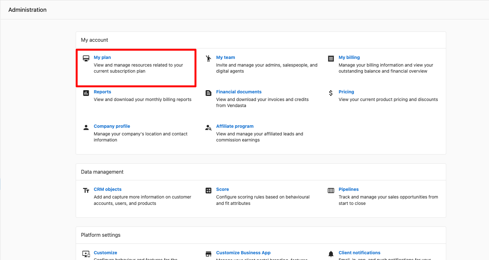

Consulta y administra tu plan de suscripción de Vendasta en Partner Center, incluidos tu plan actual, la frecuencia de facturación, los límites de uso y las opciones de cancelación.

## Ver los detalles de tu plan de suscripción

Puedes ver los detalles de tu plan de suscripción en Partner Center, incluidos tu plan actual, la frecuencia de facturación y la próxima fecha de facturación. También puedes ver cuánto has usado de los límites de tu plan y cuántos elementos gratuitos te quedan, detalles sobre las mejoras de plan y otros planes haciendo clic en `Compare Plans` en `Partner Center` → `Administration` → `My Plan`.

**¿Cómo funciona?** Accede a esta página desde `Partner Center` → `Administration` → `My Plan`.

## Suscripciones de prueba

Puedes recibir una suscripción de prueba de un representante de Vendasta, que te da acceso por tiempo limitado a funciones de nivel superior.

- La prueba puede **cancelarse en cualquier momento** antes de la fecha de vencimiento establecida por tu representante de Vendasta. En el momento de la cancelación, el representante de Ventas confirmará qué Admin permanecerá en la cuenta y eliminará a todos los demás administradores.
- Si se **firma un contrato** mientras aún estás en período de prueba, la prueba se cancelará primero antes de procesar el contrato.
- Si la prueba **vence** y no firmas un contrato, el acceso vuelve al nivel estándar **Free**.

:::info
Si tienes preguntas sobre tu prueba, comunícate con tu equipo de Éxito del Cliente asignado en la esquina inferior izquierda de Partner Center.
:::

## Cancelar tu suscripción

### Planes Starter, Startup o Individual

Si tienes un plan Starter, Startup o Individual, puedes cancelar tu suscripción completando [este formulario](https://docs.google.com/forms/d/e/1FAIpQLSdt1tIsvoyiETY0ZQLLe0vzn-xras9xJMGNgOs7eRv50Jb1pA/viewform).

Las cancelaciones deben enviarse **48 horas antes de la renovación** para evitar cargos adicionales de suscripción y se procesan en un plazo de **2 días hábiles**.

**Notas importantes después de la cancelación:**

- Las cuentas con **apps y servicios pagos** siguen renovándose y pueden seguir usándose hasta que se cancelen.
- Los **productos estándar** que excedan de uno se vuelven facturables al momento de la renovación.
- Las cuentas con **automatizaciones de facturación activas** continúan facturando y cobrando a menos que las desactives.
- Los **puestos adicionales de miembros del equipo** siguen facturándose a menos que los elimines de Partner Center.

### Planes contratados

Para cancelar o degradar una suscripción contratada, habla con tu Account Manager o envía un correo a **support@vendasta.com** para recibir orientación.

Seguirás pagando por los productos y suscripciones activos durante la duración comprometida en los términos de tu contrato. Consulta los [Términos de servicio](https://www.vendasta.com/terms/) y desactiva los productos para evitar cargos innecesarios.

Si tienes preguntas sobre tu plan o necesitas hacer cambios en tu suscripción, comunícate con nuestro equipo de soporte.
