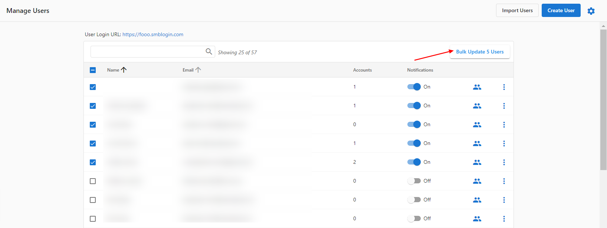

Configura la gestión de conversaciones y las herramientas de comunicación: ajustes de chat, plantillas de respuesta, enrutamiento de conversaciones y quién puede ver la pestaña Conversations en Business App. Puedes desactivar la pestaña Conversations para usuarios específicos o para todas las cuentas de un mercado.

## Desactivar la pestaña Conversations

La pestaña Conversations en Business App se puede ocultar a los clientes, para usuarios específicos o para todas las cuentas de un mercado.

:::warning
Quitar el acceso de un usuario a Conversations también elimina el acceso a Conversations Pro, Lead capture y la mensajería SMS. No se recomienda desactivarla a menos que tengas un motivo concreto.
:::

### Para usuarios específicos

1. Ve a `Partner Center` → `Accounts` → `Manage Users`
2. Selecciona el usuario o los usuarios que quieras cambiar y haz clic en `Bulk Update x users`

   

3. En `Tab Access`, abre el menú desplegable `Conversations`, selecciona `Turn Off` y luego `Apply Changes to Users`

### Para todos los usuarios de un mercado

1. Ve a `Partner Center` → `Administration` → `Customize Business App` → `Pages` → `Conversations`
2. Desmarca la casilla `Show this page` y guarda para quitar Conversations de todos los clientes de ese mercado

   

## Qué puedes configurar

- **Ajustes de chat** – Preferencias de chat en vivo y mensajería
- **Plantillas de respuesta** – Plantillas de respuesta rápida
- **Respuestas automáticas** – Respuestas automatizadas para consultas frecuentes
- **Enrutamiento de conversaciones** – Cómo se asignan las conversaciones a los miembros del equipo
- **Integraciones** – Plataformas de comunicación externas
- **Visibilidad de la pestaña** – Qué usuarios o mercados ven la pestaña Conversations (ver más arriba)

Si necesitas ayuda con la configuración de conversaciones, contacta con soporte.
