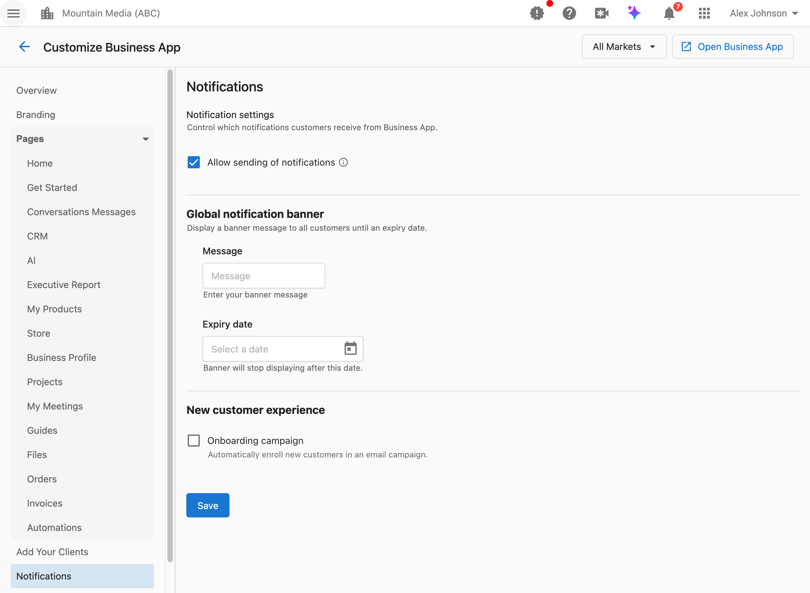

La sección Notificaciones en Customize Business App controla cómo te comunicas con los clientes a través de Business App. Configura los permisos de notificaciones, muestra banners de anuncios y automatiza las campañas de incorporación para nuevos clientes.

## ¿Cómo accedo a esta configuración?

Navega a `Partner Center` → `Accounts` → `Manage Business App` → `Customize Business App` → `Notifications`.

## ¿Cómo habilito o deshabilito las notificaciones a clientes?

La configuración de notificaciones controla si los clientes reciben notificaciones de Business App y de los productos.

**Qué controla esto:**
- Las notificaciones por correo electrónico enviadas a los clientes
- Las notificaciones dentro de Business App
- Las alertas y actualizaciones relacionadas con productos

**Cuándo deshabilitar las notificaciones:**
- Estás migrando clientes y no quieres molestarlos
- Tienes una estrategia de comunicación específica fuera de la plataforma
- Estás solucionando problemas de notificaciones

**Cómo configurarlo:**

1. Navega a `Partner Center` → `Accounts` → `Manage Business App` → `Customize Business App` → `Notifications`.
2. Busca la casilla `Allow sending of notifications`.
3. Actívala o desactívala.
4. Haz clic en `Save`.

:::warning
Deshabilitar las notificaciones detiene todas las notificaciones para los usuarios de Business App a partir de ese momento. Los usuarios no podrán administrar ni suscribirse a notificaciones mientras esto esté deshabilitado. Esta configuración solo está disponible a nivel de partner (no por mercado).
:::

**Configuraciones relacionadas:**
Para un control detallado sobre qué notificaciones específicas se envían, navega a `Partner Center` → `Administration` → `Customize Design` → `Default Notifications`.

## ¿Cómo muestro un banner de anuncio global?

El banner de notificación global muestra un mensaje en la parte inferior de todas las páginas de Business App para todos los clientes hasta la fecha de vencimiento que establezcas.

**Qué hace esto:**
- Muestra un mensaje de banner persistente en todas las páginas de Business App
- Es visible para todos los clientes hasta la fecha de vencimiento
- Admite contenido de texto plano o HTML

**Cuándo usar banners:**
- Anunciar mantenimiento programado o tiempo de inactividad
- Promocionar una oferta o promoción especial
- Notificar a los clientes sobre cambios importantes de política
- Compartir cierres de oficina por días festivos o horarios de soporte reducidos

**Cómo crear un banner:**

1. Navega a `Partner Center` → `Accounts` → `Manage Business App` → `Customize Business App` → `Notifications`.
2. Busca la sección `Global notification banner`.
3. Escribe tu mensaje en el campo `Message`. Puedes usar texto plano o HTML.
4. Establece la `Expiry date` para cuando el banner debe dejar de mostrarse.
5. Haz clic en `Save`.

**Qué ven los clientes:**
Aparece un banner en la parte inferior de cada página de Business App con tu mensaje. El banner desaparece automáticamente después de la fecha de vencimiento.

:::tip Buenas prácticas para los banners
- **Mantén los mensajes concisos**: los banners deben poder leerse de un vistazo
- **Establece siempre una fecha de vencimiento**: los banners desactualizados reducen la confianza de los clientes
- **Úsalos solo para información urgente**: no uses los banners para anuncios permanentes
- **Prueba el HTML con cuidado**: previsualiza tu banner para asegurarte de que el formato se muestre correctamente
:::

:::info
Los banners globales se configuran solo a nivel de partner y se aplican a todos los clientes en todos los mercados. No se admiten banners específicos por mercado.
:::

## ¿Cómo envío automáticamente correos de incorporación a nuevos clientes?

La configuración de campaña de incorporación inscribe automáticamente a los nuevos clientes en una campaña de correo electrónico después de que inician sesión por primera vez.

**Qué hace esto:**
- Activa una campaña de correo electrónico cuando un cliente inicia sesión por primera vez en Business App
- Envía una serie de correos de incorporación para ayudar a los clientes a comenzar
- Funciona con las campañas configuradas en Marketing: Product Adoption

**Cuándo habilitar esto:**
- Quieres automatizar la incorporación de clientes
- Tienes contenido útil de introducción para compartir
- Quieres reducir el seguimiento manual con nuevos clientes

**Cómo configurarlo:**

1. Primero, crea una campaña de incorporación en `Partner Center` → `Marketing` → `Campaigns` → `Product Adoption`.
2. Navega a `Partner Center` → `Accounts` → `Manage Business App` → `Customize Business App` → `Notifications`.
3. Busca la sección `New customer experience`.
4. Habilita la casilla `Onboarding campaign`.
5. Selecciona tu campaña en el menú desplegable `New customer experience`.
6. Haz clic en `Save`.

**Cómo funciona esto con el autorregistro:**
Cuando se combina con el [autorregistro](/docs/accounts/manage-business-app/self-signup), las campañas de incorporación crean un flujo de adquisición de clientes totalmente automatizado:
1. El cliente se registra a través del enlace de autorregistro
2. El cliente inicia sesión en Business App por primera vez
3. La campaña de incorporación se inicia automáticamente
4. El cliente recibe una serie de correos útiles

:::tip Cómo crear campañas de incorporación efectivas
Tu campaña de incorporación debería:
- Dar la bienvenida al cliente y confirmar que su cuenta está lista
- Explicar las funciones clave y cómo empezar
- Destacar victorias rápidas que puede lograr de inmediato
- Proporcionar información de contacto para soporte
- Incluir enlaces a documentación de ayuda o tutoriales

Navega a `Partner Center` → `Marketing` → `Campaigns` → `Product Adoption` para crear y administrar tus campañas de incorporación.
:::

## Preguntas frecuentes

¿Los banners aparecen en dispositivos móviles?

Sí. Los banners globales aparecen tanto en la versión de escritorio como en la versión móvil de Business App. Mantén tu mensaje conciso para asegurarte de que se vea bien en pantallas más pequeñas.

¿Puedo tener banners diferentes para distintos mercados?

No. Los banners globales se configuran a nivel de partner y se muestran a todos los clientes en todos los mercados. Si necesitas mensajes específicos por mercado, considera usar campañas de correo electrónico segmentadas en su lugar.

¿Qué sucede cuando vence un banner?

El banner deja de mostrarse automáticamente después de la fecha de vencimiento. No se requiere ninguna acción. El mensaje permanece en tu configuración para que puedas reutilizarlo o modificarlo para futuros anuncios.

¿Puedo previsualizar la campaña de incorporación antes de habilitarla?

Sí. Navega a `Partner Center` → `Marketing` → `Campaigns` → `Product Adoption` y selecciona tu campaña para previsualizar su contenido y la secuencia de correos antes de habilitarla en la configuración de Notifications.

¿Cuántos correos hay en una campaña de incorporación?

Esto depende de cómo configures tu campaña. Tú creas y controlas el contenido de la campaña de incorporación en `Partner Center` → `Marketing` → `Campaigns` → `Product Adoption`. Puedes incluir tantos correos como sean apropiados para tu proceso de incorporación.

¿La campaña de incorporación se activa en cada inicio de sesión?

No. La campaña de incorporación solo se activa en el primer inicio de sesión del cliente en Business App. Los inicios de sesión posteriores no vuelven a activar la campaña.

¿Puedo usar HTML en el mensaje del banner?

Sí. El campo de mensaje admite HTML, lo que te permite agregar enlaces, formato o estilos. Prueba tu HTML con cuidado para asegurarte de que se muestre correctamente en distintos navegadores y dispositivos.

¿Cuál es la diferencia entre la configuración de notificaciones de aquí y la de Customize Design?

- `Customize Business App` → `Notifications`: controla si se envían notificaciones o no, además de la configuración de banners y de campañas de incorporación
- `Customize Design` → `Default Notifications`: controla qué tipos específicos de notificaciones están habilitados de forma predeterminada (por ejemplo, alertas de reseñas, notificaciones de mensajes)

