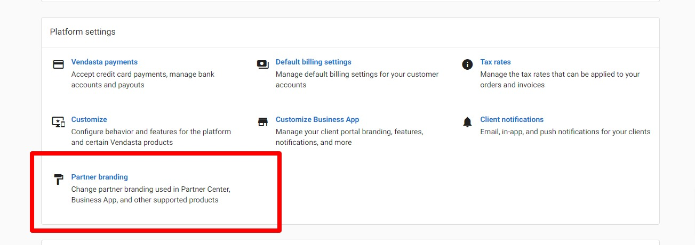
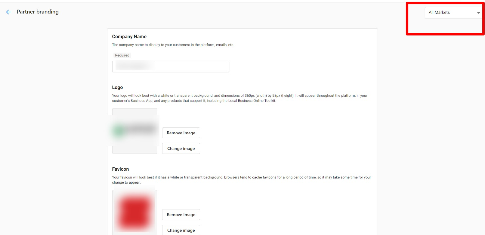
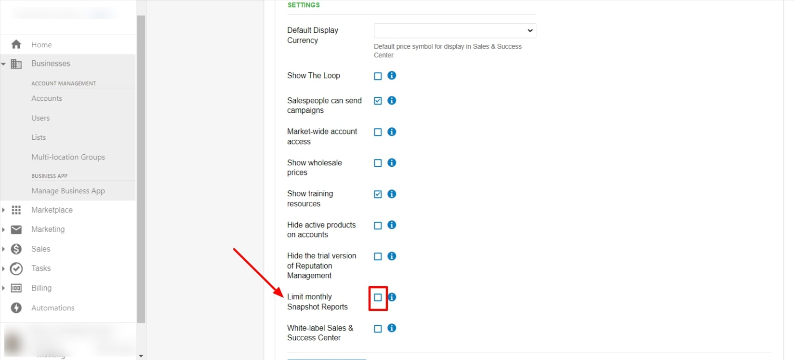

Esta guía completa cubre la configuración de mercados, los ajustes avanzados de la plataforma y funciones especializadas, incluyendo la inscripción al Early Access Program, la personalización de prioridades de negocio y los controles de vendedores de Marketplace.

## Qué son los mercados y la configuración avanzada

Los mercados y la configuración avanzada te ayudan a organizar la estructura de tu negocio, personalizar la marca y los ajustes específicos de cada mercado, acceder a funciones nuevas de forma anticipada y configurar flujos de trabajo de negocio especializados. Estos ajustes incluyen la segmentación de mercados, la personalización de marca, los programas de vista previa de funciones y la gestión de prioridades de negocio.

## Por qué son importantes los mercados y la configuración avanzada

- **Organización del negocio**: Segmenta tu negocio por región, marca, industria o criterios personalizados
- **Marca específica por mercado**: Personaliza logotipos, colores y experiencias para distintos mercados
- **Gestión de funciones**: Controla el acceso a funciones y capacidades nuevas mediante los programas de Early Access
- **Alineación con el negocio**: Configura los ajustes para que coincidan con tus prioridades y flujos de trabajo
- **Escalabilidad**: Configura sistemas que crezcan con tu negocio y mantengan una supervisión centralizada

## Qué incluyen los mercados y la configuración avanzada

### Organización y estructura de mercados
- **Asignación de cuentas**: Todas las cuentas nuevas deben asignarse a un mercado específico
- **Segmentación de mercados**: Organiza por marca, región, industria o criterios personalizados
- **Gestión centralizada**: Mantén la supervisión de todos los mercados desde una sola plataforma
- **Estructura escalable**: Agrega nuevos mercados a medida que crece tu negocio

### Marca específica por mercado
- **Logotipos personalizados**: Sube distintos logotipos para cada mercado
- **Esquemas de color**: Establece paletas de colores únicas por mercado
- **Nombres de productos**: Personaliza los nombres de productos para distintos mercados
- **Portales de inicio de sesión**: Experiencias con tu marca para usuarios específicos de cada mercado

### Configuración a nivel de mercado
- **Ajustes individuales**: Configura funciones y restricciones por mercado
- **Herencia de permisos**: Los mercados heredan la configuración predeterminada, pero se pueden personalizar
- **Configuración de pedidos de venta**: Procesos y configuraciones de venta específicos de cada mercado
- **Límites de informes**: Establece distintos límites y restricciones por mercado

:::warning
Los mercados solo están disponibles en ciertos niveles de suscripción. Comunícate con tu representante de cuenta o con soporte para activar los mercados en tu plataforma o agregar mercados adicionales.
:::

## Cómo entender la estructura de mercados

### Principios de organización de mercados

#### Proceso de asignación de cuentas
Cuando los mercados están activados en tu plataforma:
- **Asignación obligatoria**: Cada cuenta nueva debe asignarse a un mercado durante su creación
- **Selección desplegable**: Aparece un menú desplegable de mercado en el formulario de creación de cuenta
- **Mercado predeterminado**: Un mercado representa a tu empresa en su conjunto
- **Mercados adicionales**: Se usan para segmentar por región, marca u otros criterios

#### Acceso y permisos de usuario
Los distintos tipos de usuario interactúan con los mercados de forma diferente:

**Usuarios de Business App**:
- Se les asignan permisos a cuentas específicas en lugar de a mercados completos
- Ven la marca de la primera cuenta de su lista al iniciar sesión
- La marca se actualiza cuando seleccionan cuentas de distintos mercados
- Ven la marca específica del mercado al acceder a productos en las cuentas asignadas

**Vendedores**:
- Ven la marca específica del mercado tras iniciar sesión en su cuenta
- Los Snapshot Reports muestran la marca de su mercado asignado
- Las cuentas nuevas se crean automáticamente bajo su mercado asignado
- Deben estar asignados a un mercado (obligatorio para los vendedores creados antes de la activación de los mercados)

### Gestión de URL y portales
- **URL coherentes**: Las URL de los portales se mantienen coherentes con tu configuración original
- **Dominios personalizados**: Los dominios personalizados por mercado no están disponibles actualmente
- **Marca de inicio de sesión**: Los portales previos al inicio de sesión muestran tu marca de marca blanca
- **Cambio de mercado**: La marca se actualiza dinámicamente según las cuentas seleccionadas

## Cómo configurar la marca específica de un mercado

### Cómo acceder a la configuración de marca de mercado

Para personalizar la marca de mercados individuales:

1. Ve a `Administration` → `Partner branding`
2. Usa el menú desplegable de la esquina superior derecha para seleccionar:
   - `All Markets`: Aplica la marca a todos los mercados
   - `Individual Market`: Personaliza la marca de un mercado específico
3. Configura logotipos, colores y elementos visuales
4. Guarda los cambios para el alcance de mercado seleccionado

### Herencia y personalización de marca
- **Marca predeterminada**: La marca creada antes de la activación de los mercados se convierte en la predeterminada para los mercados nuevos
- **Personalización individual**: Cada mercado puede tener una identidad visual única
- **Modelo de herencia**: Los mercados nuevos heredan la configuración predeterminada, pero se puede modificar
- **Elementos coherentes**: Mantén la coherencia de marca entre mercados y, al mismo tiempo, permite la diferenciación

## Cómo gestionar la configuración de mercados

### Configurar funciones específicas por mercado

Cada mercado puede tener su propia configuración para varias funciones:

#### Configuración de ajustes de pedidos de venta
Los mercados pueden tener procesos de venta personalizados:
- **Procesos de venta individuales**: Configura flujos de trabajo únicos por mercado
- **Restricciones de pedidos**: Establece limitaciones de productos y ventas específicas de cada mercado
- **Personalización de procesos**: Adapta los flujos de venta a los requisitos del mercado
- **Variaciones de permisos**: Distintos niveles de acceso y capacidades por mercado

#### Gestión del programa beta y de funciones
- **Acceso beta a nivel de mercado**: Activa o desactiva las funciones beta por mercado
- **Configuración independiente**: La participación en el programa beta es independiente de la configuración a nivel de partner
- **Lanzamientos de funciones**: Prueba funciones nuevas en mercados específicos antes de una implementación más amplia
- **Acceso controlado**: Gestiona la disponibilidad de funciones según la preparación del mercado

### Restaurar la configuración de mercado a los valores predeterminados

Si necesitas restablecer las configuraciones específicas de un mercado:

1. Ve a `Administration` → `Customize`
2. Haz clic en `Markets`
3. Haz clic en el ícono de edición junto al mercado que deseas restaurar
4. Ve a `Sales` → `Configure Orders and Sales Processes`
5. Desplázate hasta el final y haz clic en `Restore Back to Partner Defaults`

:::info
La opción `Restore Back to Partner Defaults` solo aparece si previamente configuraste ajustes de pedidos de venta específicos del mercado. Esto evita que restablezcas por accidente mercados que usan la configuración predeterminada.
:::

## Cómo configurar límites de informes por mercado

### Establecer límites de Snapshot Report específicos por mercado

Aunque no existe un límite directo de snapshots a nivel de mercado, puedes controlar los informes por mercado configurando los límites de los vendedores dentro de cada mercado:

1. Ve a `Administration` → `Customize` → `Sales`
2. Cambia al mercado específico que quieres configurar
3. Marca la casilla `Limit monthly Snapshot Reports`
4. Establece el `Snapshot creation limit` para los vendedores de ese mercado
5. Guarda la configuración

### Cómo entender los límites de informes por mercado
- **Límites combinados**: Si varios vendedores trabajan en un mercado, el límite es el máximo total que todos los vendedores pueden crear en conjunto
- **Específico por mercado**: Cada mercado puede tener distintos límites de informes
- **Seguimiento individual**: El uso de cada vendedor se rastrea por separado dentro del total del mercado
- **Reinicio mensual**: Todos los límites se reinician mensualmente sin importar la configuración del mercado

## Cómo agregar y gestionar mercados

### Cómo agregar mercados nuevos
Para expandir tu estructura de mercados:
- **Comunícate con soporte**: Contacta a tu representante de cuenta o a Support On Demand
- **Define el propósito**: Identifica claramente cómo se usará el mercado nuevo
- **Planifica la organización**: Considera cómo se asignarán y gestionarán las cuentas
- **Preparación de marca**: Prepara los elementos de marca específicos del mercado si es necesario

### Cómo desactivar un mercado

Desactivar un mercado lo elimina del uso activo, pero no lo borra. Las cuentas y los datos asociados con el mercado se conservan. Para solicitar la desactivación de un mercado, comunícate con [Vendasta Support](https://support.vendasta.com) con el nombre del mercado y los datos de tu cuenta.

### Cómo reactivar un mercado

Un mercado previamente desactivado o cancelado se puede reactivar. Antes de solicitar la reactivación, consulta con tu gerente de cuenta de Vendasta, ya que reactivar un mercado cancelado puede tener un costo adicional según tu contrato. Para reactivar un mercado, comunícate con [Vendasta Support](https://support.vendasta.com) con el nombre del mercado y los datos de tu cuenta.

### Cómo cambiar el nombre de un mercado

Los nombres de los mercados se pueden cambiar en cualquier momento. Comunícate con [Vendasta Support](https://support.vendasta.com) con el nombre actual, el nombre nuevo y los datos de tu cuenta.

### Prácticas recomendadas de gestión de mercados
- **Nombres claros**: Usa nombres de mercado descriptivos que reflejen su propósito
- **Organización coherente**: Establece criterios claros para la asignación de cuentas
- **Revisión regular**: Evalúa periódicamente la eficacia de la estructura de mercados
- **Capacitación del equipo**: Asegúrate de que los miembros del equipo entiendan las asignaciones de mercado y sus implicaciones

## Cómo unirte al Early Access Program

### Qué es el Early Access Program

El Early Access Program te da acceso a funciones antes de que se lancen para todos los usuarios. Esto te permite probar capacidades nuevas y dar comentarios que ayuden a definir el desarrollo futuro.

**Ventajas:**
- Acceso inmediato a las funciones más recientes
- Influye en el desarrollo futuro mediante comentarios
- Ventaja competitiva con las capacidades más recientes

**Consideraciones:**
- Las funciones pueden cambiar sin previo aviso
- Documentación anticipada limitada
- Posibilidad de comportamiento inesperado

### Cómo unirte a Early Access

**Para toda tu plataforma:**
1. Ve a `Partner Center` → `Administration` → `Customize`
2. Ve a `General Product Settings` → `Others`
3. Selecciona `Join Early Access Program`

**Para mercados individuales:**
1. Ve a `Partner Center` → `Administration` → `Customize`
2. Ve a `Markets` y selecciona tu mercado objetivo
3. Ve a la sección `General Product Settings`
4. Ubica `Early Access Program`
5. Cambia la selección a `Enable`

:::info
Los ajustes específicos de mercado tienen prioridad sobre los valores predeterminados del partner, a menos que se definan explícitamente.
:::

### Cómo salir de Early Access

Si sales del programa, ya no tendrás acceso a las funciones de Early Access. Considera esto con cuidado, ya que algunas funciones podrían eliminarse de tu plataforma.

## Cómo gestionar las prioridades de negocio

### Cómo personalizar las opciones de prioridades de negocio

Puedes personalizar las opciones de prioridades de negocio disponibles para tus clientes, permitiéndoles enfocarse en los objetivos más relevantes para su industria o modelo de negocio.

### Pasos de configuración

1. Ve a `Partner Center` → `Administration` → `Customize`
2. Ve a `Product Settings` → `Business Priorities`
3. Revisa las categorías de prioridades disponibles
4. Activa o desactiva prioridades según tu base de clientes
5. Personaliza las descripciones de prioridades si es necesario
6. Guarda tu configuración

### Prácticas recomendadas para las prioridades de negocio

- **Relevancia por industria**: Activa las prioridades que se alineen con las industrias de tus clientes
- **Simplicidad**: No abrumes a los clientes con demasiadas opciones
- **Revisión regular**: Actualiza las prioridades a medida que evoluciona tu base de clientes
- **Descripciones claras**: Asegúrate de que las descripciones de las prioridades se entiendan fácilmente

## Cómo controlar el contacto de los vendedores de Marketplace

### Cómo evitar el contacto directo de los vendedores

Puedes evitar que los vendedores de Marketplace se comuniquen directamente con tus partners, manteniendo el control sobre las relaciones y comunicaciones con los vendedores.

### Cómo activar la protección de contacto

Para evitar el contacto directo de los vendedores de marketplace:

1. Ve a `Partner Center` → `Administration` → `Customize`
2. Ve a `General Product Settings`
3. Ubica los ajustes de `Marketplace Vendor Contact`
4. Selecciona `Prevent Direct Contact`
5. Guarda los cambios

### Ventajas del control de contacto

- **Gestión de relaciones**: Mantén el control sobre las asociaciones con vendedores
- **Control de calidad**: Filtra las comunicaciones de los vendedores según su relevancia
- **Protección de marca**: Garantiza mensajes coherentes desde tu organización
- **Protección al cliente**: Protege a los clientes del contacto no solicitado de los vendedores

## Cómo restaurar la configuración de pedidos de venta del mercado

### Cómo entender la configuración predeterminada frente a la personalizada

La configuración de pedidos de venta de un mercado se puede personalizar por mercado o heredar de los valores predeterminados a nivel de partner. A veces es posible que necesites restaurar esta configuración a su estado original.

### Proceso de restauración

1. Ve a `Partner Center` → `Administration` → `Customize`
2. Ve a `Markets` y selecciona tu mercado objetivo
3. Ubica la sección `Sales Order Settings`
4. Haz clic en `Restore to Partner Defaults`
5. Confirma la restauración cuando se te solicite

:::warning
Restaurar la configuración de mercado anulará cualquier configuración personalizada que hayas hecho para ese mercado específico.
:::

## Preguntas frecuentes

¿Cómo activo los mercados para mi plataforma?

Los mercados solo están disponibles en ciertos niveles de suscripción. Comunícate con tu representante de cuenta o con Support On Demand para activar los mercados o agregar mercados adicionales a tu plataforma.

¿Puedo limitar la creación de Snapshot Reports por mercado?

No existe un límite directo a nivel de todo el mercado, pero puedes limitar la creación de snapshots por vendedor dentro de cada mercado. El límite del mercado se convierte en el máximo total que todos los vendedores de ese mercado pueden crear en conjunto.

¿Cómo restauro la configuración de mercado a los valores predeterminados?

Ve a `Administration` → `Customize` → `Markets`, edita el mercado, ve a `Sales` → `Configure Orders and Sales Processes` y luego haz clic en "Restore Back to Partner Defaults" al final de la página.

¿Qué sucede con los vendedores creados antes de que se activaran los mercados?

Los vendedores creados antes de la activación de los mercados deben asignarse a un mercado la próxima vez que edites sus datos. Esto garantiza la correcta asociación de mercado y marca.

¿Puede cada mercado tener una marca distinta?

Sí, cada mercado puede tener logotipos, colores, nombres de productos y otros elementos de marca personalizados. Usa el menú desplegable de mercado en Partner branding para configurar la marca de cada mercado individual.

¿Cómo ven los usuarios de Business App la marca de distintos mercados?

Los usuarios de Business App están asignados a cuentas, no a mercados. Ven la marca de su primera cuenta al iniciar sesión, y la marca se actualiza cuando seleccionan cuentas de distintos mercados.

¿Puedo usar dominios personalizados para distintos mercados?

Los dominios personalizados por mercado no están disponibles actualmente. Todos los mercados usan URL coherentes con la configuración original de tu plataforma, pero con la marca específica del mercado aplicada.

¿Qué ajustes se pueden configurar de forma distinta por mercado?

Los mercados pueden tener distintos ajustes de pedidos de venta, participación en el programa beta, límites de informes, elementos de marca y varias configuraciones de funciones independientes de los ajustes a nivel de partner.

¿Cómo se asignan las cuentas nuevas a los mercados?

Al crear cuentas nuevas, debes seleccionar un mercado desde un menú desplegable en el formulario de creación de cuenta. Todas las cuentas requieren asignación de mercado para una organización y marca adecuadas.

¿Qué sucede si varios vendedores trabajan en el mismo mercado?

Cuando varios vendedores trabajan en un mercado con límites de informes de snapshot, el límite representa el máximo total que todos los vendedores de ese mercado pueden crear en conjunto, no por individuo.

¿Necesito mercados si solo atiendo a un área geográfica?

Los mercados no son obligatorios para negocios de una sola región, pero pueden seguir siendo útiles para segmentar por industria, nivel de servicio o tipo de negocio. Evalúa si los beneficios organizativos justifican la complejidad adicional.

¿Puedo probar las funciones de Early Access antes de comprometerme por completo?

Las funciones de Early Access se lanzan directamente a producción. No existe un entorno de prueba independiente. Considera comenzar con un solo mercado en Early Access si quieres limitar la exposición mientras pruebas.

¿Qué sucede con las cuentas si elimino un mercado?

Las cuentas asignadas a mercados eliminados deben reasignarse antes de que el mercado pueda borrarse. Comunícate con soporte para obtener ayuda con la consolidación o eliminación de mercados.

¿Puedo personalizar las prioridades de negocio para distintos mercados?

Sí, las prioridades de negocio se pueden configurar de forma distinta para cada mercado, lo que te permite adaptar las opciones según las industrias específicas o las áreas de enfoque de cada segmento de mercado.

¿Cómo sé qué funciones de Early Access están activas actualmente?

Las funciones de Early Access suelen anunciarse en las comunicaciones para partners y las notas de la versión. Revisa tu panel de partner y tus preferencias de comunicación para mantenerte informado sobre los lanzamientos nuevos.

¿Puedo evitar el contacto de vendedores para algunos mercados pero no para otros?

Los ajustes de contacto de vendedores de marketplace suelen aplicarse a toda la plataforma. Si necesitas controles de contacto de vendedores específicos por mercado, comunícate con soporte para conocer las opciones disponibles.

¿Restaurar la configuración de mercado afectará los pedidos existentes?

Restaurar la configuración afecta el procesamiento de pedidos futuros, pero no modifica los pedidos existentes. Sin embargo, cualquier campo o proceso personalizado específico de ese mercado volverá a los valores predeterminados.

¿Con qué frecuencia se agregan funciones nuevas a Early Access?

La frecuencia de lanzamiento de funciones varía según los ciclos de desarrollo. Los participantes de Early Access suelen ver funciones nuevas mensualmente, aunque el momento puede variar según la complejidad de la función y los requisitos de prueba.

