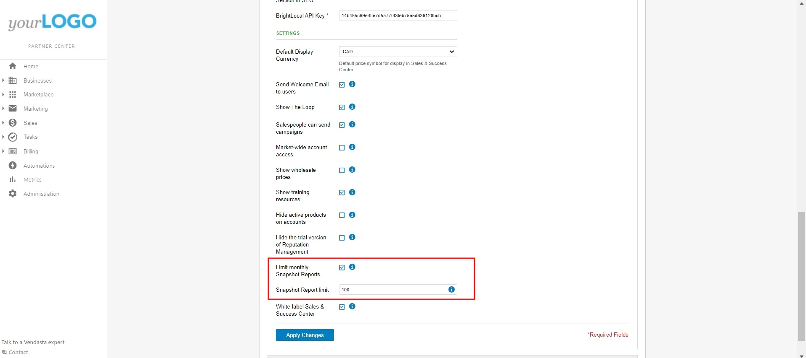

## Qué es la gestión del equipo de ventas

La gestión del equipo de ventas te brinda un control integral sobre lo que tu equipo de ventas puede acceder, ver y hacer dentro de la plataforma. Puedes configurar distintos niveles de permisos, controlar la visibilidad de precios, gestionar las capacidades de informes y establecer restricciones específicas para asegurarte de que tu equipo opere dentro de los parámetros de negocio definidos.

## Por qué es importante la gestión del equipo de ventas

Una configuración adecuada del equipo de ventas protege la información sensible del negocio y, al mismo tiempo, garantiza que los miembros del equipo tengan las herramientas que necesitan para tener éxito. Puedes mantener la confidencialidad de los precios, evitar acciones no autorizadas y escalar las operaciones del equipo de manera eficiente estableciendo niveles de acceso y restricciones adecuados.

## Qué incluye la gestión del equipo de ventas

### Control de acceso basado en roles
- **Permisos de Sales Manager**: Acceso completo al mercado y capacidades administrativas
- **Permisos de vendedor**: Acceso limitado según las asignaciones y la configuración de mercado
- **Ajustes de acceso a nivel de mercado**: Controla la visibilidad de cuentas en los territorios
- **Restricciones basadas en asignación**: Limita el acceso a las cuentas asignadas específicamente

### Controles de precios y productos
- **Visibilidad de precios al por mayor**: Muestra u oculta la información de costos a los vendedores
- **Restricciones de productos independientes**: Controla las capacidades de venta de productos individuales
- **Controles de selección de productos**: Gestiona qué productos pueden vender los miembros del equipo
- **Protección de precios**: Mantén estructuras de costos confidenciales

### Permisos de comunicación y marketing
- **Acceso a campañas de correo electrónico**: Activa o desactiva las capacidades de campañas de marketing
- **Herramientas de comunicación con clientes**: Controla las funciones de interacción directa con clientes
- **Generación de campañas**: Gestiona quién puede crear y enviar materiales de marketing
- **Acceso a herramientas de marketing**: Configura la disponibilidad de las funciones promocionales

### Limitaciones de informes y análisis
- **Límites de informes de snapshot**: Establece topes de generación mensual por vendedor
- **Controles de acceso a informes**: Define qué análisis pueden ver los miembros del equipo
- **Monitoreo de uso**: Rastrea la generación de informes y la actividad del equipo
- **Anulaciones administrativas**: Mantén el acceso de administrador independientemente de las restricciones

## Cómo configurar los roles del equipo de ventas

### Cómo entender las diferencias de roles

#### Capacidades del Sales Manager
Los Sales Managers tienen acceso mejorado y funciones administrativas:
- **Acceso a cuentas de todo el mercado**: Pueden ver todas las cuentas dentro de su mercado sin importar la asignación
- **Restricciones de anulación**: Acceden a las cuentas incluso cuando el acceso a nivel de mercado está desactivado
- **Funciones administrativas**: Configuran los ajustes del equipo y gestionan los permisos
- **Acceso completo a informes**: Generan informes ilimitados y ven análisis completos

#### Capacidades del vendedor
Los vendedores tienen un acceso enfocado, diseñado para las actividades de venta diarias:
- **Acceso basado en asignación**: Solo pueden ver las cuentas que se les asignaron específicamente (cuando el acceso a nivel de mercado está desactivado)
- **Acceso administrativo limitado**: No pueden modificar los ajustes ni los permisos del equipo
- **Informes restringidos**: Sujetos a los límites mensuales de informes de snapshot
- **Acceso controlado a funciones**: Algunas funciones pueden estar desactivadas según la configuración

### Cómo configurar los ajustes de acceso a nivel de mercado

El acceso a nivel de mercado determina si los vendedores pueden ver todas las cuentas de su territorio:

1. Ve a `Administration` → `Customize` → `Sales` → `Settings`
2. Ubica la configuración de `Market-wide access`
3. Actívala para permitir que los vendedores vean todas las cuentas del mercado
4. Desactívala para restringir a los vendedores solo a las cuentas asignadas
5. Guarda la configuración

:::info
Los Sales Managers siempre tienen acceso a todas las cuentas de su mercado, sin importar la configuración de acceso a nivel de mercado. Esto garantiza una supervisión de gestión y capacidades administrativas adecuadas.
:::

## Cómo controlar la visibilidad de precios

### Cómo ocultar los precios al por mayor a los vendedores

Para proteger la información de costos sensible mientras se mantiene la funcionalidad de venta:

1. Ve a `Administration` → `Customize`
2. Expande la sección `Sales`
3. Desplázate hasta los controles de precios
4. Desactiva `Show wholesale prices`
5. Guarda los cambios

Este ajuste evita que los vendedores vean los costos de los productos, y al mismo tiempo les permite crear cotizaciones y procesar pedidos con precios estándar.

### Prácticas recomendadas de visibilidad de precios
- **Protege los márgenes**: Oculta los precios al por mayor para mantener los márgenes de ganancia
- **Habilita la transparencia**: Muestra los precios a los Sales Managers para su supervisión
- **Monitorea los cambios**: Rastrea cuándo se modifican los ajustes de visibilidad de precios
- **Capacita a los miembros del equipo**: Asegúrate de que los vendedores entiendan las políticas de precios

## Cómo configurar los permisos de productos y campañas

### Cómo habilitar el acceso a campañas de correo electrónico

Para permitir que los vendedores envíen campañas de marketing:

1. Ve a `Partner Center` → `Administration` → `Customize` → `Sales`
2. Activa `Salespeople can send campaigns`
3. Configura cualquier restricción específica de campaña
4. Guarda los ajustes

Esto permite que los vendedores creen y envíen campañas de marketing por correo electrónico directamente a sus cuentas asignadas.

:::info
Busca el interruptor `Salespeople can send campaigns` en la sección Sales de la configuración de personalización. Este control determina si tu equipo de ventas puede acceder a las funciones de campañas dentro de Partner Center.
:::

## Cómo gestionar los límites de Snapshot Report

### Cómo establecer límites mensuales de informes

Para controlar cuántos Snapshot Reports puede generar cada vendedor mensualmente:

1. Ve a `Administration` → `Customize` → `Sales`
2. Marca `Limit monthly Snapshot Reports` en Settings
3. Ingresa el `Snapshot Report limit` deseado
4. Configura límites para mercados específicos si es necesario
5. Guarda la configuración

### Límites de snapshot específicos por mercado

Aunque no hay una forma directa de limitar los snapshots por mercado, puedes limitar los snapshots por vendedor dentro de mercados específicos:

**Para mercados individuales:**
1. Ve a la sección `Markets` en la configuración de personalización
2. Selecciona tu mercado objetivo
3. Ve a la configuración de `Sales` de ese mercado
4. Marca la casilla `limit monthly snapshot report`
5. Establece el `snapshot creation limit` para los vendedores de ese mercado

:::info
Si varios vendedores trabajan en un mercado, el límite del mercado representa el máximo total permitido que todos los vendedores de ese mercado pueden crear en conjunto.
:::

:::warning
Si tienes mercados personalizados, deberás ajustar este ajuste para cada mercado individualmente. Revisa la sección Markets para ver qué mercados ya tienen una configuración personalizada, ya que el cambio predeterminado no la sobrescribirá.
:::

### Gestión de límites de informes
- **Restricción completa**: Establece el límite en 0 para desactivar por completo la generación de informes
- **Reinicio mensual**: Todos los límites se reinician a las 12:00 a. m. UTC el primer día de cada mes
- **Acceso administrativo**: Los informes generados por el administrador no cuentan para los límites del vendedor
- **Integración con campañas**: Los límites de informes afectan las campañas de correo electrónico que incluyen pasos de generación de informes

### Cuándo se superan los límites

Cuando un vendedor alcanza su límite mensual, verá una notificación que impide generar más informes:

## Preguntas frecuentes

¿Cuál es la diferencia entre un Sales Manager y un vendedor?

**Diferencias clave de acceso:**

**Sales Managers:**
- Tienen la capacidad de ver y acceder a **todas** las cuentas dentro de su mercado, sin importar el asignado
- Mantienen acceso completo incluso cuando la configuración de `Market-wide access` está **desactivada**
- Pueden anular las restricciones de acceso a nivel de mercado

**Vendedores:**
- Solo pueden ver las cuentas asignadas específicamente a ellos cuando `Market-wide access` está **desactivado**
- Limitados a sus cuentas asignadas a menos que se active el acceso a nivel de mercado
- Sujetos a la configuración de acceso a nivel de mercado

**Ubicación de la configuración:**
Los ajustes de acceso a nivel de mercado se encuentran en `Partner Center` → `Administration` → `Customize` → `Sales` → `Settings`.

Esta distinción garantiza una segregación de cuentas adecuada, al tiempo que brinda a los Sales Managers la supervisión que necesitan para gestionar sus equipos de manera eficaz.

¿Cómo oculto los precios al por mayor a mis vendedores?

Puedes evitar que tus vendedores vean los precios al por mayor de los productos de marketplace:

1. Ve a `Partner Center` → `Administration` → `Customize`
2. Expande la sección `Sales`
3. Desplázate hacia abajo y desactiva `Show wholesale prices`

Este ajuste oculta los precios a los vendedores, y al mismo tiempo les permite crear cotizaciones y procesar pedidos con precios estándar. Esto ayuda a proteger tus márgenes de ganancia mientras se mantiene la funcionalidad operativa.

¿Puedo desactivar por completo la generación de Snapshot Reports para los vendedores?

Sí, puedes desactivar por completo la generación de Snapshot Reports estableciendo el límite mensual en 0. Esto evita que los vendedores generen informes mientras se mantiene el acceso de administrador.

¿Los informes generados por el administrador cuentan para los límites del vendedor?

Los informes generados directamente desde cuentas de administrador no cuentan para los límites del vendedor. Sin embargo, si estás suplantando a un vendedor, esos informes sí contarán para su total.

¿Cómo afectan los límites de informes de snapshot a las campañas de correo electrónico?

Los vendedores no pueden agregar cuentas a campañas que incluyan pasos de generación de Snapshot Report si superaron su límite mensual. Las campañas iniciadas desde cuentas de administrador no se ven afectadas.

¿Cuándo se reinician los límites mensuales de informes?

Todos los límites mensuales se reinician a las 12:00 a. m. UTC el primer día de cada mes. Puedes consultar la hora UTC actual para saber exactamente cuándo se reiniciarán los límites.

¿Pueden los vendedores ver los precios al por mayor si los oculto?

No, cuando los precios al por mayor están ocultos, los vendedores no pueden ver los costos de los productos. Aún pueden crear cotizaciones y procesar pedidos usando las estructuras de precios estándar para clientes.

¿Qué sucede si habilito las campañas de correo electrónico para los vendedores?

Los vendedores podrán crear y enviar campañas de marketing por correo electrónico a sus cuentas asignadas. Tendrán acceso a herramientas y plantillas de creación de campañas dentro de su nivel de permisos.

¿Puedo establecer distintos límites de informes de snapshot para distintos mercados?

Sí, puedes configurar distintos límites mensuales para cada mercado. Aunque no existe un límite directo a nivel de todo el mercado, puedes establecer límites por vendedor dentro de mercados específicos:

1. Ve a la sección `Markets` en la configuración de personalización
2. Selecciona tu mercado objetivo
3. Configura `limit monthly snapshot report` para ese mercado
4. Establece el `snapshot creation limit` para los vendedores de ese mercado

Recuerda: si varios vendedores trabajan en un mercado, el límite se aplica a cada vendedor individual, no como un total combinado del mercado.

¿Cómo sé qué vendedores alcanzaron sus límites de informes?

Puedes monitorear la generación de informes a través de las funciones de análisis e informes del administrador. Los vendedores que alcancen sus límites recibirán notificaciones al intentar generar informes adicionales.

## Capturas de pantalla o videos

<iframe 
  src="https://drive.google.com/file/d/11_cFgRQLN_Ez6UMK45Tn2O0_yp96AaZI/preview" 
  width="640" 
  height="480" 
  allowFullScreen
></iframe>
