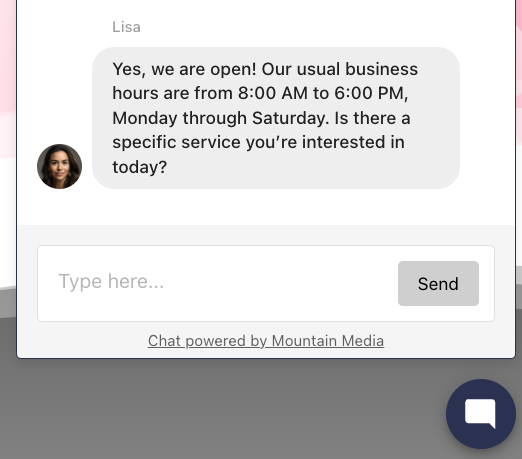

Vendasta es una plataforma de white-label. Puedes personalizarla como si fuera tuya, sin ninguna mención a Vendasta. Tu marca se usa en todos los lugares donde los clientes ven la plataforma, incluidos Business App y las campañas de correo electrónico.

**Dónde personalizar**

- **Nombre y logotipos** – `Partner Center` → `Administration` → `Partner branding`
- **Nombre de Business App** – `Partner Center` → `Accounts` → `Manage Business App` → `Customize Business App`

:::info
Algunas opciones de white-label pueden depender de tu [suscripción](https://www.vendasta.com/pricing/).
:::

## Elementos de marca personalizables

En la pestaña `Partner branding` puedes configurar:

- [Nombre de la empresa](#company-name)
- [Tema](#theme)
- [Logotipo](#logo)
- [Favicon](#favicon)
- [Icono de acceso directo](#company-avatar--shortcut-icon)
- [Color principal](#primary-color)

## Nombre de la empresa

El nombre que se muestra a los clientes en la plataforma y en los correos electrónicos. Este campo es obligatorio.

## Tema

Elige un tema (claro u oscuro) para tu equipo en Partner Center. Esto se aplica solo a la navegación.

## Tema de Business App

Configura el tema predeterminado para los clientes en Business App (claro u oscuro). `User System Default` coincide con la configuración del sistema de cada usuario; los usuarios también pueden cambiarlo en la aplicación.

## Logotipo

Tu logotipo aparece en todos los lugares donde se usa el white-label, incluidos los correos electrónicos. Usa versiones que funcionen tanto en modo claro como en modo oscuro; puedes subir logotipos independientes para cada uno.

## Favicon

El pequeño gráfico en la pestaña del navegador para Business App, para que los usuarios puedan distinguir tu aplicación de otras pestañas.

**Tamaño recomendado:** 16×16 px. **Formato:** solo ICO.

## Avatar de la empresa / icono de acceso directo

El icono de acceso directo se usa cuando los usuarios guardan Business App en la pantalla de inicio de su dispositivo móvil, y para representar a tu empresa en el chat de Inbox.

**Tamaño recomendado:** 512×512 px. **Formatos:** GIF, JPG o PNG.

## Color principal

El color de tu marca se usa como acento en la plataforma y en algunos correos electrónicos para clientes.

## Personalización de marca por mercado

De forma predeterminada, la configuración de **Partner branding** se aplica a todos los mercados. Si un mercado tiene su propia personalización (en la pestaña **Markets**), es posible que los cambios de Partner branding no se apliquen a ese mercado.

Para personalizar por mercado: abre la pestaña **All Markets** y selecciona el mercado.

## Texto "Powered by" en los productos de Business App

Algunos productos de Business App muestran una etiqueta **"Powered by [Nombre de tu empresa]"** en la interfaz del producto. Este texto proviene del `Market Name` configurado en tu configuración de Partner branding, específicamente del Company Name definido para cada mercado.

**Cómo actualizar el nombre de "Powered by":**

1. Ve a `Partner Center` → `Administration` → `Partner branding`.
2. Abre la pestaña `All Markets` y selecciona el mercado cuyo texto "Powered by" quieres actualizar.
3. Actualiza el campo `Company Name` de ese mercado y guarda.

El nuevo nombre aparecerá en los productos de Business App para las cuentas de ese mercado.

:::info
La marca "Powered by" se aplica a todas las cuentas del mercado seleccionado. No es posible suprimir ni personalizar la etiqueta para cuentas individuales. La configuración se aplica a todo el mercado.
:::

Si le cambiaste el nombre a tu empresa y el nombre anterior sigue apareciendo, revisa el Company Name de cada mercado por separado. Los mercados con su propia configuración de marca heredan el nombre de ese mercado, no el valor predeterminado global.

## Chat web

Puedes agregar un pie de página a todos los widgets de chat web de los clientes: "Chat powered by [Nombre de tu empresa]" con un enlace a tu sitio, para SEO y generación de leads. El enlace incluye un parámetro UTM para que puedas hacer seguimiento del engagement en Google Analytics.

**Para habilitarlo:** `Partner Center` → `Accounts` → `Manage Business App` → `Customize Business App` → `Branding`, luego habilita `Show 'Chat powered by [Your Company Name]' on all web chat widgets`.

## Artículos en esta sección

- **[Marca visual e identidad](./visual-branding-and-identity.md)** – Logotipos, colores, favicon, opciones de la página de inicio de sesión, marca multi-mercado y preguntas frecuentes

## Artículos relacionados

- [Personalizar texto, botones y traducciones](/administration/advanced/translate-customize/)
- [Personalizar los informes Snapshot](/snapshot-report/snapshot-report-customization)
- [Personalizar la configuración de tu correo electrónico](/marketing/email-settings/update-email-settings)
